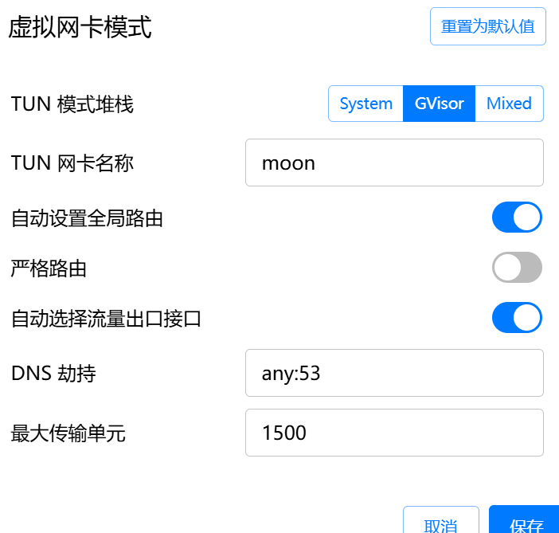
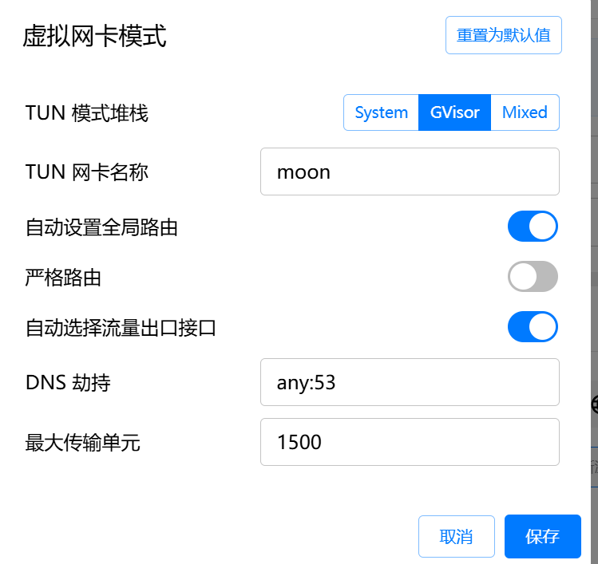
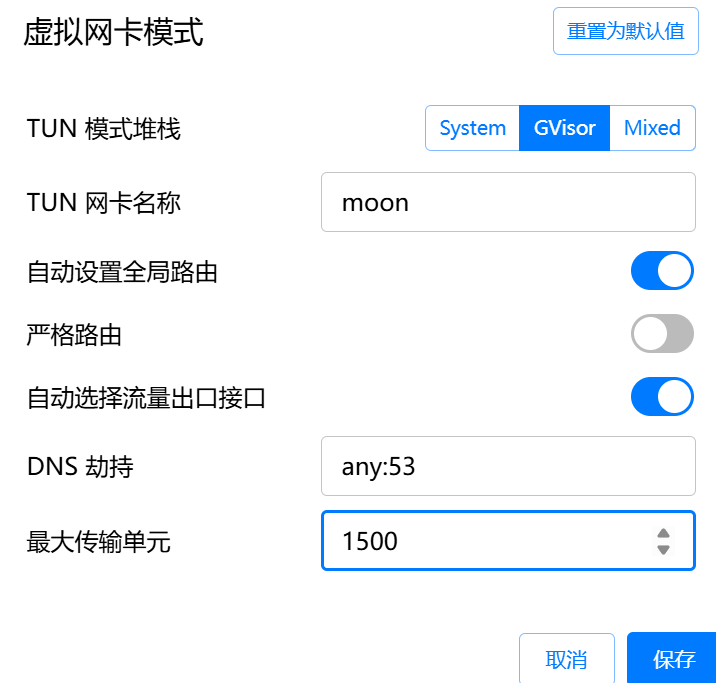

# 🚀 PageHelper 与 JSqlParser 冲突导致启动失败问题排查与解决

在整合 MyBatis-Plus、PageHelper、Flowable 等组件的 Spring Boot 项目中，我遇到了一个非常诡异且隐蔽的 Bug：**明明已经锁定了 JSqlParser 版本，但项目仍然因为 PageHelper 内部 SQL 解析报错而启动失败**。经过多轮排查，最终定位到问题根源是 PageHelper 内置 SQL Parser 与项目其他组件冲突。本文记录完整问题、分析过程、解决方案，方便后续踩坑的朋友快速定位。

## 📌 一、问题描述

项目启动时报如下异常（部分）：
```
Caused by: net.sf.jsqlparser.parser.ParseException: Encountered unexpected token ...
```

我使用 `mvn dependency:tree | Select-String jsqlparser` 查看依赖树后发现 JSqlParser 版本正常且已统一到 4.6，但仍然报 SQL 解析异常，十分困惑。

甚至尝试将 PageHelper 的 SQL Parser 参数关闭：
```yaml
pagehelper:
  parser:
    enable: false
```

并不能解决问题。

## 📌 二、初步怀疑：JSqlParser 版本冲突？

查看依赖树后发现虽然有多个重复引用：
```
com.github.jsqlparser:jsqlparser:jar:4.6
```

但它们均为同一版本，不存在多版本冲突，因此排除 "版本冲突" 的可能。

## 📌 三、进一步排查：Nacos 配置未生效？

我尝试通过 Nacos 配置关闭 PageHelper 的 SQLParser：
```yaml
pagehelper:
  parser:
    enable: false
```

但由于 PageHelper 的 parser.enable 不是可动态刷新配置项，仍然没有生效。由此判断 PageHelper SQLParser 并未被成功禁用。

## 📌 四、真正的原因：PageHelper 默认仍会启用内部 SQLParser

很多人以为：
```yaml
pagehelper:
  parser:
    enable: false
```

能完全关闭 PageHelper 的 SQLParser，但实际上**并不能**。原因是：

⭐ **PageHelper 的 SQLParser 是在插件初始化阶段加载的，不支持 Runtime 刷新**

且 PageHelper 内部优先读取 Java Config，而 YAML 配置不会覆盖初始化阶段的默认行为。

## 📌 五、最终解决：通过 @Bean 强制禁用 PageHelper SQLParser

最终采用 Java Config 的方式，手动注入 PageHelper，并显式关闭 SQL Parser。这是 PageHelper 官方推荐的方式，也是唯一完全禁用 SQLParser 的方式。

### ✔️ 解决方案（最终生效）

```java
@Bean
public PageHelper pageHelper() {
    PageHelper helper = new PageHelper();
    Properties p = new Properties();
    p.setProperty("autoRuntimeDialect", "true");

    // 关键配置：彻底禁用 PageHelper 内置的 SQLParser
    // 避免与 Flowable / MyBatis-Plus / 某些复杂 SQL 发生解析冲突
    p.setProperty("parserDialect", "null");

    helper.setProperties(p);
    return helper;
}
```

其中：
- `parserDialect=null` = 强制关闭 SQLParser
- `autoRuntimeDialect=true` = 兼容多数据源环境

## 📌 六、问题彻底解决

配置生效后：
- PageHelper 不再对 SQL 进行解析
- JSqlParser 不再被 PageHelper 使用
- 与 Flowable 或动态 SQL 不再产生冲突
- 应用启动正常、分页正常

## 📌 七、总结

### 项目问题说明

| 问题 | 状态 | 原因 |
|------|------|------|
| YAML 配置无法禁用 SQLParser | ❌ | PageHelper 初始化阶段不读取此配置 |
| Nacos 动态刷新无效 | ❌ | PageHelper 配置不可热更新 |
| JSqlParser 并非真正版本冲突 | ❌ | 实际是插件间 SQL 解析冲突 |
| 通过 @Bean 手动禁用 SQLParser | ✔️ | 实测有效，唯一根治方案 |

### 📚 最佳实践建议

如果你的项目满足以下任意条件：
- 使用 Flowable、Activiti、Quartz
- 使用复杂动态 SQL
- 使用 MyBatis-Plus + PageHelper 混用
- 存在大量子查询、CASE WHEN、JOIN

**建议一律关闭 PageHelper SQLParser**，否则可能出现各种隐蔽报错。

通过本次问题排查，再次验证了一个道理：**配置项的生效机制比配置本身更重要**，了解组件的初始化流程才能真正解决底层问题。