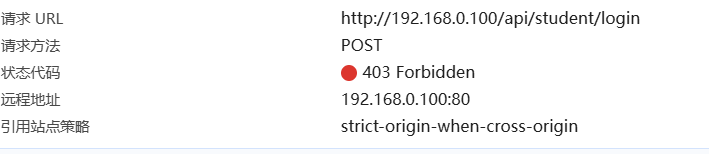
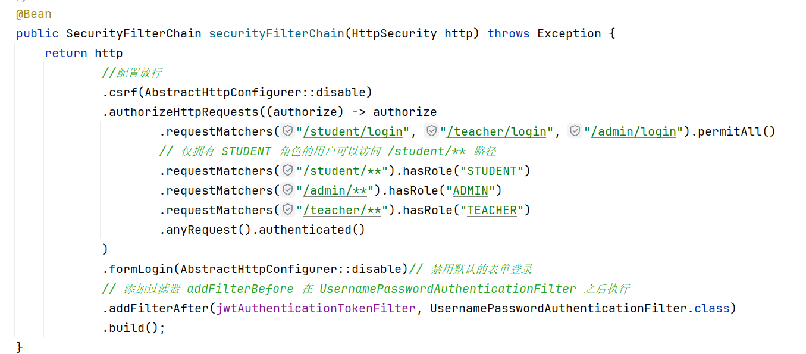
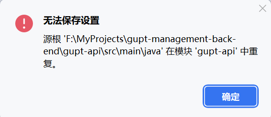
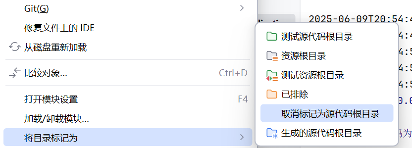

## 一、问题描述

在使用 Spring Security 进行权限控制时，即便已配置放行登录接口，如 `/student/login`，访问时仍然返回 **403 Forbidden** 错误。

  


这使得前端无法完成用户登录流程，严重影响开发进度。


## 二、原因分析

通过排查，最终发现 **不是权限配置的问题**，而是因为：

- 启动类所在模块未正确扫描到包含 `@RestController` 的模块；
- 导致 `Controller` 未被加载进 Spring 容器，自然也无法响应请求；
- Spring Security 拦截未识别请求路径，默认返回 403。

此外，还有部分配置性问题：

- 使用 JWT 自定义认证逻辑时，若 `filterChain` 中未正确跳过登录接口，或过滤器顺序不当，也可能导致 Spring Security 仍然尝试身份校验；
- IDEA 项目配置错误也会引起模块编译失败或包扫描异常。


## 三、解决方案

### ✅ 1. 启动类必须能扫描到所有 Web 层 Controller

建议将启动类（`@SpringBootApplication`）放在统一的 Web 层模块中，如 `gupt-api`，并在 `pom.xml` 中添加所有业务模块依赖：

```xml
<dependency>
    <groupId>edu.gupt</groupId>
    <artifactId>gupt-auth</artifactId>
</dependency>
<dependency>
    <groupId>edu.gupt</groupId>
    <artifactId>gupt-user-service</artifactId>
</dependency>
<!-- 其他模块同理 -->
````

同时，使用 `@ComponentScan` 明确扫描范围：

```java
@SpringBootApplication(scanBasePackages = "edu.gupt")
public class GuptApiApplication {
    public static void main(String[] args) {
        SpringApplication.run(GuptApiApplication.class, args);
    }
}
```

### ✅ 2. JWT 登录请求应跳过身份验证过滤器

在 `JwtAuthenticationTokenFilter` 中配置白名单，例如：

```java
if ("/student/login".equals(request.getRequestURI())) {
    filterChain.doFilter(request, response);
    return;
}
```

确保过滤器位置正确（建议放在 `UsernamePasswordAuthenticationFilter` 之前）：

```java
http.addFilterBefore(jwtFilter, UsernamePasswordAuthenticationFilter.class);
```

### ✅ 3. 禁用 Spring Security 默认登录页面（表单）

如你使用的是前后端分离 + JWT，应该禁用 `formLogin()`，防止默认跳转 HTML 登录页：

```java
http.formLogin(AbstractHttpConfigurer::disable);
```


## 四、IDEA 提示 "源根重复" 的原因分析与解决方案

### ❗ 错误提示

> 源根 'F:\MyProjects\gupt-management-back-end\gupt-api\src\main\java' 在模块 'gupt-api' 中重复。



说明 IntelliJ IDEA 误将同一目录多次注册为源根（Source Root），常出现在以下情形：

* 直接以子模块 `gupt-api` 打开；
* 同时导入了父项目与子模块；
* `.idea/` 和 `.iml` 文件未清理干净。


## 五、正确导入方式（推荐）

### ✅ 方法一：只导入父项目（根项目）

1. 关闭当前项目；
2. 删除项目根目录下的 `.idea/` 文件夹和所有 `.iml` 文件；
3. 重新使用 IDEA 打开根项目 `gupt-management-back-end`；
4. 使用 `pom.xml` → `Import as Maven project`；
5. IDEA 会自动识别所有子模块，不会有重复源根。

### ✅ 方法二：一个个取消标记一下也可以，但是很麻烦

