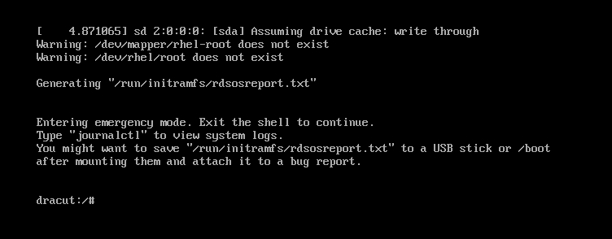

## 一、问题描述

在启动 CentOS 虚拟机时，系统报错：

```

/dev/mapper/rhel-root does not exist

```

或：

```

/dev/rhel/root does not exist

````

导致系统无法正常进入。



## 二、问题分析

### 📌 关键原因：

> 系统存在多个物理卷（PV），例如 `/dev/sda2` 和 `/dev/nvme0n1`，都被加入到了同一个卷组（VG）`rhel` 中。  
> 
> 这导致逻辑卷 `rhel-root` 跨多个磁盘（`sda2 + nvme0n1`），当启动环境中某个磁盘（如 `nvme0n1`）加载失败或初始化顺序不一致时，就会找不到完整的 `rhel-root`，从而报错。

## 三、快速修复（使用 RHEL 8.4 镜像修复 CentOS）

### 1. 准备 RHEL/CentOS 镜像（推荐 RHEL 8.4）

- 下载 [RHEL 8.4](https://access.redhat.com/downloads) 镜像 ISO（或 CentOS 8.x）并挂载到虚拟机。

### 2. 启动进入 **Rescue 模式**

1. 从 ISO 启动
2. 选择 `Troubleshooting` -> `Rescue a Red Hat Enterprise Linux system`
3. 执行提示完成挂载，选择 `1`（尝试挂载现有系统）

系统会将原有文件系统挂载到 `/mnt/sysroot`。

### 3. 切换到原系统环境（可选）

```bash
chroot /mnt/sysroot
````

现在你可以像在原系统中一样操作了。

## 四、根本解决：将系统从多盘整合为单盘

### ✅ 目标：只使用 `/dev/sda2`，彻底移除 `nvme0n1`

### 1. 扩展 `/dev/sda2` 的物理卷空间

> 确保你已在虚拟机中扩大了 `sda` 盘大小。

```bash
pvresize /dev/sda2
```

执行成功后，会显示：

```
Physical volume "/dev/sda2" changed
```

### 2. 迁移 LVM 数据：将 `nvme0n1` 上的内容转移到 `sda2`

```bash
pvmove /dev/nvme0n1
```

这个过程会把 `nvme0n1` 上所有的 extents 数据块迁移到 `/dev/sda2`，**时间视磁盘使用量和性能而定**。

如果报错：

```
No extents available for allocation
```

说明 `sda2` 扩容未成功，或者空间仍不足，请检查 `vgs` 和 `pvs`。

### 3. 迁移成功后移除 nvme0n1

```bash
vgreduce rhel /dev/nvme0n1
```

再将该设备从 LVM 彻底移除：

```bash
pvremove /dev/nvme0n1
```

此时系统不再依赖 `nvme0n1`，你可以安全删除它或格式化重用。

---

## 五、最终确认

### 查看卷组只剩下 sda2：

```bash
vgs -o +devices
```

期望输出：

```
VG   #PV #LV VSize   VFree   Devices
rhel  1   2  79.99g  <xx>    /dev/sda2
```

### 查看逻辑卷状态：

```bash
lvs -o +devices
```

确保 `rhel-root` 和 `rhel-swap` 都只绑定在 `/dev/sda2`。

---

## 六、重启系统

```bash
exit    # 如果使用了 chroot
reboot
```

系统现在应该可以正常从 `/dev/mapper/rhel-root` 启动。

## 七、总结建议

* 若系统原本因 `/` 空间不足而临时添加第二块磁盘（如 `nvme0n1`），**推荐使用 bind mount 或 overlayfs**，而不是直接加入到 LVM 卷组中。
* 使用 LVM 时避免跨多个磁盘构建卷组，除非你使用 RAID 或明确设计了多盘卷组方案。
* 每次调整 LVM 后都建议备份 `/etc/fstab` 并更新 grub：


以上就是这次修复虚拟机启动失败的全过程，如有更优方法或补充，欢迎评论交流！
