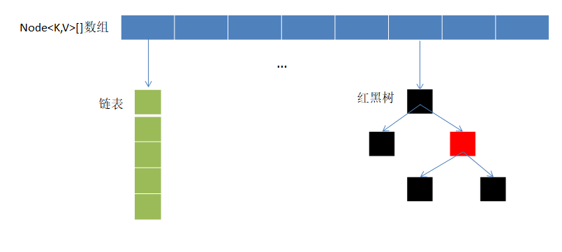

# HashMap 底层原理
HashMap 是 Java 常用哈希表实现，用于存储键值对，**底层基于数组 + 链表/红黑树**结构，通过哈希函数快速定位，用链表/红黑树解决冲突，实现 O(1) 级别的平均操作效率。



## 一、核心存储结构（JDK 1.8+）
HashMap 采用「数组 + 链表 + 红黑树」的分层存储结构，三者形成有机协作关系：

1. **数组（哈希桶/table）**：作为底层基础容器，是 HashMap 的一级存储结构。数组下标通过 Key 的哈希值计算得出，实现 O(1) 时间复杂度的快速定位，是高效查询的基础。

2. **链表（链表节点/Node）**：作为二级存储结构，用于处理数组中的哈希冲突。当不同 Key 计算出相同数组下标时，这些键值对会在数组同一位置形成链表结构，解决了哈希值碰撞问题。

3. **红黑树（树节点/TreeNode）**：作为链表的升级结构，用于优化查询效率。当 **链表长度超过阈值（默认 8）且数组长度 ≥ 64** 时，链表会自动转换为红黑树，将查询时间复杂度从链表的 O(n) 优化至 O(log n)，避免了长链表导致的性能瓶颈。

这种三层结构设计形成了一种自适应的存储机制：数据量较小时主要使用数组和短链表，保持高效；随着数据量增加，通过红黑树自动优化，保证了在大数据量下仍能维持较高的查询效率。

## 二、核心概念铺垫
在理解原理前，先明确 3 个关键参数（直接影响 HashMap 性能）：
1. **初始容量（initialCapacity）**：数组的初始长度，默认 16（必须是 2 的幂，如 16、32、64...）；
2. **负载因子（loadFactor）**：数组扩容的阈值比例，默认 0.75——当「已存储元素个数（size）≥ 数组长度 × 负载因子」时，数组会扩容（扩容为原来的 2 倍）；
3. **阈值（threshold）**：实际扩容触发条件，`threshold = 数组长度 × 负载因子`（默认初始阈值 16×0.75=12）。

例：默认情况下，当 HashMap 存储的元素达到 12 个时，数组会从 16 扩容到 32，阈值更新为 32×0.75=24。

**如何自定义初始容量和负载因子？**
1. 通过构造函数传入初始容量和负载因子：`HashMap(int initialCapacity, float loadFactor)`；

## 三、核心流程拆解（put/get/扩容）

HashMap 的核心操作流程围绕三个关键方法展开：

### 1. put 方法：插入键值对

当执行 `map.put(key, value)` 时，HashMap 会按照以下步骤处理：

#### 步骤 1：Key 空值检查
- HashMap 允许 Key 为 null，此时哈希值固定为 0，直接定位到数组下标 0；
- 若 Key 不为 null，则进入标准哈希计算流程。

#### 步骤 2：哈希值优化计算
为避免哈希冲突，HashMap 对 Key 的原始哈希值进行了「扰动处理」（简单来说就是对哈希值做优化）：
```java
static final int hash(Object key) {
    int h;
    // 1. 处理null键的特殊情况（hash=0）
    // 2. 对非null键，先获取原始哈希码
    // 3. 然后通过异或运算将高16位的特征混合到低16位
    return (key == null) ? 0 : (h = key.hashCode()) ^ (h >>> 16);
}
```
**为什么要 ` ^ (h >>> 16)` 的解释：**

HashMap使用 `(n-1) & hash` 计算数组下标，这个位运算只使用哈希值的低几位：
- n=16时：使用低4位
- n=32时：使用低5位  
- n=64时：使用低6位

**问题**：如果两个键的哈希值只是高位不同，低位相同，HashMap会误判为相同位置，导致冲突。

**扰动目的**：将高16位特征融合到低16位中，让高位信息参与定位计算。

**实现**：
1. `h >>> 16` 将高16位移动到低16位位置
2. `^` 操作将高位特征与低位特征混合
3. 即使低位相同，高位差异也能产生不同结果

**异或规则**：相同为0，不同为1

**二进制示例**：
哈希值：10110101
- `h >>> 4`：00001011
- 异或：10110101 ^ 00001011 = 10111110

通过异或，高位特征被混合到低位，减少冲突。

#### 步骤 3：数组下标定位
有了优化后的哈希值，HashMap用一个巧妙的方法计算数组下标：
```java
// n 是数组长度，必须是2的幂次方（如16、32等）
// 与规则： 两者的二进制位相同，结果为1
int index = (n - 1) & hash;
```
- 举个例子：如果数组长度n=16（二进制是10000），那么n-1=15（二进制是1111）
- 当用(n-1)与hash值做与运算时，就相当于只保留hash值的低4位，因此最终得到的index就是hash值的低4位。

#### 步骤 4：数组初始化检查
- 如果内部数组（table）未初始化，则调用 `resize()` 方法创建默认大小（16）的数组。

#### 步骤 5：哈希冲突处理
根据数组下标位置的不同状态，HashMap会采取不同的处理策略：

**情况1：位置为空（无冲突）**
- 直接创建新的Node节点存储键值对
- 操作复杂度：O(1)

**情况2：位置有节点且Key重复**
- 基于哈希值和equals方法判断Key是否相同
- 如果相同，则用新Value覆盖旧Value
- 操作复杂度：O(1)

**情况3：位置有节点但Key不重复（哈希冲突）**
- 需要根据当前存储结构进一步处理：
  - **链表结构**：将新节点插入到链表尾部，同时检查是否需要转换为红黑树
  - **红黑树结构**：调用树的插入方法
- 操作复杂度：链表为O(n)，红黑树为O(log n)

**链表转红黑树条件**：当链表长度≥8且数组长度≥64时，链表会自动转为红黑树，以优化查询性能。

#### 步骤 6：容量检查与扩容触发
- 插入完成后，检查当前元素数量（size）是否超过阈值
- 阈值计算公式：capacity × loadFactor
- 如果超过阈值，触发扩容操作（resize()），将数组长度扩大一倍

#### 步骤 7：返回结果处理
- 如果插入的Key已存在，返回被覆盖的旧Value
- 如果插入的是新Key，返回null

### 2. get 方法：查询键值对

**查找流程详解：**

1. **Key为null的特殊处理**：
   - null键固定存储在数组下标0位置
   - 直接到该位置查找即可

2. **标准查找路径（非null键）**：
   - **步骤1：计算二次哈希值并定位数组下标**
     - 确定数据在哪个桶里
     - 这一步只是缩小了查找范围
   
   - **步骤2：根据桶内存储结构选择查找算法**
     - **单节点情况**：桶里只有一个数据，直接比较Key是否匹配
     - **链表情况**：桶里有多个数据形成链表，需要从头到尾遍历比较每个节点的Key
     - **红黑树情况**：桶里数据较多形成红黑树，使用树查找算法（二分查找思想）
     
3. **查找结果处理**：
   - 找到匹配的Key：返回对应的Value
   - 未找到：返回null

### 3. resize 方法：数组扩容

扩容是HashMap维持高效查询的核心机制：

1. **计算新尺寸**：
   - 数组容量翻倍（仍保持2的幂）
   - 阈值（newThreshold）= 新容量 × 负载因子（默认0.75）
2. **创建新数组**：初始化更大容量的数组
3. **智能数据迁移**：
   - **链表迁移优化**：利用位运算特性，每个节点只有两种可能的新位置（原下标或原下标+旧容量），无需重新计算哈希值
      - **原理**：数组下标计算使用 `(n-1) & hash`，扩容后n变为2倍，但hash不变
      - **位置决定**：哈希值在新增位上的值决定新位置（0=原位置，1=原位置+旧容量）
      - **具体例子**（16扩容到32）：
        - **扩容前**：n=16，n-1=15（二进制1111），hash=10101（二进制）
          - 位置计算：15 & 10101 = 0101（十进制5）
        - **扩容后**：n=32，n-1=31（二进制11111）
          - 位置计算：31 & 10101 = 10101（十进制21）
        - **位置变化**：hash的第5位（从右数第5位）是1，所以新位置=原位置+旧容量=5+16=21
      - **优势**：避免重新计算哈希值，提升迁移效率
   
   - **红黑树降级**：迁移后若节点数≤6，自动退化为链表，降低维护成本
     - **原因**：节点数量较少时，链表的维护成本低于红黑树
     - **阈值**：6个节点是链表和红黑树性能的平衡点
4. **引用更新**：将table引用指向新数组，完成扩容

## 四、哈希冲突的解决（核心设计）
哈希冲突是指「不同 Key 计算出相同的数组下标」，HashMap 用 2 层机制解决：
### 1. 第一层：链表存储冲突节点
当多个 Key 定位到同一数组下标时，用链表将这些节点串联——查询时遍历链表即可找到目标 Key。但链表长度过长（如 >8）时，查询效率会从 O(1) 退化到 O(n)，因此需要第二层优化。

### 2. 第二层：链表转红黑树
JDK 1.8 引入红黑树优化：
- **触发条件**：链表长度 ≥ 8，且数组长度 ≥ 64（两个条件必须同时满足）
  - **重要说明**：如果数组长度 < 64，即使链表长度 ≥ 8，HashMap会优先扩容而非转树
  - **扩容路径**：16 → 32 → 64 → 128...（每次翻倍）
  - **设计原因**：小数组时哈希冲突主要是数组长度不够，扩容更有效；大数组时冲突主要是哈希分布问题，转树更有效
- **红黑树的优势**：是一种「自平衡二叉查找树」，查询、插入、删除的时间复杂度均为 O(log n)，远优于链表的 O(n)；
- **退化条件**：当红黑树的节点数 ≤ 6 时，会自动退化为链表（因为节点少的情况下，链表的维护成本更低）。

## 五、链表与红黑树转换

[红黑树介绍](算法设计/红黑树.md)

### 1. 链表转红黑树
- **触发时机**：put操作时检测到链表长度≥8且数组长度≥64
- **转换过程**：遍历链表节点，重新构建为红黑树结构
- **性能提升**：查询效率从O(n)优化到O(log n)
- **适用场景**：大数组（≥64）且哈希冲突严重的情况

### 2. 红黑树转链表
- **触发时机**：remove操作后树节点数≤6，或扩容迁移时
- **转换过程**：遍历树节点，重新连接为链表结构

## 六、关键特性与限制
### 1. 核心特性
- **Key 唯一**：Key 基于「哈希值 + equals 方法」判断唯一性，若 Key 重复，新 Value 会覆盖旧 Value；
- **Value 可重复**：多个 Key 可以对应相同的 Value；
- **无序性**：插入顺序与遍历顺序不一致（因为节点位置由哈希值决定，扩容时还会迁移节点）；
- **非线程安全**：多线程环境下，并发执行 put/resize 可能导致链表环化（死循环）、数据丢失等问题（解决方案：用 ConcurrentHashMap 或 Collections.synchronizedMap()）。

## 七、JDK 1.7 vs JDK 1.8 核心差异
| 对比维度         | JDK 1.7                  | JDK 1.8+                  |
|------------------|--------------------------|---------------------------|
| 底层结构         | 数组 + 链表              | 数组 + 链表 + 红黑树      |
| 链表插入方式     | 头插法（扩容时易出现环） | 尾插法（避免环化）        |
| 扩容迁移效率     | 遍历链表重新计算下标     | 利用位运算快速分配新下标  |
| 冲突解决优化     | 无红黑树，链表过长效率低 | 链表转红黑树（O(log n)）  |
| 空 Key 处理      | 存入下标 0                | 存入下标 0（逻辑一致）    |
| 线程安全问题     | 扩容时可能死循环          | 无死循环，但仍非线程安全  |


## 八、总结（核心要点）

**核心要点速览：**

**底层结构**：JDK 1.8+ 采用「数组 + 链表 + 红黑树」三层架构
**核心逻辑**：二次哈希 + 位运算定位，链表/红黑树解决冲突  
**关键优化**：扩容翻倍（2的幂）、链表转红黑树、尾插法、高效迁移
**使用注意**：重写hashCode/equals、非线程安全、无序、支持null键值
**性能表现**：平均O(1)，最坏O(log n)（红黑树优化）

**设计本质**：**空间换时间**——数组快速定位 + 链表/红黑树解决冲突，高并发场景首选