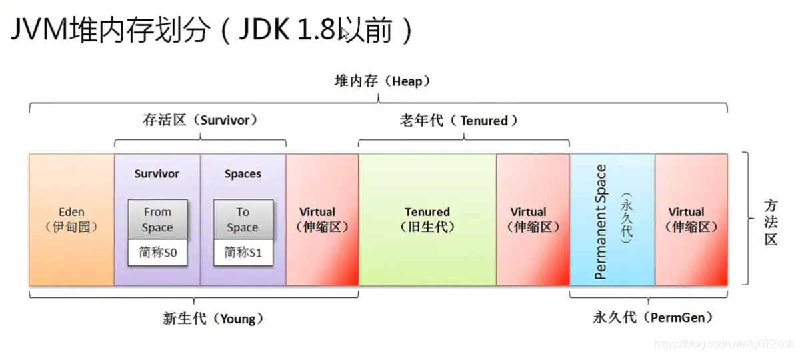
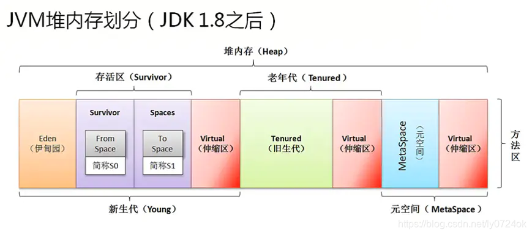

# JVM GC 入门 → 进阶

## 1. 为什么需要垃圾回收（GC）

* Java 对象在堆上动态分配，程序运行中不断创建对象，若无回收机制，内存会耗尽。
* GC 自动识别不可达对象并回收内存，降低对性能的影响。

## 2. JVM 堆与分代机制

* **堆（Heap）** 始终分为新生代（短生命周期）和老年代（长生命周期）
* **方法区（存储类元数据）**：
  * Java 8 前：永久代（PermGen，堆的一部分）存储类信息
  * Java 8+：元空间（Metaspace，使用本地内存）替代永久代
* 分代基于经验：多数对象生命周期短，新生代 GC 频繁但快

## 3. 垃圾收集器（GC）算法概览

JVM 提供多种垃圾收集器，每种针对不同应用场景进行了优化。核心区别在于 **停顿时间（pause time）**、**吞吐量（throughput）** 和 **内存整理方式**。下面按经典到现代顺序说明：

### 3.1 Serial GC（串行 GC）

* **特点**：单线程、简单高效、适合小内存应用
* **机制**：新生代复制 + 老年代标记-压缩
* **优点**：实现简单、内存占用小
* **缺点**：GC 时暂停整个应用（STW）
* **适用场景**：桌面应用、小内存服务器（< 2GB）
* **启用方式**：`-XX:+UseSerialGC`

### 3.2 Parallel GC（并行 GC）

* **特点**：多线程、吞吐量优先
* **机制**：新生代复制 + 老年代标记-压缩
* **优点**：多线程并行，提高吞吐量
* **缺点**：GC 时 STW，停顿时间较长
* **适用场景**：后台批处理、吞吐量优先应用
* **启用方式**：`-XX:+UseParallelGC`（Java 9 前默认）

### 3.3 CMS（Concurrent Mark-Sweep）GC

* **特点**：低延迟、并发回收（仅 Java 8-13，Java 14 已移除）
* **机制**：初始标记（STW）→ 并发标记 → 重新标记（STW）→ 并发清除
* **优点**：减少 STW 时间
* **缺点**：CPU 敏感、内存碎片、已过时（Java 14 移除）
* **适用场景**：遗留系统、Java 8 环境

### 3.4 G1 GC（Garbage First）

* **特点**：区域化、可预测停顿、JDK 9+ 默认
* **机制**：堆划分为 Region，优先回收垃圾最多的 Region
* **优点**：可预测停顿、无碎片、适合大堆
* **缺点**：实现复杂、小堆性能可能较差
* **适用场景**：大内存、低延迟应用
* **启用方式**：`-XX:+UseG1GC`（JDK 9+ 默认）

### 3.5 ZGC

* **特点**：亚毫秒级停顿、TB 级堆内存、并发度极高
* **机制**：并发标记 + 并发压缩（仅初始标记、重新标记 STW）
* **优点**：极低延迟、支持超大堆、分代模式优化效率
* **缺点**：需要 64 位系统、内存占用略高
* **适用场景**：高并发、大内存、低延迟应用
* **启用方式**：`-XX:+UseZGC`

### 3.6 Shenandoah GC

* **特点**：OpenJDK 专属、超低停顿（<10ms）
* **机制**：并发标记 + 并发压缩（Brooks 指针）
* **优点**：停顿极短、适合大堆
* **缺点**：OpenJDK 专属、CPU 开销高
* **适用场景**：高并发、大内存、低延迟
* **启用方式**：`-XX:+UseShenandoahGC`

### 3.7 Epsilon GC

* **特点**：无回收 GC，仅分配不回收
* **机制**：不回收，堆满即退出
* **优点**：零 GC 开销
* **缺点**：堆满即崩溃
* **适用场景**：性能测试、基准测试
* **启用方式**：`-XX:+UseEpsilonGC`

### 3.8 总结

| 收集器      | 停顿时间 | 吞吐量 | 堆大小 | 可用性 | 适用场景            |
| -------- | ---- | --- | --- | ----- | --------------- |
| Serial   | 高    | 低   | 小   | 全平台  | 小型应用 / 单线程      |
| Parallel | 中    | 高   | 中等  | 全平台  | 批处理 / 吞吐量敏感     |
| CMS      | 低    | 中   | 中等  | 全平台  | 延迟敏感，旧 JVM（Java 8-） |
| G1       | 可控   | 高   | 中大型 | 全平台  | Web 服务 / 微服务    |
| ZGC      | 亚毫秒级（<1ms） | 高   | TB 级（最大 16TB） | 全平台  | 高并发 / 大内存 / 低延迟 |
| Shenandoah | 极低（<10ms） | 高   | TB 级 | OpenJDK | 高并发 / 大内存 / 超低延迟 |
| Epsilon  | **无停顿** | 最高  | 任意  | 全平台  | 性能测试 / 短生命周期应用 |

如果你不手动指定 `-XX:+UseG1GC` 或其他收集器，JVM 会自动使用默认收集器：

| Java 版本    | 默认 GC 组合               |
| ---------- | ------------------------ |
| Java 8 及以前 | Parallel Scavenge（新生代）+ Parallel Old（老年代）（简称 Parallel GC） |
| Java 9 及以后 | G1 GC                     |

你可以通过命令行 `java -XX:+PrintCommandLineFlags -version` 查看实际 JVM 使用的默认 GC。

## 4. GC 的核心工作流程

图片来源：https://blog.csdn.net/ly0724ok/article/details/116714670

### 4.1 可达性分析（对象存活判断）

* **GC Roots 来源**：
  * 栈中引用的对象（局部变量、方法参数）
  * 方法区中类静态属性
  * 常量池中的引用
  * JNI（本地方法）引用
* **不可达对象**：没有任何 GC Roots 可以到达 → 被认为是垃圾

### 4.2 分代回收机制

**新生代 GC（Minor GC）**：

**Eden空间**：新生代中最大区域（占80%），新对象首先分配在这里
**Survivor 区**：新生代中次最大区域（占10%），对象存活时间短的对象移动到这里

* **触发条件**：Eden 空间满（新对象无法在Eden区分配）
* **算法**：复制算法（Copying）
* **流程**：Eden + Survivor 整理 → 活跃对象复制到 Survivor → 老化对象晋升老年代
* **特点**：回收快、停顿时间短、非常频繁

**老年代 GC（Major GC / Full GC）**：
* **触发条件**：老年代空间不足、长期存活对象晋升占满
* **算法**：标记-清除 或 标记-压缩
* **流程**：标记可达对象 → 清除不可达对象 → 可选整理存活对象
* **特点**：停顿时间长（Stop-the-World）、老年代碎片化严重时触发

### 4.3 标记阶段详细流程

**STW（Stop-The-World）**：暂停所有应用线程，保证对象引用关系一致性

1. **初始标记**（STW）：标记 GC Roots 直接引用的对象，停顿短
2. **并发标记**：与应用线程同时执行，标记所有可达对象
3. **重新标记**（STW）：修正并发标记遗漏的对象，停顿比初始标记长
4. **清理/整理**：清除不可达对象，可选整理存活对象消除碎片

> 这种流程以 G1 GC 为代表，适用于 CMS、ZGC 等不同 GC 实现

**STW影响**：应用完全停止响应，是造成GC停顿的主要原因。现代GC（G1、ZGC）通过并发标记减少STW时间。

### 4.4 GC 触发机制

* **主动触发**：应用调用 `System.gc()`（不保证立即执行）
* **被动触发**：
  * Eden 区满 → Minor GC
  * 老年代不足 → Full GC
  * Metaspace 超限 → 元空间回收

## 5. 对象生命周期与分代关系

* 短生命周期对象 → 新生代 GC 快速回收
* 长生命周期对象 → 多次新生代 GC 后晋升老年代
* 大对象（>10MB）→ 直接进入老年代，避免复制开销

## 6. 常见 GC 调优与实践

### 6.1 监控 GC

* **推荐工具**：`jcmd`（替代已弃用的 `jmap`）
  * 堆转储：`jcmd <pid> GC.heap_dump filename=heap.hprof`
  * GC 统计：`jcmd <pid> GC.class_histogram`
* **JFR**（Java Flight Recorder）：低开销监控，启动：`-XX:+FlightRecorder`
* **JMC**（Java Mission Control）：图形化分析JFR数据，实时监控和性能分析
* **其他工具**：VisualVM、MAT（内存分析工具）

### 6.2 合理设置堆大小

* `-Xms` 和 `-Xmx` 建议相等，避免动态扩容
* 传统 GC：用 `-XX:NewRatio` 控制新生代比例
* G1 GC：用 `-XX:G1NewSizePercent` 动态调整新生代
* 根据对象生命周期调优，避免频繁 GC

### 6.3 避免内存泄漏

* 及时清理静态集合、未关闭资源、ThreadLocal
* 使用弱引用管理缓存
* 避免大对象直接进入老年代

### 6.4 选择合适 GC

* 小应用 → Serial/Parallel
* 中大型服务 → G1
* 大堆低延迟 → ZGC/Shenandoah

### 6.5 调优实践

**基本思路**：
* 用 JFR + JMC 分析性能
* 结合日志、压测、监控逐步调整
* 先定位瓶颈再调优
* Java 25：默认 G1，大堆用 ZGC，生产用 JFR 监控

**GC 优化要点**：
1. **减少停顿**：使用并发/低停顿 GC（G1、ZGC、Shenandoah）
2. **合理设置堆和分代比例**：新生代占 1/3～1/4 堆大小
3. **避免过度创建短生命周期对象**：减少 Minor GC 频率
4. **压缩指针和对象对齐**：通过 `-XX:+UseCompressedOops` 节省内存

## 7. 总结

* JVM GC 自动管理内存，提供多种策略
* 理解原理、选择合适收集器、合理调优
* 现代 GC（G1/ZGC）满足大多数场景需求
