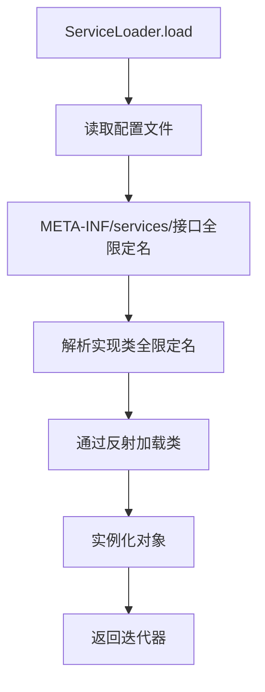

## 1. 什么是Java SPI机制

SPI（Service Provider Interface）是Java提供的一种服务发现机制，用于在运行时动态加载和发现服务实现。它通过在classpath路径下的`META-INF/services`文件夹中配置接口的实现类，使得程序可以在运行时根据配置加载相应的实现。

### 1.1 SPI的核心思想

SPI机制的核心思想是**解耦接口和实现**。通过配置文件的方式，将接口的实现类完全交给第三方来实现，而不需要在代码中硬编码具体的实现类。这种机制使得框架具有良好的扩展性，开发者可以根据需要提供不同的实现。

### 1.2 SPI的应用场景

1. **数据库驱动加载**：JDBC通过SPI机制加载不同的数据库驱动
2. **日志框架**：SLF4J通过SPI机制选择具体的日志实现（Logback、Log4j等）
3. **插件化架构**：允许第三方为系统提供插件实现
4. **验证码服务**：淘票票项目中通过SPI机制支持多种验证码类型

## 2. SPI机制的底层实现原理

### 2.1 核心类：ServiceLoader

Java SPI机制的核心实现类是`java.util.ServiceLoader`，它是一个延迟加载的迭代器，用于加载和迭代服务提供者。

### 2.2 工作流程



### 2.3 具体实现步骤

1. **配置文件**：在`META-INF/services`目录下创建以接口全限定名为文件名的配置文件
2. **文件内容**：在配置文件中写入实现类的全限定名（每行一个）
3. **加载机制**：通过`ServiceLoader.load(接口.class)`加载所有实现
4. **延迟加载**：只有在遍历时才会真正实例化对象

### 2.4 源码分析

ServiceLoader的关键方法：

```java
public final class ServiceLoader<S> implements Iterable<S> {
    // 加载服务提供者
    public static <S> ServiceLoader<S> load(Class<S> service) {
        ClassLoader cl = Thread.currentThread().getContextClassLoader();
        return ServiceLoader.load(service, cl);
    }
    
    // 迭代器实现
    public Iterator<S> iterator() {
        return new LazyIterator();
    }
}
```

LazyIterator在调用next()时才会真正加载和实例化服务提供者。

## 3. 淘票票项目中的SPI实践

### 3.1 验证码服务架构

淘票票项目中使用SPI机制实现了灵活的验证码服务架构，支持多种验证码类型：

1. **滑动拼图验证码**：BlockPuzzleCaptchaServiceImpl
2. **点选文字验证码**：ClickWordCaptchaServiceImpl
3. **默认验证码**：DefaultCaptchaServiceImpl

### 3.2 配置文件

在`taopiaopiao-captcha-manage-framework/taopiaopiao-base-captcha/src/main/resources/META-INF/services/`目录下有两个配置文件：

#### 3.2.1 CaptchaService配置

文件路径：`META-INF/services/com.taopiaopiao.captcha.service.CaptchaService`

文件内容：
```
com.taopiaopiao.captcha.service.impl.BlockPuzzleCaptchaServiceImpl
com.taopiaopiao.captcha.service.impl.ClickWordCaptchaServiceImpl
com.taopiaopiao.captcha.service.impl.DefaultCaptchaServiceImpl
```

#### 3.2.2 CaptchaCacheService配置

文件路径：`META-INF/services/com.taopiaopiao.captcha.service.CaptchaCacheService`

文件内容：
```
com.taopiaopiao.captcha.service.impl.CaptchaCacheServiceMemImpl
```

### 3.3 工厂类实现

`CaptchaServiceFactory`是验证码服务的工厂类，负责加载和管理所有服务实现：

```java
public class CaptchaServiceFactory {
    // 存储所有验证码服务实例
    public volatile static Map<String, CaptchaService> instances = new HashMap();
    // 存储所有缓存服务实例
    public volatile static Map<String, CaptchaCacheService> cacheService = new HashMap();

    static {
        // 加载所有缓存服务实现
        ServiceLoader<CaptchaCacheService> cacheServices = ServiceLoader.load(CaptchaCacheService.class);
        for (CaptchaCacheService item : cacheServices) {
            cacheService.put(item.type(), item);
        }
        
        // 加载所有验证码服务实现
        ServiceLoader<CaptchaService> services = ServiceLoader.load(CaptchaService.class);
        for (CaptchaService item : services) {
            instances.put(item.captchaType(), item);
        }
    }

    // 根据类型获取验证码服务实例
    public static CaptchaService getInstance(Properties config) {
        String captchaType = config.getProperty(Const.CAPTCHA_TYPE, "default");
        CaptchaService ret = instances.get(captchaType);
        if (ret == null) {
            throw new RuntimeException("unsupported-[captcha.type]=" + captchaType);
        }
        ret.init(config);
        return ret;
    }
}
```

### 3.4 实现类示例

#### 3.4.1 BlockPuzzleCaptchaServiceImpl（滑动拼图验证码）

```java
public class BlockPuzzleCaptchaServiceImpl extends AbstractCaptchaService {
    @Override
    public String captchaType() {
        return CaptchaTypeEnum.BLOCKPUZZLE.getCodeValue(); // 返回"blockPuzzle"
    }
    
    // 实现具体的滑动拼图逻辑
    @Override
    public ResponseModel get(CaptchaVO captchaVO) {
        // 生成滑动拼图验证码的具体实现
    }
}
```

#### 3.4.2 ClickWordCaptchaServiceImpl（点选文字验证码）

```java
public class ClickWordCaptchaServiceImpl extends AbstractCaptchaService {
    @Override
    public String captchaType() {
        return CaptchaTypeEnum.CLICKWORD.getCodeValue(); // 返回"clickWord"
    }
    
    // 实现具体的点选文字逻辑
    @Override
    public ResponseModel get(CaptchaVO captchaVO) {
        // 生成点选文字验证码的具体实现
    }
}
```

### 3.5 使用方式

在实际使用中，通过配置文件指定需要的验证码类型：

```properties
# application.properties
captcha.type=blockPuzzle  # 或者 clickWord, default
```

然后通过工厂类获取对应的服务实例：

```java
Properties config = new Properties();
config.load(new FileInputStream("application.properties"));
CaptchaService captchaService = CaptchaServiceFactory.getInstance(config);
```

## 4. SPI机制的优势与注意事项

### 4.1 优势

1. **解耦合**：接口与实现完全分离，降低模块间耦合度
2. **可扩展性**：支持第三方提供实现，便于扩展功能
3. **灵活性**：运行时动态加载，可根据配置选择不同实现
4. **约定优于配置**：通过约定的配置文件格式，简化使用

### 4.2 注意事项

1. **线程安全**：ServiceLoader不是线程安全的，需要外部同步
2. **异常处理**：加载过程中可能抛出ClassNotFoundException等异常
3. **性能考虑**：首次加载时需要通过反射实例化对象，有一定性能开销
4. **版本兼容**：不同版本的实现可能存在兼容性问题

## 5. 总结

Java SPI机制是实现插件化架构和解耦合设计的重要工具。在淘票票项目中，通过SPI机制实现了灵活的验证码服务架构，支持多种验证码类型，体现了SPI机制在实际项目中的强大作用。

通过合理使用SPI机制，我们可以构建出更加灵活、可扩展的系统架构，使得系统具备更好的可维护性和可扩展性。