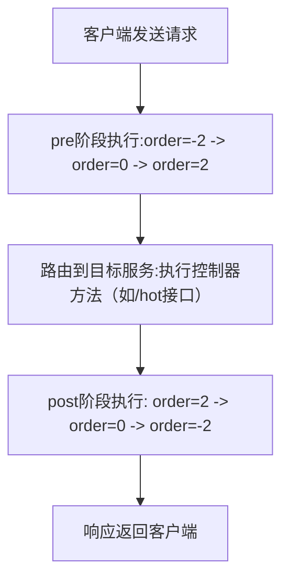

在微服务架构中，网关是请求和响应的“必经之路”。处理响应体（如加密、校验、脱敏）是网关的高频需求，但很多开发者会困惑：“为什么我配置的响应过滤器，看似在控制器前执行？”“order值和执行阶段到底是什么关系？”更会疑惑：“Gateway的过滤器和Spring MVC的拦截器有什么区别？该怎么选？”


## 一、基础认知：Gateway与Spring MVC的核心定位差异
在对比过滤器之前，先明确两者的本质区别——定位不同决定了过滤器的设计逻辑不同：

| 框架         | 定位                  | 核心场景                  | 底层依赖              | 数据处理模式          |
|--------------|-----------------------|---------------------------|-----------------------|-----------------------|
| Spring Cloud Gateway | 微服务网关（跨服务）  | 路由转发、跨服务鉴权、全局响应处理 | Netty（非阻塞IO）     | 响应式流（Flux/Mono） |
| Spring MVC   | 单体/服务内部控制器   | 服务内请求处理、接口级拦截        | Servlet API（阻塞IO） | 同步请求响应          |

简单说：Gateway是“跨服务的流量入口”，处理的是多服务的统一流量；Spring MVC是“单个服务的接口入口”，处理的是服务内的请求逻辑。


## 二、Gateway过滤器核心：双向执行流程与响应装饰器
### 1. Gateway过滤器的“双向执行流程”
Spring Cloud Gateway的过滤器链是 **“先正向pre阶段、后反向post阶段”** 的双向流程，类似“去程和返程”：

| 阶段       | 执行时机                          | 核心作用                                  | 执行顺序规则                  | 典型组件                  |
|------------|-----------------------------------|-------------------------------------------|-------------------------------|---------------------------|
| **pre阶段** | 请求路由到目标服务（控制器）之前  | 权限校验、请求体修改、日志记录（提前拦截） | `order值越小，执行越靠前`      | GlobalFilter、GatewayFilter |
| **post阶段**| 目标服务（控制器）返回响应之后    | 响应体加密、结果校验、响应头添加（后置处理）| `order值越大，执行越靠前`      | ServerHttpResponseDecorator |

#### 流程示例（3个过滤器场景）
假设网关有3个全局过滤器，`order`分别为`-2`（响应过滤器）、`0`（路由过滤器）、`2`（日志过滤器），完整执行流程：



### 2. 响应处理核心：ServerHttpResponseDecorator
要在post阶段处理响应体，必须依赖`ServerHttpResponseDecorator`（响应装饰器），其核心能力是 **“在pre阶段预埋钩子，在post阶段响应产生时触发逻辑”**。

#### 装饰器的“延迟执行”原理
- **pre阶段**：创建装饰器对象，重写`writeWith`方法（此时方法内逻辑未执行，仅“挂好钩子”）；
- **post阶段**：控制器返回响应体，Gateway调用`writeWith`方法将响应写入客户端，此时装饰器逻辑才触发（处理响应体）。

**比喻理解**：pre阶段给快递套“智能包装袋”（装饰器），袋子有“封口时自动贴标签”的钩子；post阶段商品（响应体）放入袋子，封口时钩子触发贴标签（处理响应）。


### 3. 实战案例：Gateway响应体加密过滤器
以项目中的`ResponseValidationFilter`为例，拆解完整实现：

#### 代码实现
```java
@Component
@Slf4j
public class ResponseValidationFilter implements GlobalFilter, Ordered {
    @Value("${aes.vector:default}")
    private String aesVector;
    @Autowired
    private ChannelDataService channelDataService;

    // 1. pre阶段执行顺序：order越小越靠前（此处-2确保最早挂钩）
    @Override
    public int getOrder() { return -2; }

    // 2. pre阶段：创建装饰器，替换原始响应（挂钩动作）
    @Override
    public Mono<Void> filter(ServerWebExchange exchange, GatewayFilterChain chain) {
        log.info("【Gateway-pre】order=-2，预埋响应装饰器");
        // 装饰响应对象，继续过滤器链
        return chain.filter(exchange.mutate().response(decorate(exchange)).build());
    }

    // 3. 创建响应装饰器（定义post阶段逻辑）
    private ServerHttpResponse decorate(ServerWebExchange exchange) {
        return new ServerHttpResponseDecorator(exchange.getResponse()) {
            // 4. post阶段：响应体写入时触发（核心处理逻辑）
            @Override
            public Mono<Void> writeWith(Publisher<? extends DataBuffer> body) {
                // 读取原始响应体
                String originalContentType = exchange.getAttribute(ORIGINAL_RESPONSE_CONTENT_TYPE_ATTR);
                HttpHeaders headers = new HttpHeaders();
                headers.add(HttpHeaders.CONTENT_TYPE, originalContentType);

                ClientResponse clientResponse = ClientResponse
                        .create(Objects.requireNonNull(exchange.getResponse().getStatusCode()))
                        .headers(h -> h.putAll(headers))
                        .body(Flux.from(body)).build();

                // 处理响应体（加密）
                Mono<String> modifiedBody = clientResponse.bodyToMono(String.class)
                        .flatMap(originalBody -> Mono.just(checkResponseBody(exchange, originalBody)));

                // 写回处理后的响应体
                BodyInserter<Mono<String>, ReactiveHttpOutputMessage> inserter = 
                    BodyInserters.fromPublisher(modifiedBody, String.class);
                CachedBodyOutputMessage outputMessage = new CachedBodyOutputMessage(exchange, exchange.getResponse().getHeaders());
                
                return inserter.insert(outputMessage, new BodyInserterContext())
                        .then(Mono.defer(() -> {
                            Flux<DataBuffer> messageBody = outputMessage.getBody();
                            // 处理Content-Length头
                            if (!getDelegate().getHeaders().containsKey(HttpHeaders.TRANSFER_ENCODING)) {
                                messageBody = messageBody.doOnNext(buffer -> 
                                    getDelegate().getHeaders().setContentLength(buffer.readableByteCount())
                                );
                            }
                            return getDelegate().writeWith(messageBody);
                        }));
            }

            // 5. 业务逻辑：响应体RSA加密
            private String checkResponseBody(ServerWebExchange exchange, String responseBody) {
                log.info("【Gateway-post】处理响应体，开始加密");
                ServerHttpRequest request = exchange.getRequest();
                String noVerify = request.getHeaders().getFirst(NO_VERIFY);
                String encrypt = request.getHeaders().getFirst(ENCRYPT);

                if ((!VERIFY_VALUE.equals(noVerify)) && V2.equals(encrypt) && StringUtil.isNotEmpty(responseBody)) {
                    ApiResponse apiResponse = JSON.parseObject(responseBody, ApiResponse.class);
                    Object data = apiResponse.getData();
                    if (data != null) {
                        String code = request.getHeaders().getFirst(CODE);
                        GetChannelDataVo channelData = channelDataService.getChannelDataByCode(code);
                        String encryptedData = RsaTool.encrypt(JSON.toJSONString(data), channelData.getDataPublicKey());
                        apiResponse.setData(encryptedData);
                        return JSON.toJSONString(apiResponse);
                    }
                }
                return responseBody;
            }

            @Override
            public Mono<Void> writeAndFlushWith(Publisher<? extends Publisher<? extends DataBuffer>> body) {
                return writeWith(Flux.from(body).flatMapSequential(p -> p));
            }
        };
    }
}
```

#### 关键日志输出（验证流程）
```
【Gateway-pre】order=-2，预埋响应装饰器
【目标服务控制器】开始处理请求（/hot接口）
【目标服务控制器】处理完成，返回响应体
【Gateway-post】处理响应体，开始加密
```


## 三、与Spring MVC过滤器/拦截器的完整对比
为了清晰区分，从**过滤器类型、执行流程、响应处理方式、核心组件、适用场景**5个维度做对比：

### 1. 核心维度对比表
| 对比维度         | Spring Cloud Gateway                          | Spring MVC                                  |
|------------------|-----------------------------------------------|---------------------------------------------|
| **过滤器类型**   | 1. GlobalFilter（全局过滤器，作用于所有路由）<br>2. GatewayFilter（路由过滤器，作用于指定路由） | 1. HandlerInterceptor（控制器拦截器，服务内）<br>2. Servlet Filter（Servlet级过滤器，更早执行） |
| **执行流程**     | 双向流程：<br>pre阶段（路由前）→ 控制器 → post阶段（响应后）<br>post阶段按order倒序执行 | 三层流程（基于Servlet生命周期）：<br>1. Filter.doFilter（请求前）<br>2. Interceptor.preHandle（控制器前）<br>3. 控制器执行<br>4. Interceptor.postHandle（响应前）<br>5. Interceptor.afterCompletion（响应后）<br>6. Filter.doFilter（响应后） |
| **响应处理核心** | ServerHttpResponseDecorator（装饰响应对象，重写writeWith，非阻塞处理Flux流） | 1. HttpServletResponseWrapper（装饰响应，同步处理字节流）<br>2. Interceptor.postHandle（直接操作ModelAndView或响应流） |
| **数据处理模式** | 响应式（非阻塞）：处理`Flux<DataBuffer>`流，支持大文件/高并发 | 同步阻塞：处理ServletInputStream/ServletOutputStream，单线程处理单个请求 |
| **适用场景**     | 1. 跨服务的全局响应处理（如所有服务响应加密）<br>2. 网关层路由转发后的响应加工<br>3. 高并发、大流量场景 | 1. 单个服务内的接口响应处理（如某服务接口脱敏）<br>2. 单体应用的响应拦截<br>3. 依赖Servlet API的同步场景 |


### 2. Spring MVC响应处理实战案例（对比参考）
以“服务内响应体脱敏”为例，实现Spring MVC的`HandlerInterceptor`：

#### 代码实现
```java
@Component
public class MvcResponseDesensitizeInterceptor implements HandlerInterceptor {
    // 1. 控制器执行前（类似Gateway的pre阶段）
    @Override
    public boolean preHandle(HttpServletRequest request, HttpServletResponse response, Object handler) throws Exception {
        log.info("【MVC-pre】Interceptor：控制器执行前，准备装饰响应");
        // 装饰响应对象（替换原始response）
        response = new ResponseWrapper(response);
        return true;
    }

    // 2. 控制器执行后，视图渲染前（核心响应处理，类似Gateway的post阶段）
    @Override
    public void postHandle(HttpServletRequest request, HttpServletResponse response, Object handler, ModelAndView modelAndView) throws Exception {
        log.info("【MVC-post】Interceptor：处理响应体，开始脱敏");
        if (response instanceof ResponseWrapper) {
            ResponseWrapper wrapper = (ResponseWrapper) response;
            // 读取响应体
            String responseBody = wrapper.getResponseBody();
            if (StringUtil.isNotEmpty(responseBody)) {
                // 业务逻辑：手机号脱敏
                ApiResponse apiResponse = JSON.parseObject(responseBody, ApiResponse.class);
                Object data = apiResponse.getData();
                if (data instanceof UserVo) {
                    UserVo user = (UserVo) data;
                    user.setPhone(desensitizePhone(user.getPhone())); // 手机号脱敏（138****1234）
                    apiResponse.setData(user);
                    String modifiedBody = JSON.toJSONString(apiResponse);
                    // 写回响应
                    response.getWriter().write(modifiedBody);
                }
            }
        }
    }

    // 3. 响应完成后（资源清理）
    @Override
    public void afterCompletion(HttpServletRequest request, HttpServletResponse response, Object handler, Exception ex) throws Exception {
        log.info("【MVC-after】Interceptor：响应完成，释放资源");
    }

    // 自定义响应包装器（类似Gateway的ServerHttpResponseDecorator）
    static class ResponseWrapper extends HttpServletResponseWrapper {
        private ByteArrayOutputStream outputStream = new ByteArrayOutputStream();
        private PrintWriter writer = new PrintWriter(outputStream);

        public ResponseWrapper(HttpServletResponse response) {
            super(response);
        }

        @Override
        public ServletOutputStream getOutputStream() throws IOException {
            return new ServletOutputStream() {
                @Override
                public boolean isReady() { return false; }
                @Override
                public void setWriteListener(WriteListener listener) {}
                @Override
                public void write(int b) throws IOException { outputStream.write(b); }
            };
        }

        @Override
        public PrintWriter getWriter() throws IOException {
            return writer;
        }

        // 获取响应体
        public String getResponseBody() {
            writer.flush();
            return new String(outputStream.toByteArray(), StandardCharsets.UTF_8);
        }
    }

    // 手机号脱敏工具
    private String desensitizePhone(String phone) {
        if (phone == null || phone.length() != 11) return phone;
        return phone.substring(0, 3) + "****" + phone.substring(7);
    }
}
```

#### 关键日志输出（对比Gateway）
```
【MVC-pre】Interceptor：控制器执行前，准备装饰响应
【MVC控制器】处理请求（/user/info接口）
【MVC-post】Interceptor：处理响应体，开始脱敏
【MVC-after】Interceptor：响应完成，释放资源
```


### 3. 核心差异总结（一句话区分）
- **Gateway**：网关层“跨服务全局响应处理”，用`ServerHttpResponseDecorator`非阻塞处理Flux流，适合高并发；
- **Spring MVC**：服务内“接口级响应处理”，用`HandlerInterceptor`+`ResponseWrapper`同步处理Servlet流，适合单体/服务内场景。


## 四、常见误区与避坑指南
### 误区1：Gateway的order值决定post阶段执行顺序
- **错误认知**：认为`order=-2`会让响应逻辑在post阶段最早执行；
- **正确理解**：order只影响pre阶段的“挂钩顺序”，post阶段逻辑触发时机由“响应体写入”决定，与order无关；若多个Gateway过滤器装饰响应，最终执行最后一个装饰器的`writeWith`。

### 误区2：Gateway过滤器和MVC拦截器可以混用
- **错误认知**：在Gateway中使用Spring MVC的`HandlerInterceptor`；
- **正确理解**：Gateway基于Netty非阻塞IO，不依赖Servlet API；MVC拦截器依赖Servlet API，两者无法混用，需分别实现。

### 误区3：响应装饰器创建时就执行处理逻辑
- **错误认知**：Gateway的`decorate`方法或MVC的`ResponseWrapper`创建时，就执行响应处理；
- **正确理解**：装饰器只是“预埋钩子”，处理逻辑需等响应体产生后（控制器返回后）才触发（Gateway的`writeWith`、MVC的`postHandle`）。


## 五、实战选型建议
1. **选Gateway的场景**：
    - 需要对所有微服务的响应做统一处理（如全局加密、统一响应格式）；
    - 网关层路由转发后，需加工响应体（如根据渠道动态调整响应结构）；
    - 系统并发量高（QPS>1000），需要非阻塞处理大流量。

2. **选Spring MVC的场景**：
    - 仅需对单个服务的部分接口做响应处理（如某服务用户接口脱敏）；
    - 项目是单体应用，不涉及网关；
    - 依赖Servlet API的同步逻辑（如需要获取ServletContext）。


## 六、总结
Gateway的响应过滤器通过“双向流程+延迟装饰器”实现post阶段处理，核心是`ServerHttpResponseDecorator`的非阻塞流处理；而Spring MVC的响应拦截基于Servlet生命周期，通过`HandlerInterceptor`+`ResponseWrapper`同步处理。

两者没有“优劣之分”，只有“场景之别”——理解它们的执行流程和适用场景，才能在微服务架构中正确落地响应处理逻辑，避免出现“过滤器不执行”“响应体处理异常”等问题。