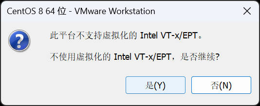
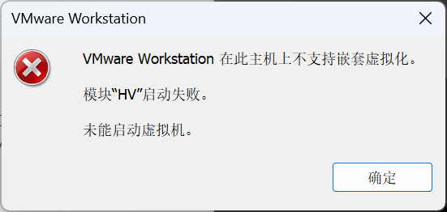

# Windows子系统WSL完全指南

## WSL简介

Windows Subsystem for Linux (WSL) 是微软开发的一项技术，允许在Windows操作系统上直接运行Linux环境，无需传统虚拟机或双系统启动。WSL为开发人员提供了在Windows平台上使用Linux工具和应用程序的便捷方式。

## WSL的发展历程

### WSL1 (2016年)

- 基于转换层技术，将Linux系统调用转换为Windows系统调用
- 实现了基本的Linux兼容性
- 性能限制：文件系统I/O操作较慢

### WSL2 (2019年)

- 采用轻量级虚拟机技术，运行完整的Linux内核
- 显著提升性能，特别是文件系统I/O
- 支持Docker容器
- 提供更完整的Linux系统调用兼容性

## WSL的优势

1. **无缝集成**：Windows与Linux环境可以共享文件系统
2. **性能优异**：接近原生Linux性能，远超传统虚拟机
3. **开发效率**：在一个系统中同时使用Windows和Linux工具
4. **资源节约**：相比虚拟机占用更少的系统资源
5. **工具兼容**：可以使用Linux开发工具链和命令行工具

## 安装WSL

### 系统要求

- Windows 10版本2004或更高(内部版本19041及以上)
- 或Windows 11
- 启用虚拟化功能(在BIOS中)

### 安装方法

#### 一键安装

以管理员身份打开PowerShell，运行以下命令：

```powershell
wsl --install
```

3. 重启计算机

4. 下载并安装WSL2内核更新包
```powershell
wsl --update --web-download
```
5. 设置WSL2为默认版本：
```powershell
wsl --set-default-version 2
```

#### 安装Ubuntu
1. Microsoft Store搜索wls,并安装Ubuntu Linux


2.
## WSL基本使用

### 启动和关闭WSL

```powershell
# 启动默认发行版
wsl

# 关闭所有WSL实例
wsl --shutdown

```

### 管理WSL发行版

```powershell
# 列出已安装的发行版
wsl -l -v

# 设置默认发行版
wsl -s Ubuntu-24.04

```

## WSL安装Docker

在WSL（Ubuntu）中安装Docker的正确步骤如下：

### ① 添加Docker官方源

首先更新系统并安装必要的依赖：

```bash
sudo apt update
sudo apt install -y ca-certificates curl gnupg
```

添加Docker官方GPG密钥：

```bash
sudo install -m 0755 -d /etc/apt/keyrings
curl -fsSL https://download.docker.com/linux/ubuntu/gpg \
  | sudo gpg --dearmor -o /etc/apt/keyrings/docker.gpg
sudo chmod a+r /etc/apt/keyrings/docker.gpg
```

添加Docker APT源：

```bash
echo \
  "deb [arch=$(dpkg --print-architecture) signed-by=/etc/apt/keyrings/docker.gpg] \
  https://download.docker.com/linux/ubuntu \
  $(lsb_release -cs) stable" \
  | sudo tee /etc/apt/sources.list.d/docker.list > /dev/null
```

### ② 安装Docker Engine

更新包索引并安装Docker Engine：

```bash
sudo apt update
sudo apt install -y docker-ce docker-ce-cli containerd.io docker-buildx-plugin docker-compose-plugin
```

### ③ 验证安装

安装完成后，验证Docker是否正确安装：

```bash
docker --version
docker compose version
```

### ④ 配置Docker服务

启动Docker服务并设置开机自启：

```bash
sudo service docker start
sudo systemctl enable docker
```

将当前用户添加到docker组，避免每次使用docker命令都需要sudo：

```bash
sudo usermod -aG docker $USER
```

**注意**：添加用户组后需要重新登录或重启WSL使更改生效。

## 移植原虚拟机的数据

如果您有之前在虚拟机中的数据需要迁移到WSL，可以按照以下步骤操作：

### 1. 创建工作目录

```bash
sudo mkdir /myprojects
sudo chown username:username /myprojects
sudo chown -R username:username /myprojects
```

**命令解释**：
- `mkdir`：创建新目录
- `chown`：将目录所有权更改为指定用户，使该普通用户也可以编辑该目录（避免需要sudo权限才能写入）
  - `-R`：递归操作，将目录及其所有子目录和文件的所有权都更改
  - `username`：需要替换为实际的用户名

### 2. 进入工作目录

```bash
cd /myprojects
```

### 3. 从Windows磁盘复制数据

WSL可以访问Windows文件系统，通常挂载在`/mnt/`目录下：

```bash
cp /mnt/f/Ubuntu-WSL/*.tar.gz .
```

**命令解释**：
- `/mnt/f/`：Windows的F盘在WSL中的挂载点
- `*.tar.gz`：匹配所有以.tar.gz结尾的文件
- `.`：当前目录

### 4. 解压数据文件

```bash
for f in *.tar.gz; do tar -xzf "$f"; done
```

**命令解释**：
- `for f in *.tar.gz`：遍历所有.tar.gz文件
- `tar -xzf`：解压命令参数
  - `-x`：提取文件
  - `-z`：处理gzip压缩
  - `-f`：指定文件名

### 5. 清理压缩包

```bash
rm *.tar.gz
```

**注意**：此操作会删除所有.tar.gz文件，请确保解压完成且数据无误后再执行。

### 6. 验证数据完整性

```bash
ls -la
```

检查解压后的文件和目录是否完整，确保数据迁移成功。

## VSCode 远程 WSL 进行开发
在VS Code中远程开发WSL，需要安装 "Remote - WSL" 扩展。
1. 打开 VS Code
2. 点击左侧扩展图标（或使用快捷键 `Ctrl+Shift+X`）
3. 在搜索框中输入 "WSL"
4. 找到 "Remote - WSL" 扩展并点击安装


完成后会自动连接WSL

## 常见问题
### 安装后VMWare启动失败报错



**问题：WSL和VMWare冲突**

你看到的报错："此平台不支持虚拟化的 Intel VT-x/EPT … 不支持嵌套虚拟化"

**原因分析：**
- WSL2需要Hyper-V，而Hyper-V会独占VT-x
- VMware也需要VT-x，因此两者会产生冲突

**解决方案：**
Z
**方案A：暂时关闭WSL2/Hyper-V（推荐）**
关闭Hyper-V让VMWare正常运行，操作完成后重新开启：

1. 关闭Hyper-V（管理员PowerShell）：
```powershell
bcdedit /set hypervisorlaunchtype off
```

2. 重启电脑，此时VMWare可以启动，WSL2不可用

3. 完成操作后，重新开启Hyper-V：
```powershell
bcdedit /set hypervisorlaunchtype auto
```

4. 再次重启，WSL2恢复可用，VMWare不可用

### 拉取镜像超时（原因是开启了魔法）

**错误信息示例：**
```
Error response from daemon: failed to resolve reference "docker.io/nacos/nacos-server:v2.3.2": failed to do request: Head "https://registry-1.docker.io/v2/nacos/nacos-server/manifests/v2.3.2": dial tcp 173.236.212.42:443: i/o timeout
```

**原因分析：**
- 当系统开启了魔法工具时，Docker可能无法正确通过魔法访问Docker Hub
- WSL环境中的网络配置与Windows主机不同，可能导致魔法设置不生效
- Docker默认不使用系统魔法设置
- Docker Desktop for Windows 没有启动
**解决方案：**


#### 方案一：临时关闭魔法

如果只是临时需要拉取镜像，可以暂时关闭魔法工具，完成后再重新开启。

#### 方案二：使用国内镜像源

配置Docker使用国内镜像源，提高访问速度：

1. 编辑Docker配置文件：
```bash
sudo nano /etc/docker/daemon.json
```

2. 添加国内镜像源：
```json
{
  "registry-mirrors": [
    "https://docker.mirrors.ustc.edu.cn",
    "https://hub-mirror.c.163.com",
    "https://mirror.baidubce.com"
  ]
}
```

3. 重启Docker服务：
```bash
sudo systemctl restart docker
```

### VMmenWSL CPU 占用过高

**问题现象：**
- WSL进程(vmmemWSL)在Windows任务管理器中占用大量CPU资源
- 系统风扇持续高速运转
- 电脑整体响应变慢

**原因分析：**
- **VS Code Remote Server扫描整个工程目录**：当打开大型工程或包含巨大体积文件夹的项目时，VS Code会使用ripgrep(rg)进程扫描整个项目进行文件索引
- **未排除大型数据文件夹**：VS Code默认不会排除如mysqldata这类包含成千上万MySQL数据页文件的文件夹，导致CPU直接飙升到1000%
- **WSL2内存管理机制问题**：WSL2的内存管理机制可能导致内存未及时释放，加剧CPU占用问题
- **后台进程持续运行**：某些后台进程在WSL中持续运行，进一步消耗系统资源

**解决方案：**

#### 方案一：终止高CPU占用进程

当VS Code Remote导致的ripgrep进程占用CPU过高时，可以通过以下方式解决：

1. **终止vscode-server进程**：
   ```bash
   pkill -f vscode-server
   ```
**注意**：终止vscode-server进程后，VS Code与WSL的连接会断开，需要重新连接。

#### 方案二：优化VS Code设置

1. 打开VS Code设置（Ctrl+,）
2. 搜索"files exclude"
3. 添加以下排除规则，减少VS Code扫描的文件：

```json
{
  "files.watcherExclude": {
    "**/data/**": true,
    "**/db/**": true,
    "**/logs/**": true,
    "**/log/**": true
  },
  "search.exclude": {
    "**/data/**": true,
    "**/db/**": true,
    "**/logs/**": true,
    "**/log/**": true
  },
  "files.exclude": {
    "**/data/**": true,
    "**/db/**": true,
    "**/logs/**": true,
    "**/log/**": true
  }
}
```
**注意**：以上设置会排除上述文件夹下的所有文件，包括子文件夹。你可以根据需要自行添加或修改。
**特别说明**：
- `mysqldata`：MySQL数据文件夹，通常包含成千上万的数据页文件，是CPU占用高的主要原因
- `data`：通用数据文件夹，可能包含大量数据文件
- `logs`：日志文件夹，通常包含大量日志文件
- `tmp`和`cache`：临时文件和缓存文件夹
- `files.watcherExclude`：完全排除这些文件夹的监视，避免VS Code持续监控这些文件夹的变化

