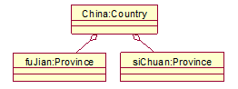
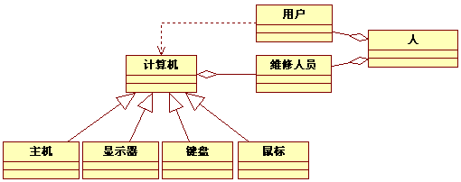

# 大题
## 重点
### 用例图之间的关系

用例图中的关系主要包括以下四种：

#### 1. 包含关系（Include）
- **定义**：一个用例包含另一个用例的功能，被包含的用例是主用例的必要组成部分
- **表示方法**：带箭头的虚线，箭头指向被包含用例，虚线标注 `<<include>>`
- **示例**："登录系统"用例包含"验证密码"用例

#### 2. 扩展关系（Extend）
- **定义**：一个用例扩展另一个用例的功能，扩展用例是主用例的可选部分，基于特定条件触发
- **表示方法**：带箭头的虚线，箭头指向主用例，虚线标注 `<<extend>>`
- **示例**："购物"用例可以扩展"使用优惠券"用例

#### 3. 泛化关系（Generalization）
- **定义**：一个用例是另一个用例的特殊化，子用例继承父用例的所有特性并可以添加自己的特性
- **表示方法**：带空心三角形的实线，三角形指向父用例
- **示例**："支付"用例是父用例，"支付宝支付"和"微信支付"是其子用例

#### 4. 关联关系（Association）
- **定义**：表示用例与参与者之间的交互关系
- **表示方法**：实线连接参与者和用例
- **示例**："用户"参与者与"浏览商品"用例之间的关系

### 类图之间的关系

类图中的关系主要包括以下六种：

#### 1. 关联关系（Association）
- **定义**：表示两个类之间存在某种静态联系，是最基本的关系类型
- **表示方法**：实线连接两个类
- **示例**："学生"类和"课程"类之间的选课关系

#### 2. 依赖关系（Dependency）
- **定义**：一个类的变化会影响另一个类，依赖是一种弱关联
- **表示方法**：带箭头的虚线，箭头指向被依赖的类
- **示例**："订单"类依赖"商品"类，因为订单需要引用商品信息

#### 3. 泛化关系（Generalization）
- **定义**：表示类之间的继承关系，子类继承父类的所有特性
- **表示方法**：带空心三角形的实线，三角形指向父类
- **示例**："动物"类是父类，"猫"和"狗"是其子类

#### 4. 实现关系（Realization）
- **定义**：表示类实现了接口的所有方法
- **表示方法**：带空心三角形的虚线，三角形指向接口
- **示例**："汽车"类实现了"交通工具"接口

#### 5. 聚合关系（Aggregation）
- **定义**：表示整体与部分的关系，部分可以独立于整体存在
- **表示方法**：带空心菱形的实线，菱形指向整体
- **示例**："学校"类包含"学生"类，学生可以独立于学校存在

#### 6. 组合关系（Composition）
- **定义**：表示整体与部分的关系，部分不能独立于整体存在
- **表示方法**：带实心菱形的实线，菱形指向整体
- **示例**："人"类包含"心脏"类，心脏不能独立于人存在

## 简答题
### UML之交互图中是谁在交互？为什么交互？如何交互？

1. 谁在交互？
- **对象**：交互的主体是类的实例
2. 为什么交互？
- **实现功能**：完成系统用例和业务逻辑
- **信息传递**：对象间需要数据交换
3. 如何交互？
- **消息传递**：通过同步、异步、返回消息
- **时间顺序**：按生命线从上到下排列

### 在下图1中最上面的对象的名称是什么？该图表示的意思是什么？请绘制出与其相应的类图。

最上面对象的名称和表示的是：

- **对象名**：China
- **表示**：表示福建，四川等省份聚合成中国

相应的类图

@startuml
' 定义Country类
class Country {
  // 可根据需求添加属性/方法，此处示例为空
}

' 定义Province类
class Province {
  // 可根据需求添加属性/方法，此处示例为空
}

' 表示聚合关系：1个Country包含多个Province
Country "1" o-- "*" Province : 包含（聚合）
@enduml

### 补充下图的系统核心类图
分析系统需求，确定核心类包括：用户、租户、房东、办公空间、预订记录、租赁合同、支付记录、评价等，绘制出的类图如图2所示，请将识别出的系统核心类填写到图中对应的（1）~（6）号所对应的位置（每个空格1分，共6分）：

(1) 用户
(2) 房东
(3) 租户
(4) 预订记录
(5) 评价
(6) 支付记录

（下方对应类图：包含标注(1)-(6)的矩形框，以及“办公空间”“租赁合同”等类，带“+1”“+n”的关联关系）

**解析**
- (1) 用户是父类，因为(2)和(3)继承自(1)
- (2) 房东，因为房东拥有办公空间
- (3) 租户，因为租户预订办公空间并发布评价
- (4) 预订记录，因为租户生成预订记录，预订记录关联到办公空间
- (5) 评价，因为租户发布评价
- (6) 支付记录，因为租赁合同关联到支付记录

## 改错题
### 用例图
#### 请分析以下用例图，请指出5处错误，并绘制正确的用例图

@startuml
left to right direction
actor "图书管理员" as Admin

(登录) as Login
(找回密码) as ResetPassword
(借书) as Borrow
(还书) as Return
(查找书籍) as SearchBook
(模糊查找) as FuzzySearch
(精确查找) as ExactSearch
(缴纳罚款) as PayFine

Admin -- Login
Login <.. ResetPassword : <<include>>
Admin -- Borrow
Admin -- Return 
Borrow ..> SearchBook : <<extend>>
SearchBook <|--FuzzySearch
SearchBook <|--ExactSearch
Return ..> SearchBook : <<extend>>
Return ..> PayFine: <<include>>
@enduml

1. 错误点：登录和找回密码的关系错误（原使用\<\<include>>，应使用\<\<extend>>）
- 原因：找回密码不是登录的必要步骤，而是可选功能

@startuml 修正：登录和找回密码关系错误
left to right direction
actor "图书管理员" as Admin

(登录) as Login
(找回密码) as ResetPassword

Admin -- Login
Login <.. ResetPassword : <<extend>>
@enduml

2. 错误点：借书和查找书籍的关系错误（原使用\<\<extend>>，应使用\<\<include>>）
- 原因：借书前必须先查找书籍，查找书籍是借书的必要步骤

@startuml 修正：借书和查找书籍关系错误
left to right direction
actor "图书管理员" as Admin

(借书) as Borrow
(查找书籍) as SearchBook

Admin -- Borrow
Borrow --> SearchBook : <<include>>
@enduml

3. 错误点：还书和查找书籍的关系错误（原使用\<\<extend>>，应使用\<\<include>>）
- 原因：还书前必须先查找书籍，查找书籍是还书的必要步骤

@startuml 修正：还书和查找书籍关系错误
left to right direction
actor "图书管理员" as Admin

(还书) as Return
(查找书籍) as SearchBook

Admin -- Return
Return --> SearchBook : <<include>>
@enduml

4. 错误点：还书和缴纳罚款的关系错误（原使用\<\<include>>，应使用\<\<extend>>）
- 原因：缴纳罚款不是还书的必要步骤，只有超期时才需要缴纳罚款

@startuml 修正：还书和缴纳罚款关系错误
left to right direction
actor "图书管理员" as Admin

(还书) as Return
(缴纳罚款) as PayFine

Admin -- Return
Return <.. PayFine : <<extend>>
@enduml

5. 错误点：参与者与“查找书籍”缺少直接关联
- 原因：查找书籍是图书管理员可以直接执行的用例

@startuml 修正：参与者与查找书籍关联错误
left to right direction
actor "图书管理员" as Admin

(查找书籍) as SearchBook

Admin -- SearchBook
@enduml

**完整正确的图书管理系统用例图**

@startuml 正确的图书管理系统用例图
left to right direction
actor "图书管理员" as Admin

(登录) as Login
(找回密码) as ResetPassword
(借书) as Borrow
(还书) as Return
(查找书籍) as SearchBook
(缴纳罚款) as PayFine
(模糊查找) as FuzzySearch
(精确查找) as ExactSearch

Admin -- Login
Login <.. ResetPassword : <<extend>>
Admin -- Borrow
Admin -- Return 
Admin -- SearchBook
Borrow --> SearchBook : <<include>>
Return --> SearchBook : <<include>>
Return <.. PayFine: <<extend>>
SearchBook <|--FuzzySearch
SearchBook <|--ExactSearch
@enduml

### 类图

#### 分析以下类图，指出5处错误，并绘制正确的类图

1. 错误点：企业与制衣厂之间错误使用了继承关系且方向错误
- 错误表现：原类图中企业通过继承箭头（空心三角）指向制衣厂，**实际表示企业是制衣厂的子类**，但这与业务逻辑不符
- 错误原因：继承关系表示"is-a"（是一个）关系，箭头应从子类指向父类；而制衣厂不是企业的一种，而是企业包含的一个组织，应使用表示"has-a"（有一个）关系的关联或聚合
- 正确设计：企业和制衣厂之间应使用聚合关系，企业作为整体，制衣厂作为其组成部分

@startuml 修正：企业与制衣厂继承关系错误
skinparam monochrome true
left to right direction

' ===== 类与接口 =====
class "企业" as Enterprise
class "制衣厂" as ClothingFactory

' ===== 正确关系 =====
Enterprise o-- ClothingFactory : 聚合
@enduml

2. 错误点：制衣厂与设计部之间错误使用了组合关系
- 错误表现：原类图中制衣厂通过实心菱形指向设计部，表示组合关系
- 错误原因：组合关系表示整体与部分的强依赖，部分（设计部）不能独立于整体（制衣厂）存在，但实际上设计部可以独立存在
- 正确设计：应使用表示松散依赖的聚合关系，空心菱形指向整体

@startuml 修正：制衣厂与设计部组合关系错误
skinparam monochrome true
left to right direction

' ===== 类与接口 =====
class "制衣厂" as ClothingFactory
class "设计部" as DesignDept

' ===== 正确关系 =====
ClothingFactory o-- DesignDept : 聚合
@enduml

3. 错误点：工人与生产部门的聚合关系方向错误
- 错误表现：原类图中工人通过空心菱形指向生产部门，表明工人拥有生产部门
- 错误原因：聚合关系中菱形应指向整体，实际是生产部门拥有工人，而不是工人拥有生产部门
- 正确设计：菱形应指向生产部门，表明生产部门是整体，工人是其组成部分

@startuml 修正：工人与生产部门聚合关系方向错误
skinparam monochrome true
left to right direction

' ===== 类与接口 =====
class "工人" as Worker
class "生产部门" as ProductionDept

' ===== 正确关系 =====
ProductionDept o-- Worker : 聚合
@enduml

4. 错误点：制衣厂与生产部门的组合关系方向错误
- 错误表现：原类图中组合关系的黑菱形放在了"生产部门"一侧，**实际表示生产部门拥有制衣厂**，但这与业务逻辑完全相反
- 错误原因：组合关系中，黑菱形必须放在"整体（拥有者）"一端；按照业务逻辑，应该是制衣厂拥有生产部门，而不是生产部门拥有制衣厂
- 正确设计：黑菱形应放在制衣厂一侧，表示制衣厂是整体，生产部门是其组成部分

@startuml 修正：制衣厂与生产部门组合关系方向错误
skinparam monochrome true
left to right direction

' ===== 类与接口 =====
class "制衣厂" as ClothingFactory
class "生产部门" as ProductionDept

' ===== 正确关系 =====
ClothingFactory *-- ProductionDept : 组合
@enduml

5. 错误点：制衣厂实现接口的箭头方向错误
- 错误表现：原类图中接口"生产校服"通过虚线空心三角指向制衣厂
- 错误原因：实现关系中，箭头应从类指向接口，表示类实现了接口
- 正确设计：应使用虚线空心三角，箭头从制衣厂指向接口"生产校服"

@startuml 修正：制衣厂实现接口画法错误
skinparam monochrome true
left to right direction

' ===== 类与接口 =====
interface "生产校服" as ProductionLine
class "制衣厂" as ClothingFactory

' ===== 正确关系 =====
ClothingFactory ..|> ProductionLine : 实现
@enduml

6. 错误点：生产部门与原材料之间错误使用了依赖关系
- 错误表现：原类图中生产部门通过虚线箭头指向原材料，表示依赖关系
- 错误原因：依赖关系表示"临时使用"，而原材料是生产部门长期使用的对象，应使用表示"长期关联"的关联关系
- 正确设计：应使用实线表示关联关系，表明生产部门与原材料之间存在长期的业务关系

@startuml 修正：生产部门与原材料依赖关系错误
skinparam monochrome true
left to right direction

' ===== 类与接口 =====
class "生产部门" as ProductionDept
class "原材料" as Material

' ===== 正确关系 =====
ProductionDept -- Material : 关联
@enduml

**正确的制衣厂类图**

@startuml
skinparam monochrome true
left to right direction

' ===== 类与接口 =====
interface "生产校服" as ProductionLine

class "企业" as Enterprise
class "制衣厂" as ClothingFactory
class "设计部" as DesignDept
class "生产部门" as ProductionDept
class "工人" as Worker
class "原材料" as Material

' ===== 正确关系 =====
Enterprise o-- ClothingFactory : 聚合
ClothingFactory o-- DesignDept : 聚合
ClothingFactory *-- ProductionDept : 组合
ProductionDept o-- Worker : 聚合
ProductionDept -- Material : 关联
ClothingFactory ..|> ProductionLine : 实现

@enduml

#### 找出并说明下面类图1中的错误。

## 设计题
### 某高校计划开发校园外卖订餐系统，支持学生下单、商家接单、配送员配送、管理员管理等功能。需求如下：
1. 管理员可以录入商家信息（商家名称、地址、营业时间、配送范围），审核商家提交的菜品信息（如价格、库存），导出订单统计表（如热门菜品、商家销售额）。
2. 商家可以提交菜品信息（需关联商家ID），查看订单列表（待接单/已接单/已完成），更新菜品库存。
3. 学生可以浏览菜品并下单（需选择配送地址、支付方式），查看订单状态（待接单/配送中/已完成），取消订单（仅限商家未接单时）。
4. 配送员可以查看待配送订单（需关联配送地址），更新订单状态为“已完成”。

采用面向对象方法开发系统：

**【问题1】识别参与者、用例及关系，建模用例图。（8分）**
**参与者识别**
1. 管理员
2. 商家
3. 学生
4. 配送员

**用例识别**
1. **管理员用例**：录入商家信息、审核菜品信息、导出订单统计表
2. **商家用例**：提交菜品信息、查看订单列表、更新菜品库存
3. **学生用例**：浏览菜品、下单、查看订单状态、取消订单
4. **配送员用例**：查看待配送订单、更新订单状态

**关系识别**
- **关联关系**：参与者与用例之间的交互
- **扩展关系**：取消订单是下单的扩展（仅在商家未接单时可触发）

**用例图**

@startuml 校园外卖订餐系统用例图
left to right direction

' 参与者
actor "管理员" as Admin
actor "商家" as Merchant
actor "学生" as Student
actor "配送员" as DeliveryMan

' 用例
usecase "录入商家信息" as AddMerchant
usecase "审核菜品信息" as AuditDish
usecase "导出订单统计表" as ExportOrder

usecase "提交菜品信息" as SubmitDish
usecase "查看订单列表" as ViewOrders
usecase "更新菜品库存" as UpdateStock

usecase "浏览菜品" as BrowseDishes
usecase "下单" as PlaceOrder
usecase "查看订单状态" as ViewOrderStatus
usecase "取消订单" as CancelOrder

usecase "查看待配送订单" as ViewDeliveryOrders
usecase "更新订单状态" as UpdateOrderStatus

' 关联关系
Admin -- AddMerchant
Admin -- AuditDish
Admin -- ExportOrder

Merchant -- SubmitDish
Merchant -- ViewOrders
Merchant -- UpdateStock

Student -- BrowseDishes
Student -- PlaceOrder
Student -- ViewOrderStatus
Student -- CancelOrder

DeliveryMan -- ViewDeliveryOrders
DeliveryMan -- UpdateOrderStatus

' 扩展关系（明确条件）
PlaceOrder <.. CancelOrder : <<extend>> （仅商家未接单时）

@enduml

**【问题2】识别类，分析关系，建模类图。（7分）**

**类识别**
1. **管理员**：管理员ID、用户名、密码
2. **商家**：商家ID、商家名称、地址、营业时间、配送范围
3. **菜品**：菜品ID、菜品名称、价格、库存、商家ID
4. **学生**：学生ID、姓名、手机号、配送地址
5. **订单**：订单ID、订单日期、订单状态、学生ID、配送地址、支付方式
6. **订单明细**：明细ID、订单ID、菜品ID、数量、单价
7. **配送员**：配送员ID、姓名、手机号

**关系识别**
- **关联关系**：商家与菜品（1对多）、学生与订单（1对多）、订单与配送员（1对多）、订单明细与菜品（1对1）
- **组合关系**：订单包含订单明细（订单明细依赖订单存在，订单删除则明细删除）

**类图**

@startuml 校园外卖订餐系统类图
left to right direction
skinparam classAttributeIconSize 0

' 类定义
class "管理员" as Admin {
    +adminID: int
    +username: String
    +password: String
}

class "商家" as Merchant {
    +merchantID: int
    +name: String
    +address: String
    +businessHours: String
    +deliveryRange: String
}

class "菜品" as Dish {
    +dishID: int
    +name: String
    +price: float
    +stock: int
}

class "学生" as Student {
    +studentID: int
    +name: String
    +phone: String
    +addresses: List<String>
}

class "订单" as Order {
    +orderID: int
    +orderDate: Date
    +status: String
    +deliveryAddress: String
    +paymentMethod: String
}

class "订单明细" as OrderDetail {
    +detailID: int
    +quantity: int
    +unitPrice: float
}

class "配送员" as DeliveryMan {
    +deliveryManID: int
    +name: String
    +phone: String
}

' 关系定义

' 订单与订单明细（组合）
Order "1" *-- "*" OrderDetail : 包含
OrderDetail "1" -- "1" Dish : 关联

' 学生与订单（1对多）
Student "1" -- "*" Order : 下单

' 商家与菜品（1对多）
Merchant "1" -- "*" Dish : 拥有

' 配送员与订单（1对多）
DeliveryMan "1" -- "*" Order : 配送

' 注释：管理员管理商家和审核订单功能属于系统功能，不是静态类关系
note top of Admin
  管理员可以录入商家信息、审核菜品信息、导出订单统计表
end note

@enduml

