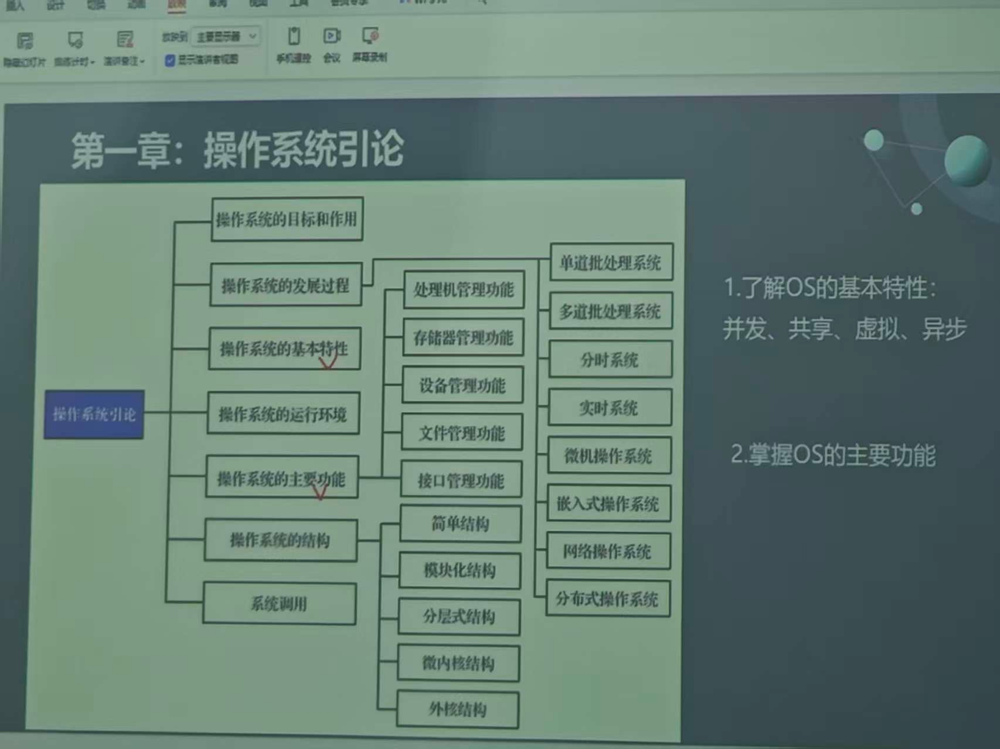
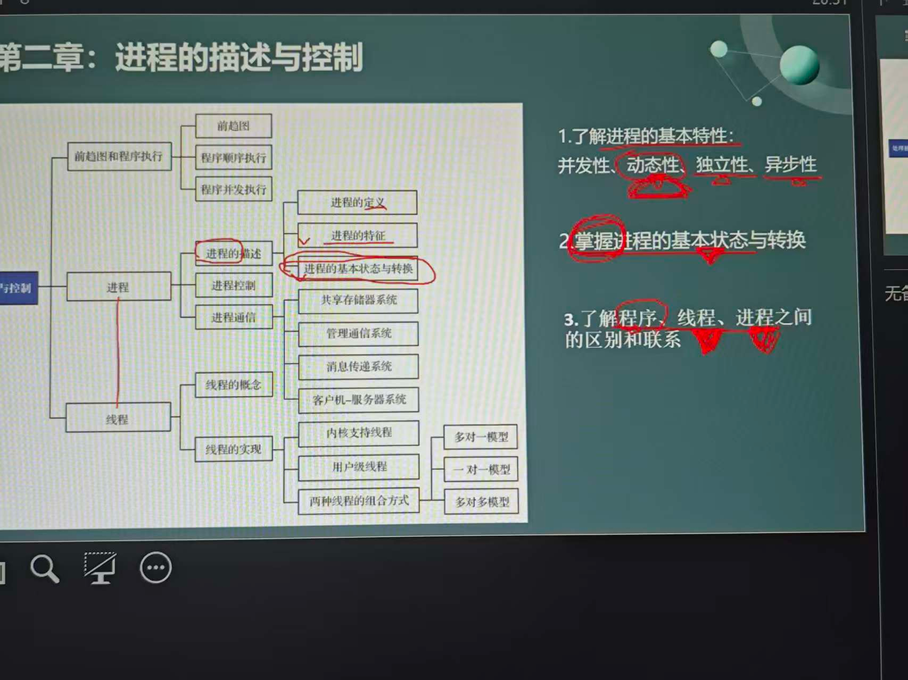
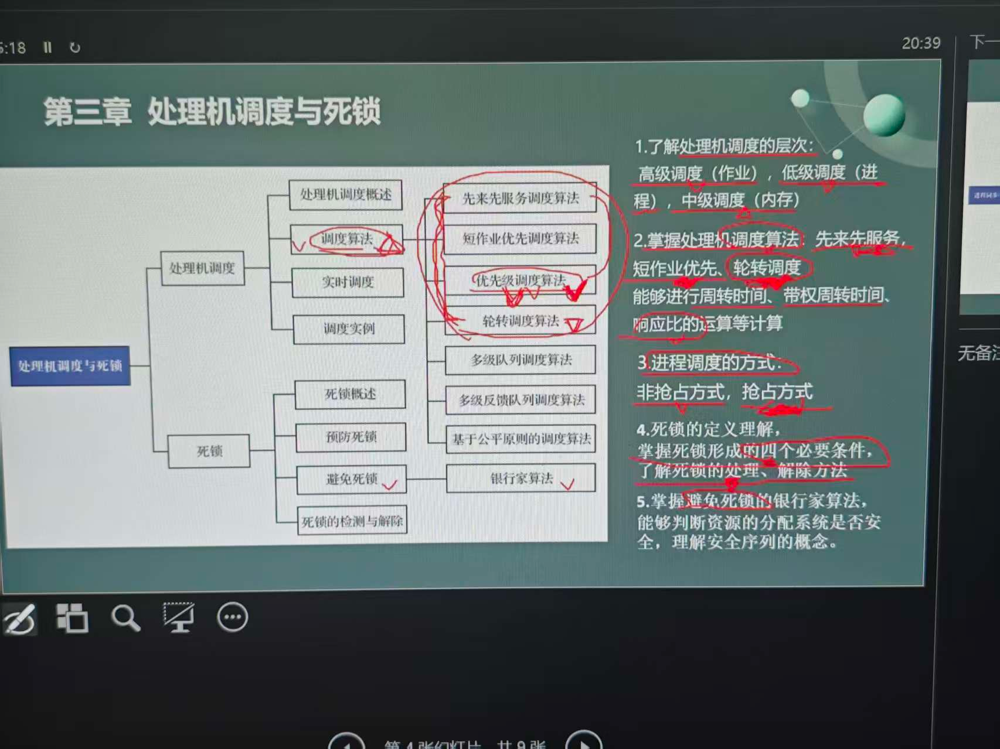
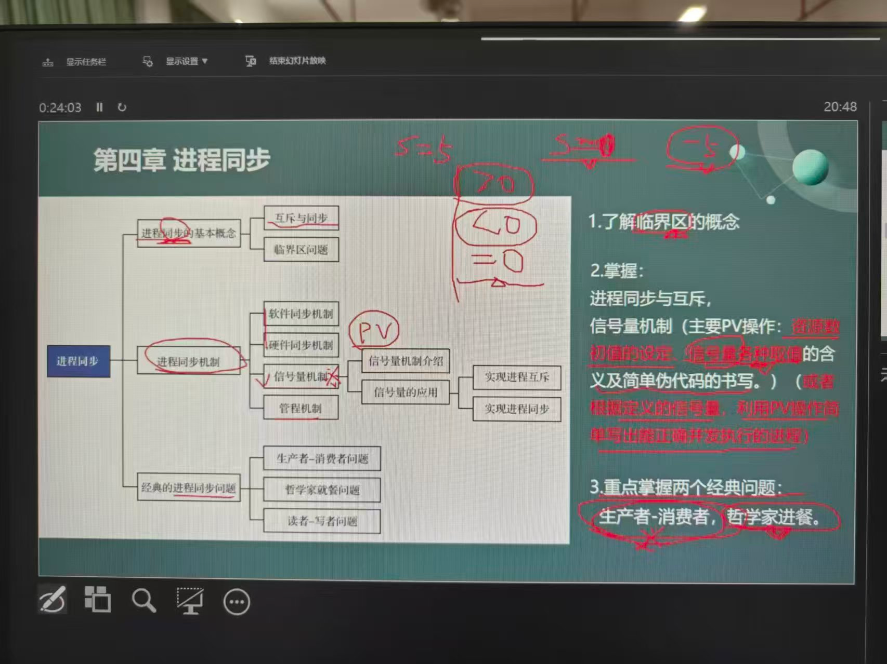

# 操作系统复习指南

## 第一章 操作系统引论


### 重点内容
- **操作系统的目标和作用**：
  - **目标**：方便性、有效性、可扩展性、开放性
  - **作用**：作为用户与计算机硬件之间的接口，作为计算机系统资源的管理者，作为扩展机或虚拟机
- **操作系统的发展过程**：
  - **无操作系统**：人工操作方式，CPU利用率低
  - **单道批处理系统**：引入脱机输入/输出技术，单道程序运行
  - **多道批处理系统**：多道程序并发运行，提高CPU利用率
  - **分时系统**：多个用户同时使用计算机，时间片轮转调度
  - **实时系统**：实时响应，可靠性高
  - **微机操作系统**：面向个人计算机
  - **网络操作系统**：支持网络通信和资源共享
  - **分布式操作系统**：分布式计算，透明性
- **操作系统的基本特性**：
  - **并发**：多个程序在一段时间内同时运行
  - **共享**：系统资源被多个并发程序共同使用
  - **虚拟**：将物理资源抽象为逻辑资源，扩大了编程空间
  - **异步**：进程以不可预知的速度向前推进
- **操作系统的运行环境**
- **操作系统的主要功能**：
  - **处理机管理功能**
  - **存储器管理功能**
  - **设备管理功能**
  - **文件管理功能**
  - **接口管理功能**
- **操作系统的结构**：
  - 简单结构
  - 模块化结构
  - 分层式结构
  - 微内核结构
  - 外核结构
- **系统调用**
- **操作系统的分类**：
  - 单道批处理系统
  - 多道批处理系统
  - 分时系统
  - 实时系统
  - 微机操作系统
  - 嵌入式操作系统
  - 网络操作系统
  - 分布式操作系统

## 第二章 进程的描述与控制



### 重点内容
- **进程的概念**：进程是程序的一次执行过程，是操作系统进行资源分配和调度的基本单位
- **进程的基本特征**：
  - **动态性**：进程是程序的执行过程，具有生命周期，从创建到消亡，进程在执行过程中状态会不断变化。程序是静态的指令集合，而进程是动态的活动过程。
  - **并发性**：多个进程可以同时存在于内存中，在一段时间内交替执行，宏观上表现为同时运行。这是现代操作系统提高资源利用率的重要手段。
  - **独立性**：每个进程都有独立的内存空间和资源，进程之间相互隔离。一个进程的崩溃不会影响其他进程的正常运行，保证了系统的稳定性。
  - **异步性**：进程的执行速度不可预测，受系统调度、资源竞争等因素影响。各进程按各自独立的、不可预知的速度向前推进，需要通过同步机制来协调进程间的执行顺序。
- **进程的三种基本状态与转换**：
  - **就绪态**：进程已获得除CPU外的所有必要资源，只要获得CPU即可立即执行。进程在就绪队列中等待CPU调度。
  - **运行态**：进程正在CPU上执行。在单处理机系统中，同一时刻只能有一个进程处于运行态。
  - **阻塞态**：进程因等待某个事件（如I/O操作完成、信号量等）而暂停执行，此时即使获得CPU也无法继续运行。
  - **状态转换关系**：
    - 就绪态 → 运行态：进程调度程序从就绪队列中选择一个进程，分配CPU给它
    - 运行态 → 就绪态：时间片用完（时间片轮转调度）或更高优先级进程抢占CPU
    - 运行态 → 阻塞态：进程请求I/O操作或等待某个事件发生
    - 阻塞态 → 就绪态：等待的事件已经完成，进程被唤醒，重新进入就绪队列
- **进程控制块(PCB)**：进程存在的唯一标志，包含进程标识符、进程状态、CPU现场信息、进程调度信息、资源清单等
- **进程控制原语**：创建、终止、阻塞、唤醒
- **线程的概念**：轻量级进程，同一进程内的线程共享进程资源
- **线程与进程的比较**：资源共享、调度开销、并发性等方面的差异
- **进程通信方式**：共享内存、消息传递、管道通信

- **程序、线程、进程之间的区别与联系**：
  - **程序**：静态的指令集合，存储在磁盘上，不占用系统资源，是被动实体
  - **进程**：程序的执行过程，动态的，是资源分配和调度的基本单位，拥有独立的内存空间和系统资源
  - **线程**：进程内的执行单元，是CPU调度的基本单位，同一进程内的线程共享进程资源
  - **进程与程序的区别**：
    - 程序是静态的，进程是动态的
    - 程序是永久的，进程是暂时的
    - 程序不占用资源，进程占用资源
    - 一个程序可以对应多个进程，一个进程可以包含多个程序
  - **线程与进程的区别**：
    - 资源共享：进程间相互独立，线程间共享进程资源
    - 调度开销：线程切换开销远小于进程切换
    - 通信方式：线程间通信更简单直接，进程间需要专门的IPC机制
    - 独立性：进程是独立运行的，线程依赖于进程存在
    - 健壮性：一个线程崩溃可能影响整个进程，进程间相互隔离

## 第三章 处理机调度与死锁



### 重点内容
- **处理机调度的层次**：
  - **高级调度(作业调度)**：从后备队列中选择作业，为其分配内存和资源，创建进程，将其放入就绪队列
  - **中级调度(内存调度)**：在内存和外存之间进行进程的换入换出，解决内存不足问题
  - **低级调度(进程调度)**：从就绪队列中选择进程，分配CPU给它，是最基本、最频繁的调度
- **调度算法的评价指标**：
  - **CPU利用率**：CPU忙碌时间占总时间的比例
  - **吞吐量**：单位时间内完成的作业数
  - **周转时间**：作业从提交到完成的时间间隔，计算公式：**T = 完成时间 - 提交时间**
  - **带权周转时间**：周转时间与作业实际运行时间的比值，计算公式：**W = T(周转时间) / 运行时间**
  - **等待时间**：作业在就绪队列中等待的时间
  - **响应时间**：用户提交请求到首次响应的时间
  - **响应比**：
  
  
  用于高响应比优先调度算法（HRRN）的优先级指标，计算公式：**响应比 = (等待时间 + 运行时间) / 运行时间 = 周转时间 / 运行时间**，值越大优先级越高（注意：虽然公式与带权周转时间相同，但用途不同，带权周转时间是评价指标越小越好，响应比是优先级指标越大越好）
- **经典调度算法**：
  - **先来先服务(FCFS)**：按照作业到达顺序调度，公平但对长作业有利，短作业等待时间长
  - **短作业优先(SJF)**：选择估计运行时间最短的作业，平均周转时间最短，但可能导致长作业饥饿
  - **最短剩余时间优先(SRTN)**：SJF的抢占式版本，当有更短作业到达时抢占CPU
  - **时间片轮转(RR)**：每个进程分配固定时间片，轮流执行，公平性好，但时间片大小影响系统性能
  - **优先级调度**：根据进程优先级调度，可分为静态优先级和动态优先级
  - **多级反馈队列调度**：结合了多种调度算法的优点，设置多个就绪队列，每个队列采用不同的调度策略
- **死锁的概念**：多个进程因竞争资源而造成的一种互相等待的僵局，若无外力作用，这些进程都将无法继续执行
- **死锁产生的必要条件**：
  - **互斥条件**：资源一次只能被一个进程使用
  - **请求和保持条件**：进程在请求新资源的同时保持已获得的资源
  - **不剥夺条件**：进程已获得的资源在未使用完之前不能被剥夺
  - **环路等待条件**：多个进程形成环路等待资源的关系
- **死锁的处理方法**：
  - **预防死锁**：破坏四个必要条件之一，如允许资源共享、一次性分配所有资源、允许剥夺资源、按序分配资源
  - **避免死锁**：银行家算法，通过安全性检查避免系统进入不安全状态
    - **算法步骤**：
      1. 当进程请求资源时，先检查请求是否超过最大需求
      2. 检查系统可用资源是否满足请求
      3. 假设分配资源，然后进行安全性检查
      4. 如果存在安全序列，则实际分配资源；否则推迟分配
    - **安全性检查**：寻找一个安全序列，使得每个进程都能依次获得所需资源并完成执行
    - **数据结构**：Available（可用资源向量）、Max（最大需求矩阵）、Allocation（已分配矩阵）、Need（需求矩阵）
  - **检测死锁**：资源分配图化简，定期检查系统是否处于死锁状态
    - **化简步骤**：
      1. 找到一个非阻塞进程节点（该进程的请求边都能满足）
      2. 移除该进程的所有边（请求边和分配边）
      3. 重复上述步骤，直到所有进程都被移除（无死锁）或无法继续化简（存在死锁）
    - **死锁判定**：如果最终无法完全化简，则剩余的进程处于死锁状态
  - **解除死锁**：资源剥夺法、进程撤销法、进程回退法

## 第四章 进程同步



### 重点内容
- **进程同步的概念**：并发进程在执行次序上的协调，以保证共享资源的正确使用
- **临界资源与临界区**：一次只允许一个进程访问的资源称为临界资源，访问临界资源的代码段称为临界区
- **同步机制的基本准则**：空闲让进、忙则等待、有限等待、让权等待
- **信号量机制**：
  - **整型信号量**：用于表示资源数量，仅能通过原子操作wait和signal操作
    ```python
    def wait(S):
        while S <= 0:
            pass
        S = S - 1
    
    def signal(S):
        S = S + 1
    ```
  - **记录型信号量**：包含资源数量和等待队列，解决了忙等问题
    ```python
    from threading import Condition

    class Semaphore:
        def __init__(self, value):
            self.value = value
            self.condition = Condition()
        
        def wait(self):
            with self.condition:
                self.value -= 1
                if self.value < 0:
                    self.condition.wait()
        
        def signal(self):
            with self.condition:
                self.value += 1
                if self.value <= 0:
                    self.condition.notify()
    ```
  - **信号量的应用**：
    - **实现进程互斥**：设置初值为1的互斥信号量mutex
      ```python
      from threading import Semaphore

      mutex = Semaphore(1)
      mutex.acquire()
      临界区
      mutex.release()
      ```
    - **实现进程同步**：设置初值为0的同步信号量
      ```python
      from threading import Semaphore, Thread
      import time

      S = Semaphore(0)
      
      # 场景：P1生产数据，P2消费数据，P2必须等P1生产完才能消费
      
      def P1():
          print("P1: 开始生产数据...")
          time.sleep(1)
          print("P1: 数据生产完成")
          S.release()  # 通知P2可以开始消费了
      
      def P2():
          print("P2: 等待数据...")
          S.acquire()  # 等待P1的通知
          print("P2: 开始消费数据...")
          print("P2: 数据消费完成")
      
      # 执行顺序：P1生产 -> S.release() -> P2等待结束 -> P2消费
      # P2会在S.acquire()处阻塞，直到P1执行S.release()
      ```
    - **实现前驱关系**：设置多个同步信号量
      ```python
      from threading import Semaphore, Thread
      import time

      # 场景：P1完成后，P2和P3才能开始；P2和P3都完成后，P4才能开始
      # 前驱关系：P1 -> P2, P3 -> P4
      
      S1 = Semaphore(0)  # 控制P1 -> P2
      S2 = Semaphore(0)  # 控制P1 -> P3
      S3 = Semaphore(0)  # 控制P2, P3 -> P4
      
      def P1():
          print("P1: 执行任务1...")
          time.sleep(1)
          print("P1: 任务1完成")
          S1.release()  # 通知P2可以开始
          S2.release()  # 通知P3可以开始
      
      def P2():
          S1.acquire()  # 等待P1完成
          print("P2: 执行任务2...")
          time.sleep(1)
          print("P2: 任务2完成")
          S3.release()  # 通知P4，P2已完成
      
      def P3():
          S2.acquire()  # 等待P1完成
          print("P3: 执行任务3...")
          time.sleep(1)
          print("P3: 任务3完成")
          S3.release()  # 通知P4，P3已完成
      
      def P4():
          S3.acquire()  # 等待P2完成
          S3.acquire()  # 等待P3完成
          print("P4: 执行任务4...")
          time.sleep(1)
          print("P4: 任务4完成")
      
      # 执行顺序：P1 -> P2,P3(并行) -> P4
      # P4需要等待两次S3，因为P2和P3都会release一次
      ```
  - **经典同步问题**：
    - **生产者-消费者问题**：一组生产者进程和一组消费者进程共享一个固定大小的缓冲区
      ```python
      from threading import Semaphore, Thread
      import time
      import random

      mutex = Semaphore(1)      # 互斥信号量，保护缓冲区
      empty = Semaphore(n)      # 计数信号量，表示空缓冲区数量
      full = Semaphore(0)       # 计数信号量，表示满缓冲区数量
      buffer = []

      def producer():
          while True:
              item = produce_item()
              empty.acquire()   # 申请空缓冲区
              mutex.acquire()   # 进入临界区
              buffer.append(item)
              mutex.release()   # 离开临界区
              full.release()    # 增加满缓冲区数量

      def consumer():
          while True:
              full.acquire()    # 申请满缓冲区
              mutex.acquire()   # 进入临界区
              item = buffer.pop(0)
              mutex.release()   # 离开临界区
              empty.release()   # 增加空缓冲区数量
              consume_item(item)
      ```
    - **读者-写者问题**：允许多个读者同时读，但写者必须互斥访问
      ```python
      from threading import Semaphore, Thread, Lock

      mutex = Lock()           # 保护readcount
      rw = Semaphore(1)        # 读写互斥
      readcount = 0            # 读者数量

      def reader():
          global readcount
          while True:
              mutex.acquire()
              readcount += 1
              if readcount == 1:
                  rw.acquire()  # 第一个读者加锁
              mutex.release()

              read_file()

              mutex.acquire()
              readcount -= 1
              if readcount == 0:
                  rw.release()  # 最后一个读者解锁
              mutex.release()

      def writer():
          while True:
              rw.acquire()      # 写者互斥
              write_file()
              rw.release()
      ```
    - **哲学家就餐问题**：5个哲学家围坐在圆桌旁，每人左右各有一根筷子，必须同时获得两根筷子才能进餐
      ```python
      from threading import Semaphore, Thread
      import time

      chopstick = [Semaphore(1) for _ in range(5)]  # 5根筷子

      def philosopher(i):
          while True:
              think()
              chopstick[i].acquire()              # 拿左边筷子
              chopstick[(i + 1) % 5].acquire()    # 拿右边筷子
              eat()
              chopstick[(i + 1) % 5].release()    # 放右边筷子
              chopstick[i].release()              # 放左边筷子

      # 避免死锁的解法：
      # 1. 奇数哲学家先拿左边，偶数哲学家先拿右边
      def philosopher_safe(i):
          while True:
              think()
              if i % 2 == 1:  # 奇数哲学家
                  chopstick[i].acquire()
                  chopstick[(i + 1) % 5].acquire()
              else:  # 偶数哲学家
                  chopstick[(i + 1) % 5].acquire()
                  chopstick[i].acquire()
              eat()
              chopstick[(i + 1) % 5].release()
              chopstick[i].release()

      # 2. 最多允许4个哲学家同时进餐
      dining = Semaphore(4)
      def philosopher_limit(i):
          while True:
              think()
              dining.acquire()
              chopstick[i].acquire()
              chopstick[(i + 1) % 5].acquire()
              eat()
              chopstick[(i + 1) % 5].release()
              chopstick[i].release()
              dining.release()
      ```
- **管程机制**：封装了同步变量和操作的抽象数据类型

## 第五章 存储器管理


### 重点内容
- **存储器的层次结构**：由上到下依次为寄存器、高速缓存、主存、外存，速度递减，容量递增，成本递减
- **程序的装入与链接**：
  - **程序的装入**：
    - **绝对装入**：直接将程序装入到指定的物理地址
    - **可重定位装入**：将程序装入到任意物理地址，需要重定位
    - **动态运行时装入**：在程序执行时才进行地址转换
  - **程序的链接**：
    - **静态链接**：在程序执行前将所有目标模块链接成一个完整的可执行文件
    - **动态链接**：在程序执行时才进行链接
    - **运行时动态链接**：在程序运行时需要用到某模块时才进行链接
- **地址绑定和内存保护**：
  - **逻辑地址**：程序编译后生成的地址，也称为虚地址或相对地址
  - **物理地址**：内存中实际的地址，也称为实地址
  - **内存保护**：防止程序越界访问内存
- **对换与覆盖**：
  - **对换**：将内存中的进程暂时换出到外存，将外存中的进程换入到内存
  - **覆盖**：将内存中暂时不用的程序段或数据段覆盖掉，以提高内存利用率
- **连续分配存储管理方式**：
  - **单一连续分配**：将内存分为系统区和用户区，用户区只分配给一个进程
  - **固定分区分配**：将内存分为若干固定大小的分区，每个分区只能分配给一个进程，分区大小可同可不同
  - **可变分区分配**：
    - **动态分区分配**：根据进程的实际需要动态分配内存
    - **动态重定位分区分配**：解决外部碎片问题，通过移动进程来合并空闲区
- **动态分区分配算法**：
  - **首次适应算法**：从内存低地址开始查找，找到第一个足够大的空闲区
  - **循环首次适应算法**：从上次查找结束的位置开始查找，找到第一个足够大的空闲区
  - **最佳适应算法**：找到最小的足够大的空闲区
  - **最坏适应算法**：找到最大的空闲区
- **分区的分配与回收**：分配时找到合适的空闲区，回收时合并相邻的空闲区
- **离散分配存储管理方式**：
  - **分页存储管理方式**：
    - **分页地址中的地址结构**：由页号和页内位移量组成
    - **页表**：将页号映射到物理块号，实现逻辑地址到物理地址的转换
    - **快表**：缓存最近访问的页表项，提高地址转换速度
    - **分页计算**：页号 = 逻辑地址 / 页面大小，页内地址 = 逻辑地址 % 页面大小
  - **分段存储管理方式**：将程序分为若干逻辑段，每个段有独立的段号和段长
  - **段页式存储管理方式**：先分段，再分页，结合了分页和分段的优点
- **分段和分页的区别**：
  - 分页是物理单位，分段是逻辑单位
  - 页的大小固定，段的大小不固定
  - 分页是为了提高内存利用率，分段是为了满足用户需求
  - 分页的地址是一维的，分段的地址是二维的

## 第六章 虚拟存储器


### 重点内容
- **局部性原理**：程序执行时具有局部性特征，包括时间局部性和空间局部性。时间局部性指最近访问的内存地址会再次被访问；空间局部性指程序访问的内存地址通常是连续的或相邻的，基于此原理可实现虚拟内存
- **虚拟内存的概念**：基于局部性原理，将内存和外存结合起来使用，为用户提供一个比实际内存大得多的虚拟地址空间
- **虚拟内存的实现原理**：利用局部性原理，只将当前需要的页面调入内存，其余页面放在外存，需要时再调入
- **请求分页存储管理**：
  - **页表机制的扩充**：在页表中增加状态位、访问字段、修改位、外存地址等字段
  - **缺页中断处理**：当访问的页面不在内存时，产生缺页中断，将页面从外存调入内存
  - **页面置换算法**（比较和计算）：
    - **最佳置换算法(OPT)**：选择永不使用或最长时间内不使用的页面置换，理论最优但无法实现
    - **先进先出置换算法(FIFO)**：选择最先进入内存的页面置换，简单但可能产生Belady异常。
      - **Belady异常**：当分配给进程的物理块数增加时，缺页率反而上升的现象，这是FIFO算法的一个特殊性质，其他大多数置换算法不会出现
      - **产生原因**：FIFO算法仅基于页面进入内存的顺序进行置换，不考虑页面的访问频率和时间局部性。当增加物理块数时，可能导致某些情况下，之前被置换出去的页面在新的分配策略下需要被频繁调入调出。例如，当程序访问序列具有循环性，增加物理块数可能会改变页面替换的顺序，使得某些页面被过早置换，从而导致更多的缺页中断
    - **最近最久未使用置换算法(LRU)**：选择最近最久未使用的页面置换，性能较好但实现复杂
    - **时钟置换算法(CLOCK)**：
      - 所有页面按环形排列，有一个指针指向当前位置
      - **置换时机**：当需要置换页面时，从当前指针位置开始扫描
        - 遇到访问位为0的页面，立即置换
        - 遇到访问位为1的页面，将访问位置为0，指针继续移动
        - 循环扫描直到找到一个访问位为0的页面进行置换
      - 特点：简单高效，避免了LRU算法的复杂实现
    - **改进型时钟置换算法**：同时考虑访问位(R)和修改位(M)，按优先级(R=0,M=0) > (R=0,M=1) > (R=1,M=0) > (R=1,M=1)置换
      - 扫描时遇到R=1的页面，将R置0后继续扫描
      - 优先置换未修改页面，减少磁盘I/O
  - **页面分配策略**：固定分配局部置换、可变分配全局置换、可变分配局部置换
  - **抖动和工作集**：
    - **抖动**：频繁的页面置换导致系统性能下降
    - **工作集**：某段时间内进程实际访问的页面集合
    - **解决方法**：采用工作集模型，调整驻留集大小，避免抖动
  - **请求分段存储管理**：基于分段的虚拟内存管理
  - **请求段页式存储管理**：基于段页式的虚拟内存管理

## 第七章 输入输出系统


### 重点内容
- **I/O系统的功能、模型与接口**：
  - **I/O系统的基本功能**：设备管理、设备分配、缓冲区管理、中断处理、设备驱动
  - **I/O系统的层次结构与模型**：从高到低依次为用户层I/O软件、与设备无关的I/O软件、设备驱动程序、中断处理程序、硬件
    - **用户层I/O软件**：为用户提供I/O接口（系统调用、库函数）
    - **与设备无关的I/O软件**：提供统一接口、设备分配、缓冲管理
    - **设备驱动程序**：与具体设备通信，控制设备操作
    - **中断处理程序**：处理设备完成中断，唤醒等待进程
    - **硬件**：执行实际的I/O操作
  - **I/O系统的接口**：命令接口、程序接口、图形接口
- **I/O设备和设备控制器**：
  - **I/O设备**：输入设备、输出设备、存储设备
  - **设备控制器**：连接CPU和I/O设备的中间部件，负责接收和执行CPU的命令
- **I/O设备的几种控制方式**：
  - **程序直接控制方式**：CPU不断查询设备状态，效率低
  - **中断驱动方式**：设备完成后产生中断，CPU响应中断，效率较高
  - **DMA方式**：直接内存访问，设备和内存直接传输数据，CPU只需要初始化和结束处理
  - **通道控制方式**：通过通道控制设备，CPU只需发出命令，通道负责具体的I/O操作
- **中断的概念及意义**：
  - **概念**：计算机在执行程序过程中，遇到需要处理的事件时，暂停当前程序的执行，转去执行相应的处理程序，处理完毕后返回原程序继续执行
  - **意义**：提高CPU利用率，实现实时处理，支持多道程序并发执行
- **设备的无关性（独立性）**：
  - **概念**：应用程序与具体的物理设备无关，只使用逻辑设备名
  - **实现**：通过逻辑设备名到物理设备名的映射，设备驱动程序的统一接口
- **I/O软件**：
  - **中断处理程序**：处理设备产生的中断
  - **设备驱动程序**：负责与具体设备通信，执行具体的I/O操作
  - **与设备无关的I/O软件**：提供统一的设备接口，处理设备的分配和回收
  - **用户层的I/O软件**：提供用户使用设备的接口，如系统调用、库函数
- **缓冲区管理**：
  - **缓冲区的引入**：解决CPU和I/O设备速度不匹配的问题，提高CPU和I/O设备的利用率
  - **缓冲区的类型**：单缓冲区、双缓冲区、循环缓冲区、缓冲池
- **磁盘性能概述和磁盘调度**：
  - **磁盘性能概述**：磁盘是计算机系统中最重要的外存设备
  - **磁盘的结构**：由盘片、磁头、磁道、扇区组成
  - **磁盘数据的访问时间**：寻道时间、旋转延迟时间、传输时间
  - **磁盘调度算法**（计算寻道长度和时间）：
    - **先来先服务调度算法(FCFS)**：按请求的先后顺序处理，公平但效率低
    - **最短寻道时间优先调度算法(SSTF)**：选择离当前磁头最近的请求处理，效率较高但可能导致饥饿
    - **扫描调度算法(SCAN)**：磁头从磁盘的一端向另一端移动，处理经过的请求，到达另一端后反向移动，也称为电梯调度
    - **循环扫描调度算法(C-SCAN)**：磁头从磁盘的一端向另一端移动，处理经过的请求，到达另一端后直接返回起点，不处理返回途中的请求
    - **NStepSCAN和FSCAN**：将请求分成多个队列，逐个处理队列，避免饥饿
- **设备分配**：
  - **逻辑设备名映射到物理设备名**：实现设备的无关性
  - **I/O调度**：选择合适的I/O请求顺序，提高系统性能
  - **系统调用**：用户程序通过系统调用请求I/O服务
  - **库函数**：封装系统调用，提供更方便的接口
  - **假脱机系统(SPOOLing)**：将独占设备改造为共享设备，提高设备利用率

## 第八章 文件管理


### 重点内容
- **文件和文件系统**：
  - **文件**：具有文件名的一组相关数据的集合
  - **文件系统**：负责管理和存储文件信息的软件集合
  - **文件操作**：创建、打开、关闭、读取、写入、删除、重命名等
- **文件的逻辑结构**：
  - **无结构文件**：没有固定结构，由字节流组成，如文本文件
  - **有结构文件**：
    - **顺序文件**：记录按顺序排列，可分为串结构和顺序结构
    - **索引文件**：为文件创建索引表，记录关键字和物理地址的对应关系
    - **索引顺序文件**：结合顺序文件和索引文件的优点，先按顺序分成组，每组建立索引
    - **直接文件**：直接根据关键字访问文件记录
    - **哈希文件**：利用哈希函数将关键字映射到物理地址，实现直接访问
- **文件目录**：
  - **文件控制块(FCB)**：记录文件的属性和位置信息，是文件存在的唯一标志
  - **索引节点(inode)**：将文件控制块中的文件名和其他信息分开，提高目录检索效率
  - **单级文件目录**：所有文件都在同一个目录中，简单但容易重名
  - **两级文件目录**：分为主目录和用户目录，解决重名问题
  - **树形结构目录**：目录按树形结构组织，支持多级目录，便于文件管理
  - **无环图目录**：允许目录之间共享文件，形成有向无环图
- **文件的共享与保护**：
  - **文件共享**：
    - **利用有向无环图**：通过硬链接实现文件共享，多个目录项指向同一个索引节点
    - **利用符号链接**：通过软链接实现文件共享，目录项指向目标文件的路径
  - **文件保护**：
    - **保护域**：定义进程对资源的访问权限
    - **访问矩阵**：描述进程对文件的访问权限，行表示进程，列表示文件，元素表示访问权限
    - **访问控制表**：为每个文件设置一个访问控制表，记录哪些进程可以访问该文件以及访问权限
    - **访问权限表**：为每个进程设置一个访问权限表，记录该进程可以访问哪些文件以及访问权限
    - **用户分类**：分为所有者、同组用户、其他用户，分别设置不同的访问权限（读、写、执行）
