# 计算题
## 第一章 操作系统引论

### 25题

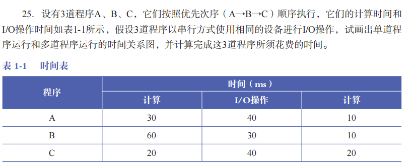

**解析：**
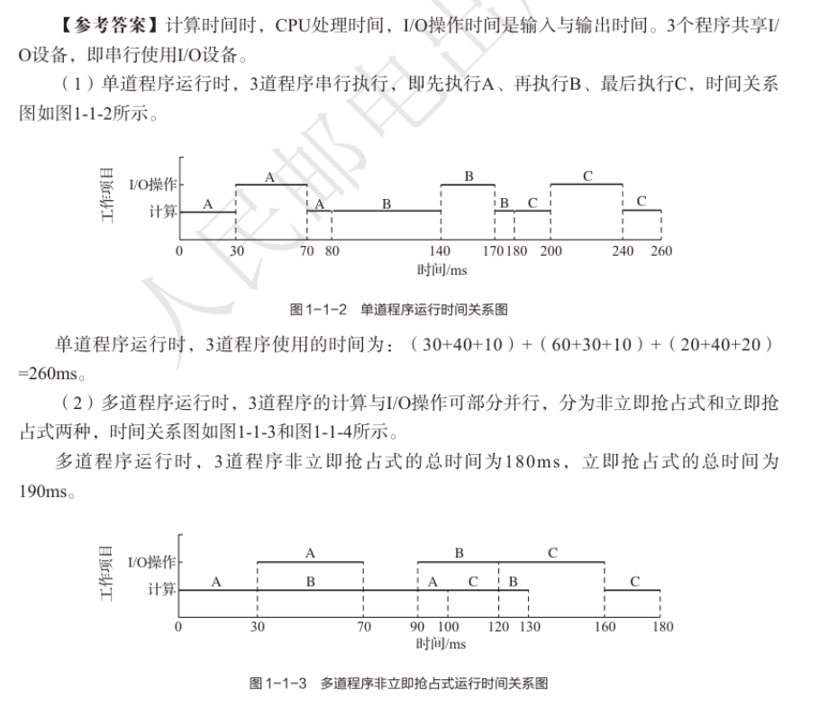
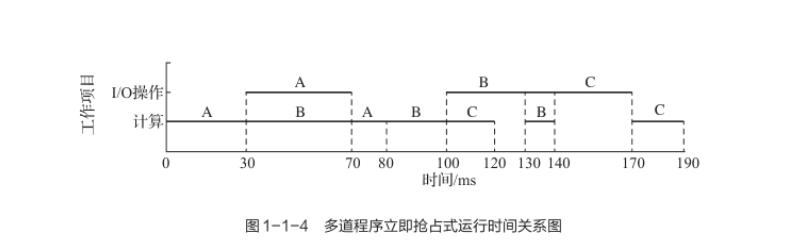

### 26题

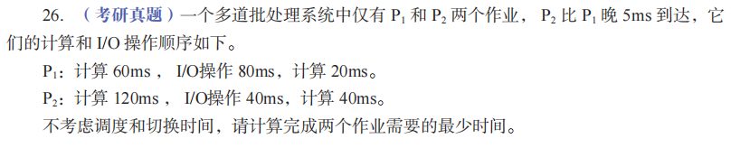

**解析：**
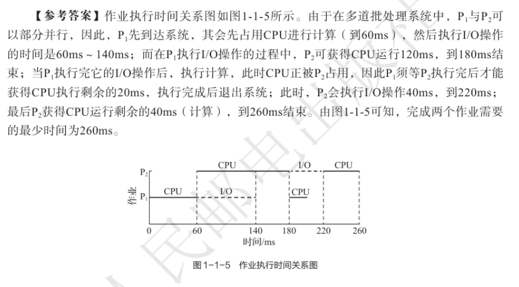

### 28题

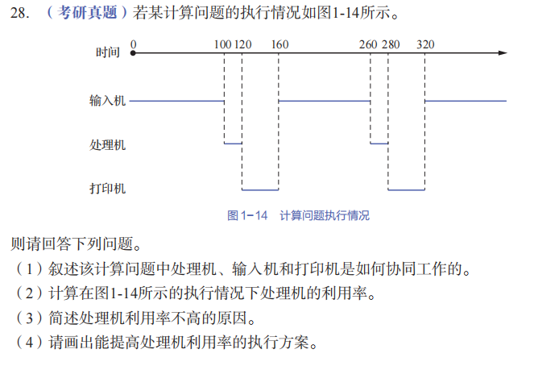

**解析：**
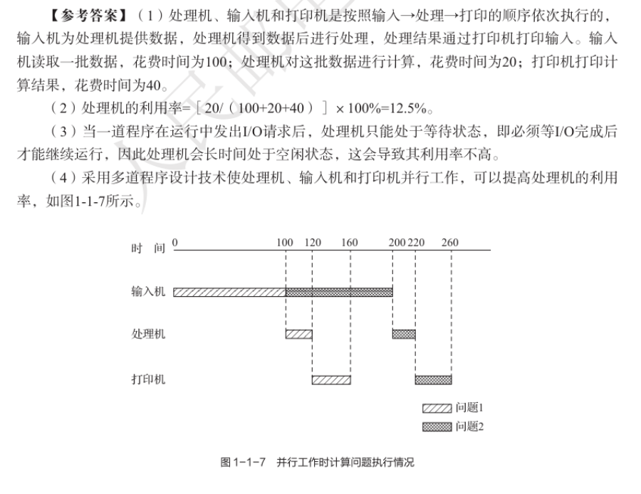

## 第二章 进程的描述与控制
### 21题
试从调度、并发、拥有资源和系统开销这4个方面对传统进程和线程进行比较。
**解析：**
**简洁对比（考试版）：**

| 比较方面     | 进程              | 线程              |
| -------- | --------------- | --------------- |
| **调度**   | 进程是资源分配和调度的基本单位 | 线程是调度的基本单位      |
| **并发**   | 进程之间并发，开销大      | 同一进程内线程并发，效率高   |
| **拥有资源** | 独立拥有地址空间和系统资源   | 共享进程资源，仅有少量私有资源 |
| **系统开销** | 创建、撤销、切换开销大     | 创建、撤销、切换开销小     |

### 22题
（考研真题）现代OS一般都提供多进程（或称多任务）运行环境，回答以下问题。
（1）为支持多进程的并发执行，系统必须建立哪些关于进程的数据结构？
（2）为支持进程状态的变迁，系统至少应提供哪些进程控制原语？
（3）在执行每一个进程控制原语时，进程状态会发生什么变化？相应的数据结构会发生什么变化？

**解析：**
（1）**支持多进程并发执行的核心数据结构**：
- **进程控制块（PCB）**：存储进程的基本信息（标识符、状态、优先级等），是进程存在的唯一标志。
- **进程队列**：
  - 就绪队列：存储所有就绪状态的进程PCB
  - 阻塞/等待队列：存储所有阻塞/等待状态的进程PCB
- **运行指针**：指向当前正在执行的进程PCB
- **进程表格**：记录系统中所有进程的PCB指针，方便快速查找进程信息

（2）**进程控制原语**：
- 创建原语
- 撤销原语
- 阻塞原语
- 唤醒原语

（3）**状态变化与数据结构变化**：
| 原语 | 进程状态变化 | 数据结构变化 |
|------|--------------|--------------|
| 创建原语 | 无→就绪 | 新建PCB，初始化进程信息，将PCB加入就绪队列 |
| 撤销原语 | 执行/就绪/阻塞→无 | 从相应队列中移除PCB，释放进程资源，销毁PCB |
| 阻塞原语 | 执行→阻塞 | 将进程状态改为阻塞，从执行队列移除，加入阻塞队列 |
| 唤醒原语 | 阻塞→就绪 | 将进程状态改为就绪，从阻塞队列移除，加入就绪队列 |

## 第三章 处理机调度与死锁

### 19题 
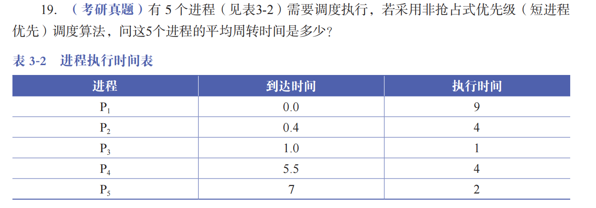
**解析：**
**执行顺序**：P₁ → P₃ → P₅ → P₂ → P₄

**计算过程**：
| 进程 | 到达时间 | 执行时间 | 开始时间 | 完成时间 | 周转时间（完成-到达） |
|------|----------|----------|----------|----------|------------------------|
| P₁   | 0.0      | 9        | 0.0      | 9.0      | 9.0                    |
| P₃   | 1.0      | 1        | 9.0      | 10.0     | 9.0                    |
| P₅   | 7.0      | 2        | 10.0     | 12.0     | 5.0                    |
| P₂   | 0.4      | 4        | 12.0     | 16.0     | 15.6                   |
| P₄   | 5.5      | 4        | 16.0     | 20.0     | 14.5                   |

**平均周转时间**：(9.0 + 9.0 + 5.0 + 15.6 + 14.5) / 5 = 53.1 / 5 = **10.62**

### 20题 
（考研真题）假定要在一台处理机上执行表3-3所示的作业，且假定这些作业在时刻0以1,2,3,4,5的顺序到达。请说明分别采用FCFS、RR（时间片为1）、SJF及非抢占式优先级调度算法时，这些作业的执行情况（优先级的高低顺序依次为1到5）。针对上述每种调度算法，给出平均周转时间和平均带权周转时间。

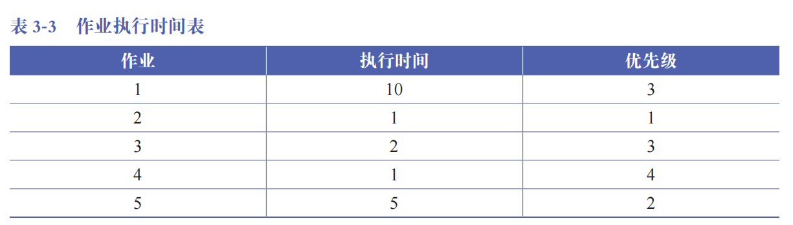

**解析：**
**作业到达顺序**：1,2,3,4,5（均在时刻0到达）

1. 先来先服务（FCFS）调度
**执行顺序**：1 → 2 → 3 → 4 → 5

**计算**：
| 作业 | 执行时间 | 开始时间 | 完成时间 | 周转时间 | 带权周转时间（周转/执行） |
|------|----------|----------|----------|----------|----------------------------|
| 1    | 10       | 0        | 10       | 10       | 1.0                        |
| 2    | 1        | 10       | 11       | 11       | 11.0                       |
| 3    | 2        | 11       | 13       | 13       | 6.5                        |
| 4    | 1        | 13       | 14       | 14       | 14.0                       |
| 5    | 5        | 14       | 19       | 19       | 3.8                        |

**平均周转时间**：(10+11+13+14+19)/5 = 67/5 = **13.4**
**平均带权周转时间**：(1.0+11.0+6.5+14.0+3.8)/5 = 36.3/5 = **7.26**

2. 时间片轮转（RR，时间片=1）调度
**执行顺序**：1→2→3→4→5→1→3→5→1→5→1→5→1→5→1→1→1→1→1→1

**计算**：
| 作业 | 执行时间 | 完成时间 | 周转时间 | 带权周转时间 |
|------|----------|----------|----------|--------------|
| 1    | 10       | 19       | 19       | 1.9          |
| 2    | 1        | 2        | 2        | 2.0          |
| 3    | 2        | 7        | 7        | 3.5          |
| 4    | 1        | 4        | 4        | 4.0          |
| 5    | 5        | 14       | 14       | 2.8          |

**平均周转时间**：(19+2+7+4+14)/5 = 46/5 = **9.2**
**平均带权周转时间**：(1.9+2.0+3.5+4.0+2.8)/5 = 14.2/5 = **2.84**

3. 短作业优先（SJF）调度
**执行顺序**：2→4→3→5→1（按执行时间从小到大：1→1→2→5→10）

**计算**：
| 作业 | 执行时间 | 开始时间 | 完成时间 | 周转时间 | 带权周转时间 |
|------|----------|----------|----------|----------|--------------|
| 1    | 10       | 9        | 19       | 19       | 1.9          |
| 2    | 1        | 0        | 1        | 1        | 1.0          |
| 3    | 2        | 2        | 4        | 4        | 2.0          |
| 4    | 1        | 1        | 2        | 2        | 2.0          |
| 5    | 5        | 4        | 9        | 9        | 1.8          |

**平均周转时间**：(19+1+4+2+9)/5 = 35/5 = **7.0**
**平均带权周转时间**：(1.9+1.0+2.0+2.0+1.8)/5 = 8.7/5 = **1.74**

4. 非抢占式优先级调度（优先级1最高，5最低）
**优先级顺序**：作业2（1）→作业5（2）→作业1（3）→作业3（3）→作业4（4）

**执行顺序**：2→5→1→3→4

**计算**：
| 作业 | 执行时间 | 优先级 | 开始时间 | 完成时间 | 周转时间 | 带权周转时间 |
|------|----------|--------|----------|----------|----------|--------------|
| 1    | 10       | 3      | 6        | 16       | 16       | 1.6          |
| 2    | 1        | 1      | 0        | 1        | 1        | 1.0          |
| 3    | 2        | 3      | 16       | 18       | 18       | 9.0          |
| 4    | 1        | 4      | 18       | 19       | 19       | 19.0         |
| 5    | 5        | 2      | 1        | 6        | 6        | 1.2          |

**平均周转时间**：(16+1+18+19+6)/5 = 60/5 = **12.0**
**平均带权周转时间**：(1.6+1.0+9.0+19.0+1.2)/5 = 31.8/5 = **6.36**

### 22题
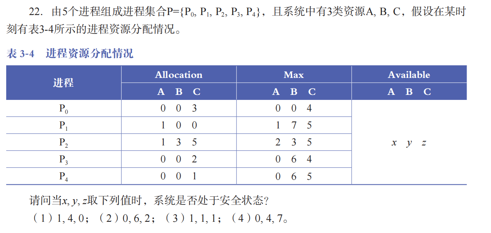
**解析：**
要判断系统是否安全，需通过银行家算法：先计算各进程的需求矩阵（Need = Max - Allocation），再检查是否存在一个安全序列（进程能依次完成，释放资源后满足后续进程需求）

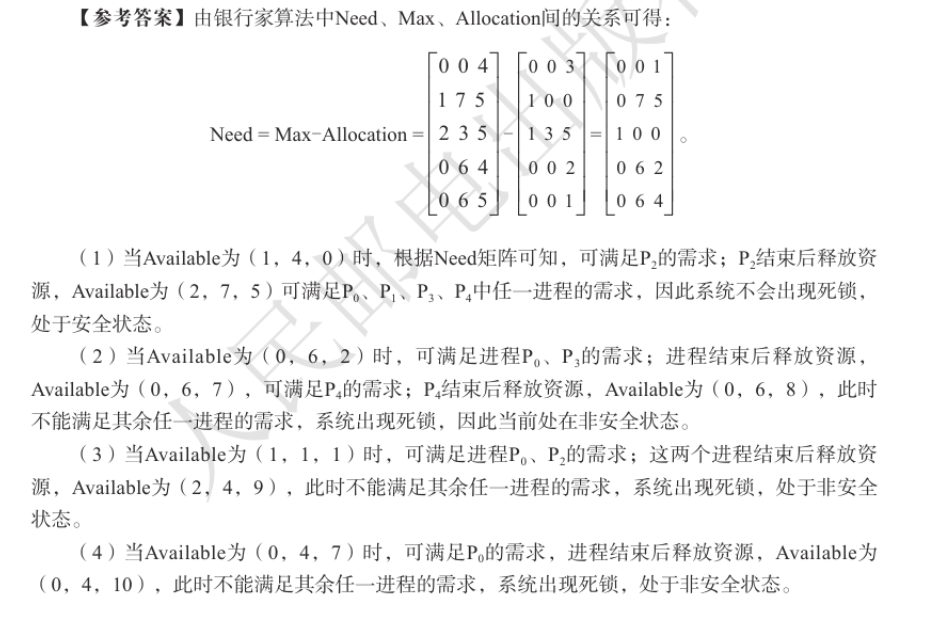

### 23题
（考研真题）假设系统中有下述３种解决死锁的方法：
（1）银行家算法；
（2）检测死锁，终止处于死锁状态的进程，释放该进程所占有的资源；
（3）资源预分配。
简述上述哪种方法允许最大的并发性？请按“并发性”从大到小对上述3种方法进行排序。

**答案：**：
- 检测死锁（方法2）允许最大的并发性，因为它允许进程自由申请资源，只有在检测到死锁时才采取措施终止进程，不限制正常进程的资源申请和执行。
- 银行家算法（方法1）次之，它通过预判断资源分配是否会导致死锁来避免死锁，允许进程动态申请资源，但会对资源分配进行限制。
- 资源预分配（方法3）并发性最低，它要求进程在开始前申请所有需要的资源，导致资源利用率低，限制了进程的并发执行。

**并发性从大到小排序**：（2）检测死锁 > （1）银行家算法 > （3）资源预分配

### 25题
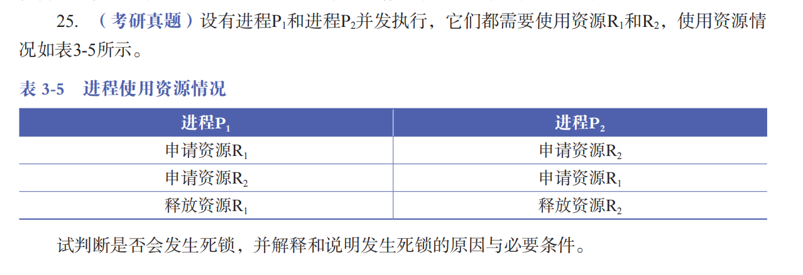
**解析：**
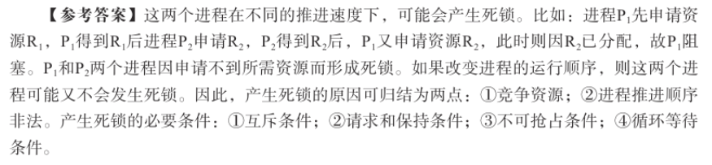

## 第四章 进程同步
### 16题
（考研真题）3 个进程 P1、P2、P3 互斥地使用一个包含 N（N＞0）个单元的缓冲区。
- P1 每次用 `produce()` 生成一个正整数，并用 `put()` 将其送入缓冲区的某一空单元中；
- P2 每次用 `getodd()` 从该缓冲区中取出一个奇数，并用 `countodd()` 统计奇数的个数；
- P3 每次用 `geteven()` 从该缓冲区中取出一个偶数，并用 `counteven()` 统计偶数的个数。

请用信号量机制实现这 3 个进程的同步与互斥活动，并说明所定义的信号量的含义。要求用伪代码描述。

**答案**：

**信号量定义及含义**：
- `mutex`：互斥信号量，用于实现对缓冲区的互斥访问，初始值为 1；
- `empty`：同步信号量，表示缓冲区中空闲单元的数量，初始值为 N；
- `odd`：同步信号量，表示缓冲区中奇数的数量，初始值为 0；
- `even`：同步信号量，表示缓冲区中偶数的数量，初始值为 0。

**伪代码实现**：
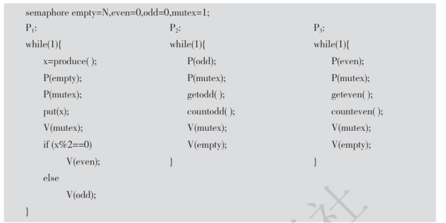

### 18题


**答案**：
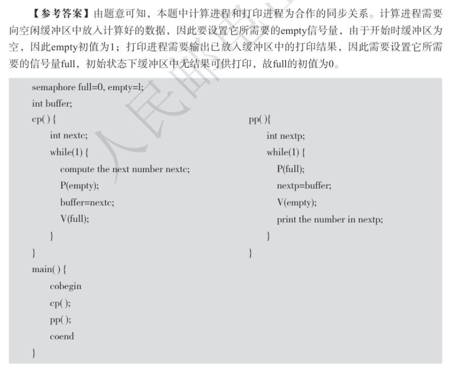

### 20题
桌上有一个能盛得下5个水果的空盘子。爸爸不停地向盘中放苹果和橘子，儿子不停
地从盘中取出橘子享用，女儿不停地从盘中取出苹果享用。规定3人不能同时向（从）盘子中放（取）水果。试用信号量机制来实现爸爸、儿子和女儿这3个“循环进程”之间的同步。

**信号量定义及含义**：
- `mutex`：互斥信号量，用于实现对盘子的互斥访问，防止三人同时操作盘子，初始值为 1；
- `empty`：同步信号量，表示盘子中空闲位置的数量，初始值为 5；
- `apple`：同步信号量，表示盘子中苹果的数量，初始值为 0；
- `orange`：同步信号量，表示盘子中橘子的数量，初始值为 0。

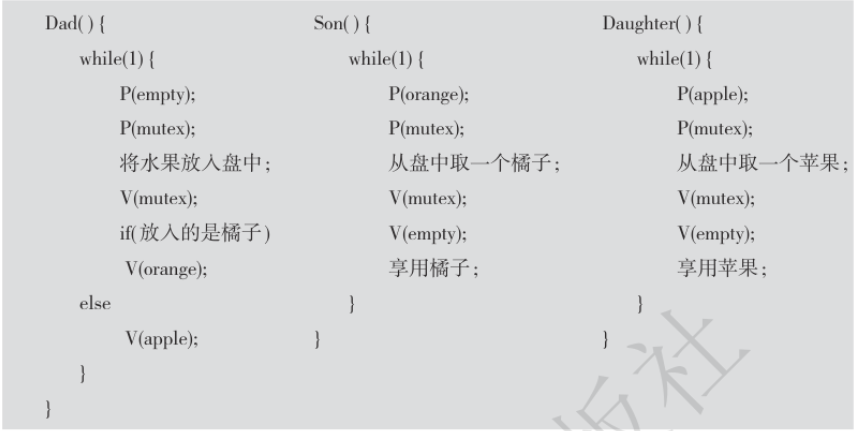

## 第五章 存储器管理
### 12题
（考研真题）假设一个分页存储系统具有快表，多数活动页表项都可以存在于其中。若页表放在内存中，内存访问时间是1ns，快表的命中率是85%，快表的访问时间为0.1ns，则有效存取时间为多少？

**答案**：
有效存取时间（EAT）的计算公式为：
EAT = 命中率 ×（快表访问时间 + 内存访问时间） + （1 - 命中率）×（快表访问时间 + 内存访问时间 + 内存访问时间）

代入数值：
EAT = 0.85 × (0.1 + 1) + (1 - 0.85) × (0.1 + 1 + 1)
    = 0.85 × 1.1 + 0.15 × 2.1
    = 0.935 + 0.315
    = **1.25 ns**

**解析**：

在分页存储系统中，地址转换和数据访问过程如下：

1. **地址转换机制**：
   - CPU访问逻辑地址时，需要将其转换为物理地址
   - 地址转换需要查找页表，页表通常存放在内存中
   - 快表（TLB）是页表的高速缓存，存放最近使用的页表项（物理块号映射）

2. **快表命中时的访问过程**：
   - CPU首先访问快表（0.1ns），找到对应的页表项（包含物理块号）
   - 然后需要根据物理地址访问内存中的**实际数据**（1ns）
   - 所以总时间：快表访问时间 + 内存访问时间（数据） = 0.1ns + 1ns = 1.1ns
   - 快表只存储地址转换信息（页表项），不存储实际数据，因此即使快表命中，仍需要访问内存获取数据

3. **快表未命中时的访问过程**：
   - CPU首先访问快表（0.1ns），未找到对应的页表项
   - 然后需要访问内存中的**页表**（1ns），找到对应的页表项
   - 最后需要根据物理地址访问内存中的**实际数据**（1ns）
   - 所以总时间：快表访问时间 + 内存访问时间（页表） + 内存访问时间（数据） = 0.1ns + 1ns + 1ns = 2.1ns
   - 快表未命中时，需要先从内存读取页表项，再读取数据，因此需要两次内存访问

4. **有效存取时间**：
   - 有效存取时间是快表命中和未命中两种情况的加权平均
   - 计算公式：EAT = 命中率×(快表访问时间+内存访问时间) + (1-命中率)×(快表访问时间+内存访问时间+内存访问时间)

### 15题
已知某分页系统，内存容量为64KB，页面大小为1KB，对一个4页大的作业，其0、1、2、3页分别被分配到内存的2、4、6、7块中。

（1）将十进制的逻辑地址1023、2500、3500、4500变换为物理地址。
（2）以十进制的逻辑地址1023为例，画出地址变换过程图。

**答案**：

**（1）地址变换**：

页面大小 = 1KB = 2^10 B，因此页内偏移量为10位，页号占剩余位。

- 逻辑地址1023：
  页号 = 1023 / 1024 = 0
  页内偏移量 = 1023 % 1024 = 1023
  物理块号 = 2
  物理地址 = 2 × 1024 + 1023 = 2048 + 1023 = **3071**

- 逻辑地址2500：
  页号 = 2500 / 1024 = 2
  页内偏移量 = 2500 % 1024 = 2500 - 2×1024 = 2500 - 2048 = 452
  物理块号 = 6
  物理地址 = 6 × 1024 + 452 = 6144 + 452 = **6596**

- 逻辑地址3500：
  页号 = 3500 / 1024 = 3
  页内偏移量 = 3500 % 1024 = 3500 - 3×1024 = 3500 - 3072 = 428
  物理块号 = 7
  物理地址 = 7 × 1024 + 428 = 7168 + 428 = **7596**

- 逻辑地址4500：
  页号 = 4500 / 1024 = 4
  由于作业只有4页（页号0-3），页号4越界，产生**缺页中断**或**地址越界中断**

**（2）地址变换过程图**：
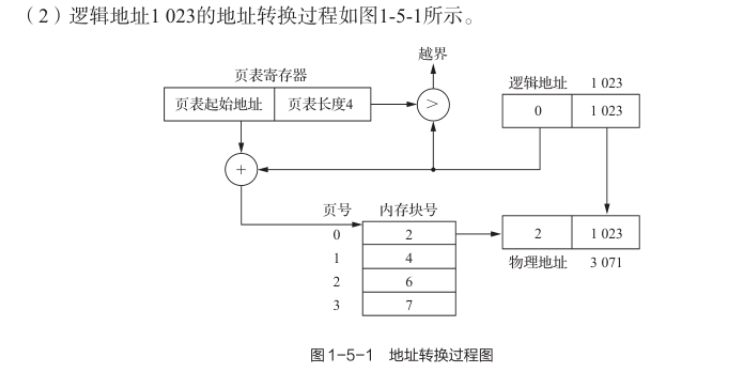

### 18题
（考研真题）某系统采用动态分区分配方式管理内存，内存空间为640KB，低端40KB存放OS。系统为用户作业分配空间时，从低地址区开始。针对下列作业请求序列，画图表示使用首次适应算法进行内存分配和回收后内存的最终映像。作业请求序列如下：

    作业1申请200KB，作业2申请70KB；
    作业3申请150KB，作业2释放70KB；
    作业4申请80KB，作业3释放150KB；
    作业5申请100KB，作业6申请60KB；
    作业7申请50KB，作业6释放60KB。

**答案**：

**首次适应算法内存分配和回收过程**：

1. 初始状态：内存空间640KB，低端40KB存放OS，用户可用空间为600KB（40KB-640KB）
2. 作业1申请200KB：分配40KB-240KB，剩余空间240KB-640KB（400KB）
3. 作业2申请70KB：分配240KB-310KB，剩余空间310KB-640KB（330KB）
4. 作业3申请150KB：分配310KB-460KB，剩余空间460KB-640KB（180KB）
5. 作业2释放70KB：释放240KB-310KB，产生空闲分区：240KB-310KB（70KB），460KB-640KB（180KB）
6. 作业4申请80KB：在空闲分区中找到第一个足够大的分区（460KB-640KB），分配460KB-540KB，剩余空间：240KB-310KB（70KB），540KB-640KB（100KB）
7. 作业3释放150KB：释放310KB-460KB，产生空闲分区：240KB-310KB（70KB），310KB-460KB（150KB），540KB-640KB（100KB）
8. 作业5申请100KB：找到第一个足够大的分区（240KB-310KB不够，310KB-460KB足够），分配310KB-410KB，剩余空间：240KB-310KB（70KB），410KB-460KB（50KB），540KB-640KB（100KB）
9. 作业6申请60KB：找到第一个足够大的分区（240KB-310KB），分配240KB-300KB，剩余空间：300KB-310KB（10KB），410KB-460KB（50KB），540KB-640KB（100KB）
10. 作业7申请50KB：找到第一个足够大的分区（300KB-310KB不够，410KB-460KB足够），分配410KB-460KB，剩余空间：300KB-310KB（10KB），540KB-640KB（100KB）
11. 作业6释放60KB：释放240KB-300KB，产生空闲分区：240KB-300KB（60KB），300KB-310KB（10KB），540KB-640KB（100KB）

**最终内存映像**：

```
内存地址范围    状态        作业/空闲
0KB-40KB       已分配      OS
40KB-240KB      已分配      作业1（200KB）
240KB-300KB     空闲       60KB
300KB-310KB     空闲       10KB
310KB-410KB     已分配      作业5（100KB）
410KB-460KB     已分配      作业7（50KB）
460KB-540KB     已分配      作业4（80KB）
540KB-640KB     空闲       100KB
```

### 20题
某系统的空闲分区如表5-3所示，采用可变分区分配策略处理作业。现有作业序列96KB、20KB、200KB，若采用首次适应算法和最佳适应算法来处理这些作业序列，则哪种算法能满足该作业序列的请求？为什么？

表 5-3 空闲分区表
| 分区号 | 分区大小 | 分区起始地址 |
|--------|----------|--------------|
| 1      | 32KB     | 100K         |
| 2      | 10KB     | 150K         |
| 3      | 5KB      | 200K         |
| 4      | 218KB    | 220K         |
| 5      | 96KB     | 530K         |

**答案**：

**首次适应算法**：

1. 作业96KB：找到第一个足够大的分区4（218KB），分配后分区4剩余218KB-96KB=122KB，起始地址316KB
2. 作业20KB：找到第一个足够大的分区1（32KB），分配后分区1剩余32KB-20KB=12KB，起始地址120KB
3. 作业200KB：查找空闲分区，剩余分区大小：12KB（分区1）、10KB（分区2）、5KB（分区3）、122KB（分区4）、96KB（分区5），均小于200KB，**分配失败**

**最佳适应算法**：

1. 作业96KB：找到大小最接近的分区5（96KB），刚好分配，分区5被完全占用
2. 作业20KB：找到大小最接近的分区1（32KB），分配后分区1剩余32KB-20KB=12KB，起始地址120KB
3. 作业200KB：找到大小最接近的分区4（218KB），分配后分区4剩余218KB-200KB=18KB，起始地址420KB

**结论**：
最佳适应算法能满足该作业序列的请求，而首次适应算法无法满足。因为首次适应算法在分配96KB作业时选择了分区4，导致后续200KB作业无法找到足够大的空闲分区；而最佳适应算法在分配96KB作业时选择了刚好大小匹配的分区5，保留了更大的分区4用于后续的200KB作业分配。

## 第六章 虚拟存储器
### 13题
（考研真题）某虚拟存储器的用户空间共有32个页面，每页1KB，内存16KB。假定某时刻系统为用户的第0、1、2、3页分配的物理块号为5、10、4、7，而该用户作业的长度为6页，试将十六进制的逻辑地址0A5C、103C、1A5C变换成物理地址。

**答案**：

**已知条件**：
- 用户空间页面数：32页，所以页号位数为5位（2^5=32）
- 页面大小：1KB = 2^10 B，所以页内偏移量位数为10位
- 内存大小：16KB，所以物理块数为16块
- 页表：第0、1、2、3页分别对应物理块号5、10、4、7
- 作业长度：6页，所以有效页号为0-5
- 物理地址 = 物理块号 × 页面大小 + 页内偏移量
**地址转换过程**：

1. **十六进制逻辑地址0A5C**：
   - 转换为二进制：0000 1010 0101 1100
   - 页号（高5位）：00010 = 2
   - 页内偏移量（低10位）：1001011100 = 0x025C
   - 页号2对应物理块号4
   - 物理块号4的起始地址：4 × 1KB = 4 × 1024 = 4096（十进制）
   - 十进制4096转换为二进制：1000000000000
   - 二进制转换为十六进制：0x1000
   - 物理地址：0x1000 + 0x025C = **0x125C**

2. **十六进制逻辑地址103C**：
   - 转换为二进制：0001 0000 0011 1100
   - 页号（高5位）：00100 = 4
   - 页内偏移量（低10位）：0000001111 = 0x003C
   - 页号4未分配物理块，**产生缺页中断**

3. **十六进制逻辑地址1A5C**：
   - 转换为二进制：0001 1010 0101 1100
   - 页号（高5位）：00110 = 6
   - 页内偏移量（低10位）：1001011100 = 0x025C
   - 页号6越界，**产生地址越界中断**

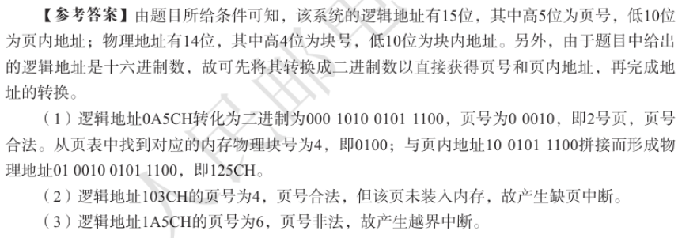

### 18题
（考研真题）有一个请求分页式虚拟存储器系统，分配给某进程3个物理块，开始时内存中预装入第1, 2, 3个页面，该进程的页面访问序列为1, 2, 4, 2, 6, 2, 1, 5, 6, 1。

（1）若采用最佳页面置换算法，则访问过程发生的缺页率为多少？
（2）若采用LRU页面置换算法，则访问过程中的缺页率为多少？

**答案**：

**已知条件**：
- 物理块数：3
- 初始内存页面：1, 2, 3
- 页面访问序列：1, 2, 4, 2, 6, 2, 1, 5, 6, 1
- 总访问次数：10

**（1）最佳页面置换算法**：

原则：淘汰“将来最晚再被访问（或不再访问）”的页面

| 访问序列 | 1 | 2 | 4 | 2 | 6 | 2 | 1 | 5 | 6 | 1 |
|----------|---|---|---|---|---|---|---|---|---|---|
| 物理块1  | 1 | 1 | 1 | 1 | 1 | 1 | 1 | 1 | 1 | 1 |
| 物理块2  | 2 | 2 | 2 | 2 | 2 | 2 | 2 | 2 | 2 | 2 |
| 物理块3  | 3 | 3 | 4 | 4 | 6 | 6 | 6 | 5 | 6 | 6 |
| 缺页？   | ✗ | ✗ | ✓ | ✗ | ✓ | ✗ | ✗ | ✓ | ✗ | ✗ |

**缺页情况**：
- 初始状态：已装入1, 2, 3（无缺页）
- 访问4：置换3（缺页，总缺页1）
- 访问6：置换4（缺页，总缺页2）
- 访问5：置换6（缺页，总缺页3）

**缺页次数**：3
**缺页率**：3/10 = **30%**

**（2）LRU页面置换算法**：

LRU算法选择最近最久未使用的页面进行置换。

| 访问序列 | 1 | 2 | 4 | 2 | 6 | 2 | 1 | 5 | 6 | 1 |
|----------|---|---|---|---|---|---|---|---|---|---|
| 物理块1  | 1 | 1 | 1 | 1 | 6 | 6 | 6 | 5 | 5 | 5 |
| 物理块2  | 2 | 2 | 2 | 2 | 2 | 2 | 2 | 2 | 6 | 6 |
| 物理块3  | 3 | 3 | 4 | 4 | 4 | 4 | 1 | 1 | 1 | 1 |
| 缺页？   | ✗ | ✗ | ✓ | ✗ | ✓ | ✗ | ✓ | ✓ | ✓ | ✗ |

**缺页情况**：
- 初始状态：已装入1, 2, 3（无缺页）
- 访问4：置换3（最近最久未使用），物理块变为1, 2, 4（缺页，总缺页1），最近使用顺序：4 → 2 → 1
- 访问2：命中，不缺页，最近使用顺序：2 → 4 → 1
- 访问6：缺页，最近最久未使用的是1，所以置换1，物理块变为6, 2, 4（缺页，总缺页2），最近使用顺序：6 → 2 → 4
- 访问2：命中，不缺页，最近使用顺序：2 → 6 → 4
- 访问1：缺页，最近最久未使用的是4，置换4，物理块变为6, 2, 1（缺页，总缺页3），最近使用顺序：1 → 2 → 6
- 访问5：缺页，最近最久未使用的是6，置换6，物理块变为5, 2, 1（缺页，总缺页4），最近使用顺序：5 → 1 → 2
- 访问6：缺页，最近最久未使用的是2，置换2，物理块变为5, 6, 1（缺页，总缺页5），最近使用顺序：6 → 5 → 1
- 访问1：命中，不缺页，最近使用顺序：1 → 6 → 5

**缺页次数**：5
**缺页率**：5/10 = **50%**

### 20题
某系统有4个页，某个进程的页面使用情况如表6-4所示，问采用FIFO、LRU、简单Clock和改进型Clock页面置换算法，分别会置换哪一页？

表 6-4 页面使用情况
| 页号 | 装入时间 | 上次引用时间 | R | M |
|------|----------|--------------|---|---|
| 0    | 126      | 279          | 0 | 0 |
| 1    | 230      | 260          | 1 | 0 |
| 2    | 120      | 272          | 1 | 1 |
| 3    | 160      | 280          | 1 | 1 |

其中，R是读标志位，M是修改位。

**答案**：

**已知条件**：
- 页号：0, 1, 2, 3
- 装入时间：126, 230, 120, 160（越小表示越早装入）
- 上次引用时间：279, 260, 272, 280（越大表示越近被引用）
- R（访问位）：0表示最近未访问，1表示最近访问过
- M（修改位）：0表示未修改，1表示已修改

**1. FIFO（先进先出）页面置换算法**：
- FIFO算法选择最早装入内存的页面进行置换
- 装入时间从小到大：页2（120） < 页0（126） < 页3（160） < 页1（230）
- 最早装入的是页2
- **置换页**：2

**2. LRU（最近最久未使用）页面置换算法**：
- LRU算法选择上次引用时间最早的页面进行置换
- 上次引用时间从小到大：页1（260） < 页2（272） < 页0（279） < 页3（280）
- 上次引用时间最早的是页1
- **置换页**：1

**3. 简单Clock页面置换算法**：
- 简单Clock算法使用访问位R，遍历所有页面，选择第一个R=0的页面
- 页面R值：页0（0），页1（1），页2（1），页3（1）
- 第一个R=0的页面是页0
- **置换页**：0

**4. 改进型Clock页面置换算法**：
- 改进型Clock算法同时使用访问位R和修改位M，优先级如下：
  1. R=0，M=0（最佳置换，既未访问也未修改）
  2. R=0，M=1（未访问但已修改，需要写回）
  3. R=1，M=0（已访问但未修改）
  4. R=1，M=1（已访问且已修改）
- 页面状态：
  - 页0：R=0，M=0（类型1）
  - 页1：R=1，M=0（类型3）
  - 页2：R=1，M=1（类型4）
  - 页3：R=1，M=1（类型4）
- 类型1的页面只有页0
- **置换页**：0

## 第七章 输入、输出系统
### 15题
（考研真题）某磁盘的转速为10 000r/min，平均寻道时间为6ms，磁盘传输速率为20MB/s，磁盘控制器时延为0.2ms，读取一个4KB的扇区所需的平均时间约为多少？

**答案**：

**计算步骤**：

1. **计算平均旋转延迟**：
   旋转延迟是磁盘旋转半圈所需的时间
   平均旋转延迟 = (60秒/转速) / 2
   平均旋转延迟 = (60 / 10000) / 2 = 0.006 / 2 = 0.003秒 = **3 ms**

2. **计算传输时间**：
   传输时间 = 数据大小 / 传输速率
   传输时间 = 4 KB / 20 MB/s = (4 × 1024 B) / (20 × 1024 × 1024 B/s) = 4 / (20 × 1024) 秒 ≈ 0.0001953125秒 = **0.1953125 ms**

3. **计算平均访问时间**：
   平均访问时间 = 平均寻道时间 + 平均旋转延迟 + 传输时间 + 控制器时延
   平均访问时间 = 6 ms + 3 ms + 0.1953125 ms + 0.2 ms ≈ **9.395 ms**

**最终结果**：
读取一个4KB扇区所需的平均时间约为 **9.4 ms**

### 17题
（考研真题）假设有11个进程先后提出磁盘I/O请求，当前磁头正在110号磁道处，并预向磁道序号增加的方向移动。请求队列的顺序为30、145、120、78、82、140、20、42、165、65，分别用FCFS调度算法和SCAN调度算法完成上述请求，写出磁道访问顺序和每次磁头移动的距离，并计算平均移动磁道数。

**答案**：

**已知条件**：
- 当前磁头位置：110号磁道
- 移动方向：向磁道序号增加的方向
- 请求队列：30、145、120、78、82、140、20、42、165、65

**（1）FCFS（先进先出）调度算法**：

FCFS算法按照请求到达的顺序处理请求。

| 访问顺序 | 磁道 | 移动距离 |
|----------|------|----------|
| 当前位置 | 110  | -        |
| 1        | 30   | 80       |
| 2        | 145  | 115      |
| 3        | 120  | 25       |
| 4        | 78   | 42       |
| 5        | 82   | 4        |
| 6        | 140  | 58       |
| 7        | 20   | 120      |
| 8        | 42   | 22       |
| 9        | 165  | 123      |
| 10       | 65   | 100      |

**总移动距离**：80 + 115 + 25 + 42 + 4 + 58 + 120 + 22 + 123 + 100 = **689**
**平均移动磁道数**：689 / 10 = **68.9**

**（2）SCAN（扫描）调度算法**：

SCAN算法向一个方向移动，直到没有请求，然后改变方向。当前磁头位置110，方向是向磁道序号增加的方向。

| 访问顺序 | 磁道 | 移动距离 |
|----------|------|----------|
| 当前位置 | 110  | -        |
| 1        | 120  | 10       |
| 2        | 140  | 20       |
| 3        | 145  | 5        |
| 4        | 165  | 20       |
| （改变方向） |      |          |
| 5        | 82   | 83       |
| 6        | 78   | 4        |
| 7        | 65   | 13       |
| 8        | 42   | 23       |
| 9        | 30   | 12       |
| 10       | 20   | 10       |

**总移动距离**：10 + 20 + 5 + 20 + 83 + 4 + 13 + 23 + 12 + 10 = (165-110)+(165-20) = **200**
**平均移动磁道数**：200 / 10 = **20.0**

### 18题
（考研真题）磁盘请求服务队列中要访问的磁道分别为38、6、37、100、14、124、65、67，磁头上次访问了20号磁道，当前处于30号磁道上，试采用FCFS、SSTF和SCAN调度算法，分别计算磁头移动的磁道数。

**答案**：

**已知条件**：
- 上次访问磁道：20
- 当前磁头位置：30
- 请求队列：38、6、37、100、14、124、65、67

**（1）FCFS（先进先出）调度算法**：

FCFS算法按照请求到达的顺序处理请求。

| 访问顺序 | 磁道 | 移动距离 |
|----------|------|----------|
| 当前位置 | 30   | -        |
| 1        | 38   | 8        |
| 2        | 6    | 32       |
| 3        | 37   | 31       |
| 4        | 100  | 63       |
| 5        | 14   | 86       |
| 6        | 124  | 110      |
| 7        | 65   | 59       |
| 8        | 67   | 2        |

**总移动距离**：8 + 32 + 31 + 63 + 86 + 110 + 59 + 2 = **391**

**（2）SSTF（最短寻道时间优先）调度算法**：

SSTF算法选择距离当前磁头位置最近的请求进行处理。

| 访问顺序 | 磁道 | 移动距离 |
|----------|------|----------|
| 当前位置 | 30   | -        |
| 1        | 37   | 7        |
| 2        | 38   | 1        |
| 3        | 14   | 24       |
| 4        | 6    | 8        |
| 5        | 65   | 59       |
| 6        | 67   | 2        |
| 7        | 100  | 33       |
| 8        | 124  | 24       |

**总移动距离**：7 + 1 + 24 + 8 + 59 + 2 + 33 + 24 = **158**

**（3）SCAN（扫描）调度算法**：

SCAN算法向一个方向移动，直到没有请求，然后改变方向。当前磁头位置30，上次访问20，方向是向磁道序号增加的方向。

| 访问顺序 | 磁道 | 移动距离 |
|----------|------|----------|
| 当前位置 | 30   | -        |
| 1        | 37   | 7        |
| 2        | 38   | 1        |
| 3        | 65   | 27       |
| 4        | 67   | 2        |
| 5        | 100  | 33       |
| 6        | 124  | 24       |
| （改变方向） |      |          |
| 7        | 14   | 110      |
| 8        | 6    | 8        |

**总移动距离**：7 + 1 + 27 + 2 + 33 + 24 + 110 + 8 = (124-30) + (124-6) = **212**

**各算法磁头移动总磁道数**：
- FCFS：391
- SSTF：158
- SCAN：212