# 计算题
## 第一章 操作系统引论

### 25题

**答案：** 单道运行时间260ms，多道运行时间170ms

**解析：**
单道程序顺序执行，A→B→C，每个程序必须完成所有操作后下一个程序才能开始。
多道程序并发执行，利用I/O等待时间进行计算。

```mermaid
gantt
    title 25题 - 单道程序运行时间关系图
    dateFormat  X
    axisFormat %s
    section 程序A
    A计算1: 0, 30
    A I/O: 30, 70
    A计算2: 70, 80
    
    section 程序B
    B计算1: 80, 140
    B I/O: 140, 170
    B计算2: 170, 180
    
    section 程序C
    C计算1: 180, 200
    C I/O: 200, 240
    C计算2: 240, 260
```

```mermaid
gantt
    title 25题 - 多道程序运行时间关系图
    dateFormat  X
    axisFormat %s
    
    section 程序A
    A计算1: 0, 30
    A I/O: 30, 70
    A计算2: 70, 80
    
    section 程序B
    B计算1: 30, 90
    B I/O: 90, 120
    B计算2: 120, 130
    
    section 程序C
    C计算1: 90, 110
    C I/O: 110, 150
    C计算2: 150, 170
```

### 26题

**答案：** 完成两个作业需要的最少时间为205ms

**解析：**
P₂比P₁晚5ms到达，在多道批处理系统中并发执行两个作业，不考虑调度和切换时间。

```mermaid
gantt
    title 26题 - 多道批处理系统作业执行时间关系图
    dateFormat  X
    axisFormat %s
    
    section 作业P₁
    P₁计算1: 0, 60
    P₁ I/O: 60, 140
    P₁计算2: 140, 160
    
    section 作业P₂
    P₂计算1: 5, 125
    P₂ I/O: 125, 165
    P₂计算2: 165, 205
```

### 28题

**答案：** 
（1）如上所述
（2）12.5%
（3）设备速度不匹配，顺序执行
（4）多道程序设计，并发执行

**解析：**
（1）处理机、输入机和打印机的协同工作：输入机负责数据输入，处理机负责计算，打印机负责输出。输入机在0-100ms输入数据，处理机在100-120ms处理，然后等待；输入机在120-160ms继续输入，处理机在160ms后等待；输入机在160-260ms输入，处理机在260-280ms处理，打印机在280-320ms输出。

（2）处理机利用率计算：总时间320ms，处理机工作时间40ms（100-120ms和260-280ms），利用率为40/320=12.5%。

（3）处理机利用率不高的原因：设备之间速度不匹配，输入机速度慢导致处理机等待时间长；采用顺序执行方式，设备之间串行工作，没有充分利用并发。

（4）提高处理机利用率的执行方案：采用多道程序设计，让多个作业并发执行，重叠使用不同设备，当一个作业进行I/O时，另一个作业可以使用处理机，合理调度作业使各设备尽量同时工作。

```mermaid
gantt
    title 28题 - 原始执行情况时间关系图
    dateFormat  X
    axisFormat %s
    
    section 输入机
    输入数据1: 0, 100
    输入数据2: 100, 120
    输入数据3: 120, 160
    输入数据4: 160, 260
    
    section 处理机
    处理1: 100, 120
    处理2: 260, 280
    
    section 打印机
    打印1: 280, 320
```

```mermaid
gantt
    title 28题 - 提高利用率的执行方案
    dateFormat  X
    axisFormat %s
    
    section 作业1
    输入1: 0, 80
    处理1: 80, 120
    打印1: 120, 160
    
    section 作业2
    输入2: 40, 120
    处理2: 120, 160
    打印2: 160, 200
    
    section 作业3
    输入3: 80, 160
    处理3: 160, 200
    打印3: 200, 240
    
    section 作业4
    输入4: 120, 200
    处理4: 200, 240
    打印4: 240, 280
```

