# 算法设计复习指南

## 考核方式

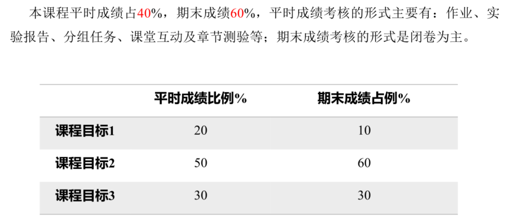

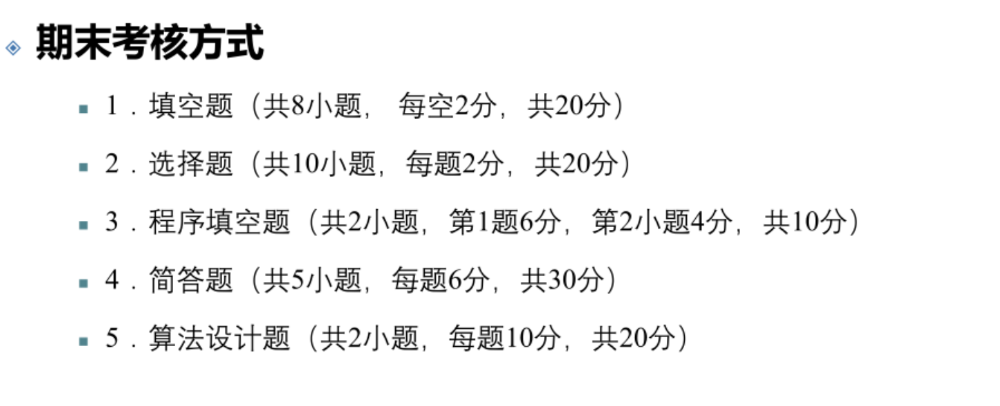

## 课程目标

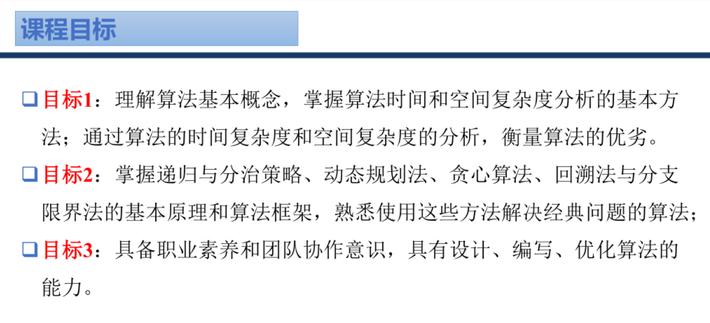

## 主要章节与核心知识点

### 第一章 算法基础

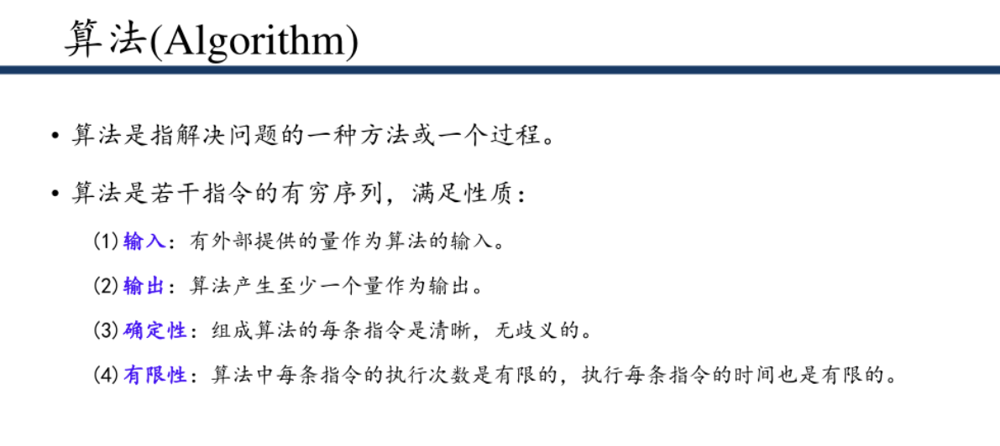
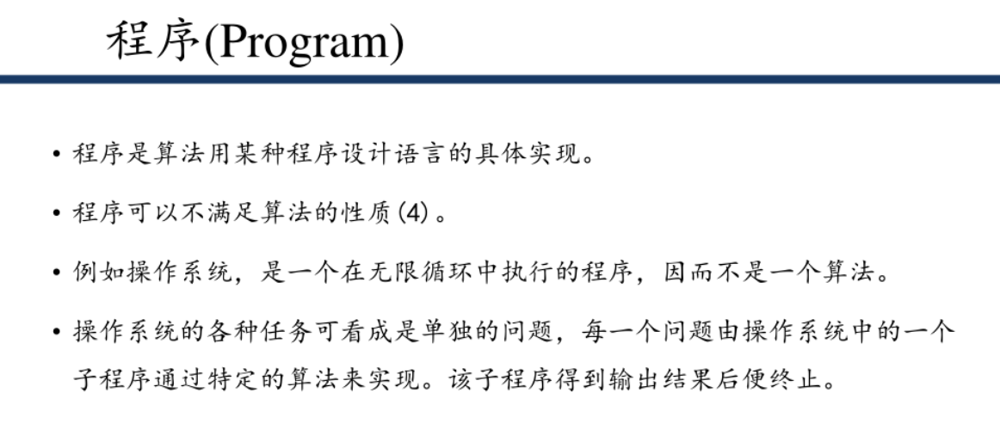

1. **算法复杂度分析**

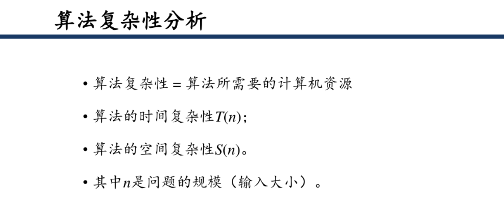
   - **时间复杂度与空间复杂度的定义**
   - **渐近符号**：O（上界）、Ω（下界）、θ（紧界）
   - 常数因子不影响渐近复杂度
   - **常见复杂度比较**：O(1) < O(logn) < O(n) < O(nlogn) < O(n²) < O(2ⁿ) < O(n!)

2. **算法设计基本概念**

   - **算法的五大特性**：输入、输出、有穷性、确定性、可行性
   - **算法设计的目标**：正确性、可读性、健壮性、效率（时间+空间）

3. **常见算法复杂度**

   | 复杂度 | 典型算法示例 |
   |--------|--------------|
   | O(1) | 数组访问 |
   | O(logn) | 二分查找 |
   | O(n) | 线性搜索、直接插入排序 |
   | O(nlogn) | 快速排序、归并排序 |
   | O(n²) | 冒泡排序、选择排序 |
   | O(n³) | 矩阵乘法（朴素算法） |
   | O(2ⁿ) | 递归斐波那契 |
   | O(n!) | 全排列 |

### 第二章 分治法

1. **分治法的基本要素**

   - **分解**：将原问题分解为若干规模较小、结构相似的子问题
   - **解决**：递归解决子问题，或直接解决小规模子问题
   - **合并**：将子问题的解合并为原问题的解

2. **分治法适用条件**

   - 子问题结构与原问题相似
   - 子问题相互独立（无重叠子问题）
   - 子问题的解可以合并

3. **典型应用**

   - 二分查找
   - 快速排序
   - 归并排序
   - 大整数乘法
   - 矩阵乘法（Strassen算法）
   - 寻找第k小元素

4. **递归**

   - **定义**：递归是一种解决问题的方法，它将原问题分解为规模更小的相同问题，通过不断调用自身来解决子问题，直到问题规模小到可以直接解决。

   - **基本思想**：
     - 将复杂问题分解为简单的子问题
     - 子问题与原问题具有相同的结构
     - 解决子问题后，将结果合并得到原问题的解

   - **递归要素**：
     - **终止条件（边界条件）**：当问题规模足够小时，可以直接返回结果，不再继续递归
     - **递归调用（递归方程）**：将原问题分解为更小的子问题，调用自身函数
     - **返回值处理**：将子问题的结果合并，得到原问题的解

   - **递归与迭代的比较**：
     - 递归：代码简洁，但空间复杂度高，可能栈溢出
     - 迭代：效率更高，空间复杂度低，但代码可能更复杂


### 第三章 贪心算法

1. **贪心算法的基本思想**

   - 每一步选择局部最优解，希望通过局部最优达到全局最优
   - **贪心准则（最优度量标准）**： 贪心法每一步上用作决策依据的选择标准
   - **贪心选择性质**：全局最优解可以通过一系列局部最优选择得到
   - **最优子结构性质**：问题的最优解包含其子问题的最优解

2. **贪心算法的要素**

   - 贪心选择性质
   - 最优子结构性质

3. **典型应用**

   - 活动安排问题
   - 哈夫曼编码
   - 单源最短路径（Dijkstra算法）
     - 基本思想：采用贪心策略，每次选择当前距离源点最近的未访问节点，更新其邻接节点的距离
     - 适用场景：带非负权重的有向图或无向图，求解从一个源点到所有其他顶点的最短路径
     - 时间复杂度：使用优先队列优化时为O(E log V)，其中V是顶点数，E是边数
     - 工作流程：初始化距离数组→迭代选择最小距离节点→更新邻接节点距离→重复直到所有节点访问完成
   - 最小生成树（Prim算法、Kruskal算法）
     - **Prim算法**：
       - 基本思想：从一个顶点开始，每次添加一条连接生成树和外部顶点的最小权重边
       - 适用场景：稠密图，边数较多的连通加权无向图
       - 时间复杂度：使用优先队列优化时为O(E log V)
       - 工作流程：初始化顶点集合→迭代选择最小边→扩展生成树→重复直到包含所有顶点
     - **Kruskal算法**：
       - 基本思想：按边权从小到大排序，每次添加不形成环的最小边
       - 适用场景：稀疏图，边数较少的连通加权无向图
       - 时间复杂度：O(E log E)（主要来自边的排序）
       - 工作流程：排序所有边→使用并查集检测环→依次添加边→直到生成树形成
   - 背包问题（分数背包）

4. **贪心算法与动态规划的区别**

   | 算法 | 搜索策略 | 子问题处理 | 适用场景 |
   |------|---------|-----------|---------|
   | 贪心算法 | 自顶向下 | 每次选择局部最优 | 具有贪心选择性质 |
   | 动态规划 | 自底向上 | 解决重叠子问题 | 子问题重叠 |

### 第四章 回溯法


1. **回溯法的基本思想**

   - 系统地搜索问题的所有解
   - 采用深度优先搜索策略，通过剪枝避免无效搜索
   - **解空间树**：子集树（0-1选择）、排列树（排列问题）

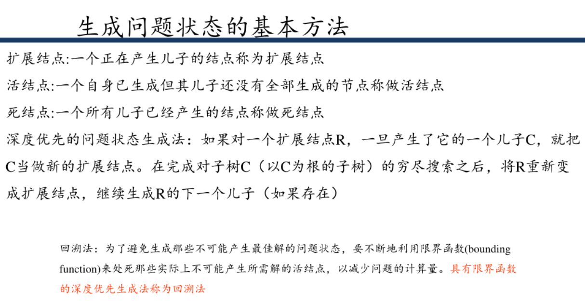

2. **回溯法的关键技术**

   - **剪枝函数**：约束函数（可行性剪枝）、限界函数（最优性剪枝）
   - 解空间的组织与遍历

3. **典型应用**

   - 0-1背包问题
   - 旅行商问题
   - n皇后问题
   - 图的着色问题
   - 子集和问题

4. **时间复杂度分析**

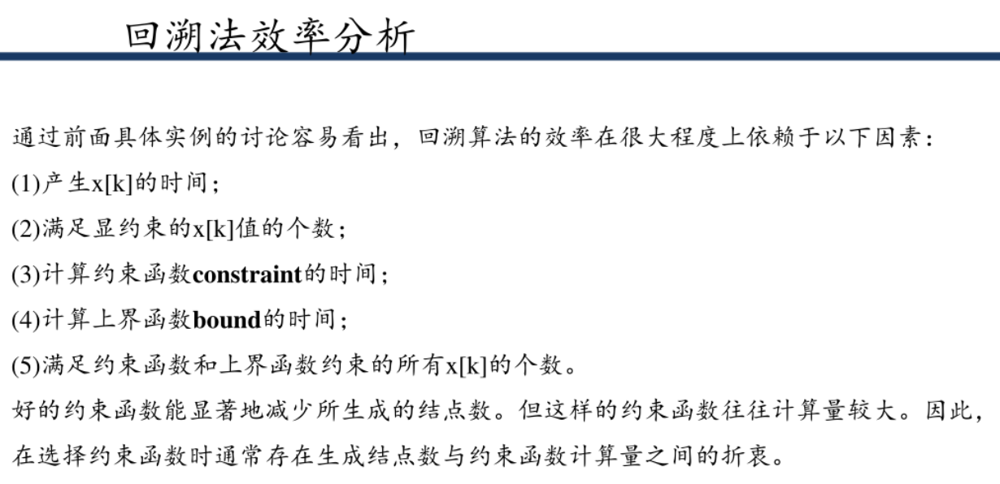

变量/术语的含义如下：
- **x[k]**：回溯法会把问题的解表示为一个“解向量”（比如`x[1],x[2],…,x[n]`），`x[k]`就是这个向量的第k个元素，对应“第k步选择的选项”（比如八皇后问题中，`x[k]`表示第k行皇后放在第几个列）。
- **显约束**：是对`x[k]`的“基本限制”（比如八皇后问题中，`x[k]`必须是1~8的整数，不能超出棋盘范围），满足显约束的`x[k]`才是“合法的候选选项”。
- **约束函数(constraint)**：是“隐约束”的判断函数，用来筛选掉不符合问题规则的`x[k]`（比如八皇后问题中，`constraint`会判断当前选的`x[k]`是否和之前的皇后冲突）。
- **上界函数(bound)**：用于“剪枝”的函数，判断当前路径即使继续选下去，也不可能得到更优解（比如背包问题中，`bound`会计算当前物品+剩余物品的最大价值，若小于已有最优解就直接剪枝）。

   - 子集树问题：O(n×2ⁿ)
   - 排列树问题：O(n×n!)
   - **上界函数**：用于剪枝优化，计算当前状态下可能的最大价值上限

### 第五章 分支限定法

1. **分支限定法的基本思想**

   - **分支**：将问题分解为子问题
   - **限定**：计算子问题的上下界，剪枝无效分支
   - 采用广度优先搜索或优先队列搜索策略

2. **分支限定法的设计**
- **1.设计合适的限界函数**
- **2.组织活结点表**
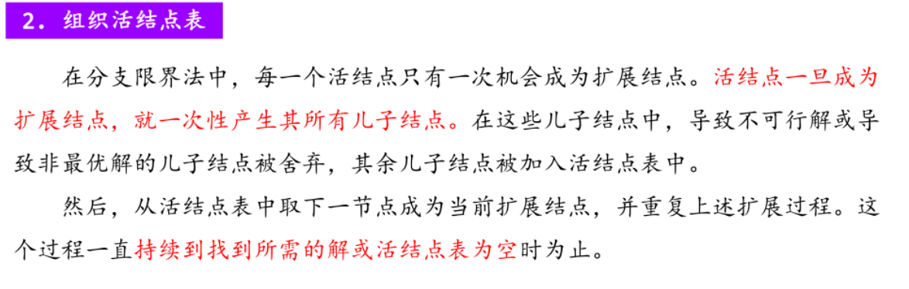

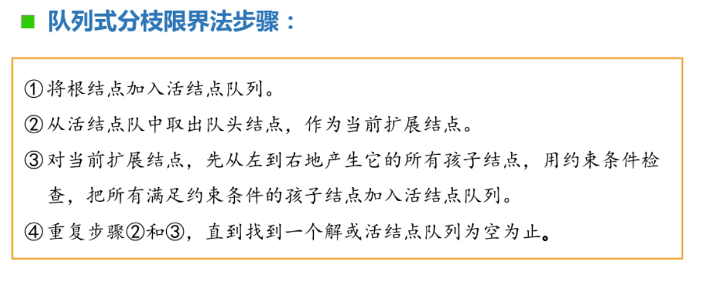
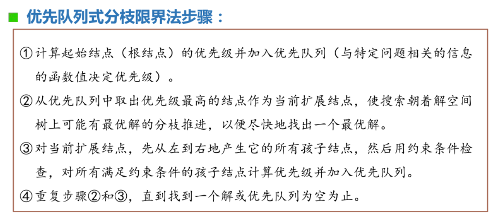
- **3.确定最优解向量**


**总结**
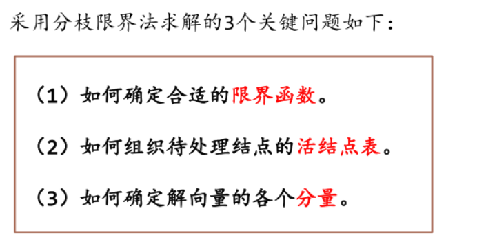

3. **分支限定法与回溯法的区别**

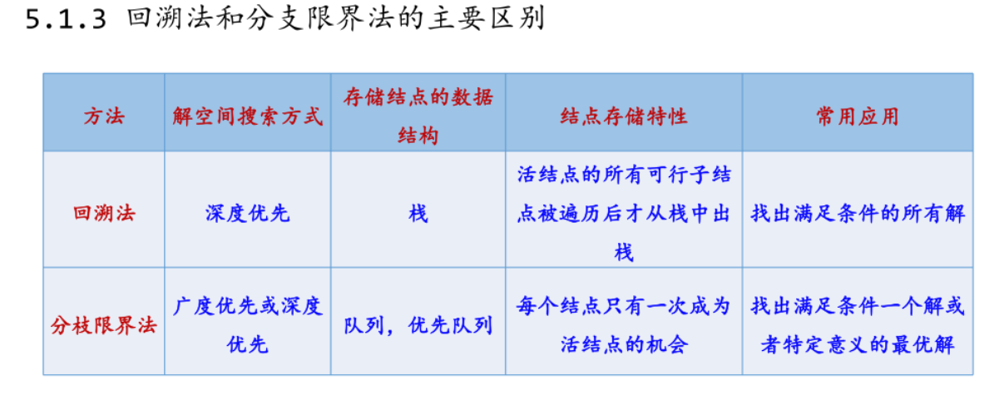

4. **最小出边限界法**

   - **定义**：分支限界法的具体实现，主要用于求解**旅行商问题（TSP）**，采用贪心策略+下界剪枝+优先队列管理活结点。

   - **核心思想**：
     - 贪心选择：每次扩展当前节点的最小出边
     - 下界剪枝：计算路径下界，剪枝不可能优于当前最优解的路径
     - 优先队列：按**下界从小到大**排列活结点，优先扩展更优路径

   - **核心要素**：
     - **优先队列**：管理活结点，按下界排序
     - **下界函数**：计算路径的最小可能总成本
     - **剪枝策略**：下界≥当前最优解时剪枝

   - **下界计算（考点）**：
     - **最小出边法**：每个节点保留两条最小出边，计算剩余路径最小成本
     - **最小生成树法**：剩余节点的最小生成树 + 已有路径成本 + 首尾节点最小边

   - **适用场景**：旅行商问题（TSP）、路径优化问题

   - **与分支限界法关系**：是分支限界法在TSP问题上的具体应用，体现了分支限界法的核心思想（剪枝+优先队列）

5. **分支限界法与分治法和回溯法的关系**

   - **与分治法的关系**：
     - **相似点**：都采用“分解-求解-合并”的思想，将原问题分解为子问题
     - **不同点**：
       - 分治法递归求解所有子问题，然后合并子问题的解；分支限界法通过限界函数剪枝，只处理可能产生最优解的子问题
       - 分治法的子问题相互独立；分支限界法的子问题可能存在依赖关系
       - 分治法适用于求解所有子问题的解，分支限界法适用于求解最优解

   - **与回溯法的关系**：
     - **相似点**：都基于问题的解空间树进行搜索，通过剪枝策略减少搜索空间
     - **不同点**：
       - **搜索策略**：回溯法采用深度优先搜索（DFS）；分支限界法可采用深度优先搜索（DFS）、广度优先搜索（BFS）或优先队列搜索（最佳优先搜索）
       - **搜索目标**：回溯法通常求解所有满足条件的解，分支限界法主要求解最优解
       - **剪枝策略**：回溯法使用约束函数（可行性剪枝）和限界函数（最优性剪枝）；分支限界法主要使用限界函数进行剪枝
       - **存储结构**：回溯法通常使用栈；分支限界法使用栈（DFS）、队列（BFS）或优先队列（最佳优先搜索）
       - **效率**：对于求解最优解问题，分支限界法通常比回溯法更高效

   - **三种算法的比较**：
     | 算法 | 核心思想 | 搜索策略 | 适用场景 |
     |------|----------|---------|---------|
     | 分治法 | 分解-递归-合并 | 递归 | 子问题独立，求解所有子问题的解 |
     | 回溯法 | 深度优先搜索+剪枝 | 深度优先搜索 | 求解所有满足条件的解或特定解 |
     | 分支限界法 | 分支+限界 | DFS/BFS/优先队列 | 求解最优解问题 |


### 第六章 动态规划

1. **动态规划的基本思想**

   - 将原问题分解为相互重叠的子问题，通过求解子问题来求解原问题
   - 自底向上计算，保存子问题的解，避免重复计算
   - 核心是找到**状态转移方程**

2. **动态规划的适用条件**

   - **最优子结构性质**：原问题的最优解包含子问题的最优解
   - **重叠子问题性质**：子问题重复出现，需要保存子问题的解

3. **动态规划的基本要素**

   - **状态定义**：描述问题的不同阶段和状态
   - **状态转移方程**：描述状态之间的转移关系
   - **初始条件**：问题的边界条件
   - **计算顺序**：自底向上，从小到大计算

4. **与其他算法的比较**

   | 算法 | 子问题特点 | 搜索策略 | 适用场景 |
   |------|-----------|---------|---------|
   | 分治法 | 子问题不重叠 | 递归 | 子问题独立 |
   | 贪心算法 | 无重叠子问题 | 自顶向下 | 具有贪心选择性质 |
   | 动态规划 | 子问题重叠 | 自底向上 | 具有最优子结构和重叠子问题 |

### 第七章 智能算法

1. **智能算法的基本概念**

   - 智能算法是一类启发式算法，模拟自然现象或生物行为
   - 适用于求解复杂的组合优化问题
   - 主要特点：全局搜索能力强，不依赖问题的具体结构

2. **粒子群优化算法（PSO）**

   - **基本思想**：模拟鸟群或鱼群的群体智能行为，通过粒子间的协作和竞争寻找最优解
   - **核心概念**：
     - **粒子**：问题的潜在解
     - **粒子位置**：粒子在解空间中的位置
     - **粒子速度**：粒子在解空间中的移动速度
     - **惯性权重**：决定粒子保持当前速度的程度
     - **认知因子**：粒子向自身历史最优位置移动的权重
     - **社会因子**：粒子向群体最优位置移动的权重
     - **个体最优（pbest）**：粒子自身找到的最优解
     - **全局最优（gbest）**：整个粒子群找到的最优解
     - **适应度函数**：评价粒子优劣的函数
     - **终止条件**：算法停止的条件（最大迭代次数或收敛）
   - **算法流程**：初始化粒子群 → 计算适应度 → 更新个体最优和全局最优 → 更新粒子位置和速度 → 重复迭代
   - **应用领域**：函数优化、神经网络训练、组合优化问题

3. **模拟退火算法（SA）**

   - **基本思想**：模拟固体退火过程，通过控制温度的冷却来寻找最优解
   - **核心概念**：
     - **温度**：控制搜索的随机性，温度越高，接受劣解的概率越大
     - **冷却速率**：控制温度下降的速度
     - **邻域函数**：生成当前解的邻居解
     - **Metropolis准则**：决定是否接受劣解
   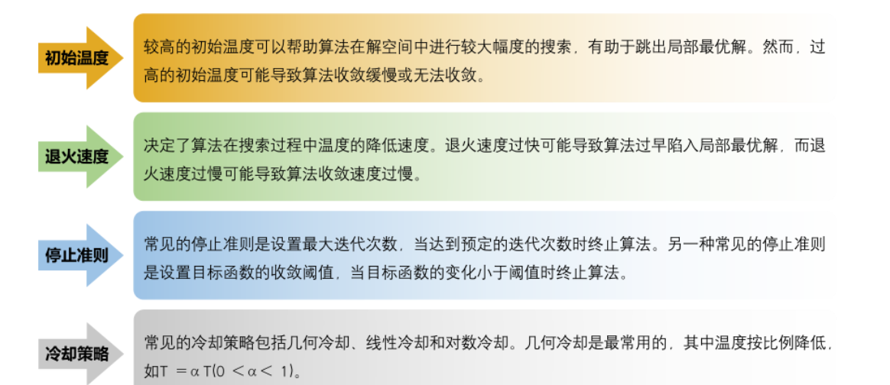
   - **算法流程**：初始化温度和初始解 → 生成邻居解 → 计算能量差 → 按Metropolis准则接受或拒绝 → 降低温度 → 迭代直到满足终止条件
   - **应用领域**：旅行商问题、图着色问题、电路设计

4. **禁忌搜索算法（TS）**

   - **基本思想**：通过记忆机制避免重复搜索，允许接受劣解以跳出局部最优
   - **核心概念**：
   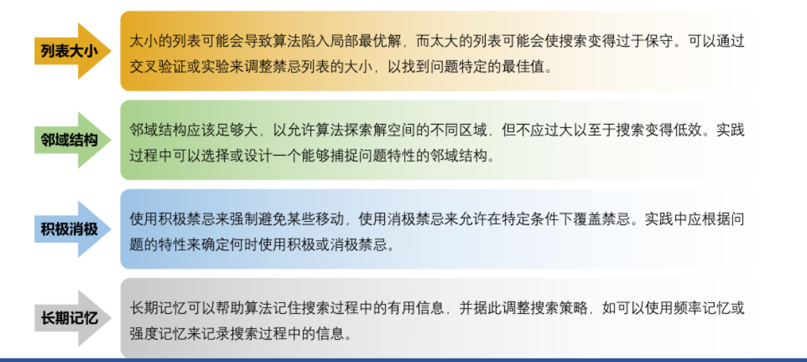
     - **禁忌表**：记录最近访问过的解或操作，避免重复搜索
     - **禁忌长度**：禁忌表的大小，控制记忆的时间
     - **候选解**：当前解的邻居解
     - **特赦规则**：当找到更优解时，可忽略禁忌表的限制
   - **算法流程**：初始化当前解和禁忌表 → 生成候选解 → 选择最优候选解（考虑禁忌表） → 更新禁忌表 → 迭代直到满足终止条件
   - **应用领域**：旅行商问题、车间调度问题、资源分配问题

5. **智能算法的优缺点**

   | 算法 | 优点 | 缺点 |
   |------|------|------|
   | PSO | 实现简单，收敛速度快 | 容易陷入局部最优 |
   | SA | 全局搜索能力强 | 参数设置敏感，收敛速度慢 |
   | TS | 记忆机制避免重复搜索 | 禁忌表长度难以确定 |

   - **优点**：全局搜索能力强，适用于复杂问题，不需要问题的梯度信息
   - **缺点**：收敛速度可能较慢，参数设置敏感，理论基础相对薄弱

### 答题技巧

#### 贪心算法通用模板（Prim / Kruskal / Dijkstra）

```
解：本题采用贪心算法（×××算法）求解。

1. 问题建模与适用性说明：
说明为何该问题适合采用贪心策略。
（如：最短路径问题中，当前距离最小的顶点一旦确定，其最短路径不再改变。）

2. 初始化：
给出初始集合及辅助结构。
（如：Dijkstra 中 S={源点}，dist[i] 表示源点到各顶点的当前最短距离；
Prim 中已选顶点集合与最小边权数组；
Kruskal 中对所有边按权值排序并初始化并查集。）

3. 贪心选择策略：
在所有候选元素中选择当前代价最小且满足约束的元素。
（如：选择 dist 最小的未确定顶点，或选择权值最小且不形成回路的边。）

4. 状态更新：
将选中的元素加入解集中，并更新相关状态。
（如：更新 dist 数组，或合并并查集中两个集合。）

5. 重复执行：
不断执行“选择—更新”过程，直到达到终止条件。
（如：所有顶点均已加入 S，或最小生成树中已选 n−1 条边。）

6. 最终结果：
   给出最优解及其总代价。
（如：最短路径长度数组或最小生成树的总权值。）
```

```
例题：
给定下图，使用Dijkstra算法求从顶点A到其他所有顶点的最短路径。

    2    B
A ------ C
|  \     | 1
|   \    |
3    5   D
|      \ |
|       \|
E ------ F
    4

解：采用贪心算法（Dijkstra算法）求解。

1. 问题建模与适用性说明：
   该问题是单源最短路径问题，适合采用Dijkstra贪心策略。因为在最短路径问题中，当前距离最小的顶点一旦确定，其最短路径不再改变，符合贪心选择性质。

2. 初始化：
   - 已确定最短路径的顶点集合 S = {A}
   - 距离数组 dist，初始化为：dist[A]=0，dist[B]=∞，dist[C]=2，dist[D]=5，dist[E]=3，dist[F]=∞

3. 贪心选择策略：
   从S外的顶点中选择距离最小的顶点，初始时选择C（dist[C]=2）。

4. 状态更新：
   - 将C加入S：S={A,C}
   - 更新C的邻接顶点B和D的距离：
     - dist[B] = min(∞, dist[C]+边CB) = min(∞, 2+2)=4
     - dist[D] = min(5, dist[C]+边CD) = min(5, 2+1)=3

5. 重复执行：
   - 选择距离最小的未确定顶点D（dist[D]=3），加入S
   - 更新D的邻接顶点F的距离：dist[F] = min(∞, 3+边DF)=3+∞=∞
   - 选择距离最小的未确定顶点E（dist[E]=3），加入S
   - 更新E的邻接顶点F的距离：dist[F] = min(∞, 3+边EF)=3+4=7
   - 选择距离最小的未确定顶点B（dist[B]=4），加入S
   - 更新B的邻接顶点无（已全部在S中）
   - 选择距离最小的未确定顶点F（dist[F]=7），加入S

6. 最终结果：
   源点A到各顶点的最短路径长度为：
   - A→B：4
   - A→C：2
   - A→D：3
   - A→E：3
   - A→F：7
```

---

#### 动态规划通用模板（必考重点）

```
解：采用动态规划方法。

1. 状态定义：
明确 dp 的含义，并结合具体问题说明。
（如：dp[i][j] 表示字符串 s1[0..i-1] 与 s2[0..j-1] 的最长公共子序列长度；
或 dp[i][j] 表示前 i 个物品放入容量为 j 的背包的最大价值。）

2. 状态转移方程：
根据问题约束写出具体、正确的转移关系。
（如：LCS 中，
若 s1[i-1] == s2[j-1]，dp[i][j] = dp[i-1][j-1] + 1，
否则 dp[i][j] = max(dp[i-1][j], dp[i][j-1])。）

3. 初始条件：
给出边界状态的取值。
（如：dp[0][j] = 0，dp[i][0] = 0。）

4. 计算顺序：
说明状态的递推顺序，保证转移所需状态已被计算。
（如：i 从 1 到 n，j 从 1 到 m 依次递推。）

5. 最终结果：
指出所求答案对应的 dp 状态。
（如：dp[n][m] 即为最长公共子序列长度。）
```

```
例题：给定两个字符串 s1 = "ABCBDAB" 和 s2 = "BDCAB"，求它们的最长公共子序列长度。

解：采用动态规划方法。

1. 状态定义：
   dp[i][j] 表示字符串 s1[0..i-1] 与 s2[0..j-1] 的最长公共子序列长度。
   （其中 i 表示 s1 的前 i 个字符，j 表示 s2 的前 j 个字符）

2. 状态转移方程：
   - 若 s1[i-1] == s2[j-1]，则 dp[i][j] = dp[i-1][j-1] + 1；
   - 若 s1[i-1] != s2[j-1]，则 dp[i][j] = max(dp[i-1][j], dp[i][j-1])。

3. 初始条件：
   - 当 i=0 时，dp[0][j] = 0（空字符串与任何字符串的LCS长度为0）；
   - 当 j=0 时，dp[i][0] = 0（任何字符串与空字符串的LCS长度为0）。

4. 计算顺序：
  从 i=1 到 len(s1) 遍历，每次 i 固定，从 j=1 到 len(s2) 遍历，依次填充 dp[i][j] 表。
   在填 dp[i][j] 时，左边 dp[i][j-1] 和上方 dp[i-1][j] 都已计算完成

5. 最终结果：
   dp[7][5] 即为字符串 s1 和 s2 的最长公共子序列长度。
   （根据计算，最长公共子序列为 "BCAB" 或 "BDAB"，长度为4）
```

---

#### 分治算法模板（快速排序、归并、最近点对）

```
解：采用分治算法。

1. 问题分解：
将原问题划分为若干规模更小、形式相同的子问题。
（如：归并排序中将数组分成左右两个子数组。）

2. 递归求解：
递归求解各个子问题。
（如：分别对左右子数组进行排序。）

3. 合并结果：
将子问题的解合并，得到原问题的解。
（如：将两个有序子数组合并为一个有序数组。）

4. 递归终止条件：
说明递归结束的情况。
（如：当子数组长度为 1 时直接返回。）
```

```
例题：使用归并排序算法对数组 [38, 27, 43, 3, 9, 82, 10] 进行排序。

解：采用分治算法（归并排序）求解。

1. 问题分解：
   将原数组划分为左右两个规模相等的子数组，直到子数组长度为1。
   - 初始数组：[38, 27, 43, 3, 9, 82, 10]
   - 第一次分解：左 [38, 27, 43]，右 [3, 9, 82, 10]
   - 继续分解左子数组：[38, 27] 和 [43]
   - 分解 [38, 27] 为 [38] 和 [27]
   - 分解右子数组：[3, 9] 和 [82, 10]
   - 分解 [3, 9] 为 [3] 和 [9]
   - 分解 [82, 10] 为 [82] 和 [10]

2. 递归求解：
   对每个子数组递归调用归并排序，当子数组长度为1时直接返回（已排序）。

3. 合并结果：
   将两个有序子数组合并为一个有序数组：
   - 合并 [38] 和 [27] → [27, 38]
   - 合并 [27, 38] 和 [43] → [27, 38, 43]
   - 合并 [3] 和 [9] → [3, 9]
   - 合并 [82] 和 [10] → [10, 82]
   - 合并 [3, 9] 和 [10, 82] → [3, 9, 10, 82]
   - 合并 [27, 38, 43] 和 [3, 9, 10, 82] → [3, 9, 10, 27, 38, 43, 82]

4. 递归终止条件：
   当子数组长度为1时，直接返回该子数组（已排序）。

最终结果：排序后的数组为 [3, 9, 10, 27, 38, 43, 82]。
```

---

#### 回溯算法模板（N 皇后、全排列、子集）

```
解：采用回溯算法。

1. 状态表示：
定义搜索状态及其含义。
（如：已放置皇后的行号及各行对应的列位置。）

2. 搜索扩展：
在当前状态下尝试所有可能的选择。
（如：在当前行依次尝试不同的列放置皇后。）

3. 约束判断与剪枝：
检查当前部分解是否满足约束条件，若不满足则回溯。
（如：判断是否与已放置皇后在同一列或同一对角线。）

4. 解的判定与记录：
当构造出一个完整且合法的解时，记录该解或计数。
（如：成功放置 n 个皇后即得到一个解。）

5. 最终结果：
搜索结束后，输出所有满足条件的解或最优解。
（如：N 皇后问题的解的个数，或满足约束的所有排列。）
```

```
例题：求解 4 皇后问题，即如何在 4×4 的棋盘上放置 4 个皇后，使得它们互不攻击（即任意两个皇后不在同一行、同一列或同一斜线上）。

解：采用回溯算法求解。

1. 状态表示：
   使用数组 x 表示皇后的位置，其中 x[i] 表示第 i 行皇后所在的列号（行号从1到4，列号从1到4）。

2. 搜索扩展：
   按行搜索，从第1行开始，在每行依次尝试不同的列位置放置皇后。

3. 约束判断与剪枝：
   对于第 k 行第 j 列，检查是否与前 k-1 行的皇后冲突：
   - 同一列：x[i] == j（i < k）
   - 同一对角线：abs(k - i) == abs(j - x[i])（i < k）
   若冲突则跳过该列，尝试下一列；否则放置皇后，继续搜索下一行。

4. 解的判定与记录：
   当成功放置第4个皇后（即 k=4+1）时，记录当前解 x。

5. 最终结果：
   4皇后问题共有2个解，分别为：
   - 解1：x = [2, 4, 1, 3]（第1行第2列，第2行第4列，第3行第1列，第4行第3列）
   - 解2：x = [3, 1, 4, 2]（第1行第3列，第2行第1列，第3行第4列，第4行第2列）

回溯过程示例：
- 第1行选择列2 → 第2行选择列4 → 第3行选择列1 → 第4行选择列3 → 找到解1
- 回溯到第3行，尝试其他列 → 第3行选择列3 → 冲突 → 回溯到第2行
- 第2行选择列1 → 第3行选择列3 → 冲突 → 回溯到第1行
- 第1行选择列3 → 第2行选择列1 → 第3行选择列4 → 第4行选择列2 → 找到解2

最终结果：4皇后问题共有2个解，分别为 [2, 4, 1, 3] 和 [3, 1, 4, 2]。
```

---

#### 分支限界算法模板（TSP、0-1 背包）

```
解：采用分支限界法求解。

1. 解空间建模：
以部分解为节点构造解空间树。
（如：TSP 中节点表示当前已访问城市序列。）

2. 界限计算：
为每个节点计算下界或上界，并结合问题给出具体方式。
（如：TSP 中，下界 = 当前路径长度 + 剩余未访问城市的最小出边和。）

3. 节点选择策略：
采用优先级队列，优先扩展界限值最优的节点。
（如下界最小的节点。）

4. 剪枝条件：
当节点的下界大于等于当前最优解时，进行剪枝。
（如：该路径不可能产生更优解。）

5. 最终结果：
搜索结束后得到最优解。
（如：最短回路长度或最大价值。）
```

```
例题：使用分支限界法求解 4 城市旅行商问题（TSP），城市间距离矩阵如下：

|   | A | B | C | D |
|---|---|---|---|---|
| A | 0 | 3 | 6 | 15 |
| B | 3 | 0 | 2 | 12 |
| C | 6 | 2 | 0 | 6 |
| D | 15 | 12 | 6 | 0 |

解：采用分支限界法求解。

1. 解空间建模：
   以部分访问路径为节点构造解空间树，节点表示当前已访问城市序列和当前路径长度。

2. 界限计算：
   采用最小出边法计算下界：
   - 下界 = 当前路径长度 + 剩余未访问城市的最小出边和 + 当前城市到起点的最小边
   - 各城市的最小出边：A→B(3)、B→C(2)、C→B(2)、D→C(6)
   - 初始下界 = 0 + (3+2+2+6) = 13

3. 节点选择策略：
   采用优先级队列，优先扩展下界最小的节点。

4. 剪枝条件：
   当节点的下界大于等于当前最优解时，进行剪枝。

5. 最终结果：
   4城市TSP的最优路径为A→B→C→D→A，总长度为26。

详细搜索过程：
- 初始节点：(路径[A], 长度0, 下界13)
- 扩展初始节点，生成子节点：
  - A→B：(路径[A,B], 长度3, 下界26)  # 3 + (6+2+3) + 12=26
  - A→C：(路径[A,C], 长度6, 下界26)  # 6 + (3+2+12) + 3=26
  - A→D：(路径[A,D], 长度15, 下界41) # 15 + (3+2+6) + 15=41
- 选择下界最小的节点A→B（下界26）进行扩展：
  - A→B→C：(路径[A,B,C], 长度5, 下界20)  # 5 + (6+3) + 6=20
  - A→B→D：(路径[A,B,D], 长度15, 下界42) # 15 + (6+6) + 15=42
- 选择下界最小的节点A→B→C（下界20）进行扩展：
  - A→B→C→D→A：总长度5+6+15=26，更新最优解为26
- 继续扩展其他节点，最终确认最优解为26。
```

---

#### 搜索算法模板（BFS / DFS）

```
解：采用（BFS / DFS）搜索算法。

1. 状态与数据结构定义：
说明搜索状态及所用数据结构。
（如：BFS 中队列元素为〈当前节点，当前距离〉。）

2. 初始化：
将起始状态加入队列或作为递归起点。
（如：起点入队并标记为已访问。）

3. 搜索过程：
按照队列（BFS）或递归（DFS）的方式遍历所有可达状态。
（如：依次访问相邻节点并更新距离。）

4. 终止条件与结果：
当满足目标条件时结束搜索并给出结果。
（如：首次到达目标节点即得到最短路径长度。）
```

```
例题：使用BFS算法求解迷宫最短路径问题。

迷宫描述：
- 迷宫是一个5×5的网格，0表示可通行，1表示障碍物
- 起点：(0, 0)，终点：(4, 4)
- 移动规则：只能上下左右四个方向移动

迷宫矩阵：
0 0 0 0 0
0 1 1 1 0
0 0 0 0 0
0 1 1 1 0
0 0 0 0 0

解：采用BFS搜索算法求解。

1. 状态与数据结构定义：
   - 状态：用坐标(x, y)表示当前位置，包含当前距离
   - 数据结构：
     - 队列：用于存储待访问的节点，元素为(x, y, distance)
     - 访问标记数组：visited[x][y]，标记该位置是否已访问
     - 方向数组：dirs = [(-1,0), (1,0), (0,-1), (0,1)]，表示上下左右四个方向

2. 初始化：
   - 将起点(0, 0)加入队列，初始距离为0
   - 标记visited[0][0] = True
   - 初始化距离数组dist，用于记录起点到各位置的最短距离

3. 搜索过程：
   - 当队列不为空时，取出队首元素(x, y, distance)
   - 若当前位置是终点(4, 4)，返回distance
   - 否则，遍历四个方向：
     - 计算新位置(nx, ny) = (x+dx, y+dy)
     - 检查新位置是否在迷宫范围内且可通行且未被访问
     - 若满足条件，将新位置加入队列，距离+1，标记为已访问

4. 终止条件与结果：
   - 当到达终点(4, 4)时，返回当前距离，即为最短路径长度
   - 若队列为空仍未找到终点，则返回-1（表示无法到达）

详细搜索过程：
- 初始队列：[(0,0,0)]
- 第1步：处理(0,0,0)，访问上下左右四个方向，将(0,1,1)和(1,0,1)加入队列
- 第2步：处理(0,1,1)和(1,0,1)，继续扩展可达位置
- 第...步：最终到达(4,4)，此时的距离即为最短路径长度

最终结果：最短路径长度为8。
```

#### 示例
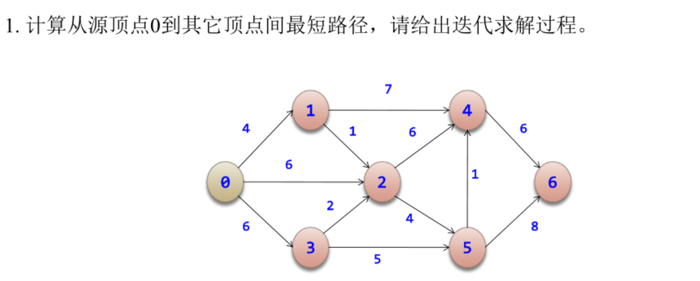
``` text
解：本题采用 Dijkstra 算法求从源点 0 到其余各顶点的最短路径。

1. 问题建模与适用性说明
   本题为单源最短路径问题，图中各边权值均为非负数，满足最优子结构和贪心选择性质，适合采用 Dijkstra 算法求解。

2. 初始化
   设 S 为已确定最短路径的顶点集合，dist[i] 表示从源点 0 到顶点 i 的当前最短距离。
   初始时：
   S = {0}
   dist = [0, 4, 6, 6, ∞, ∞, ∞]

3. 迭代过程与状态更新

第 1 次迭代：
在未加入 S 的顶点中选取 dist 最小的顶点 1，将其加入 S。
对与顶点 1 相邻的边进行松弛：
dist[2] = min(6, 4 + 1) = 5
dist[4] = min(∞, 4 + 7) = 11
更新后：
dist = [0, 4, 5, 6, 11, ∞, ∞]

第 2 次迭代：
选取 dist 最小的未确定顶点 2，加入 S。
松弛相关边：
dist[5] = min(∞, 5 + 4) = 9
更新后：
dist = [0, 4, 5, 6, 11, 9, ∞]

第 3 次迭代：
选取顶点 3，加入 S。
对其相邻边进行松弛后，dist 不发生变化。

第 4 次迭代：
选取顶点 5，加入 S。
松弛操作：
dist[4] = min(11, 9 + 1) = 10
dist[6] = min(∞, 9 + 8) = 17
更新后：
dist = [0, 4, 5, 6, 10, 9, 17]

第 5 次迭代：
选取顶点 4，加入 S。
松弛操作：
dist[6] = min(17, 10 + 6) = 16

第 6 次迭代：
选取顶点 6，加入 S，所有顶点均已确定，算法结束。

4. 最终结果
   从源点 0 到其余各顶点的最短路径长度为：
   0→1 = 4，0→2 = 5，0→3 = 6，0→5 = 9，0→4 = 10，0→6 = 16

```