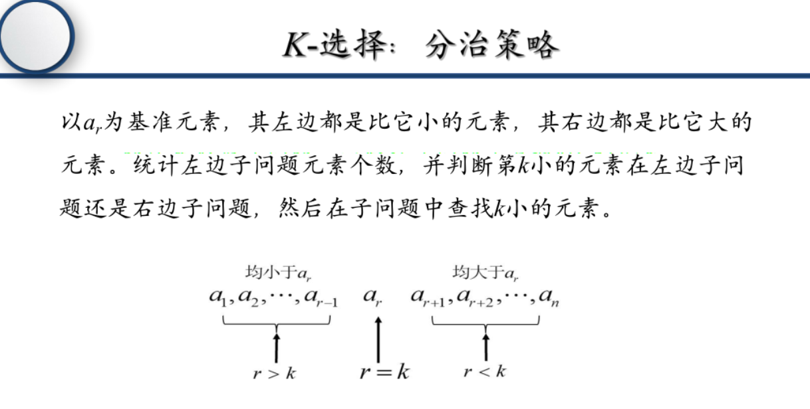
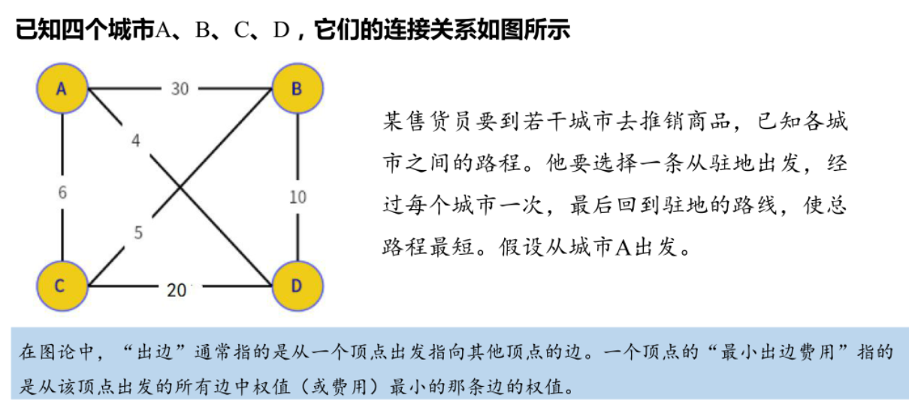
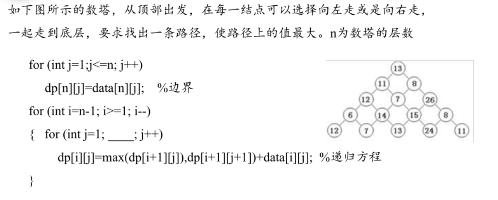
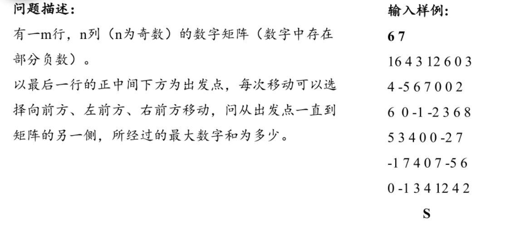
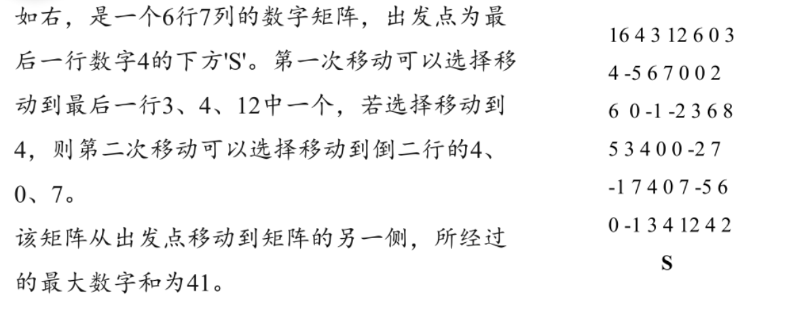

# 课中习题

## 第二章 分治法
### k选择


**核心思路**：
使用分治法求解k选择问题（找到第k小元素），基于快速排序的思想，通过分区操作减少搜索范围。

**分治法模板应用**：

1. **问题建模与适用性说明**：
   - 问题：在无序数组中找到第k小的元素
   - 适用性：分治法适合此类问题，因为可以通过分区操作将问题规模减半，平均时间复杂度为O(n)

2. **算法设计**：
   - **分解**：使用快速排序的分区函数，选择一个基准元素，将数组分为两部分，左边元素都小于等于基准，右边元素都大于等于基准
   - **递归求解**：根据基准元素的位置与k的关系，选择继续在左半部分或右半部分查找
   - **合并结果**：当基准元素的位置等于k时，直接返回该元素

3. **算法步骤**：
   - 选择基准元素，对数组进行分区
   - 计算基准元素在数组中的位置pos
   - 若pos == k-1（假设k从1开始），返回基准元素
   - 若pos > k-1，在左半部分递归查找第k小元素
   - 若pos < k-1，在右半部分递归查找第k-pos-1小元素

4. **时间复杂度分析**：
   - 平均时间复杂度：O(n)
   - 最坏时间复杂度：O(n²)（当每次选择的基准都是最大或最小元素时）
   - 空间复杂度：O(log n)（递归调用栈的深度）

**示例应用**：
- 数组：[3, 1, 4, 1, 5, 9, 2, 6]
- 查找第3小元素：
  - 第一次分区：基准=6，left=[3,1,4,1,5,2]，right=[9]，pos=6
  - 由于6 > 2（k-1=2），在左半部分查找
  - 左半部分继续分区，最终找到第3小元素为3

## 第四章 回溯法
### 子集和问题


**核心思路**：
用回溯法枚举所有可能的子集，同时通过**剪枝**减少无效搜索：
1. 每个元素有“选”或“不选”两种选择；
2. 剪枝条件：
   - 若当前子集和 > 目标W，直接剪枝；
   - 若当前子集和 + 剩余元素的总和 < W，直接剪枝（即使选完剩余元素也达不到W）。

**子集、子序列、子数组的核心区别**：
| 概念 | 定义 | 顺序要求 | 连续性要求 | 示例（原数组`[1,2,3]`） | 严格差异示例 |
|------|------|----------|------------|------------------------|----------------|
| 子集 | 原集合中元素的任意组合 | 无（可重新排列） | 无 | `[]`、`[1]`、`[2]`、`[3]`、`[1,2]`、`[1,3]`、`[2,3]`、`[1,2,3]` | 理论上允许`[3,1,2]`（重新排列） |
| 子序列 | 原序列中元素顺序不变的任意组合 | 有（必须保持原顺序） | 无 | `[]`、`[1]`、`[2]`、`[3]`、`[1,2]`、`[1,3]`、`[2,3]`、`[1,2,3]` | 不允许`[3,1,2]`（顺序错误） |
| 子数组 | 原数组中连续的一段 | 有（保持原顺序） | 有 | `[1]`、`[2]`、`[3]`、`[1,2]`、`[2,3]`、`[1,2,3]` | 不允许`[1,3]`（不连续） |


**算法步骤（以示例`w=[11,13,24,7], W=31`为例）**：
1. **排序**：先将数组排序（方便剪枝，示例排序后为`[7,11,13,24]`）；
2. **递归回溯**：
   - 维护`当前索引`、`当前子集和`、`当前子集`；
   - 对每个元素，尝试“选”或“不选”，并检查剪枝条件；
   - 若当前子集和 == W，记录该子集。

**代码实现**
```python
def subset_sum(w, W):
    w.sort()  # 排序，方便后续剪枝
    n = len(w)
    result = []  # 存储所有满足条件的子集
    total_sum = sum(w)  # 所有元素的总和，用于剪枝

    def backtrack(index, current_sum, current_subset):
        # 找到符合条件的子集
        if current_sum == W:
            result.append(current_subset.copy())
            return
        # 越界或当前和超过W，剪枝
        if index >= n or current_sum > W:
            return
        # 剪枝：当前和 + 剩余元素总和 < W，选完也达不到，直接返回
        remaining_sum = total_sum - sum(w[:index])
        if current_sum + remaining_sum < W:
            return
        
        # 选择当前元素
        current_subset.append(w[index])
        backtrack(index + 1, current_sum + w[index], current_subset)
        # 不选择当前元素（回溯）
        current_subset.pop()
        backtrack(index + 1, current_sum, current_subset)

    backtrack(0, 0, [])
    return result
```


## 第五章 分支限定
### 最小出边限界法


- 城市编号：`A(0), B(1), C(2), D(3)`
- 邻接矩阵（路径长度，`∞`表示无直接边）：
  ```
  graph = [
      [∞, 30, 6, 4],    # A(0)的出边：A→B(30)、A→C(6)、A→D(4)
      [30, ∞, 5, 10],   # B(1)的出边：B→A(30)、B→C(5)、B→D(10)
      [6, 5, ∞, 20],    # C(2)的出边：C→A(6)、C→B(5)、C→D(20)
      [4, 10, 20, ∞]    # D(3)的出边：D→A(4)、D→B(10)、D→C(20)
  ]
  ```
- 目标：找路径`0 → v1 → v2 → v3 → 0`（每个城市仅访问一次），总长度最小。

**分支限定法核心逻辑**：
1. **分支**：以“当前路径”为节点，枚举下一个未访问的城市，生成子节点（分支）。
2. **限定（下界计算）**：对每个节点，计算“当前路径长度 + 剩余城市的最小出边费用 + 回到起点的最小边费用”，若下界≥已有最优解，则剪枝（无需继续探索该分支）。
3. **优先队列**：用优先队列（最小堆）存储待探索的节点，优先选择**下界最小**的节点（贪心策略，加速找到最优解）。

**预处理**：各城市的最小出边费用（用于计算下界）：
- A的最小出边：`min(30,6,4) = 4`
- B的最小出边：`min(30,5,10) = 5`
- C的最小出边：`min(6,5,20) = 5`
- D的最小出边：`min(4,10,20) = 4`

**分支限定法核心代码**：
```python
import heapq

INF = float('inf')
graph = [
    [INF, 30, 6, 4],    # A(0)
    [30, INF, 5, 10],   # B(1)
    [6, 5, INF, 20],    # C(2)
    [4, 10, 20, INF]    # D(3)
]
n = 4
min_out_edge = [4, 5, 5, 4]
best_cost = INF
best_path = []

# 初始化优先队列
heap = []
heapq.heappush(heap, (sum(min_out_edge), 0, 0, frozenset([0]), [0]))

while heap:
    current_lower, current_cost, current_city, visited, path = heapq.heappop(heap)
    
    # 剪枝
    if current_lower >= best_cost:
        continue
    
    # 终止条件：访问所有城市，返回起点
    if len(visited) == n:
        total = current_cost + graph[current_city][0]
        if total < best_cost:
            best_cost = total
            best_path = path + [0]
        continue
    
    # 分支：枚举下一个城市
    for next_city in range(n):
        if next_city not in visited and graph[current_city][next_city] != INF:
            new_visited = frozenset(visited | {next_city})
            new_cost = current_cost + graph[current_city][next_city]
            
            # 计算新下界
            remaining_min = sum(min_out_edge[i] for i in range(n) if i not in new_visited)
            back_to_start = min(graph[next_city][0] for i in range(n) if graph[next_city][i] != INF)
            new_lower = new_cost + remaining_min + back_to_start
            
            if new_lower < best_cost:
                heapq.heappush(heap, (new_lower, new_cost, next_city, new_visited, path + [next_city]))
```

## 第六章 动态规划
### 数塔问题


1. 填空答案：`j <= i`
2. 原因：数塔第$i$层有$i$个节点，$j$的取值范围是1到$i$，故循环条件为`j <= i`。
3. 最大路径计算（$n=5$）：
   - 数塔数据：`[[13], [11, 8], [12, 7, 26], [6, 14, 15, 8], [12, 7, 13, 24, 11]]`
   - 从底层向上递推dp数组：
     - 第5层：`[12, 7, 13, 24, 11]`
     - 第4层：`[18, 27, 39, 32]`（每个元素为下一层相邻两数最大值加当前层值）
     - 第3层：`[39, 46, 65]`
     - 第2层：`[57, 73]`
     - 第1层：`[86]`
   - 最终最大路径值：$\boxed{86}$，路径：`13 → 8 → 26 → 15 → 24`

### 小超人追赶上司领导
小超人每步可以走1米、2米或3米，它与上司的距离为n米。请设计动态规划方案，计算小超人走n米的所有走法数量。

1. **状态定义**：设`dp[i]`表示**小超人走i米的走法总数**。

2. **状态转移方程**：要到达i米处，最后一步的选择为“走1米”“走2米”“走3米”，因此：
   $$dp[i] = dp[i-1] + dp[i-2] + dp[i-3]$$

3. **边界处理**：
   - 当`i-1 < 0`时，`dp[i-1]=0`
   - 当`i-2 < 0`时，`dp[i-2]=0`
   - 当`i-3 < 0`时，`dp[i-3]=0`

4. **初始条件**：
   - `dp[0] = 1`：走0米的走法是“原地不动”，共1种
   - `dp[1] = 1`：走1米的走法是“走1米”，共1种
   - `dp[2] = 2`：走2米的走法是“1+1”“2”，共2种

5. **循环处理**：
   - 从第3个台阶开始循环，直到第n个台阶
   - 对于每个i（3 ≤ i ≤ n），使用状态转移方程计算`dp[i] = dp[i-1] + dp[i-2] + dp[i-3]`
   - 循环过程中自动处理边界情况（通过初始条件和状态转移方程的设计）

6. **递推示例（以n=5为例）**：
   - `dp[3] = dp[2] + dp[1] + dp[0] = 2 + 1 + 1 = 4`
   - `dp[4] = dp[3] + dp[2] + dp[1] = 4 + 2 + 1 = 7`
   - `dp[5] = dp[4] + dp[3] + dp[2] = 7 + 4 + 2 = 13`

7. **复杂度**：
   - 时间复杂度：$O(n)$（遍历1到n即可完成递推）
   - 空间复杂度：$O(n)$（用数组存储`dp`）；可优化为$O(1)$（仅维护前3个状态的变量）

### 矩形数塔-1

1. **问题解析**：
   - 矩阵规模：$m=6$行，$n=7$列（$n$为奇数）
   - 出发点：最后一行（第6行）的正中间列（第4列）下方
   - 移动规则：每次可向前（上一行同列）、左前方（上一行左列）、右前方（上一行右列）移动
   - 目标：求路径上的最大数字和

2. **状态定义**：设`dp[i][j]`表示**到达第$i$行第$j$列时的最大数字和**

3. **状态转移方程**：
   $$dp[i][j] = \max(dp[i+1][j-1], dp[i+1][j], dp[i+1][j+1]) + data[i][j]$$

4. **边界处理**：
   - 当$j-1<1$时，排除$i+1,j-1$位置
   - 当$j+1>n$时，排除$i+1,j+1$位置

5. **初始条件**：最后一行（第6行）的`dp`值等于其本身的数字，即`dp[6][j] = data[6][j]`

6. **矩阵数据**（从第1行到第6行）：
   - 第1行：`[16, 4, 3, 12, 6, 0, 3]`
   - 第2行：`[4, -5, 6, 7, 0, 0, 2]`
   - 第3行：`[6, 0, -1, -2, 3, 6, 8]`
   - 第4行：`[5, 3, 4, 0, 0, -2, 7]`
   - 第5行：`[-1, 7, 4, 0, 7, -5, 6]`
   - 第6行：`[0, -1, 3, 4, 12, 4, 2]`

7. **循环处理**：
   - 从第5行开始向上循环，直到第1行
   - 对于每行的每个元素j（1 ≤ j ≤ n），使用状态转移方程计算dp[i][j]
   - 循环过程中自动处理边界情况

8. **递推计算**（从第5行到第1行）：
   - **第5行**：`[2, 11, 16, 12, 19, -1, 10]`
   - **第4行**：`[16, 19, 20, 19, 19, 17, 17]`
   - **第3行**：`[25, 20, 19, 18, 22, 25, 25]`
   - **第2行**：`[29, 20, 26, 29, 25, 25, 27]`
   - **第1行**：`[45, 33, 32, 41, 35, 27, 30]`

9. **最终结果**：第1行的最大`dp`值为$\boxed{45}$，即最大数字和为45

10. **复杂度分析**：
    - 时间复杂度：$O(m \times n)$（需遍历m行n列的矩阵）
    - 空间复杂度：$O(m \times n)$（用二维数组存储dp）；可优化为$O(n)$（用一维数组滚动更新）


### 矩形数塔-2


1. **问题核心**：
   该问题是**带起点约束的矩阵路径最大和问题**：
   - 矩阵为6行7列，出发点“S”对应最后一行（第6行）第4列数字“4”的下方
   - 移动规则：每次可向“当前位置的上方左列、上方同列、上方右列”移动，最终到达矩阵第一行
   - 目标：求路径上的数字最大和

2. **状态定义**：
   设`dp[i][j]`表示**从出发点到达第$i$行第$j$列时的最大数字和**

3. **状态转移方程**：
   $$dp[i][j] = max(dp[i+1][j-1], dp[i+1][j], dp[i+1][j+1]) + data[i][j]$$

4. **边界处理**：
   - 当`j-1 < 1`时，`dp[i+1][j-1]`不参与计算
   - 当`j+1 > n`时，`dp[i+1][j+1]`不参与计算
   - 出发点在第6行第4列下方，因此第6行第4列的初始值为其本身数值

5. **初始条件**：
   - 最后一行（第6行）中，只有第4列有初始值，其他列初始值为负无穷（表示不可达）
   - `dp[6][4] = data[6][4] = 4`
   - 其他`dp[6][j] = -∞`（$j ≠ 4$）

6. **循环处理**：
   - 从第5行开始向上循环，直到第1行
   - 对于每行的每个元素j（1 ≤ j ≤ n），使用状态转移方程计算dp[i][j]
   - 循环过程中自动处理边界情况和不可达状态

7. **递推计算**：
   - 从第5行开始向上递推，直到第1行
   - 最终取第1行中的最大值作为结果

8. **结论**：
   通过动态规划计算，该矩阵从出发点到第一行的最大数字和为$\boxed{41}$

9. **复杂度分析**：
   - 时间复杂度：$O(m \times n)$（需遍历m行n列的矩阵）
   - 空间复杂度：$O(m \times n)$（用二维数组存储dp）；可优化为$O(n)$（用一维数组滚动更新）

### 机器人爬台阶
机器人爬台阶，一次可以爬1个台阶、2个台阶、3个台阶，请计算机器人爬n个台阶有多少种爬法？

1. **状态定义**：设`dp[i]`表示机器人爬`i`个台阶的爬法总数

2. **状态转移方程**：
   $$dp[i] = dp[i-1] + dp[i-2] + dp[i-3]$$

3. **边界处理**：
   - 当`i-1 < 0`时，`dp[i-1] = 0`
   - 当`i-2 < 0`时，`dp[i-2] = 0`
   - 当`i-3 < 0`时，`dp[i-3] = 0`

4. **初始条件**：
   - `dp[0] = 1`（爬0个台阶只有“不爬”这1种方式，作为递推基础）
   - `dp[1] = 1`（爬1个台阶：仅“爬1个”这1种方式）
   - `dp[2] = 2`（爬2个台阶：“1+1”“2”共2种方式）

5. **循环处理**：
   - 从第3个台阶开始循环，直到第n个台阶
   - 对于每个i（3 ≤ i ≤ n），使用状态转移方程计算`dp[i] = dp[i-1] + dp[i-2] + dp[i-3]`
   - 循环过程中自动处理边界情况

6. **示例计算（以n=5为例）**：
   - `dp[3] = dp[2] + dp[1] + dp[0] = 2 + 1 + 1 = 4`
   - `dp[4] = dp[3] + dp[2] + dp[1] = 4 + 2 + 1 = 7`
   - `dp[5] = dp[4] + dp[3] + dp[2] = 7 + 4 + 2 = 13`

7. **结论**：
   对于任意正整数`n`，爬`n`个台阶的爬法数可通过上述动态规划递推公式计算得到。

8. **复杂度分析**：
   - 时间复杂度：$O(n)$（需遍历1到n进行递推）
   - 空间复杂度：$O(n)$（用数组存储dp）；可优化为$O(1)$（仅维护前3个状态）

### 连续子序列的最大和
给定一个长度为n的整数序列d，找出其连续子序列的最大和。例如d=[6,-1,5,4,-7]，最大子序列和为14。

1. **算法思路（Kadane算法）**：
   - **状态定义**：设`dp[i]`表示以第i个元素结尾的连续子序列的最大和
   - **状态转移方程**：`dp[i] = max(d[i], dp[i-1] + d[i])`（若前序子序列和为正，则拼接当前元素；否则从当前元素重新开始）
   - **全局最大值**：遍历过程中记录`dp[i]`的最大值，即为整个序列的最大子序列和

2. **初始条件**：
  - `dp[0] = d[0]`

3. **状态转移方程**：
   $$dp[i] = \max(d[i], dp[i-1] + d[i])$$

4. **循环处理**：
   - 从第2个元素开始循环，直到第n个元素
   - 对于每个i（1 ≤ i < n），使用状态转移方程计算`dp[i] = max(d[i], dp[i-1] + d[i])`
   - 循环过程中维护一个全局最大值变量，记录当前的最大子序列和

5. **示例计算（以d=[6,-1,5,4,-7]为例）**：
   - `dp[0] = 6`，全局最大=6
   - `dp[1] = max(-1, 6-1)=5`，全局最大=6
   - `dp[2] = max(5, 5+5)=10`，全局最大=10
   - `dp[3] = max(4, 10+4)=14`，全局最大=14
   - `dp[4] = max(-7, 14-7)=7`，全局最大保持14

6. **结论**：
   该序列的最大连续子序列和为14

7. **复杂度分析**：
   - 时间复杂度：$O(n)$（需遍历整个序列一次）
   - 空间复杂度：$O(n)$（用数组存储dp）；可优化为$O(1)$（仅维护前一个状态和全局最大值）

### 最长递增子序列（LIS）
给定序列，找出其最长递增子序列（元素为原序列的一部分且保持递增顺序）。例如序列`[10,9,2,5,3,7,101,18]`的一个最长递增子序列是`[2,3,7,101]`。

1. **状态定义**：
   设`dp[i]`表示以原序列第`i`个元素结尾的最长递增子序列的长度

2. **状态转移方程**：
   $$dp[i] = 1 + \max_{0 \leq j < i \text{且} d[j] < d[i]} dp[j]$$
   （若不存在满足`d[j] < d[i]`的`j`，则`dp[i] = 1`）

3. **初始条件**：
   对于每个`i`，`dp[i]`的初始值为1（每个元素自身可构成长度为1的递增子序列）

4. **循环处理**：
   - 从第2个元素开始循环，直到第n个元素
   - 对于每个i（1 ≤ i < n），遍历所有j（0 ≤ j < i）
   - 对于每个j，如果d[j] < d[i]，则更新dp[i] = max(dp[i], dp[j] + 1)
   - 循环结束后，遍历整个dp数组，找出最大值

5. **示例计算（以序列`[10,9,2,5,3,7,101,18]`为例）**：
   - `dp[0] = 1`（元素10）
   - `dp[1] = 1`（元素9，无更小的前序元素）
   - `dp[2] = 1`（元素2，无更小的前序元素）
   - `dp[3] = 1 + dp[2] = 2`（元素5，前序元素2满足条件）
   - `dp[4] = 1 + dp[2] = 2`（元素3，前序元素2满足条件）
   - `dp[5] = 1 + max(dp[2], dp[3], dp[4]) = 1 + 2 = 3`（元素7，前序元素2、5、3满足条件）
   - `dp[6] = 1 + max(dp[2], dp[3], dp[4], dp[5]) = 1 + 3 = 4`（元素101，前序多个元素满足条件）
   - `dp[7] = 1 + max(dp[2], dp[3], dp[4], dp[5]) = 1 + 3 = 4`（元素18，前序多个元素满足条件）

6. **结论**：
   遍历`dp`数组的最大值，即为原序列的最长递增子序列长度（示例中最大值为4，对应子序列如`[2,3,7,101]`）。

7. **复杂度分析**：
   - 时间复杂度：$O(n^2)$（嵌套循环，外层n次，内层平均n/2次）
   - 空间复杂度：$O(n)$（用数组存储dp）
   - 优化方法：使用二分查找可以将时间复杂度优化到$O(n\log n)$

### 最长公共子序列
给定两个序列 $a[1],\cdots,a[m]$ 和 $b[1],\cdots,b[n]$，找出它们的最长公共子序列（子序列元素在原序列中顺序一致且对应元素相等，使子序列长度最大）。

1. **状态定义**：
   设 $dp[i][j]$ 表示序列 $a[1..i]$ 和 $b[1..j]$ 的最长公共子序列长度。

2. **状态转移方程**：
   - 若 $a[i] = b[j]$，则 $dp[i][j] = dp[i-1][j-1] + 1$（当前元素加入公共子序列）；
   - 若 $a[i] \neq b[j]$，则 $dp[i][j] = \max(dp[i-1][j], dp[i][j-1])$（取去掉一个序列末尾元素后的最长长度）。

3. **边界处理**：
   - 当 $i = 0$ 时，$dp[0][j] = 0$（序列 $a$ 为空，无公共子序列）；
   - 当 $j = 0$ 时，$dp[i][0] = 0$（序列 $b$ 为空，无公共子序列）。

4. **循环处理**：
   - 外层循环遍历序列a的每个元素i（1 ≤ i ≤ m）
   - 内层循环遍历序列b的每个元素j（1 ≤ j ≤ n）
   - 对于每个i和j，根据状态转移方程计算$dp[i][j]$：
     - 若 $a[i] = b[j]$，则 $dp[i][j] = dp[i-1][j-1] + 1$
     - 否则 $dp[i][j] = \max(dp[i-1][j], dp[i][j-1])$
   - 循环结束后，$dp[m][n]$即为最长公共子序列的长度

5. **递推示例（以 $a = [1,3,4,5,6,2,7]$、$b = [3,5,6,4,9,2,7]$ 为例）**：
   - $dp[1][1] = 0$（$a[1]=1 \neq b[1]=3$）；
   - $dp[2][1] = 1$（$a[2]=3 = b[1]=3$）；
   - 最终 $dp[7][7] = 5$，对应最长公共子序列为 $[3,4,6,2,7]$。

6. **复杂度分析**：
   - 时间复杂度：$O(m \times n)$（需遍历两个序列的所有元素组合）；
   - 空间复杂度：$O(m \times n)$（用二维数组存储 $dp$）；可优化为 $O(\min(m,n))$（用一维数组滚动更新）。
   - 优化方法：使用滚动数组可以将空间复杂度从$O(m \times n)$优化到$O(\min(m,n))$

### 方阵取宝
在 $n \times m$ 的矩阵中，从左上角出发，每次只能向右或向下移动，最终从右下角走出，求能搜集到的最大宝物价值（以示例中 $3 \times 5$ 矩阵为例）。

1. **状态定义**：
   设 $dp[i][j]$ 表示**到达第i行第j列时，能搜集到的最大宝物价值**。

2. **状态转移方程**：
   - 第一行（仅能从左侧移动）：$$dp[1][j] = dp[1][j-1] + data[1][j]$$
   - 第一列（仅能从上方移动）：$$dp[i][1] = dp[i-1][1] + data[i][1]$$
   - 其他位置（取上方/左侧最大值）：$$dp[i][j] = \max(dp[i-1][j], dp[i][j-1]) + data[i][j]$$

3. **边界处理**：
   - 当 $i=1$ 且 $j=1$（起点）：无前置位置，直接取矩阵本身值 $dp[1][1] = data[1][1]$；
   - 当 $i=1$ 且 $j>1$：仅能从左方来，无需考虑上方边界
   - 当 $j=1$ 且 $i>1$：仅能从上方来，无需考虑左方边界

4. **初始条件**：
   - $dp[1][1] = 1$；示例矩阵左上角（第1行第1列）的宝物价值为1
   - 所有未初始化的 $dp[i][j]$ 初始值为0（仅作为计算占位）

5. **循环处理**：
   - 先填充第一行：遍历 $j$ 从 $2$ 到 $5$，按第一行转移方程计算 $dp[1][j]$；
   - 再填充第一列：遍历 $i$ 从 $2$ 到 $3$，按第一列转移方程计算 $dp[i][1]$；
   - 最后填充剩余位置：遍历 $i$ 从 $2$ 到 $3$、$j$ 从 $2$ 到 $5$，按通用转移方程计算 $dp[i][j]$；

6. **递推示例（以3×5示例矩阵为例）**：
   示例矩阵（行1到3，列1到5）：
   行1：$[1, 2, 9, 9, 9]$；
   行2：$[5, 3, 3, 4, 3]$；
   行3：$[1, 2, 5, 9, 5]$；
   - 第一行计算：
     $dp[1][2] = 1+2=3$；$dp[1][3] = 3+9=12$；$dp[1][4] = 12+9=21$；$dp[1][5] = 21+9=30$；
   - 第一列计算：
     $dp[2][1] = 1+5=6$；$dp[3][1] = 6+1=7$；
   - 剩余位置计算：
     $dp[2][2] = \max(3,6)+3=9$；$dp[2][3] = \max(12,9)+3=15$；$dp[2][4] = \max(21,15)+4=25$；$dp[2][5] = \max(30,25)+3=33$；
     $dp[3][2] = \max(9,7)+2=11$；$dp[3][3] = \max(15,11)+5=20$；$dp[3][4] = \max(25,20)+9=34$；$dp[3][5] = \max(33,34)+5=39$；

7. **复杂度**：
   - 时间复杂度：$O(n \times m)$（遍历矩阵所有 $n \times m$ 个元素，每个元素仅计算1次）；
   - 空间复杂度：$O(n \times m)$（用二维数组存储 $dp$）；可优化为 $O(\min(n,m))$（用一维数组滚动更新，仅保留当前行/列数据）；

### 摘花生
在 $n \times m$ 网格的花生地中，从左上角出发，仅能向东（右）或向南（下）移动，最终从右下角走出，求最多能摘到的花生数量。

1. **状态定义**：
   设 $dp[i][j]$ 表示**到达第i行第j列时，累计摘到的最大花生数**。

2. **状态转移方程**：
   - 第一行（仅能从左侧移动）：$$dp[1][j] = dp[1][j-1] + peanuts[1][j]$$
   - 第一列（仅能从上方移动）：$$dp[i][1] = dp[i-1][1] + peanuts[i][1]$$
   - 其他位置（取上方/左侧最大值）：$$dp[i][j] = \max(dp[i-1][j], dp[i][j-1]) + peanuts[i][j]$$

3. **边界处理**：
   - 当 $i=1$ 且 $j=1$（起点）：$dp[1][1] = peanuts[1][1]$；
   - 当 $i=1$ 且 $j>1$：仅依赖左侧位置，无需考虑上方边界
   - 当 $j=1$ 且 $i>1$：仅依赖上方位置，无需考虑左侧边界

4. **初始条件**：
   - $dp[1][1] = peanuts[1][1]$；（起点位置的花生数）

5. **循环处理**：
   - 先填充第一行：遍历 $j$ 从 $2$ 到 $m$，按第一行转移方程计算；
   - 再填充第一列：遍历 $i$ 从 $2$ 到 $n$，按第一列转移方程计算；
   - 最后填充剩余位置：遍历 $i$ 从 $2$ 到 $n$、$j$ 从 $2$ 到 $m$，按通用转移方程计算；

6. **复杂度**：
   - 时间复杂度：$O(n \times m)$（遍历所有网格点）；
   - 空间复杂度：$O(n \times m)$（二维数组存储 $dp$）；可优化为 $O(\min(n,m))$（一维数组滚动更新）；

### 地宫取宝
在 $n \times m$ 网格的地宫宝库中，从左上角出发，仅能向右或向下移动，经过格子时可拿取“价值大于手中所有宝贝”的物品（也可选择不拿），求走到右下角时恰好持有k件宝贝的行动方案数。

1. **状态定义**：
   设 $dp[i][j][c][v]$ 表示**到达第i行第j列时，持有c件宝贝且当前最大价值为v的方案数**。

2. **状态转移方程**：
   到达 $(i,j)$ 的方案数来自上方 $(i-1,j)$ 或左侧 $(i,j-1)$，分两种情况：
   - **不拿当前格子的宝贝**：$$dp[i][j][c][v] += dp[\text{up/left}][c][v]$$
   - **拿当前格子的宝贝（需满足当前宝贝价值>v）**：$$dp[i][j][c+1][\text{currentValue}] += dp[\text{up/left}][c][v]$$

3. **边界处理**：
   - 当 $i=1$ 且 $j=1$（起点）：
     - 不拿：$dp[1][1][0][0] = 1$；
     - 拿：$dp[1][1][1][\text{起点价值}] = 1$；

4. **初始条件**：
   - $dp[1][1][0][0] = 1$；（起点不拿宝贝的初始方案）
   - 其他状态初始值为0

5. **循环处理**：
   - 遍历每个格子 $(i,j)$，再遍历当前持有宝贝数 $c$ 和最大价值 $v$，分别计算“不拿”和“拿”的方案数，累加至 $dp[i][j]$ 的对应状态；

6. **结果计算**：
   统计 $dp[n][m][k][v]$ 的总和（v为所有可能的最大价值），即为恰好持有k件宝贝的方案数。

7. **复杂度**：
   - 时间复杂度：$O(n \times m \times k \times V)$（V为宝贝价值的可能取值范围）；
   - 空间复杂度：$O(n \times m \times k \times V)$（可通过滚动数组优化空间）；