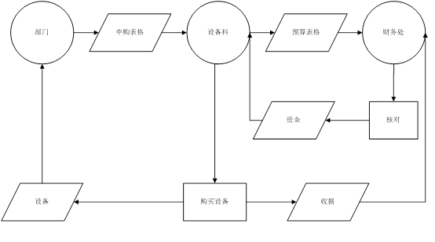
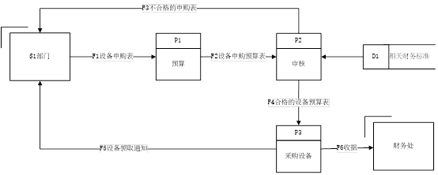
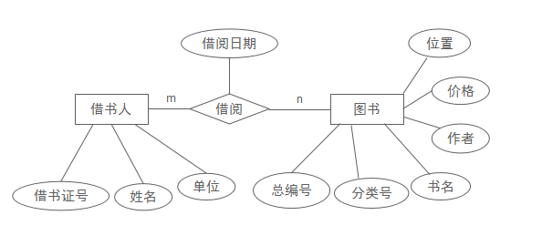

# 软件工程实践 - 图怎么画

> 软件工程实践中常见的六类结构化分析与设计图：业务流程图、数据流图（DFD）、模块化结构图、功能结构图、数据字典、ER 图。  

---

## 一、业务流程图

| 符号 | 含义 | 对应示例 |
|---|---|---|
| 圆形 | 组织 / 角色（部门 / 科室） | 左上「部门」、中间「设备科」、右上「财务处」 |
| 矩形 | 处理 / 活动（动作） | 底部中间「申购设备」、右侧「核对」 |
| 平行四边形 | 表单 / 单据 / 数据载体 | 图中所有斜向方框（申购表格 / 预算表格 / 设备 / 资金 / 收据） |
| 箭头 | 数据流 / 流程方向 | 各节点之间的有向线段（带文字标注表示数据内容） |

### 示例：部门设备申购流程

---

## 二、数据流图（DFD）

| 符号 | 含义 | 对应示例 |
|---|---|---|
| 上下分隔的矩形 | 加工（Process）— 顶部编号 P 开头，下方为处理名称 | `P1 预算` / `P2 审核` / `P3 采购设备` |
| 矩形 | 外部实体（External Entity）— 数据的来源 / 终点 | 左侧 `S1 部门`、右下 `财务处` |
| 右侧开口矩形 | 数据存储（Data Store）— 内部存放数据 | 右上 `D1 设备申请表` |
| 箭头 + 标注 | 数据流（Data Flow）— 标注数据名或编号 | 各加工 / 实体 / 存储之间的箭头（标注如 `#2 设备申购预算`） |

### 示例：部门设备申购数据流

---

## 三、模块化结构图

| 符号 | 含义 | 对应示例 |
|---|---|---|
| 矩形 | 模块（Module） | `成绩管理系统`、`登录模块` |
| 箭头 | 调用关系（自顶向下） | `成绩管理系统 --> 登录模块 : 启动` |
| 标签 | 调用语义（`启动` / `调用`） | `Score --> S1 : 调用` |

### 示例：成绩管理（三层）

@startuml 学生成绩管理结构图
title 学生成绩管理 - 模块化结构图

rectangle "成绩管理系统" as System
rectangle "登录模块"   as Login
rectangle "成绩管理"   as Score

rectangle "校验用户"   as C1
rectangle "录入成绩"   as S1
rectangle "成绩统计"   as S2

' 自顶向下：上层模块调用下层模块（调用方向：自上而下）
System  --> Login : 启动
System  --> Score : 启动
Login   --> C1    : 调用
Score   --> S1    : 调用
Score   --> S2    : 调用

@enduml

---

## 四、功能结构图

功能结构图用于描述系统的**功能分解关系**，是概要设计阶段的核心工具。

| 符号 | 含义 | 对应示例 |
|---|---|---|
| 矩形 | 功能模块 — 系统的功能单元 | `学生成绩管理系统`、`成绩录入` |
| 实线 | 从属关系 — 上级模块包含下级模块 | `学生成绩管理系统 --- 成绩录入` |

> **与模块结构图的差异**：  
> - **功能结构图**：描述「**谁属于谁**」，强调功能的**层级包含**关系，自顶向下逐层分解。  
> - **模块结构图**：描述「**谁调用谁**」，强调模块间的**调用与数据传递**。

### 示例：学生成绩管理功能分解

@startuml 学生成绩管理功能结构图
title 学生成绩管理 - 功能结构图

rectangle "学生成绩管理系统" as System

rectangle "用户管理"   as UM
rectangle "成绩管理"   as SM
rectangle "查询统计"   as QS

rectangle "用户登录"   as U1
rectangle "权限校验"   as U2

rectangle "成绩录入"   as S1
rectangle "成绩修改"   as S2
rectangle "成绩删除"   as S3

rectangle "成绩查询"   as Q1
rectangle "成绩统计"   as Q2

System --- UM
System --- SM
System --- QS

UM --- U1
UM --- U2

SM --- S1
SM --- S2
SM --- S3

QS --- Q1
QS --- Q2

@enduml

---

## 五、数据字典

数据字典描述系统中所有数据的结构与含义，分为以下四类条目：

1. **数据项** — 最基本、不可再分的数据
2. **数据流** — 流动的数据
3. **数据存储** — 存储的数据
4. **处理逻辑** — 数据变换的处理过程

### 示例：部门设备申购

#### 1. 数据项

| 名称 | 类型 | 长度 | 取值范围 | 说明 |
|---|---|---|---|---|
| 部门编号 | 字符型 | 4 | 0001~9999 | 申请部门的唯一编号 |
| 设备名称 | 字符型 | 20 | — | 拟采购的设备名 |
| 设备数量 | 整型 | — | 1~999 | 申购数量 |
| 预算金额 | 实型 | — | 0.00~999999.99 | 申购预算（元） |
| 审核结果 | 字符型 | 2 | {通过, 驳回} | 财务处审核结论 |
| 采购日期 | 日期型 | — | — | 实际采购完成日期 |

#### 2. 数据流

| 名称 | 来源 | 去向 | 组成 |
|---|---|---|---|
| 设备申购通知 | 部门（$1） | 预算（P1） | 部门编号 + 设备名称 + 设备数量 |
| 设备申购预算 | 预算（P1） | 审核（P2） | 部门编号 + 设备名称 + 预算金额 |
| 设备申购表 | 预算（P1） | 设备申请表（D1） | 部门编号 + 设备名称 + 设备数量 + 预算金额 |
| 设备申购结果 | 审核（P2） | 部门（$1） | 审核结果 |
| 设备申购通知 | 审核（P2） | 采购设备（P3） | 部门编号 + 设备名称 + 设备数量 |
| 设备收据 | 财务处 | 部门（$1） | 采购日期 + 设备名称 + 金额 |

#### 3. 数据存储

| 名称 | 别名 | 组成 | 存储方式 |
|---|---|---|---|
| D1 设备申请表 | 申购单 | 部门编号 + 设备名称 + 设备数量 + 预算金额 + 申请日期 | 数据库表 |

#### 4. 处理逻辑

| 名称 | 编号 | 输入 | 输出 | 功能说明 |
|---|---|---|---|---|
| 预算 | P1 | 设备申购通知（$1→P1） | 设备申购预算（→P2）、设备申购表（→D1） | 审核部门申请金额是否在年度预算内 |
| 审核 | P2 | 设备申购预算（←P1）、设备申购表（←D1） | 设备申购结果（→$1）、设备申购通知（→P3） | 财务处审核并决定通过 / 驳回 |
| 采购设备 | P3 | 设备申购通知（←P2） | 设备申购收据（→财务处） | 通知财务处进行实际采购 |

---

## 六、ER 图（Entity-Relationship Diagram）

ER 图用于描述系统的**概念数据模型**，由实体、属性、联系三类要素构成，是数据库概念结构设计阶段的核心工具。

| 符号 | 含义 | 对应示例 |
|---|---|---|
| 矩形 | 实体（Entity）— 现实世界中可相互区分的事物 | `部门`、`设备申请表`、`设备` |
| 椭圆 | 属性（Attribute）— 实体的特征 | `部门编号`、`设备名称`、`设备数量` |
| 菱形 | 联系（Relationship）— 实体之间的关联 | `申请`、`采购` |
| 下划线 | 主键 / 标识属性 | `部门编号`、`申购单号` |
| 连线 | 实体 ↔ 属性、实体 ↔ 联系之间的连接 | 各节点之间的无向线段 |

> **三类联系**（按基数）：  
> - **1 : 1**（一对一）  
> - **1 : N**（一对多）  
> - **M : N**（多对多）

### 示例：部门设备申购 E-R 模型

