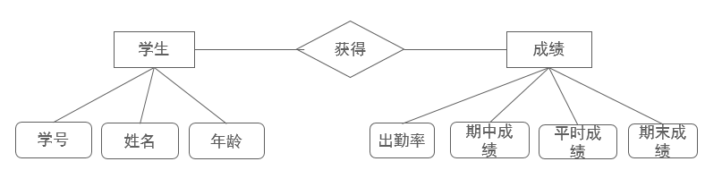
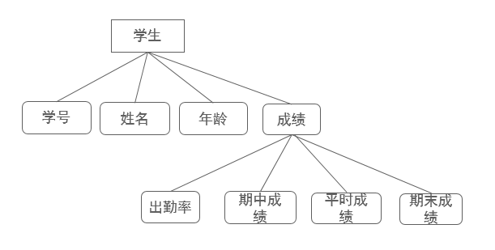
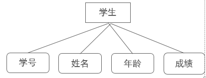
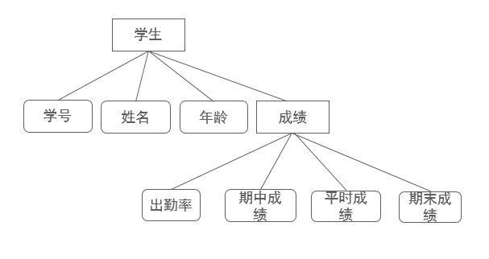
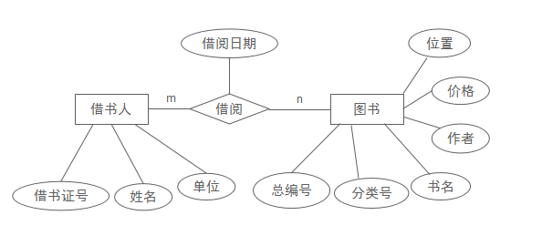

# 第三章 项目管理

## 填空题

1. 风险管理被认为是IT软件项目中（**减少失败**）的一种重要手段。可以减少潜在问题发生的可能性和影响。风险管理意味着危机还没有发生之前就对它进行处理。这就提高了项目成功的机会和减少了不可避免风险所产生的后果。

2. 软件工程基本原理有哪些？
（**用分阶段的生命周期计划严格管理**）
（**坚持进行阶段评审**）
（**实行严格的产品控制**）
（**采用现代程序设计技术**）
（**结构应能清楚的审查**）
（**开发小组的成员应该少而精**）
（**承认不断改进软件工程实践的必要性**）

3. 项目管理的过程包括：（**启动一个软件项目**）、（**制定项目计划**）、（**计划的追踪和控制**）、（**评审和评价计划的完成程度**）、（**编写文档**）。

4. 软件过程可分为三大类：
1、基本过程: 是构成（**软件生存周期**）主要部分的那些过程, 包括获取, 供应, 开发, 操作, 维护等过程。
2、支持过程: 可穿插到（**基本过程**）中提供支持的一系列过程, 包括文档开发, 配置管理, 质量保证, 验证, 确认, 联合评审, 审计, 问题解决等过程。
3、辅助过程: 一个组织用来建立, 实施一种基础结构, 并不断改进该基础结构的过程, 包括（**管理**）, 基础, 改进, 培训等过程。

5. 软件项目管理是为了使软件项目能够按照预定的（**成本**）、（**进度**）、（**质量**）顺利完成，而对经费、人员、进度、性能、风险等进行分析和管理的活动。

6. 估算软件规模主要有哪两种技术？
（**代码行技术**）
（**功能点技术**）

7. 软件生存期模型是跨越整个（**生存期**）的系统开发、运作和维护所实施的全部过程、活动和任务的（**结构框架**）。

## 判断题

1. 软件项目管理的对象是软件工程项目。它所涉及的范围覆盖了整个软件工程过程。这种管理在技术工作开始之前就应开始，在软件从概念到实现的过程中继续进行，当软件工程过程最后结束时才终止。(✓)

2. 为使软件项目开发获得成功，关键问题是必须对软件项目的工作范围、可能风险、需要资源(人、硬件／软件)、要实现的任务、经历的里程碑、花费工作量(成本)、进度安排等做到心中有数。(✓)

3. 软件项目风险管理实际上就是贯穿在软件项目开发过程中的一系列管理步骤。(✓)

4. 风险与其它工作相比较不那么重要，因为不能将风险管理看作是项目工作中的主要活动，不能将风险管理看作是本身职责，应该由其他人负责完成。(✗)
【解析：风险管理是项目工作的主要活动之一，是项目经理的本身职责，必须由项目团队负责完成。】

# 第四章 需求工程

## 单选题

1. 下列选项中哪个不是"软件需求分析的原则"？(D)
A、规格说明必须局部化和松散耦合。
B、如果被开发软件只是一个大系统中的一个元素，那么整个大系统也包括在规格说明的描述之中。
C、要能以层次化的方式对问题进行分解和不断细化。
D、只要给出系统的逻辑视图，不需要物理视图。

2. 下列选项中哪个不是"需求分析评审"中的项目"？(C)
A、系统定义的目标是否与用户的要求一致。
B、主要功能是否已包括在规定的软件范围之内，是否都已充分说明。
C、是否建立了快速原型模型。
D、开发的技术风险是什么，是否考虑过软件需求的其它方案。
【解析：需求分析评审关注的是需求规格说明的质量、目标一致性、功能覆盖度、风险评估等，建立快速原型属于需求获取方法，不属于评审项目。】

3. 下列选项中哪个不是"需求分析评审"中的项目"？(A)
A、是否考虑过将来对系统进行测试时将采用的方法。
B、文档中的所有描述是否完整、清晰、准确反映用户要求。
C、设计的约束条件或限制条件是否符合实际。
D、是否详细制定了检验标准，它们能否对系统定义是否成功进行确认。
【解析：将来对系统进行测试所采用的方法属于测试阶段考虑的问题，需求分析评审不涉及具体的测试方法，而关注需求的完整性和可验证性。】。

## 填空题

1. 需求获取的常用方法有：（**客户访谈**）、（**联合分析小组**）、（**问题分析与确认**）。

2. 需求分析的过程中，前面四个步骤是：
1、(**问题识别**)。
2、(**分析与综合**)。
3、(**编制需求分析阶段的文档**)。
4、(**快速建立软件原型**)。

3. 需求分析的任务一般可以归纳成下面4个方面：
1、(**确定目标系统的具体要求**)。
2、(**建立目标系统的逻辑模型**)。
3、修正计划：重估成本、进度等
4、(**开发原型系统**)。

4. 快速原型的目的是尽快向（**用户**）提供一个可在计算机上运行的目标系统的模型，以便使用户和开发者在目标系统应该"做什么"这个问题上尽可能快地（**达成共识**）。

5. 需求分析是软件定义时期的最后一个阶段,仍然回答"What"，而不是"How"，但更（**细致**）、（**精确**）。

6. 需求分析的基本任务是软件人员和（**用户**）一起完全弄清用户对系统的（**确切要求**）。

7. 需求分析方法由对软件问题的（**数据域**）和（**功能域**）的系统分析过程及其表示方法组成。

8. 需求分析过程应该建立3种模型，它们分别是（**数据模型**）、（**功能模型**）和（**行为模型**）。

9. 数据域具有三种属性: （**数据流**）、（**数据内容**）和（**数据结构**）。

10. 结构化分析方法使用工具：（**数据流图**）、（**数据字典**）、结构化英语、判定表与判定树。

## 判断题

1. 规格说明必须容许不完备性并允许扩充。(✓)

2. 需求分析需要能够表达和理解问题的数据域和功能域。(✓)

3. 需求分析过程中的"分析与综合"就是要从数据流和数据结构出发，逐步细化所有的软件功能。(✓)

4. 在需求分析中要求使用统一建模规格说明语言（UML建模说明语言）。(✗)
【解析：需求分析没有强制要求使用UML，UML是面向对象分析与设计阶段的常用工具，而非需求分析阶段必须使用。】

5. 需求分析的任务就是借助于当前系统的逻辑模型导出目标系统的逻辑模型，解决目标系统的 "怎样做" 的问题。(✗)
【解析：需求分析回答的是"做什么"（What）而不是"怎样做"（How），后者属于设计阶段的任务。】

6. 需求分析是发现需求、逐步求精、建模、规格说明和复审的过程。(✓)

7. 为了消除用自然语言书写的软件需求规格说明书中可能存在的不一致、歧义、含糊、不完整及抽象层次混乱等问题，也可采用用形式化方法描述用户对软件系统的需求。(✓)

8. 具体来说，结构化分析方法就是用抽象模型的概念，按照软件内部数据传递、变换的关系，自顶向下逐层分解，直到找到满足功能要求的所有可实现的软件为止。(✓)

9. 数据词典与数据流图配合，能清楚地表达数据处理的要求。(✓)

10. 用户往往对系统都有一个准确的想法，可以比较准确地表达对系统的全面要求。(✗)
【解析：用户通常难以准确、完整地表达对系统的全面要求，往往需要通过需求获取方法（如访谈、原型等）逐步挖掘和确认。】

11. 需求验证并不是严格意义上的一个阶段，而是贯穿整个需求演化、分解、实现的一系列质量保障活动，包括评审、测试，最重要的是保障需求同源。(✓)

12. 大多数的需求分析方法是由结构驱动的。(✗)
【解析：大多数需求分析方法是由数据驱动的，而非结构驱动。】

13. 为了更好地理解复杂事物，人们常常采用建立事物模型的方法。(✓)

14. 结构化分析方法只适合于数据处理类型软件的需求分析。(✗)
【解析：结构化分析方法不仅适用于数据处理类软件，也可用于其他类型软件的需求分析。】

# 第五章 软件设计

## 单选题

1. 从工程管理的角度，可以将软件设计分为（**D**）和详细设计阶段。
A、数据库设计阶段
B、体系结构设计阶段
C、接口设计阶段
D、概要设计阶段

2. 最高程度的耦合是（**C**）耦合。
A、公共
B、特征
C、内容
D、数据

3. （**A**）内聚是最高程度的内聚。
A、功能
B、顺序
C、通讯
D、机械

4. 信息系统开发的结构化方法的一个主要原则是（**C**）
A、重点突破原则
B、分步实施原则
C、自顶向下原则
D、自底向上原则

5. 绘制功能结构图的依据是（**D**）。
A、系统总体设计
B、PAD图
C、N---S图
D、数据流程图

6. 数据库的逻辑结构设计是将（**D**）。
A、逻辑模型转换成数据模型
B、数据模型转换成物理模型
C、逻辑模型转换为物理模型
D、概念数据模型转换为数据模型

7. 功能结模块聚合中，一个模块只执行一个功能的是（**A**）。
A、功能聚合
B、时间聚合
C、数据聚合
D、逻辑聚合

8. （**A**）能够充分地说明低层模块内部的处理细节和各模块之间数据传递的关系。
A、IPO图
B、HIPO图
C、数据流程图
D、数据字典
【解析：IPO图（Input-Process-Output）描述模块的输入、处理、输出，能充分说明低层模块内部的处理细节和数据传递关系；HIPO图是层次化的IPO图，主要表达模块间层次关系；数据流程图描述数据流；数据字典描述数据内容。】

9. 数据流程图处理功能中，最难于用文字和符号表达清楚的是（**B**）。
A、数据存取功能
B、逻辑判断功能
C、输入输出功能
D、运算功能

10. 类之间的关系不包括（**D**）
A、实现关系
B、依赖关系
C、泛化关系
D、包含关系
【解析：UML类图中的关系包括关联、依赖、泛化、实现四种。包含关系是用例图中的关系（用例之间），不是类之间的关系。】

11. 执行者（Actor）与用例之间的关系是（**C**）
A、泛化关系
B、扩展关系
C、关联关系
D、包含关系

12. （**D**）是从用户使用系统的角度描述系统功能的图形表达方法。
A、顺序图
B、对象图
C、类图
D、用例图

13. 以下不属于子系统E-R图之间冲突的是（**B**）。
A、结构冲突
B、关系冲突
C、属性冲突
D、命名冲突
【解析：E-R图合并时的冲突包括属性冲突、命名冲突、结构冲突三类，并不包含"关系冲突"这一类别，所以选B。】

14. 以下选项中，最正确的一项是（**A**）
A、以上选项都正确。
B、为了简化E-R图的处置，现实世界中的事物能作为属性对待的，尽量作为属性对待。
C、"属性"不能与其他实体具有联系。
D、"属性"必须是不可分的数据项，不包含其他属性。

15. 关于结构冲突，最正确的一项为：（**D**）
A、若同一实体在不同子系统的E-R图中所包含属性的个数和属性排列次序不完全相同，应使该实体的属性取各子系统的E-R图中属性的并集，再适当调整属性的次序。
B、若同一对象在不同应用中具有不同的抽象，应把属性变换为实体或把实体变换为属性，使同一对象具有相同的抽象。
C、若实体间的联系在不同的E-R图中为不同的类型，应根据应用的语义对实体联系的类型进行综合或调整。
D、以上选项都对。

16. 关于冗余，说法错误的是（**C**）
A、冗余的联系是指可由其他联系导出的联系。
B、除了使用分析方法外，还可以使用规范化理论来消除冗余。
C、应消除所有冗余数据与冗余联系。
D、所谓冗余的数据是指可由基本数据导出的数据。

17. 以下选项中，错误的是（**D**）
A、命名冲突包括同名异义和异名同义。
B、属性冲突包括属性域冲突和属性取值单位冲突。
C、属性域冲突即属性值的类型、取值范围或取值集合不同。
D、命名冲突只会发生在属性一级上。

18. 学生是一个实体，学号、姓名、年龄、成绩是学生的属性，成绩由出勤率、期中成绩、平时成绩、期末成绩按一定权重计算得来，以下表示最恰当的是（**A**）
A、

B、

C、

D、

19. 从E-R模型向关系模型转换时，一个M:N联系转换为关系模型时，该关系模式的关键字是（**B**）
A、N端实体的关键字
B、M端实体的关键字与N端实体的关键字组合
C、重新选取其他属性
D、M端实体的关键字

20. 将E-R图转换为关系模型一般不需要遵循的原则是（**A**）
A、实体的元组就是关系的元组
B、实体的码就是关系的码
C、一个实体型转换为一个关系模式
D、实体的属性就是关系的属性
【解析：E-R图转关系模型的原则：①一个实体型转换为一个关系模式；②实体的属性就是关系的属性；③实体的码（主键，唯一标识实体的属性集）就是关系的码；④实体间的联系也转换为关系模式。但"实体的元组就是关系的元组"并非转换原则，元组与模式是对应而非等同，故选A。】

21. 以下哪项不属于数据库物理设计阶段确定的系统配置（**C**）
A、缓冲区分配参数
B、时间片大小
C、数据的存放位置
D、内存分配参数

22. 下列说法不正确的是（**D**）
A、3个或3个以上实体间的一个多元联系可以转换为一个关系模式
B、一个M:N联系可以转换为一个独立的关系模式
C、一个1:1联系可以与任意一端对应的关系模式合并
D、一个1:N联系只可以转换为一个独立的关系模式
【解析：1:N联系有两种转换方式：①转换为一个独立的关系模式；②与N端对应的关系模式合并（将1端的主键作为外键加入N端）。所以"只可以"的说法是错误的，故选D。】

23. 在数据库物理设计准备工作中，下列哪项工作是正确的（**B**）
A、知道每个事务在各关系上运行的频率和性能要求
B、以上都需要
C、对要进行的事务进行详细分析
D、充分了解所用的RDBMS的内部特征

24. 以下关于索引存取方法的说法正确的是（**D**）
A、如果一个属性经常作为最大值和最小值等聚集函数的参数，则考虑在这个属性上建立索引
B、关系上定义的索引数越多越好
C、如果一个属性经常在查询条件中出现，可以考虑在这个属性上建立索引
D、常用的索引方法是B+树索引方法

25. 下图所示的E-R图转换成关系模型，可以转换为（**B**）

A、4个
B、3个
C、1个
D、2个

26. 视觉校验一般查错率可达到（**A**）
A、75%～85%
B、35%～50%
C、85%～100%
D、5%～30%

27. 会计凭证中的数据必须满足：借方金额合计 = 贷方金额合计，利用这一条件可对输入的会计凭证数据进行输入校验，这种校验法属于（**B**）
A、控制总数校验
B、平衡校验法
C、视觉校验法
D、二次输入校验法
【解析：平衡校验法是利用数据之间的平衡关系（如会计中的借方=贷方）来检测输入错误；控制总数校验是利用总数控制（如记录条数合计）；视觉校验是人工目测；二次输入校验是同一数据由两人输入后比对。题目中"借方=贷方"正是典型的平衡校验。】

## 多选题

1. 软件结构内同一个层次上的模块总数的最大值称为（**A**）
A、宽度
B、扇出
C、扇入
D、深度

2. 流图中，可以用（**ACD**）计算环形复杂度V(G)。
A、V(G)=流图中的区域数
B、V(G)=P+E（其中P是流图中判定结点的数目，E是流图中的边数）
C、V(G)=E-N+2（其中E是流图中的边数，N是结点数）
D、V(G)=P+1（其中P是流图中判定结点的数目）

3. 面向对象方法将软件设计划分为（**ABCD**）等部分。
A、体系结构设计
B、接口设计
C、类设计/数据设计
D、构件级设计

4. 从技术的角度，传统的结构化方法将软件设计划分为（**ABCD**）等部分。
A、过程设计
B、数据设计
C、接口设计
D、体系结构设计

5. 数据流程图的基本符号包括（**BCDE**）。
A、内部项
B、加工处理
C、外部项
D、数据流
E、数据存储

6. 以下图中属于建模系统静态特征的有（**ABCF**）
A、用例图
B、组件图
C、部署图
D、活动图
E、顺序图
F、类图

7. 部署图要素包括（**BCDE**）
A、消息
B、关联
C、组件
D、设备
E、处理器

8. 需求分析常用的调查方法有（**ABCDEF**）
A、设计调查表请用户填写
B、开调查会
C、询问
D、请专人介绍
E、查阅记录
F、跟班作业

9. 数据库设计的方法包括（**ABCDE**）
A、基于E-R模型的设计方法
B、新奥尔良方法
C、面向对象的数据库设计方法
D、3NF的设计方法
E、UML方法

10. 常用的人机对话的方法有（**BCD**）
A、语音方式
B、填表法
C、问答式
D、菜单式

11. 用户界面是指软件系统与用户交互的接口，通常包括（**ABD**）
A、输出
B、输入
C、系统处理数据的算法
D、人-机对话的界面与方式

12. 输出设计的内容有（**ABC**）
A、确定输出格式
B、选择输出设备与介质
C、确定输出内容
D、确定输出的接收用户

13. 以下属于人机对话设计的原则是（**ABCD**）
A、对话要清楚、简单，不能有二义性，用词要符合用户观点和习惯
B、关键操作要用强调和警告
C、错误信息设计要有建议性，能及时反馈错误信息
D、对话要适应不同操作水平的用户，要便于操作和学习掌握，有帮助功能，便于维护和修改

14. 输入设计应遵循的原则有（**ABCD**）
A、输入过程简捷性原则
B、少转换原则
C、最小量原则
D、早检验原则

## 填空题

1. 如果一个程序的代码块仅仅通过顺序、选择和循环这3种基本控制结构进行连接，并且每个代码块只有一个入口和一个出口，则称这个程序是（**结构化**）程序。

2. Miller法则：一个人在任何时候都只能把注意力集中在（**7**） ±2个知识块上。

3. 如果模块中所有元素都使用同一个输入数据或产生同一个输出数据，则称为（**通信**）内聚。

4. 如果两个模块彼此间通过参数交换信息，而且交换的信息仅仅是数据，那么这种耦合称为（**数据**）耦合。

5. 如果一个模块内部的各组成部分的处理动作在逻辑上相似，但功能都彼此不同或无关，则称为（**逻辑**）内聚。

6. 模块独立程度的两个定性标准度量中，用（**耦合**）衡量不同模块彼此间互相依赖的紧密程度。

7. 模块独立程度的两个定性标准度量中，用（**内聚**）衡量一个模块内部各个元素彼此结合的紧密程度。

8. （**流**）图是退化了的程序流程图，它仅仅描绘程序的控制流程，完全不表现对数据的具体操作以及分支或循环的具体条件，一个圆代表一条或多条语句，箭头线表示控制流。

9. （**程序流程图**）又称为程序框图，它是历史最悠久、使用最广泛的描述过程设计的方法。

10. 在系统模块设计时，模块的耦合性可分为内容耦合、公共耦合、（**控制耦合**）、标记耦合、数据耦合。

11. 按照结构化思想，系统开发的生命周期划分为总体规划、系统分析、系统设计、（**系统实施**）和系统运行与维护等5个阶段。

12. UML中具有多种视图，细分起来共有五种：用例视图、（**逻辑视图**）、并发视图、组件视图、部署视图。

13. 顺序图与（**协作图**）包含的信息是一样多的，只是侧重点不同，可以相互转化。

14. 面向对象程序的基本特征是：抽象、封装、（**继承**）和多态。

15. 需求分析调查的重点是（**数据**）和（**处理**）。

16. 数据库设计是（**结构设计**）和（**行为设计**）的结合。

17. 消除冗余主要采用分析方法，即以（**数据字典**）和（**数据依赖**）为依据，根据数据字典中关于数据项之间的（**逻辑**）关系的说明来消除冗余。

18. E-R图的集成一般需要分两步:合并、修改和重构。合并解决各分E-R图之间的（**冲突**），修改和重构消除不必要的（**冗余**）。

19. 关系数据模型的优化通常以（**规范化**）理论为指导。

20. 评价物理数据库的方法完全依赖于所选用的DBMS，主要从定量估算各种方案的（**存储空间**）、（**存取时间**）、（**维护代价**）入手。

21. 数据库管理系统常用的三种存取方法：（**索引**）方法、（**聚簇**）方法、（**哈希/HASH**）方法。

22. "为哪些表，在哪些字段上，建立什么样的索引"这一设计内容应该属于数据库（**物理**）设计阶段。

## 判断题

1. 模块的控制域是这个模块本身以及所有直接或间接从属于它的模块的集合。(✓)

2. 在一个设计得很好的系统中，作用域应小于等于控制域。(✓)

3. Yourdon提出的结构图是进行软件结构设计的有力工具，用方框代表一个模块，方框之间的直线表示模块的调用关系。(✓)

4. 判定树的优点是能清晰地表示复杂的条件组合与应做的动作之间的对应关系；缺点是含义不是一眼就能看出来的，初次接触这种工具的人理解它需要有一个简短的学习过程。(✗)
【解析：该描述是判定表的优缺点，而非判定树。判定树的优点是简单直观、易于理解，缺点是当条件组合较多时图会比较复杂。】

5. 层次图与层次框图是不同的两个图，层次框图用来描绘软件的层次结构，很适于在自顶向下设计软件的过程中使用。(✗)
【解析：层次图与层次框图是同一个图的不同叫法，均用于描绘软件的层次结构。】

6. 模块的作用域定义为受该模块内一个判定影响的所有模块的集合。(✓)

7. 在数据流程图中，数据流必须通过加工。(✓)

8. 模块结构图是直接在业务流程图的基础上推导出来的。(✗)
【解析：模块结构图是直接在数据流程图的基础上推导出来的，而不是业务流程图。】

9. 结构图化方法把系统看成是函数加数据；而面向对象方法认为系统是对象的集合加通信机制。(✓)

10. UML是面向对象分析与设计的一种方法。(✗)
【解析：UML是面向对象分析与设计的统一建模语言（一种表示工具/标准），而不是一种方法。】

11. 数据模型优化属物理设计阶段的步骤。(✗)
【解析：数据模型优化属于逻辑设计阶段。物理设计阶段的步骤包括确定存储结构、存取路径、存储分配等。】

12. 数据库设计的第一步是概念结构设计。(✗)
【解析：数据库设计的第一步是需求分析，而不是概念结构设计。】

## 排序题

1. 调查用户需求的具体步骤是 （**C**）（**A**）（**D**）（**B**）
A、调查各部门的业务活动情况
B、确定新系统的边界
C、调查组织结构情况
D、协助用户明确对新系统的各种要求

# 第七章 软件测试

## 单选题

1. 软件测试在软件生命周期中横跨（  B  ）个阶段。
A、全部
B、2
C、3
D、4

**解析：** 软件测试横跨**编码阶段**和**运行/维护阶段**两个阶段，即通常所说的「开发阶段的测试」和「运行阶段的测试」。不是横跨全部阶段，因此选 B。

2. 下列哪项不是软件缺陷？(B)
A、软件未达到产品说明书虽未指明但应达到的目标。
B、软件需求分析文档不完善。
C、软件出现了产品说明书指明不会出现的错误。
D、软件功能超出产品说明书的范围。

3. 下列哪项不是软件缺陷？(A)
A、软件算法设计效率低。
B、软件功能超出产品说明书的范围。
C、软件测试员认为软件难于理解、不易使用、运行速度缓慢，或最终用户认为不好。
D、软件未达到产品说明书标明的功能。

4. 等价类的划分有两种不同情况：(B)
A、边界值等价类和逻辑等价类
B、合理等价类和不合理等价类
C、白盒法等价类和黑合法等价类
D、单元测试等价类和集成测试等价类

## 填空题

1. 测试的目标是想以（**最少**）的时间和人力（**找出**）软件中（**潜在**）的各种错误和缺陷。

2. 在对程序进行修改后，要进行（**回归测试**）。

3. 导致软件缺陷的最大原因是（**产品说明书**）。

4. 使用人工或自动手段来运行或测定某个系统的过程，其目的在于检验它是否满足规定的（**需求**）或弄清（**预期结果**）与实际结果之间的差距。

5. 软件缺陷的第二大来源是（**设计方案**）。

6. 目前，软件测试仍然是保证软件（**质量**）的关键步骤，它是对规格说明书、设计和编码的最后复审。

7. 设计测试用例时，应包括合理的（**输入条件**）和不合理的（**输入条件**）。

8. 测试用例应当由测试（**输入数据**）和（**与之对应**）的预期输出结果两部分组成。

9. 程序的确认分为（**静态**）和（**动态**）确认两种。

10. 软件测试员的目标是（**发现**）软件缺陷。

11. 在系统测试中发现的往往是（**软件设计**）中的错误，也可能发现（**需求说明**）中的错误。

12. 对由经过测试的子系统测试组装成的系统进行的测试则称为（**系统测试**）。

13. 使用黑盒测试时，完全不考虑（**程序内部结构**），只依据程序的（**规格说明**）来设计测试用例。

14. 在逻辑覆盖中（**有选择**）地执行程序中某些最有代表性的通路是对穷尽测试的唯一可行的替代办法。

15. 条件覆盖就是设计若干个测试用例，运行所测程序，使得程序中每个（**判断条件**）的可能取值至少执行一次。

16. 使用合理等价类构造测试用例，主要检测程序模块是否实现了设计规格规定的（**功能和性能**）。

17. 为了暴露程序中的错误，至少每个语句应该执行（**一次**）。语句覆盖的含义是，选择足够多的测试数据，使被测程序中每个语句至少执行一次。

18. 错误推测法在很大程度上靠直觉和经验进行。它的基本想法是列举出程序中（**可能有的**）错误和（**容易发生**）错误的特殊情况，并且根据它们选择测试方案。

19. 验收测试一般使用（**黑盒测试**）法。

## 判断题

1. 软件测试就是为了验证程序的正确性。(✗)
【解析：软件测试的目的是发现错误，而不仅仅是验证正确性。测试可以证明软件存在缺陷，但不能证明软件没有缺陷。】

2. 不应把软件测试仅仅看作是软件开发的一个独立阶段，而应当把它贯穿于软件开发的始终和各个阶段中。(✓)

3. 通常在编写出每个模块之后就对它做必要的测试（称为单元测试），模块的编写者和测试者是同一个人，编码和单元测试属于软件生命周期的同一个阶段。(✓)

4. 大多数软件缺陷都是源自编程错误。(✗)
【解析：大多数软件缺陷源自产品说明书（需求规格说明书），而不是编程错误。】

5. 软件测试就是为了发现错误而执行程序的过程。(✓)

6. 将所有的软件问题通称为缺陷，不管它是大的、小的、有意的、无意的，因为它们都会制造障碍。(✓)

7. 软件测试是根据软件开发各阶段的规格说明和程序的内部结构而精心设计的一批测试用例（即输入数据及预期的输出结果），并利用这些测试用例去运行程序，以发现程序错误的过程。(✓)

8. 使用人工或自动手段来运行或测定某个系统的过程，其目的在于检验它是否满足规定的需求或弄清预期结果与实际结果之间的差距。(✓)

9. 在单元测试的基础上，我们通常需要对由经过单元测试的模块组装起来形成的一个子系统进行的测试，这样的测试被称为子系统测试。(✓)

10. 渐增式测试是指把下一个要测试的模块同已经测试好的模块结合起来进行测试，测试完以后再把下一个应该测试的模块结合进来测试。这种每次增加一个模块的方法称为渐增式测试。这种方法同时完成单元测试和集成测试。(✓)

11. 使用不合理等价类构造测试用例，主要检测程序模块是否能够拒绝无效数据输入，被测试对象在运行初始条件不具备时的可靠性如何。(✓)

12. 经过集成测试，已经按照设计把所有模块组装成一个完整的软件系统，接口错误也已经基本排除了，接着就应该进一步验证软件的有效性，这就是验收测试的任务。(✓)

13. 子系统测试时重点测试模块间的信息传递。(✗)
【解析：子系统测试时重点测试模块间的接口和交互，而模块间的信息传递属于集成测试的重点。】

14. 判定覆盖就是设计若干测试用例，运行所测程序，使得程序中每个判断的取真分支和取假分支至少经历一次。判定覆盖又称为分支覆盖。(✓)

15. 在成功的测试之后，还必须进一步诊断和改正程序中的错误，这就是调试的任务。(✓)

16. 在软件测试中没有一种方法能设计出全部的测试方案。(✓)

17. 单元测试集中检验软件设计的最小单元——函数或类。(✗)
【解析：单元测试集中检验软件设计的最小单元——模块（子程序），而不是函数或类。】

18. 使用边界值分析方法设计测试用例时，首先应该确定边界情况。通常输入等价类与输出等价类的边界，就是应该着重测试边界情况。(✓)

19. 模块并不是一个独立的程序，因此必须为每个单元测试开发驱动模块和(或)桩(存根)模块。(✓)

20. 经验表明，处理边界情况时程序最容易发生错误，因此不应该采用等价类划分的方法。(✗)
【解析：边界值分析通常与等价类划分结合使用，二者互补而非对立。】

21. 单元测试可以使用白盒测试法，而且对多个模块的测试可以并行地进行。(✓)

22. 等价类划分是把所有可能输入的数据划分成若干等价类，假定每类中的一个典型值在测试中的作用与这类中所有其他值的作用相同。然后可以从每个等价类中只取一组数据作为代表性数据用于测试，以便发现程序中的错误。(✓)

# 第八章 软件维护

## 填空题

1. 一般维护的工作量占生存周期（**70**）%以上，维护成本约为开发成本的（**4**）倍。

2. 维护的种类有四类：（**改正性维护**）、（**适应性维护**）、（**完善性维护**）、（**预防性维护**）。

3. 维护的定义是在软件已经交付使用之后，为了（**改正错误**）或（**满足新的需要**）而修改软件的过程。

4. 完成软件维护后，可进行一次情况（**复审**），它可为提高软件组织的管理效能提供重要意见。

5. 没有完整的文档，维护只能从代码着手，后果难以估计，也不可能进行回归测试。这种维护称为（**非结构化**）维护。

6. 软件维护中出现的大部分问题都是由（**软件需求分析**）和（**设计过程**）的缺陷而引起的，在软件生存周期的最初两个阶段如果不进行严格而科学的管理和规划，必然会造成其生存周期最后的维护阶段产生种种问题。

## 判断题

1. 整个维护活动与新软件开发的设计、编码和测试各步是平行的，不过由于时间上的限制，可能省略或简化某些步骤。(✓)

2. 软件可维护性可定性的定义为：维护人员理解、改正、改动和改进这个软件的难易程度。(✓)

3. 从阅读需求、设计文档开始，从修改设计入手，对所作的修改进行复查，并重复过去的测试，以确保没有引入新的错误。这种以完备的文档为基础的维护称为结构化维护。(✓)

4. 如果有良好的维护记录，就可对维护工作做一些定量的评价。(✓)

5. 代码维护比文档维护更重要。(✗)
【解析：代码和文档维护都重要，不能说哪个更重要。软件维护是针对程序、数据、文档的修改，二者相辅相成。】

6. 在维护活动开始之前就明确维护责任是没有必要的，这样会造成工作量的增加。(✗)
【解析：在维护活动开始之前就明确维护责任是必要的，这样有利于规范维护流程、明确责任分工。】

7. 每次维护活动都应该做好记录，以此来构成维护数据库。(✓)

8. 软件维护中出现的大部分问题都是由软件需求分析和设计过程的缺陷而引起的，在软件生存周期的最初两个阶段如果不进行严格而科学的管理和规划，必然会造成其生存周期最后的维护阶段产生种种问题。(✓)

9. 并非每个软件开发机构都必须建立正式的维护组织，但至少应设立专门负责维护的非正式组织，起码应有一个了解整个软件配置，配合相应维护人员。(✓)