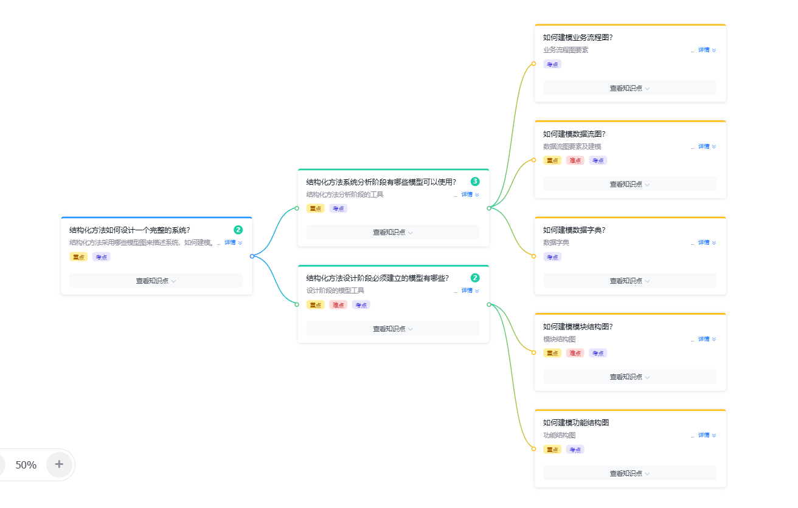

# 结构化方法复习

> 软件工程实践中结构化方法的核心知识点汇总，涵盖建模工具与设计阶段。  
> 参考：[图怎么画](./图怎么画.md)

---

## 一、结构化方法如何设计一个完整的系统

结构化方法采用**自顶向下**的方法来描述系统，常用建模工具包括：

- **业务流程图**：描述业务的处理过程
- **数据流图（DFD）**：描述系统中数据的流动和变换
- **数据字典**：定义系统中所有数据的结构和含义
- **模块结构图**：描述系统的模块划分与调用关系

> **核心思想**：思想不同，描述方式也就不同。

---

## 二、结构化方法系统分析阶段有哪些模型可以使用

系统分析阶段用于描述系统的逻辑模型，主要工具：

| 工具 | 用途 |
|---|---|
| 数据流图（DFD） | 描述数据流向与加工 |
| 数据字典 | 定义数据项 / 数据流 / 数据存储 / 处理逻辑 |
| ER 图 | 描述概念数据模型（实体 - 联系） |
| 业务流程图 | 描述业务处理流程 |

---

## 三、结构化方法设计阶段必须建立的模型有哪些

系统设计阶段将分析模型转换为物理 / 体系结构模型：

| 工具 | 用途 |
|---|---|
| 模块结构图 | 描述系统模块划分与调用关系 |
| 功能结构图 | 描述系统功能分解 |

---

## 四、如何建模业务流程图

**业务流程图要素**：

- **组织 / 角色**（圆形）：如部门、科室
- **处理 / 活动**（矩形）：如申购设备、核对
- **表单 / 单据**（平行四边形）：如申购表格、预算表格
- **箭头**：表示数据流 / 流程方向（带文字标注表示数据内容）

> 详细图示见 [图怎么画 - 业务流程图](./图怎么画.md#一业务流程图)

---

## 五、如何建模数据流图

**DFD 四要素**：

- **加工（Process）**：上下分隔矩形，编号 P 开头
- **外部实体（External Entity）**：矩形
- **数据存储（Data Store）**：右侧开口矩形
- **数据流（Data Flow）**：箭头 + 标注

**建模要点**：

- 顶层图（0 层）描述系统与外部实体的交互
- 逐层分解加工（1 层、2 层……），保持父图与子图平衡
- 每个加工至少有一个输入流和一个输出流

> 详细图示见 [图怎么画 - 数据流图](./图怎么画.md#二数据流图dfd)

---

## 六、如何建模数据字典

数据字典定义系统中所有数据的结构与含义，分四类条目：

| 条目类型 | 说明 |
|---|---|
| 数据项 | 最基本、不可再分的数据 |
| 数据流 | 流动的数据 |
| 数据存储 | 存储的数据 |
| 处理逻辑 | 数据变换的处理过程 |

> 详细示例见 [图怎么画 - 数据字典](./图怎么画.md#四数据字典)

---

## 七、如何建模模块结构图

**模块结构图三要素**：

- **模块**（矩形）：系统功能单元
- **调用关系**（箭头）：模块之间的调用
- **调用语义标签**：如 `启动` / `调用`

**典型结构**：

- **三层结构**：表示层 → 业务逻辑层 → 数据访问层
- **分层调用**：上层调用下层，避免循环调用

> 详细 PlantUML 示例见 [图怎么画 - 模块化结构图](./图怎么画.md#三模块化结构图)

---

## 八、如何建模功能结构图

**功能结构图要素**：

- **功能模块**（矩形）：表示系统的功能单元
- **从属关系**（实线）：上级模块包含下级模块
- **功能分解**：按功能层级逐层细化

**建模要点**：

- 从顶层主功能开始，逐层分解为子功能
- 每个模块只对应单一功能，符合「高内聚」原则
- 模块间通过数据传递进行交互

**与模块结构图的异同**：

| 对比项 | 功能结构图 | 模块结构图 |
|---|---|---|
| 描述对象 | 系统功能分解 | 系统模块划分 |
| 重点 | 功能层级关系（包含） | 模块调用关系（调用） |
| 适用阶段 | 概要设计 | 详细设计 |