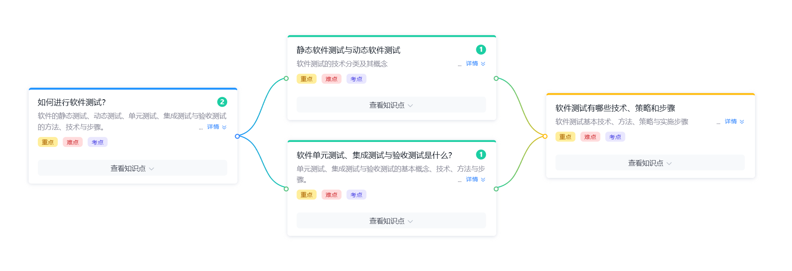

# 软件测试复习

> 软件测试是**保证软件质量**的关键手段。本节围绕「静态 vs 动态」「单元 / 集成 / 验收三大层次」「技术 / 策略 / 步骤」三个维度展开。  
> 参考：[复习题 - 软件测试章节](./复习题.md)



---

## 一、如何进行软件测试（重点 / 难点 / 考点）

> 软件的**静态测试、动态测试、单元测试、集成测试与验收测试**的方法、技术与步骤。

### 1. 软件测试的目的

| 目的 | 说明 |
|---|---|
| 发现缺陷 | 找出软件中**尚未发现的错误** |
| 评估质量 | 验证软件是否满足规定的需求 |
| 预防缺陷 | 通过测试发现的过程问题推动改进 |
| 建立信心 | 为开发者和用户提供质量信心 |

> **重要原则**：测试是为了**发现错误**，证明软件**有错**，而**不是证明软件无错**。

### 2. 软件测试的分类总览

```
软件测试
├─ 按是否执行程序
│  ├─ 静态测试（不运行程序）
│  └─ 动态测试（运行程序）
├─ 按测试层次
│  ├─ 单元测试
│  ├─ 集成测试
│  ├─ 系统测试
│  └─ 验收测试
├─ 按测试方法
│  ├─ 黑盒测试（功能测试）
│  └─ 白盒测试（结构测试）
└─ 按测试目的
   ├─ 功能测试
   ├─ 性能测试
   ├─ 安全测试
   ├─ 易用性测试
   └─ 兼容性测试
```

### 3. 软件测试的基本原则（7 条）

1. 尽早和不断地测试
2. 测试用例应包含期望输出（输入 + 预期输出）
3. 程序员应避免测试自己的程序
4. 测试用例应包含合理的输入和不合理的输入
5. 测试应从「小规模」逐步过渡到「大规模」
6. 测试无法穷尽，应有风险意识
7. 测试不能保证软件 100% 正确，但能提高质量

---

## 二、静态软件测试与动态软件测试（重点 / 难点 / 考点）

### 1. 静态测试 vs 动态测试对比（高频）

| 对比项 | 静态测试（Static） | 动态测试（Dynamic） |
|---|---|---|
| 是否执行程序 | ❌ 不运行程序 | ✅ 运行程序 |
| 关注点 | 代码 / 文档本身 | 程序运行行为 / 输出 |
| 方法 | 走查、审查、代码评审 | 执行测试用例 |
| 能发现的问题 | 语法、规范、逻辑、风格、需求缺陷 | 功能、性能、安全性问题 |
| 成本 | 较低 | 较高 |
| 速度 | 快 | 相对慢 |
| 覆盖率 | 不依赖运行 | 依赖测试用例设计 |

### 2. 静态测试的三大方法

| 方法 | 含义 | 形式 |
|---|---|---|
| 走查（Walkthrough） | 开发人员向评审组讲解代码 | 演示 |
| 审查（Inspection） | 结构化、有流程的正式评审 | 会议 + 角色分工 |
| 代码评审（Code Review） | 同行互相检查代码 | PR / Merge Request |

### 3. 动态测试的两大类

#### （1）黑盒测试（功能测试 / 数据驱动测试）

- 不关心程序内部结构和实现
- 只关心输入 / 输出
- 常用技术：**等价类划分、边界值分析、因果图、错误猜测、场景法**

#### （2）白盒测试（结构测试 / 透明盒测试）

- 关心程序内部结构和逻辑
- 通过分析代码设计测试用例
- 常用技术：**逻辑覆盖、循环覆盖、路径覆盖**

#### （3）黑盒 vs 白盒对比

| 对比项 | 黑盒测试 | 白盒测试 |
|---|---|---|
| 别称 | 功能测试 | 结构测试 |
| 视角 | 用户 / 需求 | 开发者 / 代码 |
| 优点 | 易设计、不需要代码知识 | 能发现代码内部问题 |
| 缺点 | 不能发现代码细节 | 需要代码知识、设计复杂 |
| 适用阶段 | 系统测试 / 验收测试 | 单元测试 |

### 4. 常用测试技术详解

#### （1）白盒测试的逻辑覆盖（由弱到强）

| 级别 | 含义 |
|---|---|
| 语句覆盖 | 每条语句至少执行一次 |
| 判定覆盖（分支覆盖） | 每个判断的真 / 假分支至少执行一次 |
| 条件覆盖 | 每个判断中的每个条件的真 / 假至少出现一次 |
| 判定 / 条件覆盖 | 同时满足判定覆盖和条件覆盖 |
| 条件组合覆盖 | 所有条件的真 / 假组合至少出现一次 |
| 路径覆盖 | 所有可能的路径至少执行一次（**最强**） |

> 记忆：语句 < 判定 < 条件 < 组合 < 路径

#### （2）黑盒测试的常用方法

| 方法 | 含义 |
|---|---|
| 等价类划分 | 把输入域划分为等价类，从每个类中取代表值测试 |
| 边界值分析 | 关注输入 / 输出的边界值（最容易出错） |
| 因果图 | 分析输入条件的组合与对应输出 |
| 错误猜测 | 基于经验猜测可能的错误 |
| 场景法 | 基于业务场景设计测试用例（特别适合业务测试） |

---

## 三、软件单元测试、集成测试与验收测试是什么（重点 / 难点 / 考点）

> 单元测试、集成测试与验收测试是按**测试层次**划分的三大测试类型。

### 1. 三大测试层次对比

| 层次 | 测试对象 | 测试者 | 依据 | 测试方法 |
|---|---|---|---|---|
| 单元测试 | 最小可测试单元（函数、类） | 开发人员 | 详细设计文档 | 主要白盒 |
| 集成测试 | 模块 / 组件之间的**接口** | 开发人员 | 概要设计文档 | 黑盒 + 白盒 |
| 验收测试 | **整个系统** | 用户 / 客户 | 需求规格说明书 SRS | 主要黑盒 |

> 测试层次关系：`单元 → 集成 → 系统 → 验收`

### 2. 单元测试（Unit Testing）

#### 含义与目标

- 对软件中的**最小可测试单元**进行检查和验证
- 通常由**开发人员**自己执行

#### 测试内容

| 测试项 | 内容 |
|---|---|
| 功能 | 函数 / 方法的正确性 |
| 边界 | 边界值、异常值 |
| 逻辑 | 路径覆盖、分支覆盖 |
| 接口 | 函数签名、参数类型与返回值 |
| 错误处理 | 异常路径、错误码 |

#### 常用工具

| 语言 | 工具 |
|---|---|
| Java | JUnit、TestNG、Mockito |
| Python | pytest、unittest、mock |
| JavaScript | Jest、Mocha、Vitest |
| C/C++ | Google Test、CppUnit |

#### 单元测试示例（Java）

```
import org.junit.jupiter.api.Test;
import static org.junit.jupiter.api.Assertions.*;

class CalculatorTest {

    @Test
    void testAdd() {
        Calculator calc = new Calculator();
        assertEquals(5, calc.add(2, 3));
    }

    @Test
    void testDivideByZero() {
        Calculator calc = new Calculator();
        assertThrows(ArithmeticException.class, () -> calc.divide(10, 0));
    }
}
```

### 3. 集成测试（Integration Testing）

#### 含义与目标

- 对**接口和交互**进行测试
- 把单元模块组装成一个**子系统**进行测试
- 又称**装配测试**、**联合测试**

#### 集成测试策略

| 策略 | 含义 | 优缺点 |
|---|---|---|
| 自顶向下（Top-Down） | 从主控模块开始，逐步加入下层模块 | ✅ 早期验证主流程 ❌ 需要桩（stub） |
| 自底向上（Bottom-Up） | 从底层模块开始，逐步向上集成 | ✅ 不需要桩 ❌ 早期无法验证主流程 |
| 三明治（Sandwich） | 上下同时进行 | ✅ 折中 ❌ 管理复杂 |
| 大爆炸（Big-Bang） | 所有模块一起集成 | ❌ 难以定位问题 |

#### 集成测试关注点

| 关注点 | 含义 |
|---|---|
| 接口一致性 | 模块间接口匹配 |
| 数据传递 | 数据在模块间传递是否正确 |
| 全局数据结构 | 全局变量、共享数据 |
| 性能 | 整体性能表现 |

### 4. 验收测试（Acceptance Testing）

#### 含义与目标

- 由**用户 / 客户**参与执行
- 验证软件是否**满足合同 / 需求规格说明书**中规定的要求
- 是**软件交付前**的最后一道关卡

#### 验收测试的两种形式

| 类型 | 含义 |
|---|---|
| Alpha 测试 | 由开发方组织的内部用户在受控环境下测试 |
| Beta 测试 | 由最终用户在**真实使用环境**下测试（公测） |

#### 验收测试内容

| 测试项 | 含义 |
|---|---|
| 功能验收 | 业务流程、用户场景 |
| 合同验收 | 满足合同条款 |
| 法规验收 | 满足法规 / 行业标准 |

---

## 四、软件测试有哪些技术、策略和步骤（重点 / 难点 / 考点）

### 1. 软件测试的三大策略

| 策略 | 含义 | 适用层次 |
|---|---|---|
| 自底向上 | 从单元测试开始，逐步扩大到系统测试 | 单元 → 集成 → 系统 |
| 自顶向下 | 从系统级测试开始，逐步细化为单元测试 | 系统 → 集成 → 单元 |
| 三明治 / 大爆炸 | 折中 / 一次性集成 | 视情况而定 |

### 2. 软件测试的五大步骤（五段法）

```
测试步骤：
 ① 单元测试（Unit Testing）
 ② 集成测试（Integration Testing）
 ③ 确认测试（Validation Testing）
 ④ 系统测试（System Testing）
 ⑤ 验收测试（Acceptance Testing）
```

### 3. 软件测试的过程模型

#### （1）V 模型（重点）

> **V 模型**描述了开发与测试的对应关系。

```
需求分析    ←→    验收测试
  系统设计   ←→    系统测试
概要设计    ←→    集成测试
详细设计    ←→    单元测试
  编码
```

| 开发阶段 | 对应测试 |
|---|---|
| 需求分析 | 验收测试 |
| 系统设计 | 系统测试 |
| 概要设计 | 集成测试 |
| 详细设计 | 单元测试 |

> **测试左移**：尽早介入测试，能在早期发现缺陷，降低修复成本。

#### （2）W 模型

- 在 V 模型基础上，每个开发阶段**同时进行**对应的测试准备
- 加强开发与测试的并行性

### 4. 测试用例设计（核心）

#### 标准测试用例要素

| 要素 | 含义 |
|---|---|
| 测试 ID | 唯一标识 |
| 测试目的 | 验证什么 |
| 前置条件 | 必要的环境与状态 |
| 输入数据 | 具体的输入值 |
| 执行步骤 | 操作步骤 |
| 预期结果 | 期望的输出 / 状态 |
| 实际结果 | 执行后的实际输出 |
| 是否通过 | 通过 / 失败 |
| 备注 | 设计人 / 优先级等 |

### 5. 测试驱动开发（TDD）

```
红 → 绿 → 重构
(写失败的测试) → (写实现让它通过) → (重构代码)
```

### 6. 测试覆盖率（重点）

| 类型 | 含义 | 工具 |
|---|---|---|
| 语句覆盖 | 每行代码至少执行一次 | JaCoCo、Coverage.py、Istanbul |
| 分支覆盖 | 每个分支至少执行一次 | — |
| 路径覆盖 | 所有路径至少执行一次 | — |

> **行业最低要求 80%** 覆盖率。