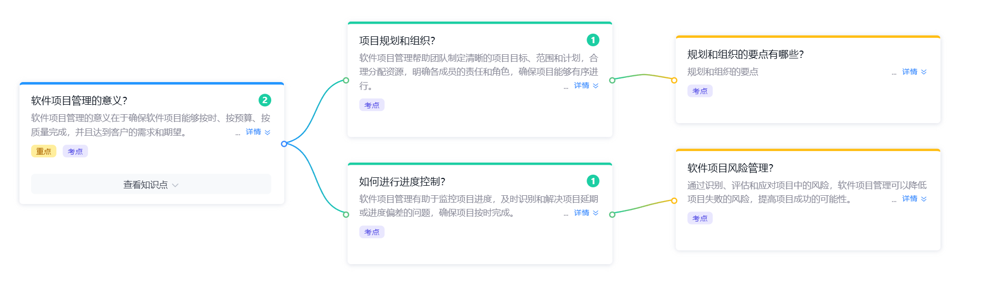

# 软件项目管理复习

> 软件项目管理的核心知识点汇总，围绕「意义 → 规划 → 进度 → 风险」展开。  
> 参考：[复习题 - 第三章 项目管理](./复习题.md)



---

## 一、软件项目管理的意义

**核心定义**：软件项目管理的意义在于**确保软件项目能够按时、按预算、按质量完成**，并且达到客户的需求和期望。

### 四大目标（重点）

| 目标 | 含义 |
|---|---|
| 按时 | 在约定的工期内交付 |
| 按预算 | 在成本范围内完成 |
| 按质量 | 满足约定的质量标准 |
| 达到客户需求和期望 | 满足用户的功能与非功能需求 |

### 项目管理的过程（五步）

1. 启动一个软件项目
2. 制定项目计划
3. 计划的追踪和控制
4. 评审和评价计划的完成程度
5. 编写文档

---

## 二、项目规划和组织

> 软件项目管理帮助团队制定清晰的**项目目标、范围和计划**，合理分配资源，明确各成员的责任和角色，确保项目能够有序进行。

### 规划和组织的要点

**（1）目标管理**——SMART 原则

- **S**pecific（具体）
- **M**easurable（可衡量）
- **A**chievable（可达成）
- **R**elevant（相关）
- **T**ime-bound（有时限）

**（2）范围管理**——明确项目边界，做 / 不做什么；输出 WBS（工作分解结构）

**（3）资源分配**

| 资源类型 | 内容 |
|---|---|
| 人力资源 | 团队成员 + 角色分工 |
| 硬件资源 | 服务器 / 开发机 / 设备 |
| 软件资源 | 工具 / 平台 / 库 |
| 时间资源 | 进度计划 / 里程碑 |

**（4）角色与责任（典型 RACI）**

| 角色 | 职责 |
|---|---|
| 项目经理（PM） | 整体计划、协调、风险管控 |
| 系统架构师 | 技术方案、架构决策 |
| 开发人员 | 代码实现、单元测试 |
| 测试人员 | 测试用例、缺陷管理 |
| 配置管理员（CMO） | 版本控制、变更管理 |
| 质量保证（QA） | 过程审计、质量评价 |

---

## 三、如何进行进度控制

> 软件项目管理有助于监控项目进度，及时识别和解决项目**延期**或**进度偏差**的问题，确保项目按时完成。

### 进度控制流程

```
制定计划 → 跟踪进度 → 偏差分析 → 纠偏措施 → 重新计划 → ...
  (循环)
```

### 常用进度控制工具

| 工具 | 用途 | 输出 |
|---|---|---|
| 甘特图（Gantt Chart） | 可视化进度计划 | 任务条 + 时间轴 |
| 里程碑（Milestone） | 关键节点检查点 | 关键交付物 |
| 关键路径法（CPM） | 找出最长路径 | 关键任务链 |
| 挣值分析（EVM） | 综合进度 / 成本分析 | PV / EV / AC / SPI / CPI |
| 燃尽图（Burndown） | 剩余工作量趋势 | 理想线 vs 实际线 |
| 每日站会（Daily Stand-up） | 快速同步 | 昨日 / 今日 / 阻碍 |

### 挣值分析（EVM）公式速查（考点）

| 指标 | 公式 | 含义 |
|---|---|---|
| PV（计划值） | 计划工作量 × 计划单价 | 计划完成的价值 |
| EV（挣值） | 实际完成工作量 × 计划单价 | 实际完成的价值 |
| AC（实际成本） | 实际花费 | 实际投入 |
| SV（进度偏差） | EV − PV | > 0 提前，< 0 落后 |
| CV（成本偏差） | EV − AC | > 0 节约，< 0 超支 |
| SPI（进度绩效） | EV / PV | > 1 提前，< 1 落后 |
| CPI（成本绩效） | EV / AC | > 1 节约，< 1 超支 |

### 进度偏差的纠偏措施

- 增加资源（人手、设备）
- 并行开发（关键路径并行）
- 范围调整（与客户协商削减非核心需求）
- 赶工（Crashing）：增加资源压缩工期
- 快速跟进（Fast-tracking）：并行执行原本串行的任务
- 加班

---

## 四、软件项目风险管理

> 通过**识别、评估和应对**项目中的风险，软件项目管理可以**降低项目失败的风险**，提高项目成功的可能性。

### 风险管理流程（五步）

1. 风险识别（Identify） — 找出可能的风险
2. 风险分析（Analyze） — 评估概率与影响
3. 风险计划（Plan） — 制定应对策略
4. 风险跟踪（Track） — 监控风险变化
5. 风险应对（Handle） — 实施应对措施

### 风险类型

| 类别 | 典型风险 |
|---|---|
| 技术风险 | 新技术不成熟、架构缺陷、性能瓶颈 |
| 人员风险 | 关键人员流失、技能不足 |
| 进度风险 | 工期过紧、依赖延期 |
| 成本风险 | 预算超支、资源价格上涨 |
| 需求风险 | 需求变更、需求不清晰 |
| 外部风险 | 政策变化、第三方接口不稳定 |

### 应对策略（四大策略）

| 策略 | 含义 | 示例 |
|---|---|---|
| 规避（Avoid） | 消除风险源 | 更换不成熟的技术 |
| 转移（Transfer） | 把风险转给第三方 | 购买保险、外包 |
| 减轻（Mitigate） | 降低概率 / 影响 | 代码评审、测试 |
| 接受（Accept） | 接受并制定预案 | 预留应急储备 |