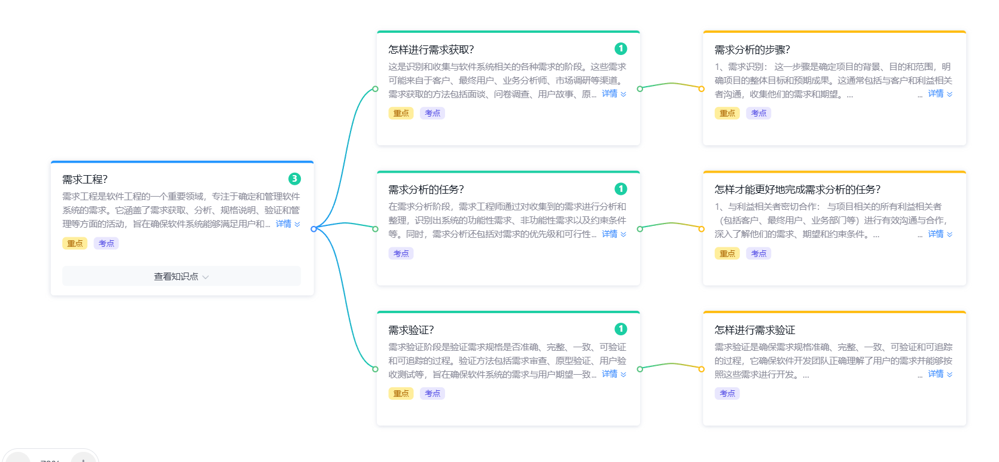

# 需求分析复习

> 软件需求工程的核心知识点汇总，围绕「需求获取 → 需求分析 → 需求验证」三大阶段展开。  
> 参考：[复习题 - 第四章 需求工程](./复习题.md)



---

## 一、需求工程

**核心定义**：需求工程是软件工程的一个重要领域，专注于**确定和管理软件系统的需求**，它涵盖了需求获取、分析、规格说明、验证和管理等方面的活动，旨在确保软件系统能够满足用户和利益相关者的需求。

### 1. 需求工程的四大活动

| 活动 | 含义 |
|---|---|
| 需求获取（Elicitation） | 识别和收集各种需求 |
| 需求分析（Analysis） | 对需求进行分析、整理、识别问题 |
| 需求规格说明（Specification） | 编写软件需求规格说明书 **SRS** |
| 需求验证（Validation） | 验证需求规格是否正确、完整、一致、可验证、可追踪 |
| 需求管理（Management） | 变更控制、需求追踪、版本管理 |

### 2. 需求的三层分类（重点）

| 层次 | 回答的问题 | 示例 |
|---|---|---|
| 业务需求（Business） | 为什么 | 提高客户满意度、增加营收 |
| 用户需求（User） | 做什么（业务角度） | 用户能查询历史订单 |
| 功能需求（Functional） | 做什么（系统角度） | 系统应提供按日期范围查询订单的接口 |
| 非功能需求（Non-functional） | 做得怎么样 | 响应时间 < 2s、支持 1000 并发 |

### 3. 需求的特性（验证标准）

- **正确（Correct）** — 准确描述用户真实意图
- **完整（Complete）** — 涵盖所有功能 / 非功能需求
- **一致（Consistent）** — 内部无冲突
- **可验证（Verifiable）** — 有明确验收标准
- **可追踪（Traceable）** — 可追溯到需求源头和后续设计 / 测试

---

## 二、怎样进行需求获取

> 需求获取是识别和收集与软件系统相关的各种需求的阶段。这些需求可能来自于**客户、最终用户、业务分析师、市场调研**等渠道。需求获取的方法包括面谈、问卷调查、用户故事、原型法等。

### 1. 需求获取的来源

| 来源 | 描述 |
|---|---|
| 客户 | 提出需求的直接来源 |
| 最终用户 | 系统的实际使用者 |
| 业务分析师 | 业务专家，整理需求 |
| 市场调研 | 同类产品的需求参考 |
| 法律法规 | 行业规范、合规要求 |
| 技术文档 | 接口、平台约束 |

### 2. 需求获取的常用方法

| 方法 | 适用场景 | 优点 | 缺点 |
|---|---|---|---|
| 面谈（Interview） | 高层需求、关键问题 | 深入、灵活 | 耗时、易跑题 |
| 问卷调查（Survey） | 大范围、多用户 | 成本低、覆盖广 | 回收率低、深度不足 |
| 用户故事（User Story） | 敏捷开发 | 简洁、易沟通 | 缺乏细节 |
| 原型法（Prototyping） | 需求模糊、UI 密集 | 直观、易理解 | 范围易蔓延 |
| 观察法（Observation） | 用户工作场景 | 真实 | 用户行为可能改变 |
| 联合应用开发（JAD） | 多方协作会议 | 高效、易达成共识 | 需专业引导 |
| 焦点小组（Focus Group） | 收集多用户观点 | 多元观点 | 个别人主导 |
| 文档分析 | 已有遗留系统 | 反映现状 | 可能过时 |

### 3. 需求获取的产物

- 需求访谈纪要
- 用户故事列表（User Story）
- 初步的用例图 / 业务流程图
- 项目愿景 / 范围说明

---

## 三、需求分析的任务

> 在需求分析阶段，需求工程师通过**对收集到的需求进行分析和整理**，识别出系统的**功能性需求、非功能性需求以及约束条件**等，同时，需求分析还包括对需求的**优先级和可行性**分析。

### 1. 需求分析的四步法（经典）

```
1. 问题识别 → 2. 分析与综合 → 3. 编制需求分析文档 → 4. 快速建立软件原型
     ↑                                                            ↓
     └────────────────────────────────────────────────────────────┘
                        （循环迭代验证）
```

| 步骤 | 含义 | 输出 |
|---|---|---|
| 1. 问题识别 | 明确功能需求、性能需求、环境需求、用户界面需求等 | 问题清单 |
| 2. 分析与综合 | 对问题进行细化、抽象 / 综合 / 分解 | 数据流图 + 数据字典 |
| 3. 编制需求分析阶段的文档 | 编写软件需求规格说明书 **SRS** | SRS 文档 |
| 4. 快速建立软件原型 | 使用原型工具快速展示需求 | 可运行的原型 |

### 2. 需求分析的方法

| 方法 | 思路 |
|---|---|
| 结构化分析（SA） | 自顶向下、面向数据流（DFD、数据字典、ER 图） |
| 面向对象分析（OOA） | 自底向上、用例驱动（用例图、类图） |
| 面向数据（Data-Oriented） | 以数据为中心 |
| 面向控制（Control-Oriented） | 以控制流为中心 |

### 3. 需求分析的任务（详细）

#### （1）四个核心任务（必背）

1. **确定目标系统的具体要求**
2. **建立目标系统的逻辑模型**
3. **修正计划：重估成本、进度等**
4. **开发原型系统**

#### （2）建立三种模型（重点）

| 模型 | 含义 | 工具 |
|---|---|---|
| 数据模型 | 描述数据的结构 / 关系 | ER 图 |
| 功能模型 | 描述系统的功能 / 数据加工 | DFD |
| 行为模型 | 描述系统的状态变化 / 时序 | 状态图、时序图 |

> **数据域的三种属性**：数据流、数据内容、数据结构

#### （3）需求分析方法的两维度

需求分析方法由对软件问题的 **数据域** 和 **功能域** 的系统分析过程及其表示方法组成。

---

## 四、怎样才能更好地完成需求分析的任务（重点 / 考点）

> 更好地完成需求分析任务是软件项目的关键成功因素。

### 1. 与利益相关者密切合作

- 与项目相关的所有利益相关者（包括客户、最终用户、业务部门等）进行**有效沟通与合作**
- 深入了解他们的需求、期望和约束条件

### 2. 关键措施（五点）

| # | 措施 | 说明 |
|---|---|---|
| 1 | 利益相关者协作 | 与客户、用户、业务部门建立紧密沟通 |
| 2 | 需求优先级排序 | 使用 MoSCoW / Kano 等方法 |
| 3 | 原型 + 迭代验证 | 每轮迭代都对需求进行验证 |
| 4 | 评审与确认 | 需求评审会 + 用户签字确认 |
| 5 | 需求管理工具 | 使用专业的需求管理工具（DOORS、Jira） |

### 3. 需求冲突的处理

> 需求之间出现冲突是非常正常的事情。

- **协商**：与利益相关者协商，寻找折中方案
- **优先级**：按优先级排序，先满足高优先级需求
- **变更管理**：通过变更控制流程统一处理

### 4. 需求分析的原则（重点 / 考点）

> 下列选项中哪个不是"软件需求分析的原则"？

✅ **正确原则**：

1. 规格说明必须局部化和松散耦合
2. 整个大系统也包括在规格说明的描述之中（如果被开发软件是大系统的一部分）
3. 要能以层次化的方式对问题进行分解和不断细化

❌ **错误说法**：

- "只要给出系统的逻辑视图，不需要物理视图" —— **错误**，需要**逻辑 + 物理**双视图

### 5. 需求分析快速原型的目的

> 「使用户和开发者在目标系统应该"做什么"这个问题上尽可能快地**达成共识**」

---

## 五、需求验证

> 需求验证阶段是验证需求规格是否**正确、完整、一致、可验证和可追踪**的过程。

### 1. 验证目的

确保软件**需求规格准确、完整、一致、可验证和可追踪**，确保软件开发团队**正确理解了用户的需求并能够按照这些需求进行开发**。

### 2. 验证方法（重点 / 考点）

| 方法 | 内容 |
|---|---|
| 需求审查（Review） | 由开发团队、QA、客户共同评审 SRS |
| 原型验证 | 通过原型让用户确认需求 |
| 用户验收测试 | 用户对需求实现进行验收 |
| 需求追溯 | 建立需求 → 设计 → 代码 → 测试 的双向追溯 |
| 形式化验证 | 使用数学方法证明需求的正确性 |
| 走查（Walkthrough） | 团队逐步检查需求文档 |

### 3. 需求验证的内容

- ✅ 正确性：准确反映用户意图
- ✅ 完整性：覆盖所有场景（含边界、异常）
- ✅ 一致性：无内部矛盾
- ✅ 可验证性：每条需求都有验收标准
- ✅ 可追踪性：可追溯到需求源 + 设计 / 测试用例

### 4. 需求评审的项目（重点 / 考点）

> 下列选项中哪个不是「需求分析评审」中的项目？

✅ **属于需求评审**：

1. 系统定义的**目标是否与用户的要求一致**
2. 主要功能是否已包括在规定的软件范围之内，是否都已充分说明
3. **开发的技术风险是什么**，是否考虑过软件需求的其它方案
4. 文档中的所有描述是否完整、清晰、准确反映用户要求
5. 设计的约束条件 / 限制条件是否符合实际
6. 是否详细制定了**检验标准**，能否对系统定义是否成功进行确认

❌ **不属于需求评审**：

- 「是否建立了快速原型模型」—— 属于**需求获取**方法，不是评审项目
- 「是否考虑过将来对系统进行测试时将采用的方法」—— 属于**测试阶段**问题，需求评审不涉及