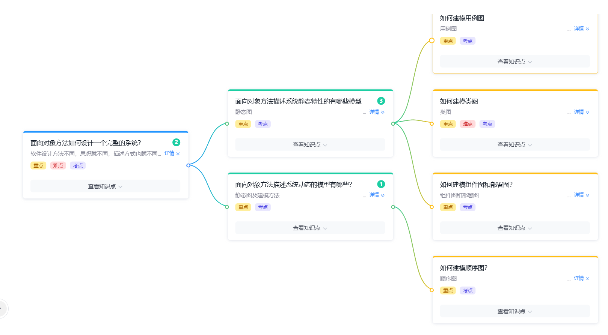

# 面向对象方法复习

> 面向对象方法（OO）相关的核心知识点汇总，对比结构化方法的「自顶向下、面向过程」思想，OO 强调「**自底向上、面向对象**」。  
> 参考：[结构化方法复习](./结构化方法复习.md)



---

## 一、面向对象方法如何设计一个完整的系统

**核心思想**：软件设计方法不同，**思想就不同，描述方式也就不同**。

| 对比项 | 结构化方法 | 面向对象方法 |
|---|---|---|
| 思想 | 自顶向下、面向过程 | 自底向上、面向对象 |
| 基本单位 | 模块 / 函数 | 类 / 对象 |
| 核心问题 | How（怎么做） | What + Who（做什么 + 谁来做） |
| 模型 | DFD / 模块结构图 / ER 图 | 用例图 / 类图 / 组件图 / 部署图 / 顺序图 |

**OO 设计流程（自底向上）**：

1. **识别对象** — 从问题域中找出关键实体
2. **抽象类** — 提炼对象的共同属性和行为 → 形成类
3. **建立关系** — 描述类之间的关联 / 继承 / 依赖 / 聚合 / 组合
4. **构建模型** — 使用 UML 各类图描述系统

---

## 二、面向对象方法描述系统静态特性的有哪些模型

**静态模型** 描述系统的**静态结构**（类、对象、关系、属性），与时间无关。

| 模型 | 用途 | 重要程度 |
|---|---|---|
| 类图（Class Diagram） | 描述类、接口、协作及它们之间的关系 | ⭐⭐⭐ |
| 对象图（Object Diagram） | 描述某一时刻对象的实例及其关系 | ⭐⭐ |
| 包图（Package Diagram） | 描述系统的包结构与依赖 | ⭐⭐ |
| 组件图（Component Diagram） | 描述组件的物理结构与接口 | ⭐⭐ |
| 部署图（Deployment Diagram） | 描述系统的物理部署（节点、设备） | ⭐⭐ |

---

## 三、面向对象方法描述系统动态的模型有哪些

**动态模型** 描述系统的**动态行为**（对象之间的交互、消息传递、状态变化）。

| 模型 | 用途 |
|---|---|
| 用例图（Use Case Diagram） | 从用户视角描述系统功能 |
| 顺序图（Sequence Diagram） | 强调消息的**时间顺序** |
| 协作图 / 通信图（Communication Diagram） | 强调对象之间的**结构关系**与消息 |
| 状态图（State Machine Diagram） | 描述对象生命周期中的**状态变化** |
| 活动图（Activity Diagram） | 描述业务流程 / 工作流（类似流程图） |

---

## 四、如何建模用例图

用例图是**从用户视角**对系统功能的描述，是 OO 需求分析阶段的核心工具。

### 四要素

| 元素 | 含义 | 表示 |
|---|---|---|
| 参与者（Actor） | 与系统交互的外部用户 / 系统 | 火柴人 |
| 用例（Use Case） | 系统提供的一个完整功能 | 椭圆 |
| 系统边界 | 系统的范围 | 矩形框 |
| 关联关系 | 参与者 ↔ 用例 | 实线 |

### 用例之间的关系

| 关系 | 含义 | 表示 | 示例 |
|---|---|---|---|
| 关联（Association） | 参与者与用例的连接 | 实线 | 用户 → 登录 |
| 包含（Include） | A 用例**强制**包含 B 的行为 | 虚线箭头 + `<<include>>` | 下订单 → 验证库存 |
| 扩展（Extend） | B 用例在特定条件下扩展 A | 虚线箭头 + `<<extend>>` | 查询订单 ←（条件：会员）→ 推荐 |
| 泛化（Generalization） | 用例之间的继承 | 实线 + 空心三角 | 支付 ← 微信支付 / 支付宝支付 |

### 包含与扩展的区别（考点）

| 对比 | `<<include>>` | `<<extend>>` |
|---|---|---|
| 方向 | 基础用例 → 被包含用例 | 扩展用例 → 基础用例 |
| 是否必须 | 必须执行 | 可选 / 条件触发 |
| 谁主导 | 基础用例主动包含 | 扩展用例在条件满足时触发 |

### 用例图示例

@startuml 用例图示例
title 在线购物系统 - 用例图

left to right direction

actor 顾客 as U
actor 管理员 as A

rectangle 购物系统 {
  usecase "注册登录"   as UC1
  usecase "浏览商品"   as UC2
  usecase "加入购物车" as UC3
  usecase "下单支付"   as UC4
  usecase "查看订单"   as UC5
  usecase "管理商品"   as UC6
}

U --> UC1
U --> UC2
U --> UC3
U --> UC4
U --> UC5
A --> UC6

UC4 ..> UC3 : <<include>>

@enduml

---

## 五、如何建模类图

类图是 **OO 建模的最核心工具**（重点 / 难点 / 考点）。三栏表示：

```
┌────────────────┐
│  类名          │    ← 类名（抽象类用斜体）
├────────────────┤
│  + 属性 1      │    ← 属性（可见性 名称: 类型）
│  - 属性 2      │
├────────────────┤
│  + 方法 1()    │    ← 方法（可见性 名称(): 返回类型）
│  - 方法 2()    │
└────────────────┘
```

### 可见性符号

| 符号 | 含义 | 范围 |
|---|---|---|
| `+` | public | 任何类 |
| `-` | private | 本类 |
| `#` | protected | 本类 + 子类 |
| `~` | package | 同包 |

### 类之间的关系（六种）

| 关系 | 含义 | UML 表示 | 强度 | 示例 |
|---|---|---|---|---|
| 关联（Association） | 类之间存在连接 | 实线 + 箭头 | - | 学生 选课 |
| 聚合（Aggregation） | 整体与部分，**部分可独立存在** | 空心菱形 | 中 | 班级 ↔ 学生 |
| 组合（Composition） | 整体与部分，**部分不可独立存在** | 实心菱形 | 强 | 人 ↔ 心脏 |
| 泛化（Generalization） | 继承关系 | 空心三角箭头 | 强 | 动物 ← 狗 |
| 实现（Realization） | 类实现接口 | 空心三角箭头（虚线） | 强 | 类 ←← 接口 |
| 依赖（Dependency） | 一个类使用另一个类 | 虚线 + 箭头 | 弱 | Controller → Service |

### 类图示例

@startuml 类图示例
title 学生选课系统 - 类图

class Student {
  - studentId: String
  - name: String
  + enroll(course: Course): void
}

class Course {
  - courseId: String
  - name: String
  - credits: int
}

class Teacher {
  - teacherId: String
  - name: String
  + teach(course: Course): void
}

Student "1" --> "*" Course : 选课
Teacher "1" --> "*" Course : 授课

@enduml

### 关系强度排序（重点）

```
泛化 / 实现  >  组合  >  聚合  >  关联  >  依赖
```

---

## 六、如何建模组件图和部署图

### 1. 组件图（Component Diagram）

描述系统的**物理组成**（组件、文件、库、接口）及它们之间的依赖关系。

| 元素 | 含义 | 表示 |
|---|---|---|
| 组件 | 系统的一个可替换模块 | 带两个小方块的矩形 |
| 接口 | 组件对外提供的服务 | 圆圈（棒棒糖） |
| 依赖 | 组件使用另一个组件 | 虚线箭头 |

### 2. 部署图（Deployment Diagram）

描述系统的**物理部署**（硬件节点、设备、网络连接）。

| 元素 | 含义 | 表示 |
|---|---|---|
| 节点 | 物理设备（服务器、PC） | 立方体 |
| 组件实例 | 部署在节点上的组件 | 组件 + `<<artifact>>` |
| 连接 | 节点之间的通信路径 | 线段 |

### 组件图示例

@startuml 组件图示例
title Web 商城系统 - 组件图

component [Web 前端] as Front
component [API 网关]   as Gateway
component [订单服务]   as Order
component [支付服务]   as Payment
database   [数据库]     as DB

Front     --> Gateway
Gateway   --> Order
Order     --> Payment
Order     --> DB
Payment   --> DB

@enduml

### 部署图示例

@startuml 部署图示例
title Web 商城系统 - 部署图

node "Web 服务器" {
  [Web 前端]
  [API 网关]
}

node "应用服务器" {
  [订单服务]
  [支付服务]
}

node "数据库服务器" {
  [数据库]
}

@enduml

---

## 七、如何建模顺序图

顺序图强调**消息的时间顺序**，展示对象之间**交互的先后**。

### 四要素

| 元素 | 含义 |
|---|---|
| 对象（Object） | 矩形框 + 对象名（`:` 前可选） |
| 生命线（Lifeline） | 对象下方的**虚线** |
| 激活（Activation） | 生命线上的**细长矩形**，表示对象正在执行 |
| 消息（Message） | 对象之间的箭头 |

### 消息类型

| 类型 | 表示 | 含义 |
|---|---|---|
| 同步消息 | 实线箭头 | 调用方等待返回 |
| 异步消息 | 实线开放箭头 | 调用方不等待 |
| 返回消息 | 虚线箭头 | 方法返回值 |
| 自调用 | 自指箭头 | 对象调用自身方法 |

### 顺序图示例

@startuml 顺序图示例
title 用户下单 - 顺序图

actor 用户     as U
participant "Web前端" as Front
participant "订单服务" as Order
participant "支付服务" as Pay
database   "数据库"      as DB

U -> Front    : 点击「下单」
Front -> Order : 创建订单请求
Order -> DB   : 查询库存
DB --> Order  : 库存充足
Order -> Pay  : 调用支付
Pay --> Order : 支付成功
Order -> DB   : 保存订单
DB --> Order  : OK
Order --> Front: 返回订单号
Front --> U    : 显示下单成功

@enduml

### 顺序图与协作图的区别

| 对比 | 顺序图 | 协作图 |
|---|---|---|
| 强调 | **时间顺序** | **对象结构** |
| 维度 | 纵向（时间向下） | 横向 + 编号（消息序号） |
| 阅读 | 易于看交互时序 | 易于看对象间连接 |