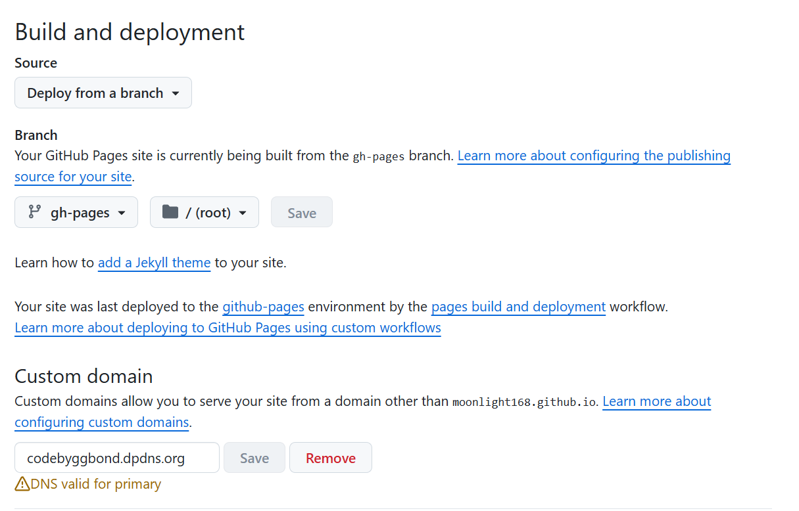
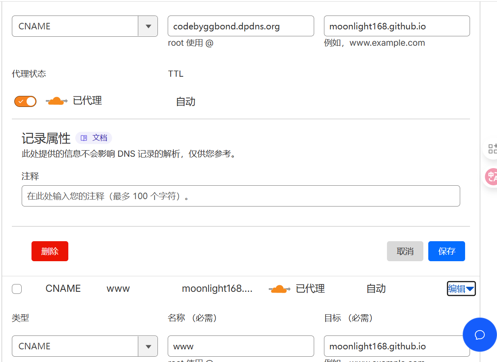

本文将详细介绍如何将使用 VuePress 构建的博客部署到 GitHub Pages 上，包括本地构建、生成静态文件、推送到 `gh-pages` 分支以及自定义域名绑定等。

## 一、前提条件

在开始部署之前，请确保你已经完成了以下准备工作：

- 已经搭建好 VuePress 项目并可本地正常访问
- 已将博客项目推送至 GitHub 仓库（如：`https://github.com/你的用户名/你的仓库名`）
- 安装了 Node.js 和 Git
- 本地可正常构建 VuePress 静态文件

## 二、构建静态文件

VuePress 的构建命令会将所有页面编译为静态 HTML 文件，默认输出在 `docs/.vuepress/dist` 目录下：

```bash
npm run build
````

执行成功后，你会在 `docs/.vuepress/dist/` 目录下看到生成的 `index.html`、`.js`、`.css` 文件等。

## 三、部署到 GitHub Pages

GitHub Pages 通常部署在 `gh-pages` 分支上。你可以使用如下方式手动推送部署：

### 使用 bat 脚本部署（推荐）

```bat
@echo off
echo 正在构建 VuePress 项目...
call npm run build

if %ERRORLEVEL% NEQ 0 (
  echo ❌ 构建失败，终止脚本！
  pause
  exit /b %ERRORLEVEL%
)

echo ✅ 构建完成，进入构建输出目录...
cd .vuepress/dist

echo 初始化 Git 仓库...
git init
git add .
git commit -m "deploy"

echo 推送到 GitHub gh-pages 分支...
git branch -M gh-pages
git remote add origin https://github.com/your-github-account/blog.git
git push -f origin gh-pages

echo 🎉 更新完成！
pause

```

注意将 `origin` 后面的链接替换为你的仓库地址。

## 四、配置 GitHub Pages

1. 打开你的 GitHub 仓库
2. 点击【Settings】→【Pages】
3. 选择部署分支：`gh-pages`
4. Folder 选择 `/ (root)`

## 五、配置自定义域名（可选）

如果你有自己的域名，你可以：

1. 在 `docs/.vuepress/dist` 中创建一个名为 `CNAME` 的文件，内容如下：

```
你的域名
```



2. 登录 DNS 服务商（如 Cloudflare）添加两条 CNAME 记录：



3. 返回 GitHub Pages 设置页面，绑定这个域名（Custom domain）。

### GitHub 强制验证所有常见变体

为防止配置疏漏导致服务中断，GitHub 会主动探测 `www.<your-domain>` 是否也能正确指向你的 Pages 站点。如果 DNS 无法解析 `www` 子域，GitHub 就认为“域名配置不完整”，从而报错：

`Domain's DNS record could not be retrieved (InvalidDNSError)`

## 六、常见问题排查

### 1. 页面 404 或不生效

* 检查 `gh-pages` 分支是否成功部署了 `/index.html`
* 检查 GitHub Pages 设置是否指向了 `gh-pages` 分支
* 清除浏览器缓存或强制刷新页面

### 2. 自定义域名无效

* 检查 DNS 是否已成功解析（使用 `nslookup` 命令）
* 确认 `CNAME` 文件已存在于 `dist` 并成功提交至 `gh-pages` 分支

## 七、总结

整个部署流程看似复杂，其实核心就是三步：

1. 使用 `vuepress build` 构建出静态网页
2. 将 `dist` 目录内容推送到 `gh-pages` 分支
3. 配置 GitHub Pages 设置页面（可加自定义域名）

完成上述步骤后，你的 VuePress 博客就成功上线啦！

