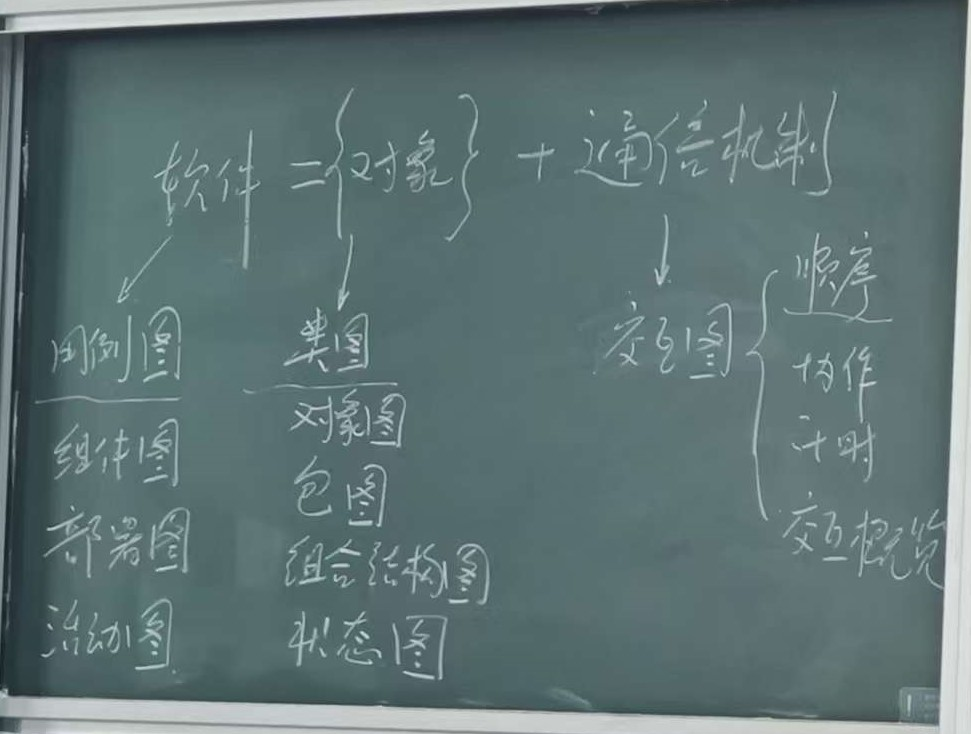

# UML建模

UML（Unified Modeling Language，统一建模语言）是一种用于描述、可视化、构建和文档化软件系统 artifacts 的标准化建模语言。它提供了一套丰富的图形符号，帮助开发团队更好地理解、设计和沟通软件系统。

## 软件的本质

**软件=对象➕通信机制**

软件系统的核心由两部分组成：
- **对象**：系统中的基本构建块，包含数据和行为
- **通信机制**：对象之间交互和协作的方式

UML通过不同类型的图表来描述这两个核心要素，帮助我们全面理解和设计软件系统。

## UML图分类

UML图可以分为两大类：结构图和行为图。

### 结构图（Structure Diagrams）

结构图描述系统的静态结构，展示系统中的元素及其关系。

1. **类图（Class Diagram）**
   - 描述系统中的类、接口、协作以及它们之间的关系
   - 是面向对象建模的核心

2. **对象图（Object Diagram）**
   - 展示系统在特定时刻的对象实例及其关系
   - 是类图的一个具体实例

3. **包图（Package Diagram）**
   - 展示系统的组织结构和模块划分
   - 用于管理大型系统的复杂性

4. **组件图（Component Diagram）**
   - 描述系统的物理组件及其依赖关系
   - 用于系统架构设计

5. **部署图（Deployment Diagram）**
   - 展示系统的硬件部署和运行环境
   - 描述节点、组件和连接关系

6. **组合结构图（Composite Structure Diagram）**
   - 描述复杂类的内部结构和协作
   - 展示类的组成部分及其交互

7. **ER图（Entity-Relationship Diagram）**
   - 描述数据模型中的实体、属性和关系
   - 主要用于数据库设计

### 行为图（Behavior Diagrams）

行为图描述系统的动态行为，展示系统中的元素如何交互和随时间变化。

1. **用例图（Use Case Diagram）**
   - 描述系统的功能需求和参与者
   - 从用户角度展示系统功能

2. **活动图（Activity Diagram）**
   - 描述业务流程或操作过程的控制流
   - 类似于流程图，但更加强调并发和同步

3. **顺序图（Sequence Diagram）**
   - 描述对象之间消息传递的时间顺序
   - 展示对象间的交互序列

4. **状态图（State Machine Diagram）**
   - 描述对象在其生命周期内的状态变化
   - 展示状态、转换和事件

5. **通信图（Communication Diagram）**
   - 强调对象之间的协作关系
   - 展示消息传递和对象链接

6. **定时图（Timing Diagram）**
   - 描述对象状态变化的时间约束
   - 强调时间相关的行为分析

7. **交互概览图（Interaction Overview Diagram）**
   - 组合多个交互图的概览视图
   - 展示复杂交互流程的整体结构

## 学习路径

建议按照以下顺序学习UML图：

1. **用例图** → 理解系统需求和功能
2. **类图** → 设计系统静态结构
3. **对象图** → 理解类图的具体实例
4. **顺序图** → 描述对象交互时序
5. **活动图** → 描述业务流程
6. **状态图** → 理解对象状态变化
7. **通信图** → 掌握对象协作关系
8. **包图** → 组织系统模块
9. **组件图** → 设计系统架构
10. **部署图** → 规划硬件部署
11. **组合结构图** → 理解复杂类结构
12. **ER图** → 设计数据模型
13. **定时图** → 分析时间约束
14. **交互概览图** → 掌握复杂交互流程

## 实际开发中的UML建模顺序

在实际软件开发过程中，推荐按照以下顺序进行UML建模：

1. **需求分析阶段**
   - **用例图**：捕获用户需求和系统功能
   - **活动图**：描述业务流程和操作步骤

2. **系统设计阶段**
   - **类图**：设计系统的静态结构和类的关系
   - **对象图**：展示特定场景下对象的实例状态
   - **包图**：组织系统模块和子系统

3. **详细设计阶段**
   - **顺序图**：详细设计对象间的交互流程
   - **状态图**：描述对象的状态变化
   - **通信图**：展示对象间的协作关系

4. **数据设计阶段**
   - **ER图**：设计数据库模型

5. **实现和部署阶段**
   - **组件图**：描述系统的物理组件
   - **部署图**：规划系统的硬件部署

## 参考资料

<PDF url="/assets/pdf/UML.pdf"/>

华为在线文档：[UML建模](https://support.huaweicloud.com/usermanual-codeartsmodeling/modeling_ug_0003_1.html)
下载链接：[文档下载](https://support.huaweicloud.com/download_codeartsmodeling/index.html){download}