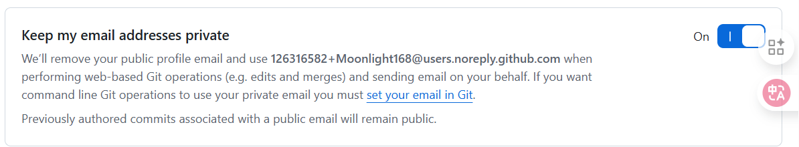

> 代码不该被密码束缚，连接应当如风般自由。

以前每次 `git push`，都要输入用户名和密码，像一次次敲门，繁琐又冰冷。  
直到我遇见了 **SSH** —— 它让我的本地机器与 GitHub 之间建立起一条安静而信任的通道。

今天，我想把这份“自由”分享给你，尤其如果你也和我一样，用着 **Windows 系统**。

---

## 为什么选择 SSH？

- **免密推送**：一次配置，永久信任
- **更安全**：基于密钥认证，比密码更难被破解
- **更流畅**：告别反复输入凭证的打断感

---

## 🛠️ 配置步骤（Windows + Git Bash）

### 1️⃣ 确保已安装 Git

前往 [https://git-scm.com/download/win](https://git-scm.com/download/win) 下载并安装 Git。  
安装完成后，你会拥有一个叫 **Git Bash** 的终端 —— 它是我们的主战场。

---

### 2️⃣ 生成 SSH 密钥

打开 **Git Bash**，输入：

```bash
ssh-keygen -t ed25519 -C "Moonlight168@users.noreply.github.com"
```

- 按三次回车（使用默认路径，不设密码）
- 密钥将生成在 `C:\Users\你的用户名\.ssh\` 目录下


> 💡 邮箱建议使用 GitHub 的 **noreply 邮箱**（格式：`用户名@users.noreply.github.com`），保护隐私。

---

### 3️⃣ 复制公钥到剪贴板

在 Git Bash 中执行：

```bash
cat ~/.ssh/id_ed25519.pub
```

---

### 4️⃣ 添加公钥到 GitHub

1. 登录 GitHub → 点击头像 → **Settings**
2. 左侧选择 **SSH and GPG keys** → **New SSH key**
3. Title 填 `Windows PC`，Key 粘贴刚才复制的内容
4. 点击 **Add SSH key**

---

### 5️⃣ 测试连接

```bash
ssh -T git@github.com
```

看到这行字，你就成功了：

```
Hi Moonlight168! You've successfully authenticated...
```

---

### 6️⃣ 将远程仓库地址改为 SSH

进入你的本地博客目录，执行：

```bash
git remote set-url origin git@github.com:Moonlight168/blog.git
```

验证：

```bash
git remote -v
```

应显示 `git@github.com:...` 而非 `https://...`

---

### 7️⃣ 推送吧！


```bash
# 在本地设置 Git邮箱
git config user.email "Moonlight168@users.noreply.github.com"
```


```bash
git add .
git commit -m "配置完成，从此无密推送"
git push origin main
```

这一次，没有密码，只有风。

---

## 🌼 小贴士

- 如果你用的是 `master` 分支，请把 `main` 分支替换为 `master`
- 若遇到权限问题，确保 `.ssh` 文件夹权限正常（Windows 通常无需调整）
- 可通过 `git config --global user.email "Moonlight168@users.noreply.github.com"` 设置隐私邮箱

