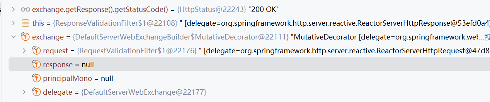

在 IDEA debug Spring Cloud Gateway 中，我遇到过一个让我盯着屏幕发呆的调试场景：

调试器里明明显示 `exchange.getResponse()` 是 `null`，但紧接着调用 `exchange.getResponse().getStatusCode()` 却能返回有效的状态码（比如 `200 OK`），甚至能基于这个状态码正常创建 `ClientResponse`。这看起来像个悖论——`null` 对象怎么可能调用方法并返回有效值？

经过一番源码追踪和调试原理分析，终于搞懂了这背后的“障眼法”。这篇博客记录下这个现象的本质、原因和调试技巧，避免后来者踩坑。


## 一、现象复现：看似矛盾的调试结果

先看一段核心代码（来自 Gateway 响应过滤器）：
```java
// 调试时观察到的现象：
// 1. 查看 exchange 变量，其 response 字段显示为 null
// 2. 但调用 getResponse().getStatusCode() 却能拿到 200
HttpStatusCode statusCode = exchange.getResponse().getStatusCode(); 
// 3. 甚至能正常创建 ClientResponse
ClientResponse clientResponse = ClientResponse
    .create(Objects.requireNonNull(statusCode))
    .headers(headers -> headers.putAll(httpHeaders))
    .body(Flux.from(body))
    .build();
```

调试器截图：


但执行 `exchange.getResponse().getStatusCode()` 时，返回 `200 OK`，且 `ClientResponse` 能正常创建，后续响应处理逻辑也能正常执行。


## 二、本质原因：动态代理与调试器快照的“信息差”

这个现象的核心矛盾是：**调试器显示的“字段快照”与代码运行时的“方法调用结果”不一致**。背后涉及两个关键机制：


### 1. ServerWebExchange 的“动态响应对象”设计

Spring Cloud Gateway 中的 `ServerWebExchange`（具体实现是 `DefaultServerWebExchange`）对 `response` 的处理采用了**动态初始化+代理模式**：

- `response` 字段并非在 `exchange` 创建时就初始化，而是**延迟到第一次调用 `getResponse()` 方法时才创建**（懒加载）；
- 即使 `response` 字段在调试器中显示为 `null`，`getResponse()` 方法内部会通过 `createResponse()` 动态生成 `ServerHttpResponse` 实例（默认是 `DefaultServerHttpResponse`）；
- 生成的 `response` 对象会被缓存，后续调用 `getResponse()` 时直接返回缓存实例。

源码片段（简化的 `DefaultServerWebExchange`）：
```java
public class DefaultServerWebExchange implements ServerWebExchange {
    private ServerHttpResponse response; // 初始为 null

    @Override
    public ServerHttpResponse getResponse() {
        if (this.response == null) {
            // 第一次调用时动态创建响应对象
            this.response = createResponse(); 
        }
        return this.response;
    }

    private ServerHttpResponse createResponse() {
        // 基于请求信息创建响应对象，默认状态码 200
        return new DefaultServerHttpResponse(this.request, this.headers);
    }
}
```

也就是说：调试器看到的 `response = null` 是“字段未初始化时的快照”，但代码执行到 `getResponse()` 时，方法会动态创建并返回有效对象。


### 2. 调试器的“静态快照”特性

调试器（如 IDEA）显示的对象字段值，是**某个时间点的“静态快照”**，而不是“实时运行时状态”：

- 当你在代码中打断点时，调试器会捕获当前时刻的变量状态。如果此时 `getResponse()` 还未被调用，`response` 字段确实是 `null`，所以调试器会显示 `null`；
- 但当代码执行到 `exchange.getResponse()` 时，方法内部已经动态创建了 `response` 对象，此时变量的实际状态已经更新，但调试器的快照可能没有实时刷新（尤其是在单步调试时，字段显示可能滞后于实际执行）。


### 3. statusCode 为什么一定有值？

`ServerHttpResponse` 的 `statusCode` 是响应的“基础元数据”，在 `createResponse()` 时会**默认初始化**：

- 即使上游服务还未返回响应，网关也会为 `response` 设置默认状态码（通常是 `200 OK`）；
- 当上游服务返回响应后，网关会同步上游的状态码（如 `404`、`500`）到 `response` 中；
- 因此，`getStatusCode()` 几乎不可能返回 `null`（除非极端bug），这也是 `Objects.requireNonNull(statusCode)` 不会报错的原因。


## 三、总结：别被调试器的“静态视图”骗了

这个问题的本质是：**框架的动态设计（懒加载、代理）与调试器的静态快照之间存在信息差**。

- 看到 `response = null` 时，别慌，这只是“字段尚未初始化”的快照；
- 只要 `exchange.getResponse()` 方法能正常调用，就会动态生成有效响应对象；
- `statusCode` 作为基础元数据，会被提前初始化，因此总能通过 `getStatusCode()` 获取有效值。


## 四、实用调试技巧

遇到类似“调试视图与代码执行不一致”的问题时，可按以下步骤验证：

1. **通过方法调用获取实时值**：  
   不要依赖调试器显示的字段值，而是在调试面板中手动执行 `exchange.getResponse()` 方法（通过 Evaluate Expression），查看返回的实际对象。

2. **加日志确认运行时状态**：  
   在代码中添加日志，打印 `response` 是否为 null 以及 `statusCode` 的值：
   ```java
   log.info("response 是否为 null：{}", exchange.getResponse() == null);
   log.info("statusCode：{}", exchange.getResponse().getStatusCode());
   ```  
   日志输出的是运行时的真实状态，比调试器快照更可靠。

3. **理解框架的“延迟初始化”设计**：  
   Spring 生态（尤其是响应式框架如 Gateway）大量使用懒加载和代理模式，很多对象的字段会在首次调用 getter 方法时才初始化，调试时需关注“方法调用结果”而非“字段静态值”。


## 最后

调试的本质是“观察程序的真实运行状态”，但工具（调试器）的显示方式可能存在局限性。当看到矛盾的现象时，多从框架设计和工具原理角度思考，往往能找到答案——毕竟，程序不会说谎，只是我们可能看错了“视角”。