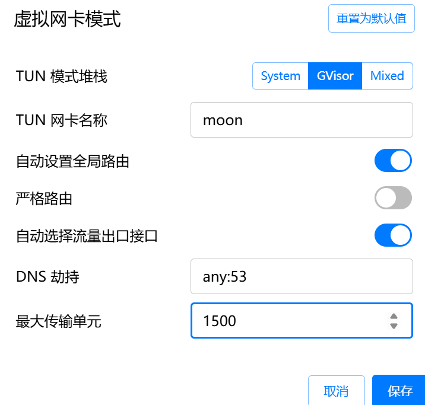

# 系统代理与TUN模式(虚拟网卡模式)

## 什么是系统代理和TUN模式？

系统代理和TUN模式是两种常见的网络流量管理方式，简单来说：

- **系统代理**：就是我们常说的"梯子"，通过一个中间服务器转发你的网络请求，比如HTTP代理
- **TUN模式（虚拟网卡模式）**：在电脑上创建一个"假网卡"，让所有网络流量都先经过这个假网卡处理，再发送出去

## TUN模式的工作原理

TUN模式的工作原理可以简单理解为"中间人"机制：

1. **创建虚拟网卡**：在你的电脑上创建一个"假网卡"（如图中名为"moon"的网卡）
2. **流量劫持**：让原本应该直接发送的网络数据，先走到这个假网卡
3. **数据处理**：在假网卡里对数据进行修改、加密等操作
4. **重新发送**：处理完后，通过真实网卡将数据发送出去

这种方式最大的好处是：不管什么软件产生的流量都能被处理，不需要每个软件单独设置代理，而且一些检测代理的软件也发现不了。

## 虚拟网卡模式设置详解

上图展示了一个实际的TUN模式设置界面，让我们详细介绍每个设置项的作用：

### TUN模式堆栈

- **System**：使用操作系统原生的TUN驱动，性能最好，兼容性最广
- **GVisor**：使用Google的GVisor沙箱技术，提供更强的隔离性和安全性
- **Mixed**：智能混合模式，会根据网络类型自动选择最合适的实现方式

### TUN网卡名称

设置虚拟网卡在系统中的名称，图中设为"moon"。这个名称会出现在系统的网络连接列表中，可以自定义。

### 路由相关设置

- **自动设置全局路由**：开关已打开（蓝色），表示系统会自动配置路由表，将流量引导至虚拟网卡
- **严格路由**：当前关闭（灰色），开启后会更严格地控制路由规则，确保流量不会通过其他途径泄露
- **自动选择流量出口接口**：开关已打开，系统会智能选择最佳的网络出口，比如WiFi或有线网络

### DNS劫持

设置为"any:53"，表示劫持所有发送到53端口（DNS端口）的请求。这能有效防止DNS泄漏，确保DNS查询也经过虚拟网卡处理。

### 最大传输单元（MTU）

设置为1500字节，这是网络中数据包的最大大小限制。这个值通常与物理网卡保持一致，如果设置过小会影响性能，过大可能导致数据包分片。

### 保存/取消按钮

用于应用或放弃当前的设置更改。

## 系统代理与TUN模式的对比

| 特性 | 系统代理 | TUN模式 |
|------|----------|---------|
| 适用范围 | 主要针对HTTP/HTTPS协议 | 支持所有网络协议 |
| 应用设置 | 需要每个应用单独配置代理 | 系统级设置，应用无需额外配置 |
| 绕过检测 | 容易被应用检测到并绕过 | 难以被应用检测 |
| 性能影响 | 较小 | 稍大，但影响不明显 |
| 兼容性 | 某些应用可能不支持 | 兼容性好，几乎所有应用都能使用 |

## 总结

TUN模式通过创建虚拟网卡，在网络层直接处理数据包，相比系统代理具有更好的兼容性和隐蔽性。它特别适合需要处理所有网络流量或绕过应用代理检测的场景。通过简单的设置，我们可以让TUN模式更好地满足我们的网络需求。