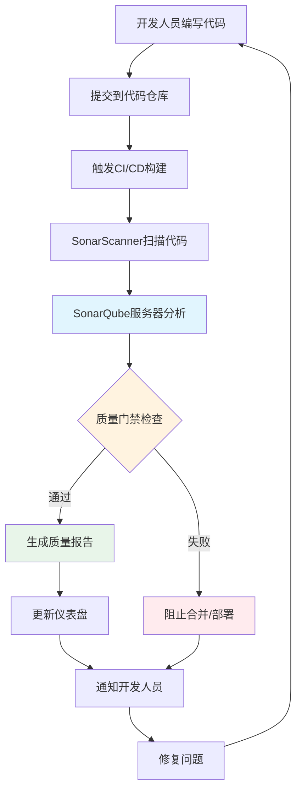

# SonarQube：代码质量管理系统

## 通俗介绍

### 什么是SonarQube？

想象一下，你是一位建筑工程师，每次完成建筑设计后，都有一位专业的检查员自动帮你检查图纸中的各种问题：结构是否稳固、材料是否合适、设计是否符合规范、有没有安全隐患等。SonarQube就像是软件开发中的这样一位"代码检查员"。

SonarQube是一个开源平台，专门用来检查和衡量代码质量。它可以自动扫描你的代码，找出各种潜在问题，比如：

- **代码缺陷**：可能导致程序崩溃的bug
- **安全漏洞**：黑客可能利用的弱点
- **代码异味**：虽然能运行但写得不好的地方
- **重复代码**：浪费资源且难以维护的重复劳动
- **测试覆盖率**：你的测试是否充分覆盖了所有功能

### 为什么需要SonarQube？

在软件开发中，我们经常面临这些挑战：

1. **代码质量难以量化**：如何判断代码写得好还是坏？
2. **技术债务累积**：为了快速交付功能，我们经常妥协代码质量
3. **团队标准不一**：不同开发者的编码风格和水平差异很大
4. **维护成本高**：低质量代码后期维护和修改成本极高

SonarQube通过提供**可视化仪表盘**和**质量门禁**，帮助团队：

- **量化代码质量**：通过分数和评级直观展示代码质量
- **统一标准**：为团队建立统一的编码规范
- **持续改进**：跟踪质量趋势，防止技术债务累积
- **自动化检查**：集成到开发流程中，自动检查每次代码变更

### SonarQube如何工作？

SonarQube的工作流程很简单：

1. **扫描代码**：通过SonarScanner工具扫描你的项目代码
2. **分析问题**：在SonarQube服务器上分析代码，找出各种问题
3. **展示结果**：通过仪表盘展示分析结果，包括问题列表、质量指标等
4. **跟踪改进**：跟踪代码质量变化趋势，确保持续改进



SonarQube分析涵盖7大质量维度：
- **可靠性**：检测潜在的Bug和错误
- **安全性**：发现安全漏洞和风险
- **可维护性**：评估代码的可读性和可修改性
- **覆盖率**：统计测试覆盖程度
- **重复率**：识别重复代码块
- **规模**：度量代码复杂度
- **文档**：检查注释和文档完整性

### 谁在使用SonarQube？

从小型开源项目到大型企业，全球有数百万开发者在使用SonarQube：

- **开发团队**：确保代码质量，减少bug
- **项目经理**：监控项目健康度，控制技术债务
- **质量保证团队**：建立质量标准，执行质量检查
- **安全团队**：发现和修复安全漏洞

## 专业介绍

### SonarQube架构概述

SonarQube采用分布式架构，主要由以下组件构成：

#### 核心组件

1. **SonarQube服务器**
   - 负责处理扫描请求、存储分析结果、提供Web界面
   - 包含Web服务器、搜索服务器和应用服务器
   - 支持多种数据库：H2（内置）、PostgreSQL、MySQL、Oracle、SQL Server

2. **SonarScanner**
   - 负责在CI/CD流水线中扫描代码
   - 支持多种语言：Java、C/C++、C#、JavaScript、Python、PHP等
   - 可集成到Jenkins、GitLab CI、GitHub Actions等CI/CD工具

3. **数据库**
   - 存储项目配置、分析结果和历史数据
   - 生产环境推荐使用PostgreSQL

#### 扩展组件

1. **SonarQube插件**
   - 扩展语言支持
   - 增强功能（如集成外部工具）
   - 自定义规则和质量配置文件

2. **SonarLint**
   - IDE插件，提供实时代码质量反馈
   - 支持IntelliJ IDEA、Eclipse、VS Code等主流IDE

### 代码质量模型

SonarQube基于七个维度评估代码质量：

| 质量维度 | 描述 | 指标示例 |
|----------|------|----------|
| **可靠性** | 代码的健壮性和错误处理能力 | Bug密度、Bug严重程度 |
| **安全性** | 代码对恶意攻击的抵抗能力 | 安全漏洞数量、漏洞类型 |
| **可维护性** | 代码易于理解和修改的程度 | 技术债务比率、代码异味 |
| **覆盖率** | 测试对代码的覆盖程度 | 单元测试覆盖率、集成测试覆盖率 |
| **重复率** | 代码重复的程度 | 重复代码块数量、重复行数 |
| **规模** | 代码的规模和复杂度 | 代码行数、函数数量、复杂度 |
| **文档** | 代码文档的完整性 | 注释覆盖率、API文档完整性 |

### 质量门禁(Quality Gates)

质量门禁是SonarQube的核心功能，用于定义项目质量标准：

```yaml
# 示例质量门禁配置
name: "My Quality Gate"
conditions:
  - condition: "new_reliability_rating"
    operator: "LT"
    error: "1"
  - condition: "new_security_rating"
    operator: "LT"
    error: "1"
  - condition: "new_coverage"
    operator: "GT"
    error: "80"
  - condition: "new_duplicated_lines_density"
    operator: "LT"
    error: "3"
  - condition: "new_maintainability_rating"
    operator: "LT"
    error: "1"
```

质量门禁工作流程：

1. **定义标准**：根据项目需求设置质量阈值
2. **扫描分析**：每次代码提交后自动扫描
3. **评估结果**：对照质量门禁标准评估
4. **决策执行**：通过则继续流程，失败则阻止合并或部署

### 集成与部署

#### 与CI/CD集成

SonarQube可与主流CI/CD工具无缝集成：

**Jenkins Pipeline示例**：
```groovy
pipeline {
    agent any
    stages {
        stage('SonarQube Analysis') {
            steps {
                withSonarQubeEnv('My SonarQube Server') {
                    sh 'mvn clean package sonar:sonar'
                }
            }
        }
        stage('Quality Gate') {
            steps {
                timeout(time: 1, unit: 'HOURS') {
                    waitForQualityGate abortPipeline: true
                }
            }
        }
    }
}
```

**GitHub Actions示例**：
```yaml
name: SonarQube Analysis
on:
  push:
    branches: [ main ]
  pull_request:
    branches: [ main ]
jobs:
  sonarqube:
    runs-on: ubuntu-latest
    steps:
    - uses: actions/checkout@v2
    - name: Set up JDK 11
      uses: actions/setup-java@v1
      with:
        java-version: 11
    - name: SonarQube Scan
      uses: sonarsource/sonarqube-scan-action@master
      env:
        SONAR_TOKEN: ${{ secrets.SONAR_TOKEN }}
        SONAR_HOST_URL: ${{ secrets.SONAR_HOST_URL }}
```

#### 部署架构

**小型团队部署**：
```
+-----------------+
|   SonarQube     |
|   Server        |
| (单节点)        |
+--------+--------+
         |
+--------+--------+
|   PostgreSQL    |
|   (内置H2)      |
+-----------------+
```

**企业级部署**：
```
+-----------------+     +-----------------+
|   SonarQube     |     |   SonarQube     |
|   Server Node 1 |<--->|   Server Node 2 |
+--------+--------+     +--------+--------+
         |                      |
         +-----------+----------+
                     |
         +-----------+----------+
         |   Load Balancer     |
         +-----------+----------+
                     |
         +-----------+----------+
         |   PostgreSQL Cluster|
         +----------------------+
```

### 高级特性

#### 分支分析

SonarQube支持多分支分析，可跟踪不同分支的代码质量：

- **长分支**：持续跟踪功能分支质量
- **短分支**：分析Pull Request中的代码变更
- **合并请求**：在合并前评估代码质量影响

#### 代码清洁度

SonarQube 7.7+引入了"Clean as You Code"理念：

- **新代码**：重点关注新增代码的质量
- **遗留代码**：逐步改进，不阻塞开发
- **增量分析**：只分析变更部分，提高效率

#### 安全分析

SonarQube提供多层次安全分析：

1. **静态应用安全测试(SAST)**
   - 检测常见漏洞类型：SQL注入、XSS、CSRF等
   - 遵循OWASP Top 10和CWE标准
   - 支持自定义安全规则

2. **依赖检查**
   - 检测第三方库中的已知漏洞
   - 集成NVD、OSS Index等漏洞数据库
   - 提供修复建议和版本升级路径

#### 自定义规则

SonarQube支持创建自定义规则：

```java
// 自定义规则示例：禁止使用System.out.println
@Rule(key = "NoSystemOutPrintln",
      name = "System.out.println should not be used",
      description = "Use a logger instead of System.out.println",
      priority = Priority.MAJOR,
      tags = {"bad-practice"})
public class NoSystemOutPrintlnCheck extends IssuableSubscriptionVisitor {
    
    @Override
    public List<Tree.Kind> nodesToVisit() {
        return Collections.singletonList(Tree.Kind.METHOD_INVOCATION);
    }
    
    @Override
    public void visitNode(Tree tree) {
        MethodInvocationTree methodInvocation = (MethodInvocationTree) tree;
        if (methodInvocation.symbol().name().equals("println") &&
            methodInvocation.methodSelect().toString().startsWith("System.out")) {
            reportIssue(tree, "Use a logger instead of System.out.println");
        }
    }
}
```

### 最佳实践

#### 项目配置最佳实践

1. **质量门禁设置**
   - 根据项目阶段设置不同标准
   - 新项目可适当放宽，逐步收紧
   - 避免一刀切，考虑项目特性

2. **排除配置**
   - 合理排除自动生成代码
   - 排除第三方库代码
   - 避免过度排除导致分析不完整

3. **分析配置**
   - 根据项目特点调整规则权重
   - 定期更新规则集
   - 监控分析性能

#### 团队协作最佳实践

1. **质量文化培养**
   - 将代码质量作为团队共同责任
   - 定期评审质量指标
   - 奖励高质量代码贡献

2. **持续改进流程**
   - 定期清理技术债务
   - 跟踪质量趋势
   - 调整开发流程以适应质量要求

3. **知识分享**
   - 分享常见问题和解决方案
   - 建立最佳实践文档
   - 定期进行代码质量培训

### 性能优化

#### 服务器优化

1. **硬件配置**
   - CPU：至少4核，推荐8核以上
   - 内存：至少8GB，推荐16GB以上
   - 存储：SSD，至少50GB可用空间

2. **JVM调优**
   ```bash
   # 示例JVM参数
   -Xmx4g -Xms2g
   -XX:+UseG1GC
   -XX:MaxGCPauseMillis=200
   -XX:+UseStringDeduplication
   ```

3. **数据库优化**
   - PostgreSQL推荐配置
   - 定期维护和索引优化
   - 监控数据库性能

#### 扫描优化

1. **增量扫描**
   - 只分析变更部分
   - 缓存分析结果
   - 合理设置扫描范围

2. **并行扫描**
   - 多模块并行分析
   - 分布式扫描架构
   - 资源隔离和限制

### 扩展生态

#### 社区插件

SonarQube拥有丰富的插件生态：

1. **语言支持插件**
   - C/C++/Objective-C
   - Python
   - JavaScript/TypeScript
   - Go
   - Ruby
   - PHP
   - Scala
   - Kotlin

2. **集成插件**
   - Git/GitLab/GitHub
   - Jira
   - LDAP/Active Directory
   - Jenkins

3. **增强功能插件**
   - 代码覆盖率增强
   - 自定义度量
   - 报告增强

#### 商业版本

SonarSource提供商业版SonarQube，提供额外功能：

1. **高级安全功能**
   - 更多安全规则
   - 运行时应用自我保护(RASP)
   - 应用安全测试(AST)

2. **企业级功能**
   - 高可用性
   - 多租户支持
   - 高级报告和分析

3. **专业服务**
   - 技术支持
   - 咨询服务
   - 培训课程

### 总结

SonarQube作为代码质量管理的领先工具，通过全面的代码分析、质量度量和持续监控，帮助开发团队构建更高质量、更安全、更易维护的软件。无论是小型开源项目还是大型企业应用，SonarQube都能提供适合的解决方案，是现代软件开发不可或缺的质量保障工具。

通过合理配置和持续改进，SonarQube可以显著提升团队的开发效率和软件质量，降低维护成本，加速交付速度，是DevOps工具链中的重要组成部分。

## 官方资源

- **GitHub仓库**: [SonarQube](https://github.com/SonarSource/sonarqube)
- **官方网站**: [SonarQube](https://www.sonarqube.org/)
- **文档中心**: [SonarQube Docs](https://docs.sonarqube.org/)
- **社区论坛**: [SonarSource Community](https://community.sonarsource.com/)