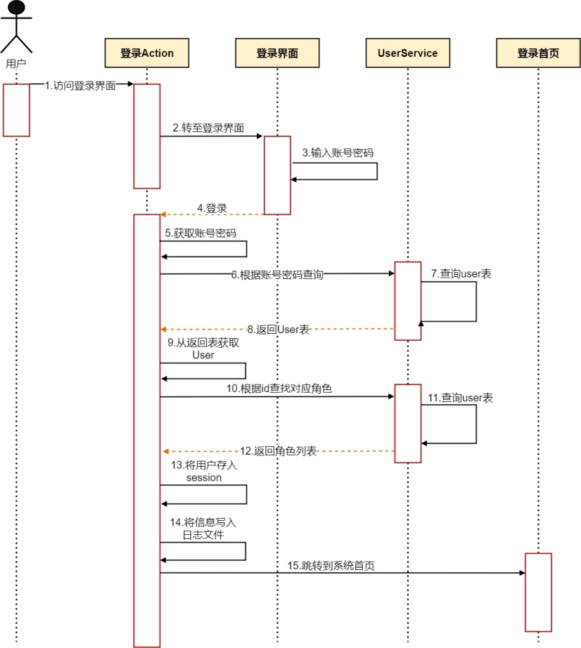

# 时序图（Sequence Diagram）

## 1. 什么是时序图？

时序图（Sequence Diagram）是 **UML（统一建模语言）** 中的一种交互图，用来描述系统中对象之间的消息传递顺序。它强调 **时间顺序**，展示了对象在特定场景下的交互过程。

## 2. 时序图的作用

* **需求分析阶段**：明确业务流程，帮助开发和测试理解需求。
* **系统设计阶段**：设计模块间的交互逻辑。
* **开发阶段**：作为开发人员编写接口和调用关系的参考。
* **测试阶段**：根据时序图设计测试用例，验证业务流程。

## 3. 时序图的常见元素

1. **参与者（Actor）**：发起交互的用户或系统，通常画在最左边。
2. **对象（Object / Lifeline）**：交互中的角色，用竖直虚线表示生命周期。
3. **消息（Message）**：对象之间传递的调用、返回、异步操作，用箭头表示。
    * 实线实箭头：同步调用
    * 实线虚箭头：返回消息
    * 虚线箭头：异步/信号
4. **激活条（Activation Bar）**：对象执行某个操作的时间段。
5. **注释（Note）**：用于补充说明。

## 4. 时序图的绘制规范

* **从左到右** 放置参与者和对象，顺序要清晰。
* **从上到下** 展示时间顺序，先发生的事件在上方。
* 每个交互过程要有始有终，尽量避免悬空调用。
* **命名清晰**：消息用方法名，避免模糊词（如“处理数据”→“checkUserAuth()”）。

## 5. 时序图示例

以“用户登录”流程为例：

