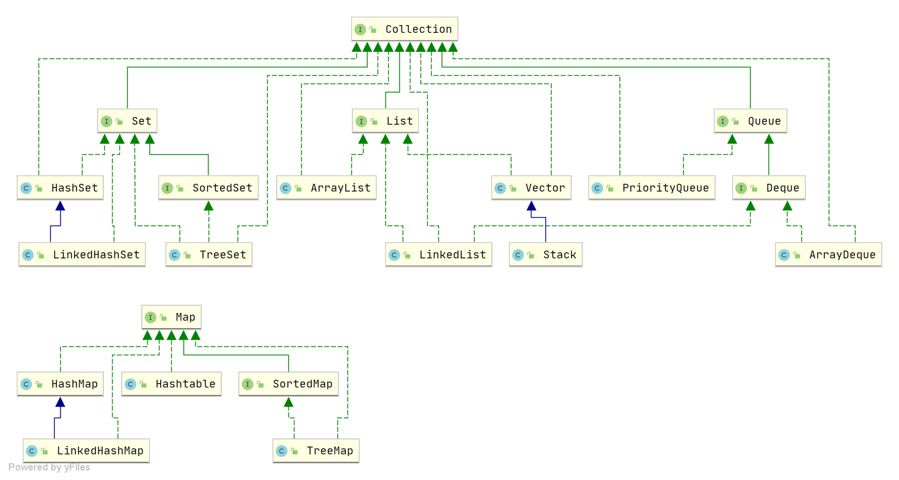

## Java中有哪些集合？

Java集合是用于存储和操作数据的框架，主要分为四大类：

1. **List**：有序、可重复，如`ArrayList`、`LinkedList`、`Vector`
2. **Set**：无序、元素唯一，如`HashSet`、`TreeSet`、`LinkedHashSet`
3. **Queue**：队列结构，先进先出，如`LinkedList`、`PriorityQueue`
4. **Map**：键值对存储，键唯一，如`HashMap`、`TreeMap`、`ConcurrentHashMap`



## List, Set, Queue, Map 有什么区别？


1. **List**：有序、可重复，如`ArrayList`、`LinkedList`
2. **Set**：无序、元素唯一，无Value，如`HashSet`、`TreeSet`
3. **Queue**：队列结构，先进先出，如`LinkedList`、`PriorityQueue`
4. **Map**：键值对存储，键唯一，如`HashMap`、`TreeMap`

## ArrayList 和 数组 有什么区别？

1. **数组**：长度固定，类型单一，性能高
2. **ArrayList**：长度可变，提供丰富的API，底层基于数组实现
3. **适用场景**：数组适合性能敏感、长度固定的场景，ArrayList更适合动态增删数据的场景

## 为什么要使用集合，如何选择？

**使用集合的原因**：
1. **动态扩容**：自动扩展容量，无需预设大小
2. **功能丰富**：提供常用操作方法
3. **类型安全**：使用泛型，避免类型错误
4. **高性能**：Java集合经过优化，效率高

**选择集合的方法**：
1. **按数据特点**：允许重复用`List`，不允许重复用`Set`，键值对存储用`Map`
2. **按线程环境**：单线程用非同步集合（`ArrayList`、`HashMap`），多线程用同步集合（`ConcurrentHashMap`）

## ArrayList 的扩容机制？

**回答：**

1. **初始容量**：默认初始容量为0（JDK 8+），首次添加元素时扩容为10
2. **扩容触发条件**：当元素数量超过当前容量时触发扩容
3. **扩容公式**：新容量 = 原容量 * 1.5（如10 → 15 → 22 → 33）
4. **数组复制**：扩容后通过`Arrays.copyOf()`复制数组，性能开销较大
5. **优化**：可通过`new ArrayList<>(初始容量)`手动预分配容量，避免频繁扩容

## Comparable 和 Comparator 的区别

| 维度 | Comparable | Comparator |
|------|------------|------------|
| 接口定义 | `compareTo()`方法，定义自然排序规则 | `compare()`方法，定义临时排序规则 |
| 耦合度 | 排序与类绑定，侵入性强 | 排序与类分离，解耦性好 |
| 使用场景 | 类的默认排序方式 | 需要额外排序规则（如逆序、按其他字段排序） |

**2. 代码对比**

**Comparable 示例**

```java
public class Person implements Comparable<Person> {
    @Override
    public int compareTo(Person other) {
        return this.age - other.age;  // 按年龄升序
    }
}
Collections.sort(people);  // 自动按默认规则排序
```

**Comparator 示例**

```java
Comparator<Person> ageComparator = (p1, p2) -> p1.getAge() - p2.getAge();  // 按年龄升序
Collections.sort(people, ageComparator);  // 按指定规则排序
```

**3. 应用场景**

* **Comparable**：自定义类的默认排序，常用于数字、字符串等基本类型
* **Comparator**：临时排序、按多个规则排序，或对未实现 `Comparable` 的类排序

## HashMap 和 Hashtable 的区别

- **HashMap面向性能，线程不安全 → 非并发场景首选**
- **Hashtable古老低效，已被ConcurrentHashMap淘汰**

| 维度 | HashMap | Hashtable |
|------|---------|-----------|
| 线程安全 | ❌ 线程不安全 | ✔ 方法全部`synchronized`，线程安全 |
| 性能 | 高（无锁） | 低（有锁） |
| null支持 | 允许1个null key、多个null value | 不允许null key/value |
| 继承体系 | 继承`AbstractMap` | 继承`Dictionary`（已过时） |
| 替代方案 | — | `ConcurrentHashMap` |

## HashMap 的底层原理是什么？

1. **底层结构**：数组 + 链表 + 红黑树
2. **定位方式**：通过`hash(key)`计算索引定位桶位
3. **冲突解决**：拉链法（链表），链表超过阈值（默认8）转红黑树提升查询效率
4. **扩容机制**：容量达到`0.75 * size`时触发扩容（2倍），并重新分配节点位置
5. **非线程安全原因**：多线程下扩容可能导致链表成环、数据覆盖

详情：[HashMap 的底层原理](/blogs/java/HashMap的底层原理.md)

### HashMap 在 JDK 1.8 做了什么优化？

1. 链表插入从**头插改尾插**——1.7 头插法多线程 resize 会死循环。
2. 引入**红黑树**——链表长度 ≥ 8 且数组 ≥ 64 时转树，查询 O(n)→O(log n)。
3. hash 扰动简化——从多次位运算简化为**高 16 位异或低 16 位一次**。

→ [回答历史](/series/答题历史/Java/java-答题记录.md#hashmap-在-jdk-18-做了什么优化)

## ConcurrentHashMap 底层结构与如何保证线程安全？

**底层结构**：`Node[]数组 + 链表 + 红黑树`，JDK8+采用**桶级锁+CAS无锁操作**替代JDK7的分段锁。

**线程安全机制**：
1. **CAS无锁操作**：插入时通过CAS设置节点，避免阻塞
2. **synchronized桶级锁**：只锁定具体桶位，粒度更细
3. **原子计数**：baseCount + CounterCells实现高效size统计

详情：[ConcurrentHashMap 的底层原理与线程安全](/blogs/java/ConcurrentHashMap的底层原理.md)

## 集合中map的遍历方式有哪些？


| 方式 | 代码示例 | 特点 |
|------|---------|------|
| KeySet | `for (String key : map.keySet())` | 需二次查找，效率低 |
| Values | `for (Integer value : map.values())` | 只能获取value |
| EntrySet | `for (Map.Entry entry : map.entrySet())` | 效率最高，一次获取键值对 |
| Lambda | `map.forEach((k,v) -> System.out.println(k+v))` | 代码简洁，函数式风格 |

**推荐使用**：
1. **性能优先**：EntrySet遍历
2. **简洁优先**：Java 8的forEach方法

## HashMap 底层数据结构？什么时候转红黑树，为什么是 8？

- 底层：**数组 + 链表 + 红黑树**（JDK 1.8+）
- 转树条件：链表长度 **≥ 8** 且数组长度 **≥ 64**。数组小于 64 优先扩容。
- 为什么是 8：**泊松分布概率**，hash 冲突达到 8 的概率约 0.00000006，极其罕见。小于 8 时链表 O(n) 足够，转树后 TreeNode 内存占用更大，不划算。
- 退化：树节点 ≤ 6 时退回链表。

→ [回答历史](/series/答题历史/Java/java-答题记录.md#hashmap-底层数据结构什么时候转红黑树为什么是-8)