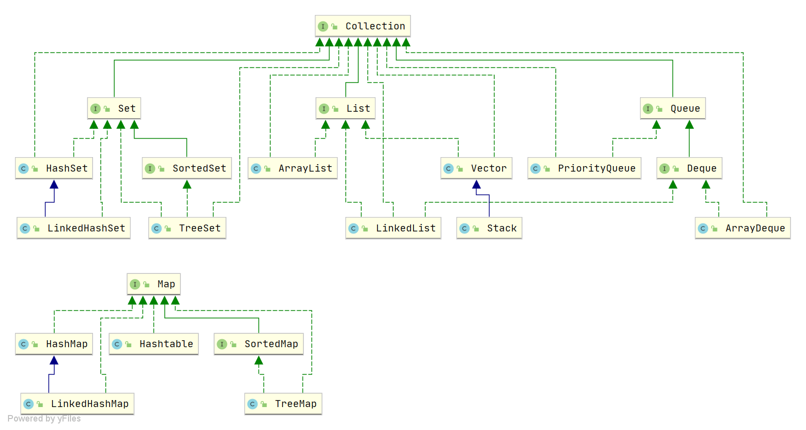

## Java中有哪些集合？
**回答：**
Java集合是用于存储和操作数据的框架，主要分为四大类：

* **List**：有序、可重复，如 `ArrayList`、`LinkedList`、`Vector`
* **Set**：无序、元素唯一，如 `HashSet`、`TreeSet`、`LinkedHashSet`
* **Queue**：队列结构，先进先出，如 `LinkedList`、`PriorityQueue`
* **Map**：键值对存储，键唯一，如 `HashMap`、`TreeMap`、`ConcurrentHashMap`




## List, Set, Queue, Map 有什么区别？

* **List**：有序、可重复，如 `ArrayList`、`LinkedList`
* **Set**：无序、元素唯一，无 Value，如 `HashSet`、`TreeSet`
* **Queue**：队列结构，先进先出，如 `LinkedList`、`PriorityQueue`
* **Map**：键值对存储，键唯一，如 `HashMap`、`TreeMap`

## ArrayList 和 数组 有什么区别？

**回答：**

* **数组**：长度固定，类型单一，性能高
* **ArrayList**：长度可变，提供丰富的API，底层基于数组实现
* **适用场景**：数组适合性能敏感、长度固定的场景，ArrayList 更适合动态增删数据的场景

## 为什么要使用集合，如何选择？

**一、使用集合的原因**

1. **动态扩容**：自动扩展容量，无需预设大小
2. **功能丰富**：提供常用操作方法
3. **类型安全**：使用泛型，避免类型错误
4. **高性能**：Java 集合经过优化，效率高

**二、选择集合的方法**

1. **按数据特点**：

    * 允许重复：用 `List`（`ArrayList`、`LinkedList`）
    * 不允许重复：用 `Set`（`HashSet`、`TreeSet`）
    * 键值对存储：用 `Map`（`HashMap`、`TreeMap`）
2. **按线程环境**：

    * 单线程：用非同步集合（`ArrayList`、`HashMap`）
    * 多线程：用同步集合（`Vector`、`ConcurrentHashMap`）

## ArrayList 的扩容机制？

**回答：**

1. **初始容量**：默认初始容量为 0（JDK 8+ 后），首次添加元素时扩容为 10。
2. **扩容触发条件**：当元素数量超过当前容量时触发扩容。
3. **扩容公式**：新容量 = **原容量 \* 1.5**（如 10 → 15 → 22 → 33）。
4. **数组复制**：扩容后通过 `Arrays.copyOf()` 复制数组，性能开销较大。
5. **优化**：可通过 `new ArrayList<>(初始容量)` 手动预分配容量，避免频繁扩容。

**面试答题模板**：

```text
1. 初始容量：默认 0，首次添加扩容为 10。
2. 触发条件：元素数量超过当前容量。
3. 扩容公式：原容量 * 1.5。
4. 数组复制：使用 `Arrays.copyOf()`，性能开销大。
5. 优化：预分配容量提升性能。
```

**源码验证（JDK 17）**
```java
private void grow(int minCapacity) {
    int oldCapacity = elementData.length;
    int newCapacity = oldCapacity + (oldCapacity >> 1); // 1.5倍
    if (newCapacity - minCapacity < 0)
        newCapacity = minCapacity; // 若1.5倍不够，直接用minCapacity
    if (newCapacity - MAX_ARRAY_SIZE > 0)
        newCapacity = hugeCapacity(minCapacity); // 处理超大容量
    elementData = Arrays.copyOf(elementData, newCapacity); // 复制数组
}
```

## Comparable 和 Comparator 的区别

**1. 核心区别**

| **维度**   | **Comparable**            | **Comparator**          |
| -------- | ------------------------- | ----------------------- |
| **接口定义** | `compareTo()` 方法，定义自然排序规则 | `compare()` 方法，定义临时排序规则 |
| **耦合度**  | 排序与类绑定，侵入性强               | 排序与类分离，解耦性好             |
| **使用场景** | 类的默认排序方式                  | 需要额外排序规则（如逆序、按其他字段排序）   |

**2. 代码对比**

**Comparable 示例**

```java
public class Person implements Comparable<Person> {
    @Override
    public int compareTo(Person other) {
        return this.age - other.age;  // 按年龄升序
    }
}
Collections.sort(people);  // 自动按默认规则排序
```

**Comparator 示例**

```java
Comparator<Person> ageComparator = (p1, p2) -> p1.getAge() - p2.getAge();  // 按年龄升序
Collections.sort(people, ageComparator);  // 按指定规则排序
```

**3. 应用场景**

* **Comparable**：自定义类的默认排序，常用于数字、字符串等基本类型
* **Comparator**：临时排序、按多个规则排序，或对未实现 `Comparable` 的类排序

## **HashMap 和 Hashtable 的区别**

* **HashMap 面向性能，线程不安全 → 非并发场景首选。**
* **Hashtable 古老低效，已被 ConcurrentHashMap 淘汰。**

| **维度**      | **HashMap**                     | **Hashtable**                     |
| ----------- | ------------------------------- | --------------------------------- |
| **线程安全**    | ❌ 线程不安全                         | ✔ 方法全部 `synchronized`，线程安全        |
| **性能**      | 高（无锁）                           | 低（有锁）                             |
| **null 支持** | 允许 *1 个 null key*、多个 null value | 不允许 null key/value                |
| **迭代器**     | `Iterator`，fail-fast            | `Enumerator`，非 fail-fast          |
| **继承体系**    | 继承 `AbstractMap`                | 继承 `Dictionary`（已过时）              |
| **使用场景**    | 普通场景，高性能需求                      | 老旧代码；一般用 `ConcurrentHashMap` 替代   |
| **替代方案**    | —                               | `ConcurrentHashMap`（更细粒度锁 + 更高并发） |

## **HashMap 的底层原理是什么？**

* **底层结构**：数组 + 链表 + 红黑树。
* **定位方式**：通过 `hash(key)` 计算索引定位桶位。
* **冲突解决**：拉链法（链表），链表超过阈值（默认 8）转红黑树提升查询效率。
* **扩容机制**：容量达到 `0.75 * size` 时触发扩容（2 倍），并重新分配节点位置。
* **非线程安全原因**：多线程下扩容可能导致链表成环、数据覆盖。

详情：[HashMap 的底层原理](/blogs/java/HashMap的底层原理.md)

## **ConcurrentHashMap 底层结构与如何保证线程安全？**

**底层结构**：`Node[]数组 + 链表 + 红黑树`，JDK8+采用**桶级锁+CAS无锁操作**替代JDK7的分段锁。

**线程安全机制**：
- **CAS无锁操作**：插入时通过CAS设置节点，避免阻塞
- **synchronized桶级锁**：只锁定具体桶位，粒度更细
- **原子计数**：baseCount + CounterCells实现高效size统计

详情：[ConcurrentHashMap 的底层原理与线程安全](/blogs/java/ConcurrentHashMap的底层原理.md)


## 集合中map的遍历方式有哪些？

### 四种遍历方式

| 方式 | 代码示例 | 特点 |
|------|---------|------|
| **KeySet** | `for (String key : map.keySet())` | 需二次查找，效率低 |
| **Values** | `for (Integer value : map.values())` | 只能获取value |
| **EntrySet** | `for (Map.Entry entry : map.entrySet())` | 效率最高，一次获取键值对 |
| **Lambda** | `map.forEach((k,v) -> System.out.println(k+v))` | 代码简洁，函数式风格 |

### 推荐使用
1. **性能优先**：EntrySet遍历
2. **简洁优先**：Java 8的forEach方法
