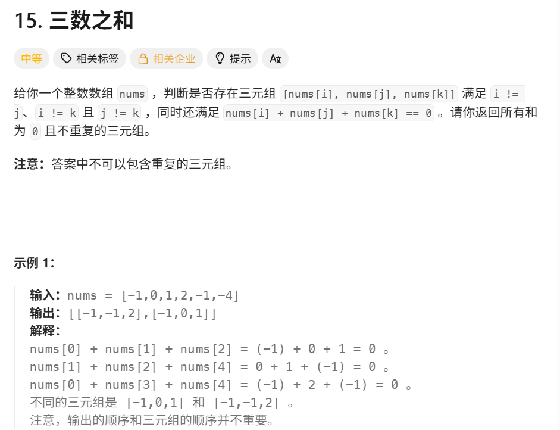

### [1.三数之和](https://leetcode.cn/problems/3sum/description/?envType=study-plan-v2&envId=top-100-liked)



```java
class Solution {
    public List<List<Integer>> threeSum(int[] nums) {
        List<List<Integer>> result = new ArrayList<>();
        // 对数组进行排序，排序后便于使用双指针法，利用数组的有序性提高查找效率
        Arrays.sort(nums);

        // 遍历数组，i 作为第一个数的索引，最多遍历到倒数第三个元素，因为后面需要两个元素与它组成三元组
        for (int i = 0; i < nums.length - 2; i++) {
            // 跳过重复的 i 值，避免结果集中出现重复的三元组
            if (i > 0 && nums[i] == nums[i - 1]) {
                continue;
            }

            // 左指针初始化为 i 的下一个位置
            int left = i + 1;
            // 右指针初始化为数组的最后一个位置
            int right = nums.length - 1;

            // 当左指针小于右指针时，继续循环查找满足条件的三元组
            while (left < right) {
                // 计算当前三个数的和
                int sum = nums[i] + nums[left] + nums[right];
                if (sum == 0) {
                    // 如果和为 0，说明找到了一个满足条件的三元组，将其加入结果集
                    result.add(Arrays.asList(nums[i], nums[left], nums[right]));
                    // 跳过重复的 left 值，避免结果集中出现重复的三元组
                    while (left < right && nums[left] == nums[left + 1]) {
                        left++;
                    }
                    // 跳过重复的 right 值，避免结果集中出现重复的三元组
                    while (left < right && nums[right] == nums[right - 1]) {
                        right--;
                    }
                    // 移动左指针和右指针，继续寻找下一个满足条件的三元组
                    left++;
                    right--;
                } else if (sum < 0) {
                    // 如果和小于 0，说明需要增大和，将左指针右移
                    left++;
                } else {
                    // 如果和大于 0，说明需要减小和，将右指针左移
                    right--;
                }
            }
        }
        return result;
    }
}
```

### 十一、和为 K 的子数组（Subarray Sum Equals K）

#### 🧩 题目描述

给定一个整数数组 `nums` 和一个整数 `k`，请你统计并返回和为 `k` 的连续子数组的个数。

- 输入：`nums = [1,2,3], k = 3`
- 输出：`2`（[1,2] 与 [3]）

---

#### 📘 解题思路解析

我们可以使用「前缀和 + 哈希表」来降低时间复杂度：

##### ✅ 思路步骤

1. 设定前缀和 `preSum[i]` 表示 `nums[0] + nums[1] + ... + nums[i - 1]`
2. 若某两个前缀和之差为 `k`，即：`preSum[j] - preSum[i] = k`，则说明区间 `[i, j-1]` 的和为 `k`
3. 使用一个 `Map<Integer, Integer>` 存储当前前缀和出现的次数
4. 每次遍历当前前缀和 `sum`，判断 `sum - k` 是否在 map 中，如果存在，说明存在若干个之前的前缀和，使得它们与当前的前缀构成和为 `k` 的子数组

---

#### 💡 为什么 `map.put(0, 1)`？

我们初始化时设定 `preSum[0] = 0`，表示「前面没有元素时，前缀和为 0」，这样可以处理「从开头就满足条件的子数组」。

---

#### ✅ Java 实现

```java
public int subarraySum(int[] nums, int k) {
    Map<Integer, Integer> preSumCount = new HashMap<>();
    preSumCount.put(0, 1); // 初始化前缀和为0的个数为1

    int sum = 0, count = 0;
    for (int num : nums) {
        sum += num;

        // 判断之前是否有某段前缀和，使得当前sum - preSum = k
        if (preSumCount.containsKey(sum - k)) {
            count += preSumCount.get(sum - k);
        }

        // 更新当前前缀和出现次数
        preSumCount.put(sum, preSumCount.getOrDefault(sum, 0) + 1);
    }
    return count;
}

