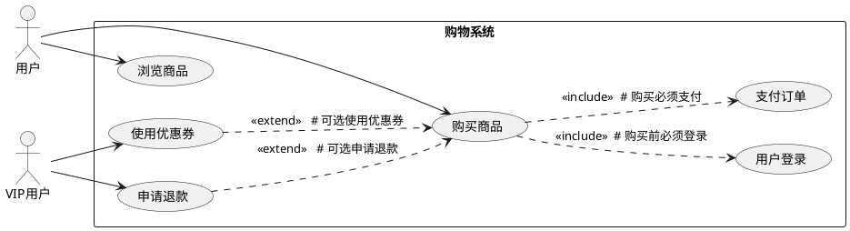

## 用例图中extend与include的区别

**回答：**

### **核心区别**

| 特性 | **include（包含）** | **extend（扩展）** |
|------|-------------------|-------------------|
| **目的** | 复用公共用例，避免重复 | 添加可选功能，增强主用例 |
| **执行方式** | **必须执行**的公共步骤 | **条件触发**的可选步骤 |
| **方向** | 基础用例 → 包含用例 | 扩展用例 → 基础用例 |
| **场景** | 多个用例共享相同步骤 | 在特定条件下增强功能 |

### **简单理解**

* **include** = 必做事项（如：登录后才能操作）
* **extend** = 可选事项（如：VIP用户额外功能）

### **PlantUML 示例**

### **代码说明**

1. **include关系**（虚线箭头+`<<include>>`）：
   - `购买商品` 必须包含 `用户登录`
   - `购买商品` 必须包含 `支付订单`

2. **extend关系**（虚线箭头+`<<extend>>`）：
   - `使用优惠券` 可选扩展 `购买商品`（VIP专享）
   - `申请退款` 可选扩展 `购买商品`（条件触发）

### **记忆口诀**

> **"包含必做，扩展可选"**
> 
> include：没有我，你干不了  
> extend：没有我，你照样干，有了我更香

