# FlowMind

**基于 RuoYi-Cloud + Flowable 的智能工作流管理系统 v2.1.0，集成 AI 智能设计与审批能力**

## 🧠项目简介

FlowMind 是一款基于 **RuoYi-Cloud** 扩展的 **智能流程审批系统**，在保留 RuoYi-Cloud 原有功能基础上，集成了 **AI 能力** 实现智能意图识别、流程自动生成和审批意见智能推荐，并新增审批中心、草稿箱等企业级流程管理功能。

系统采用 **微服务架构**，包含三个主要子项目：

| 子项目 | 技术栈 | 端口 | 职责 |
| --- | --- | --- | --- |
| **flowmind-ui** | Vue 3 + Element Plus | 5173 / 80 | 用户界面、AI 助手、审批中心 |
| **flowmind-cloud** | Spring Cloud + Flowable | 8080 | 业务逻辑、Flowable 流程引擎 |
| **flowmind-ai-flow** | FastAPI + LangGraph | 8000 | AI 意图识别、流程设计、表单生成 |

---

## ✨ 核心特性

### 🤖 AI 智能设计

通过 **自然语言描述**，自动生成流程分类、BPMN 流程结构和用户表单：

| 功能 | 说明 |
| --- | --- |
| **AI 设计分类** | 自然语言描述 → 自动生成流程分类 |
| **AI 设计流程** | 业务需求描述 → 自动生成 BPMN 2.0 流程 |
| **AI 设计表单** | 表单内容描述 → 自动生成 v-form-designer 表单 |
| **React 模式** | 基于 ReAct 架构的智能 Agent，支持多轮追问 |
| **追问优化** | AI 主动询问细节，持续优化设计结果直到满意 |

### 🧠 ReAct 模式 Agent

全新的 Agent 架构，采用 **Reasoning + Acting** 模式：

- **智能推理**：AI 分析用户意图，规划执行步骤
- **工具调用**：动态调用 BPMN 设计、表单生成等工具
- **追问机制**：主动询问缺失信息，确保设计完整
- **结果验证**：自动验证生成结果的正确性

### 🛡️ 四层校验架构

AI 生成结果经过四层校验 + 分阶段写库，确保产出可靠：

| 校验层 | 说明 |
| --- | --- |
| **字段锁定** | LLM 只输出扁平骨架，assignee/data_type 等运行时属性由程序注入 |
| **节点/连线校验** | 在 JSON 层校验节点与连线结构，生成 BPMN 前拦截错误 |
| **BPMN 校验** | 校验 BPMN XML，失败可反馈重试 |
| **部署回流** | 部署失败时错误反馈驱动 LLM 自我修正，防死循环兜底 |

### 💬 全局 AI 助手

悬浮式 AI 助手，随时随地调用 AI 能力：

- 对话历史自动保存
- 支持查看、继续和删除对话
- 一键跳转到对应设计页面

### 📋 审批中心

统一的流程审批管理界面：

- **待办事项**：需要处理的审批任务
- **已办事项**：已完成的审批记录
- **我的流程**：我发起的流程申请
- **待签收**：需要签收的任务

### 📦 草稿箱

- 流程草稿随时保存
- 编辑、删除、提交
- 与审批中心无缝集成

---

## 💻 技术架构

- **前端**：Vue 3 + Element Plus + Vite + BPMN-JS + v-form-designer
- **后端**：Spring Boot 3.x + Spring Cloud + Flowable 6.x + Nacos
- **AI**：FastAPI + LangChain + LangGraph + Redis
- **基础设施**：MySQL + Redis + Docker

### 服务通信架构

```
flowmind-ui → flowmind-cloud → Flowable 流程引擎
     ↓              ↓
     └───────────────┴──→ flowmind-ai-flow (SSE/WebSocket)
```

### 系统架构图

```
┌─────────────────────────────────────────────────────────────────┐
│                        前端层 (flowmind-ui)                      │
│              Vue 3 + Element Plus + BPMN-JS                     │
└─────────────────────────────────────────────────────────────────┘
                              │
                              ▼ HTTP
┌─────────────────────────────────────────────────────────────────┐
│                    API 网关 (Spring Cloud Gateway)               │
└─────────────────────────────────────────────────────────────────┘
                    │                       │
                    ▼                       ▼
         ┌──────────────────┐    ┌─────────────────────┐
         │  业务模块        │    │  AI 服务            │
         │  (Flowable)      │    │  (FastAPI+LangGraph)│
         └──────────────────┘    └─────────────────────┘
```

---

## 📋 主要功能

### RuoYi-Cloud 原有功能

1. 用户管理：用户是系统操作者，该功能主要完成系统用户配置。
2. 部门管理：配置系统组织机构（公司、部门、小组），树结构展现支持数据权限。
3. 岗位管理：配置系统用户所属担任职务。
4. 菜单管理：配置系统菜单，操作权限，按钮权限标识等。
5. 角色管理：角色菜单权限分配、设置角色按机构进行数据范围权限划分。
6. 字典管理：对系统中经常使用的一些较为固定的数据进行维护。
7. 参数管理：对系统动态配置常用参数。
8. 通知公告：系统通知公告信息发布维护。
9. 操作日志 / 登录日志：系统操作与登录日志记录和查询。
10. 在线用户：当前系统中活跃用户状态监控。
11. 定时任务：在线（添加、修改、删除）任务调度包含执行结果日志。
12. 代码生成：前后端代码的生成（java、html、xml、sql）支持 CRUD 下载。
13. 系统接口：根据业务代码自动生成相关的 api 接口文档。
14. 服务监控：监视当前系统 CPU、内存、磁盘、堆栈等相关信息。
15. 在线构建器：拖动表单元素生成相应的 HTML 代码。
16. 连接池监视：监视当前系统数据库连接池状态，可进行分析 SQL 找出系统性能瓶颈。

### FlowMind 新增功能

17. **审批中心**：
    - 待办任务：显示当前用户需要处理的任务列表
    - 已办任务：显示当前用户已经处理完成的任务列表
    - 待签任务：显示当前用户可以签收的任务列表
    - 我的流程：显示当前用户发起的流程实例列表
    - 流程详情：查看流程实例的详细信息、流程图和审批记录

18. **草稿箱**：
    - 草稿列表：显示用户保存的流程草稿列表
    - 草稿编辑：支持编辑已保存的草稿，继续完善流程申请
    - 草稿删除：支持删除不需要的草稿
    - 草稿转正：支持将草稿直接转换为正式流程申请

19. **AI 智能设计**：
    - AI 设计分类：自然语言描述 → 自动生成流程分类
    - AI 设计流程：业务需求描述 → 自动生成 BPMN 2.0 流程
    - AI 设计表单：表单内容描述 → 自动生成 v-form-designer 表单

20. **ReAct 模式 Agent**：
    - 基于 ReAct 架构的智能 Agent，支持多轮追问
    - 主动询问细节，持续优化设计结果直到满意

21. **四层校验架构**：
    - 字段锁定：运行时属性由程序注入，LLM 不乱造字段
    - 节点/连线/BPMN 校验：JSON 层与 XML 层双重校验
    - 部署回流：部署失败反馈驱动 AI 自我修正，防死循环

22. **全局 AI 助手**：
    - 悬浮式全局 AI 助手
    - 对话历史管理与一键跳转

---

## 📁 项目结构

```
flowmind/
├── flowmind-ui/                  # 前端项目（Vue 3 + Element Plus）
├── flowmind-cloud/               # 后端微服务（Spring Cloud + Flowable）
│   ├── flowmind-gateway          # 网关模块
│   ├── flowmind-auth             # 认证中心
│   ├── flowmind-api              # 接口模块
│   ├── flowmind-common           # 通用模块（core/datascope/datasource/log/redis/security/swagger）
│   ├── flowmind-modules          # 业务模块（system/gen/job/file/flowable）
│   └── flowmind-visual           # 图形化（monitor）
├── flowmind-ai-flow/             # AI 服务（FastAPI + LangGraph）
│   └── ai-service/               # AI 核心服务
├── docker/                       # Docker 编排与配置
├── sql/                          # 数据库脚本
└── docs/                         # 项目文档
```

---

## 🚀 快速开始

### 生产环境（Docker 一键启动）

一键构建：Java 后端 + 前端，并复制构建产物到 Docker 目录：

```bash
bin\build.bat
```

构建产物：

- Java JAR → `docker/cloud/ruoyi/*/jar/`
- 前端 dist → `docker/cloud/nginx/html/dist/`

启动：

```bash
cd docker\flowmind
docker-compose -f docker-compose.prod.yml up -d --build
```

### 开发环境（启动脚本）

前提：Docker 服务已启动且可用

```bash
bin\start.bat
```

自动启动：Docker 基础环境 → Java 后端 → 前端

**已启动服务**：Gateway (9001)、Auth (9200)、System (9201)、Flowable (9204)

**未启动（可选）**：File (9202)、Gen (9203)、Job (9205)、Visual

AI 服务（需单独启动）：

```bash
cd flowmind-ai-flow/ai-service
poetry install
poetry run uvicorn app.main:app --reload --host 0.0.0.0 --port 8000
```

### 服务端口

| 服务 | 端口 | 访问地址 |
| --- | --- | --- |
| 前端 | 5173 / 80 | http://localhost:5173 |
| API 网关 | 8080 | http://localhost:8080 |
| AI 服务 | 8000 | http://localhost:8000 |
| Nacos | 8848 | http://localhost:8848/nacos |
| MySQL | 3306 | localhost:3306 |
| Redis | 6379 | localhost:6379 |

---

## 🌐 在线体验

演示地址：https://codebyggbond.dpdns.org/series/myprojects/FlowMind/

测试账号：admin/123456

---

## 🖼️ 项目预览

### AI 功能

| 全局 AI 助手 | 对话历史管理 |
| --- | --- |
| 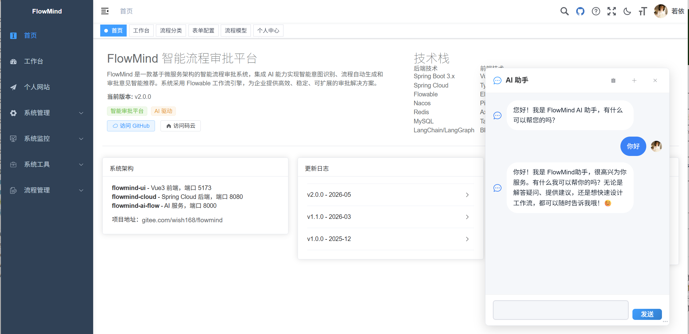 |  |

| AI 设计分类 | AI 生成流程 |
| --- | --- |
|  | 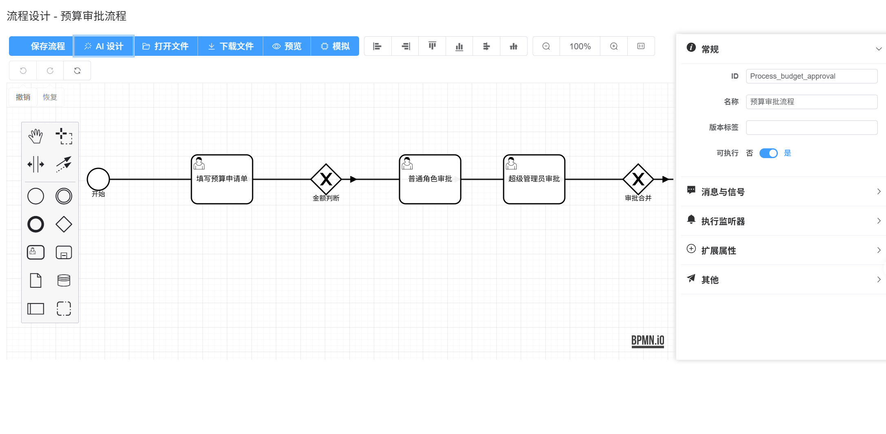 |

### OA 工作台

| 工作台 | 流程发起 |
| --- | --- |
| 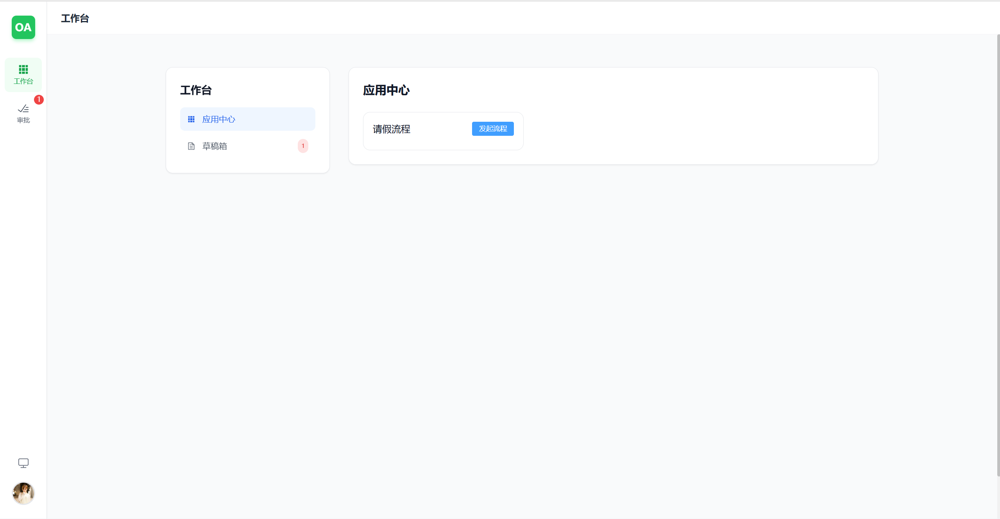 | 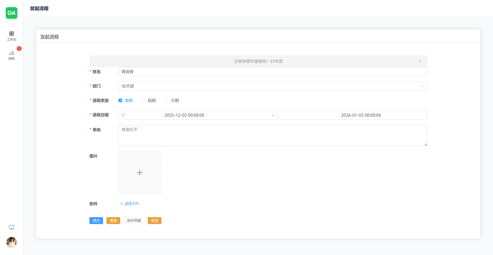 |

| 审批中心 | 我的流程 |
| --- | --- |
| 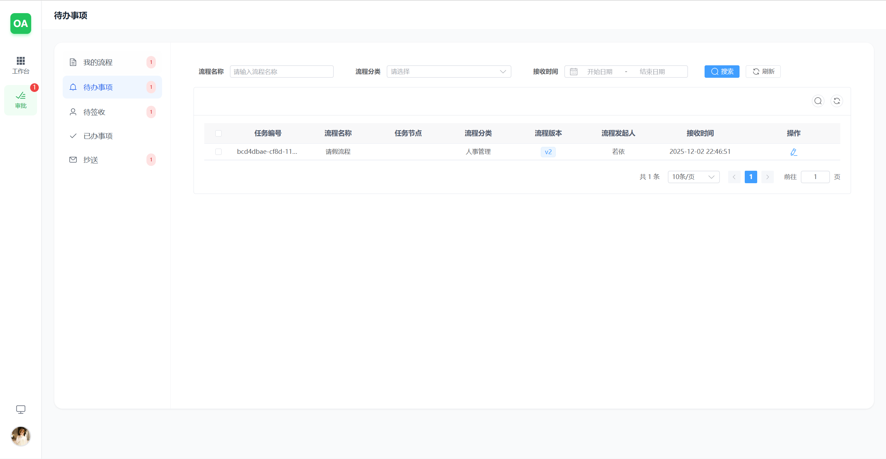 | 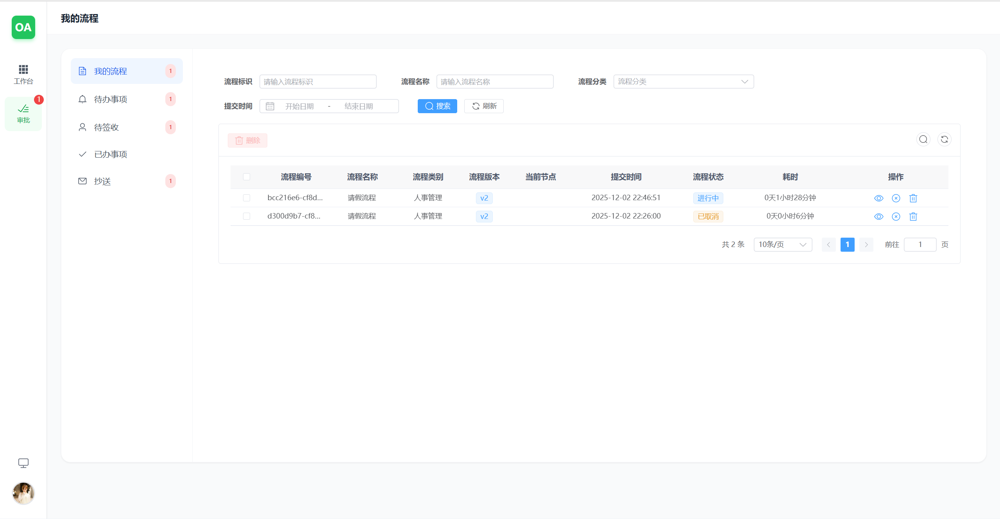 |

### 流程管理

| 流程分类 | 流程设计 |
| --- | --- |
| 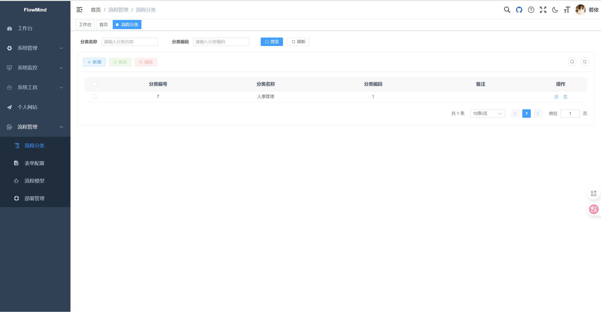 | 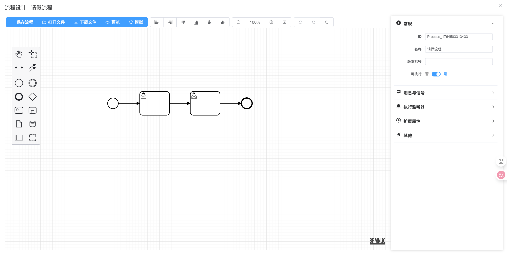 |

| 流程部署 | 表单编辑 |
| --- | --- |
| 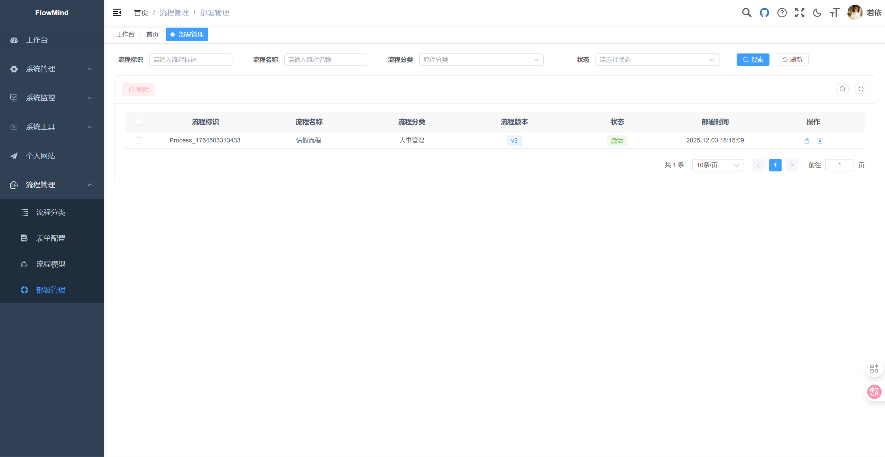 | 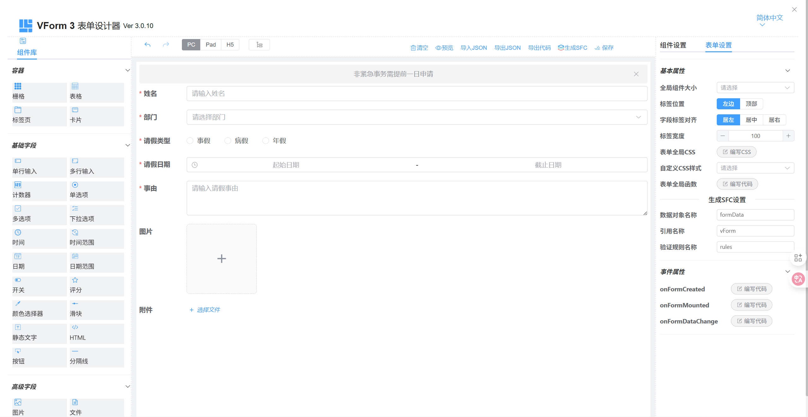 |

### 草稿箱

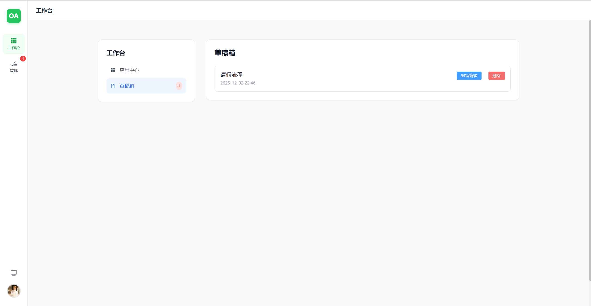

### 个人信息


---

## 📄 项目仓库

| 平台 | 地址 |
| --- | --- |
| **GitHub** | https://github.com/Moonlight168/flowmind |
| **Gitee** | https://gitee.com/wish168/flowmind |

### 子项目详情

| 项目 | 描述 |
| --- | --- |
| [flowmind-ui](https://github.com/Moonlight168/flowmind/tree/main/flowmind-ui) | 前端项目，Vue 3 + Element Plus |
| [flowmind-cloud](https://github.com/Moonlight168/flowmind/tree/main/flowmind-cloud) | 后端项目，Spring Cloud + Flowable |
| [flowmind-ai-flow](https://github.com/Moonlight168/flowmind/tree/main/flowmind-ai-flow) | AI 服务，FastAPI + LangGraph |

## 📚 相关教程

- [完整教程：基于Python的审批智能体实现及接入FlowMind系统](../../../../blogs/开发工具/实践出真知/完整教程：基于Python的单一功能审批智能体实现及接入Spring Cloud Alibaba.md)

---

## 🛡️ 版权信息

本项目基于 [RuoYi-Cloud](https://gitee.com/y_project/RuoYi-Cloud) 进行扩展开发，遵循 [Apache License 2.0](https://github.com/Moonlight168/flowmind/blob/master/LICENSE) 开源协议。