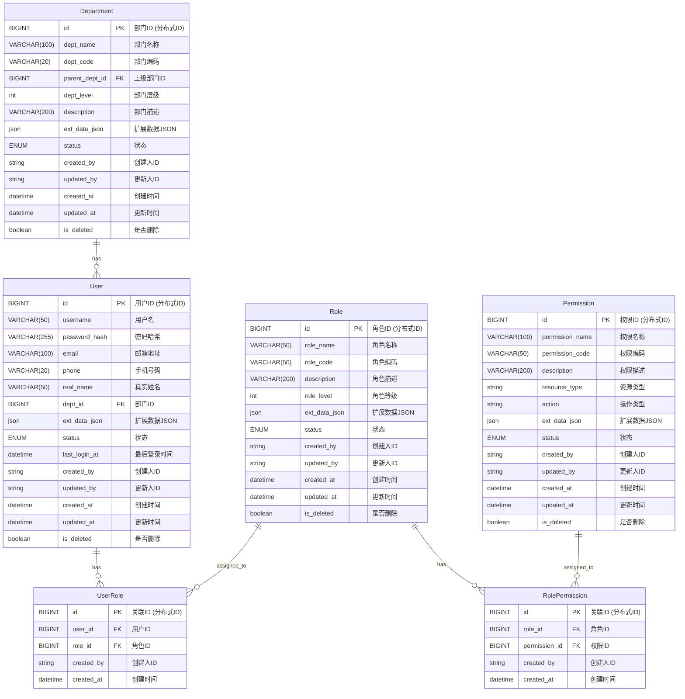
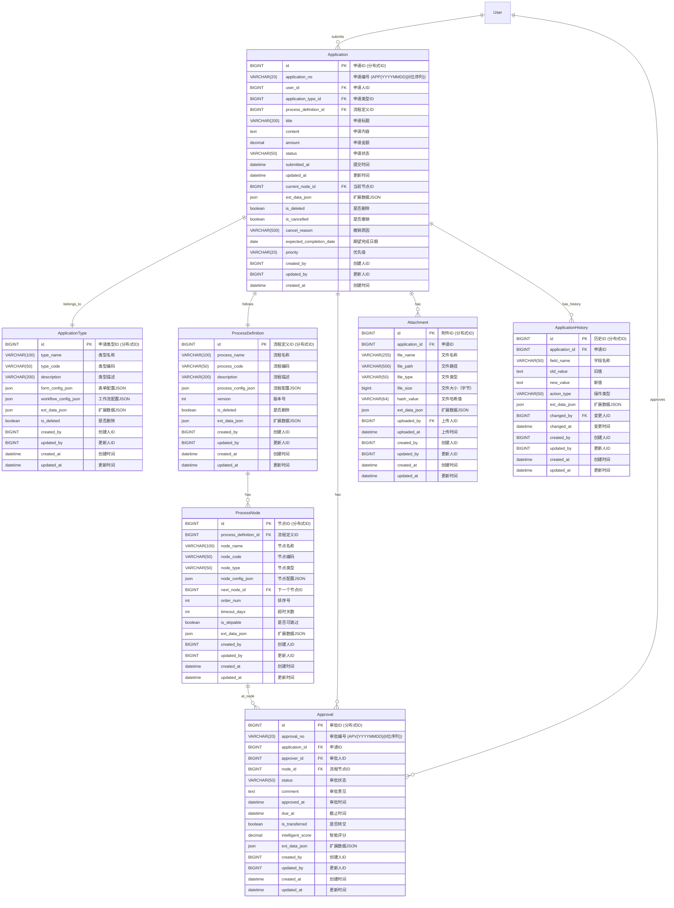
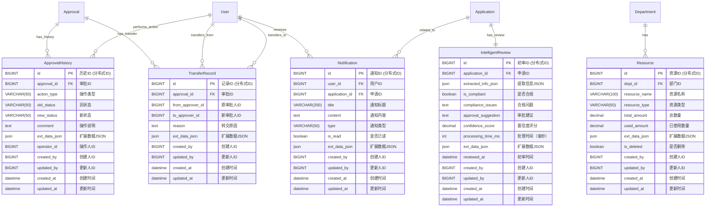

# FlowMind 系统ER图设计与优化

## 1. ER图概述

ER图（Entity-Relationship Diagram，实体-关系图）是数据库设计的重要工具，用于描述系统中实体之间的关系。FlowMind智能审批系统的ER图经过精心设计，确保数据结构清晰、关系明确、易于理解和维护。

## 2. 设计原则

### 2.1 设计目标
- **结构清晰**：实体关系清晰，便于理解和维护
- **关系明确**：一对一、一对多、多对多关系明确定义
- **可扩展性**：支持未来业务功能的扩展
- **规范化**：遵循数据库规范化原则，减少数据冗余
- **性能优化**：合理设计关系，支持高效查询

### 2.2 设计规范
- **实体命名**：使用单数形式，首字母大写，如 `User`、`Application`
- **关系命名**：使用动词短语描述关系，如 `has`、`belongs_to`
- **属性命名**：使用小写字母，多个单词用下划线分隔，如 `created_at`
- **主键标识**：使用下划线标注主键，如 `id`
- **外键标识**：使用虚线箭头表示外键关系

## 3. 主键设计说明

### 3.1 分布式ID策略

考虑到微服务架构需求，本系统采用**分布式ID生成策略**，确保跨服务数据唯一性。

#### 3.1.1 ID生成方案
- **雪花算法（Snowflake）**：64位长整型，包含时间戳、机器ID、序列号，作为主键ID
- **业务ID字段**：关键业务表增加业务编号字段，用于用户可见的业务标识
- **内部ID**：主键`id`使用雪花算法生成的分布式ID，确保全局唯一性

#### 3.1.2 业务ID设计
- **申请相关表**：`applications`表增加`application_no`字段，格式：`APP{YYYYMMDD}{6位序列}`
- **审批相关表**：`approvals`表增加`approval_no`字段，格式：`APV{YYYYMMDD}{6位序列}`
- **用户可见**：业务ID用于前端展示、查询和业务流转
- **内部关联**：数据库关联仍使用自增主键`id`

### 3.2 主键类型选择

| 特性 | 自增主键 | 分布式ID |
|------|--------|---------|
| **唯一性** | 单机唯一 | 全局唯一，分布式友好 |
| **性能** | 索引效率高，存储空间小 | 索引效率高，存储空间适中 |
| **可读性** | 较好，易于理解 | 业务ID可读性好 |
| **扩展性** | 单机扩展困难 | 天然支持分布式 |

**最终选择**：
- 主键`id`：使用雪花算法生成的分布式ID（BIGINT类型），确保跨服务全局唯一性
- 业务ID：关键业务表增加业务编号字段，用于用户可见的业务标识

## 4. 核心实体关系图

### 4.1 用户权限模块ER图



**中文注释说明：**
- **User（用户）**：系统用户实体，包含基本信息和部门关联
- **Role（角色）**：系统角色实体，定义用户权限集合
- **Permission（权限）**：系统权限实体，定义具体操作权限
- **Department（部门）**：组织架构实体，支持多级部门结构
- **UserRole（用户角色关联）**：用户与角色的多对多关系
- **RolePermission（角色权限关联）**：角色与权限的多对多关系

### 4.2 申请流程模块ER图



**中文注释说明：**
- **Application（申请）**：核心申请实体，关联用户、类型、流程等信息
- **ApplicationType（申请类型）**：定义不同类型的申请，包含表单和工作流配置
- **ProcessDefinition（流程定义）**：审批流程的定义，包含多个流程节点
- **ProcessNode（流程节点）**：流程中的各个审批节点，支持顺序流转
- **Approval（审批）**：具体的审批记录，关联申请、审批人、流程节点
- **Attachment（附件）**：申请相关的附件文件
- **ApplicationHistory（申请历史）**：申请数据的变更历史记录

### 4.3 历史记录与辅助功能模块ER图



**中文注释说明：**
- **ApprovalHistory（审批历史）**：记录审批过程中的所有操作历史
- **TransferRecord（转交记录）**：记录审批任务的转交情况
- **Notification（通知）**：系统通知消息，关联用户和申请
- **Resource（资源）**：部门资源管理，支持资源申请和分配
- **IntelligentReview（智能初审）**：AI智能初审结果，关联申请

## 5. 表结构优化说明

### 5.1 扩展性设计

#### 5.1.1 JSON扩展字段
所有主要表都包含 `ext_data_json` 字段，支持以下扩展场景：
- **动态字段**：无需修改表结构即可添加新字段
- **配置信息**：存储业务配置和参数
- **临时数据**：存储计算过程中的临时数据
- **第三方集成**：存储外部系统的数据映射

**示例应用场景：**
```json
{
  "custom_fields": {
    "project_code": "PROJ2024001",
    "cost_center": "CC001",
    "business_line": "BL_01"
  },
  "workflow_config": {
    "auto_approve_amount": 1000,
    "skip_manager_level": true
  },
  "integration_data": {
    "erp_system_id": "ERP123",
    "crm_account_id": "CRM456"
  }
}
```

#### 5.1.2 审计字段标准化
所有表都包含以下审计字段，确保数据的可追溯性：
- **created_at**：记录数据创建时间
- **updated_at**：记录数据最后更新时间
- **created_by**：记录数据创建人
- **updated_by**：记录数据最后更新人

这些字段通过数据库触发器自动维护，确保审计信息的准确性和完整性。

### 5.2 性能优化

#### 5.2.1 索引设计
基于业务查询需求，设计了以下核心索引：

```sql
-- 申请查询优化
CREATE INDEX idx_applications_user_status ON applications(user_id, status);
CREATE INDEX idx_applications_type_status ON applications(application_type_id, status);
CREATE INDEX idx_applications_submitted_status ON applications(submitted_at, status);
CREATE INDEX idx_applications_application_no ON applications(application_no);

-- 审批任务查询优化  
CREATE INDEX idx_approvals_approver_status ON approvals(approver_id, status);
CREATE INDEX idx_approvals_due_status ON approvals(due_at, status);
CREATE INDEX idx_approvals_approval_no ON approvals(approval_no);

-- 通知查询优化
CREATE INDEX idx_notifications_user_read ON notifications(user_id, is_read);

-- 逻辑删除查询优化
CREATE INDEX idx_users_is_deleted ON users(is_deleted);
CREATE INDEX idx_roles_is_deleted ON roles(is_deleted);
CREATE INDEX idx_permissions_is_deleted ON permissions(is_deleted);
CREATE INDEX idx_departments_is_deleted ON departments(is_deleted);
```

#### 5.2.2 全文搜索索引
对于内容搜索需求：

```sql
-- 申请表全文索引
ALTER TABLE applications ADD FULLTEXT ft_applications_search (title, content);

-- 审批意见全文索引  
ALTER TABLE approvals ADD FULLTEXT ft_approvals_search (comment);
```

### 5.3 数据完整性

#### 5.3.1 外键约束
- 所有外键关系都设置了外键约束，确保数据引用的完整性
- 关联表使用级联删除，如user_roles、role_permissions等
- 业务数据表使用限制删除，防止误删除重要数据

#### 5.3.2 唯一约束
- 用户表：username、email字段设置唯一约束
- 角色表：role_name、role_code字段设置唯一约束
- 权限表：permission_name、permission_code字段设置唯一约束
- 部门表：dept_code字段设置唯一约束
- 申请类型表：type_name、type_code字段设置唯一约束
- 流程定义表：process_code字段设置唯一约束
- 智能初审表：application_id字段设置唯一约束

#### 5.3.3 非空约束
- 关键业务字段设置NOT NULL约束，确保数据完整性
- 状态字段设置默认值，确保业务状态的正确性
- 时间戳字段设置默认值，确保审计信息的完整性

## 6. 关系说明

### 6.1 一对一关系
- **Application - IntelligentReview**：每个申请最多有一个智能初审结果
- **Application - ApplicationHistory**：每个申请有多个历史记录（一对多，但每个版本独立）

### 6.2 一对多关系
- **User - Application**：一个用户可以提交多个申请
- **Department - User**：一个部门可以有多个用户
- **ProcessDefinition - ProcessNode**：一个流程定义包含多个流程节点
- **Application - Approval**：一个申请可以有多个审批记录
- **Application - Attachment**：一个申请可以有多个附件

### 6.3 多对多关系
- **User - Role**：通过UserRole关联表实现
- **Role - Permission**：通过RolePermission关联表实现
- **User - Approval**：一个用户可以是多个审批的审批人，一个审批记录对应一个审批人

## 7. 扩展性考虑

### 7.1 模块化设计
表结构按照业务模块进行清晰划分：

1. **用户权限模块**：用户、角色、权限、部门管理
2. **申请流程模块**：申请、审批、流程定义
3. **历史记录模块**：申请历史、审批历史、操作日志
4. **智能处理模块**：智能初审、数据分析
5. **辅助功能模块**：通知、附件、资源管理

每个模块内部高内聚，模块间低耦合，便于：
- 独立开发和部署
- 功能模块的复用
- 系统维护和升级
- 数据库分库分表

### 7.2 版本管理
- 流程定义表包含version字段，支持流程版本管理
- 历史记录表完整记录数据变更历史
- 时间戳字段支持数据的时间维度分析

### 7.3 多租户支持
虽然当前设计为单租户系统，但通过以下设计为未来的多租户扩展预留了空间：
- **tenant_id字段**：所有核心表可以添加tenant_id字段实现多租户数据隔离
- **业务ID前缀**：application_no和approval_no字段支持租户前缀标识（如"TENANT01_APP20241201000001"）
- **JSON扩展字段**：ext_data_json字段可以存储租户特定的配置信息和扩展属性
- **审计字段**：created_by、updated_by等审计字段支持租户内的操作追踪
- **分布式ID适配**：自增BIGINT主键设计天然支持分布式部署，便于多租户架构扩展

## 8. 安全性设计

### 8.1 数据加密
- 敏感字段如password_hash使用高强度加密
- 支持字段级加密，如手机号、邮箱等个人信息
- 支持传输层加密，确保数据传输安全

### 8.2 访问控制
- 基于角色的访问控制（RBAC）模型
- 支持行级安全（RLS）控制
- 支持数据脱敏和访问审计

### 8.3 备份策略
- 定期全量备份和增量备份
- 支持点时间恢复（PITR）
- 异地备份和容灾策略

## 9. 总结

FlowMind系统的ER图设计充分考虑了：

1. **业务需求**：完整覆盖智能审批系统的核心业务流程
2. **扩展性**：通过JSON字段和模块化设计支持未来功能扩展
3. **性能**：合理的索引设计和关系优化
4. **安全性**：完整的审计机制和访问控制
5. **可维护性**：清晰的命名规范和关系定义

本ER图为FlowMind智能审批系统提供了坚实的数据模型基础，能够支撑系统的核心业务功能，同时为未来的业务发展和技术演进预留了充分的扩展空间。通过中文注释和详细说明，使得开发团队和运维团队都能够快速理解系统数据结构，提高开发和维护效率。