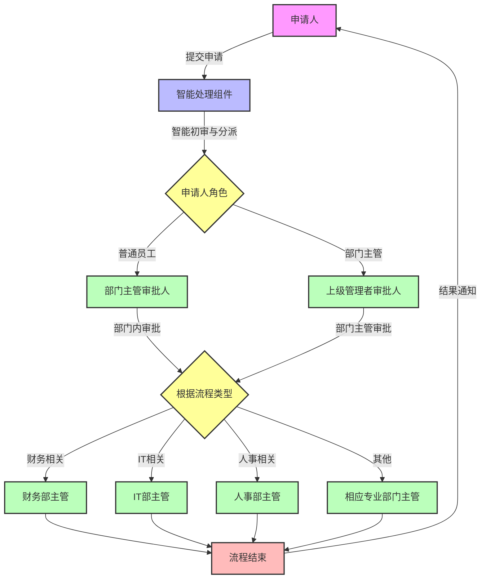
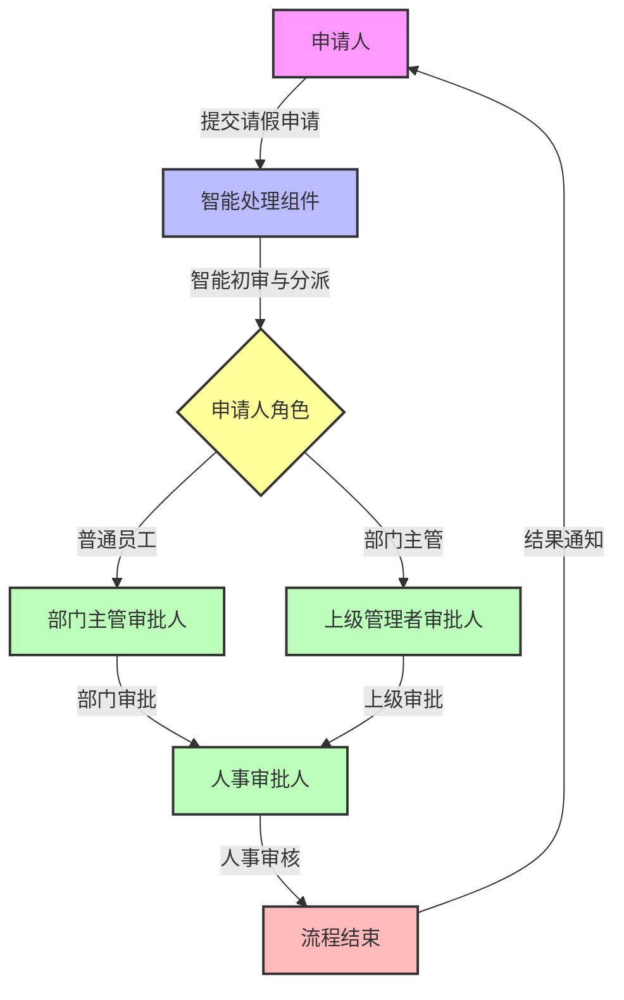
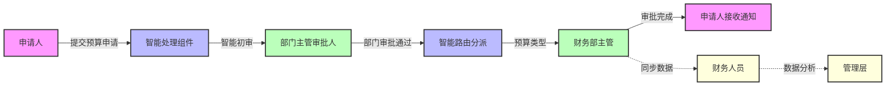
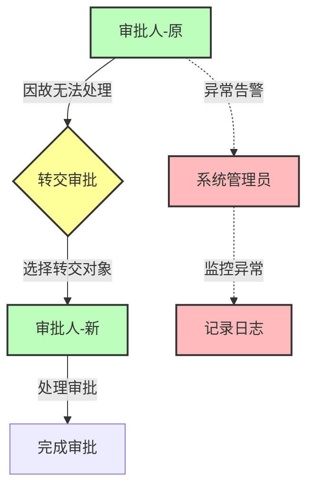

# FlowMind 系统角色定义

## 1. 角色概述

FlowMind系统面向跨部门预算与资源审批场景，采用简洁的角色体系，主要包括申请人、审批人、系统管理员、管理层和财务人员五种核心角色。审批人角色根据部门类型（如财务部、IT部等）灵活设定，适应不同审批流程需求。系统还内置智能处理组件，提供自动化支持。

## 2. 系统用户角色

| 角色名称 | 描述 | 主要职责 | 系统权限 |
| :--- | :--- | :--- | :--- |
| **申请人** | 发起审批流程的用户 | 提交申请、查看审批状态、修改/撤销申请、接收通知 | 提交申请、查看个人申请、修改待审批申请、撤销申请、查看审批结果 |
| **审批人** | 根据部门类型设定的审批角色 | 审批相关申请、查看部门申请统计、查看审批历史（按部门类型细分职责） | 查看待审批列表、审批操作、驳回操作、转交审批、审批意见查询、部门数据查看、接收审批提醒 |
| **系统管理员** | 负责系统配置与维护 | 用户管理、流程配置、系统监控 | 用户CRUD、角色管理、系统配置、监控告警、流程配置、查看所有申请状态 |
| **管理层** | 企业高层决策人员 | 查看整体运营数据、审批统计分析、资源分配决策 | 查看审批统计报表、数据导出、多维度数据分析 |

## 3. 审批人角色细分

审批人角色根据部门类型和层级灵活设定，通过智能路由自动分派，具体细分如下：

- **部门主管审批人**：负责本部门内初步审批（各业务部门的直接主管）
- **专业部门审批人**：根据申请类型由智能路由分派
  - 财务部主管：处理预算相关申请
  - IT部主管：处理IT资源相关申请
  - 人事部主管：处理人事相关申请
  - 其他专业部门主管：根据申请类型分派
- **上级管理者审批人**：负责部门主管提交的申请审批，如部门总监或副总经理等

**说明**：同一用户可能同时拥有多个审批人身份（如既是部门主管，也是财务部主管），系统会根据申请类型和审批流程配置，由智能路由组件自动分派到相应的审批人。

## 4. 特殊角色

### 4.1 智能处理组件

**职责**：系统内置的自动化处理组件

**主要功能**：
- 自动分析申请内容的完整性和规范性
- 提取关键信息并进行初步判断
- 根据规则自动分派审批任务

## 5. 角色与工作流关系

### 5.1 审批流转关系

### 5.2 请假流程示例

### 5.3 权限矩阵

#### 5.3.1 核心功能权限

| 功能 | 申请人 | 审批人 | 系统管理员 | 管理层 | 财务人员 |
| :--- | :--- | :--- | :--- | :--- | :--- |
| **申请管理** |
| 提交预算申请 | ✓ | ✓ | - | - | - |
| 提交资源申请 | ✓ | ✓ | - | - | - |
| 查看申请状态 | ✓（个人） | ✓（部门） | ✓（全部） | ✓（全部） | ✓（财务相关） |
| 修改申请 | ✓（待审批） | - | - | - | - |
| 撤销申请 | ✓（待审批） | - | - | - | - |
| **审批处理** |
| 查看待审批列表 | - | ✓ | - | - | - |
| 审批申请 | - | ✓ | - | - | - |
| 驳回申请 | - | ✓ | - | - | - |
| 转交审批 | - | ✓ | - | - | - |
| 审批意见查询 | ✓（相关） | ✓ | ✓ | - | - |
| 查看智能建议 | - | ✓ | - | - | - |
| **通知功能** |
| 接收申请通知 | ✓ | - | - | - | - |
| 接收审批提醒 | - | ✓ | - | - | - |
| 设置提醒偏好 | ✓ | ✓ | ✓ | - | - |
| **系统管理** |
| 用户管理 | - | - | ✓ | - | - |
| 角色管理 | - | - | ✓ | - | - |
| 流程配置 | - | - | ✓ | - | - |
| 系统监控 | - | - | ✓ | - | - |
| **数据分析** |
| 审批统计报表 | - | ✓（部门） | ✓（全部） | ✓（全部） | - |
| 预算执行分析 | - | - | - | ✓ | ✓ |
| 数据导出 | - | ✓（部门） | ✓ | ✓ | ✓ |

#### 5.3.2 权限说明

- **申请人**：可以提交、修改、撤销自己的申请，查看个人申请状态和审批结果
- **审批人**：可以处理分配给自己的审批任务，查看部门相关数据，权限范围根据部门类型动态调整
- **系统管理员**：拥有系统配置和管理的最高权限，但不参与业务审批
- **管理层**：可以查看全局统计数据和报表，支持决策分析
- **财务人员**：专注于预算和财务相关数据分析，不参与审批流程

**注意**：
1. 审批人的具体权限范围根据所属部门类型和审批流程配置动态调整
2. 同一用户可以拥有多个角色，权限取并集
3. 所有角色都受到数据权限控制，只能访问授权范围内的数据

## 6. 角色创建与管理

### 6.1 角色分配原则

- **最小权限原则**：用户仅获得完成工作所需的最小权限
- **职责分离原则**：关键操作需要不同角色配合完成
- **动态调整原则**：根据组织架构变化及时调整角色权限
- **审计追踪原则**：所有角色变更都有完整的审计日志

### 6.2 角色管理流程

1. **创建用户**：系统管理员通过管理界面创建用户账号
2. **分配角色**：根据用户职位和职责分配相应角色
3. **设置权限**：为特定角色配置细粒度权限
4. **批量导入**：支持基于组织架构的批量用户和角色导入
5. **定期审查**：定期审查用户权限，确保权限合理性
6. **权限回收**：用户离职或岗位变动时及时回收权限

### 6.3 特殊场景处理

- **临时授权**：支持为特定用户临时提升权限，并设置过期时间
- **代理机制**：审批人可以设置临时代理人处理审批任务
- **多角色用户**：同一用户可以拥有多个角色（如既是申请人也是审批人）
- **跨部门协作**：支持跨部门的临时审批授权

## 7. 角色协作关系

### 7.1 典型协作场景

#### 场景一:预算申请流程

#### 场景二:资源申请流程

#### 场景三:异常处理流程

### 7.2 角色间交互规则

- **申请人与审批人**：单向交互，申请人提交申请后等待审批结果
- **审批人之间**：可以转交审批任务，需记录转交原因
- **审批人与智能组件**：审批人可以参考智能建议，但保留最终决策权
- **财务人员与管理层**：财务人员提供数据分析，管理层进行决策参考
- **系统管理员**：不参与业务流程，仅负责系统运维和配置

## 8. 角色访问控制实现

### 8.1 技术实现

- 基于 JWT 的身份认证
- Spring Security 实现细粒度权限控制
- 基于 Redis 的权限缓存
- 操作审计日志记录关键权限操作

### 8.2 数据权限控制

- **申请人**：只能查看和操作自己提交的申请
- **审批人**：只能查看分配给自己的审批任务和本部门数据
- **系统管理员**：可以查看所有数据，但操作受限
- **管理层**：可以查看全局统计数据，但不能查看个人敏感信息
- **财务人员**：只能查看财务相关数据

### 8.3 安全措施

- 敏感操作（如角色变更）需要二次验证
- 异常登录行为自动告警
- 权限变更实时生效并记录日志
- 定期进行权限合规性审计