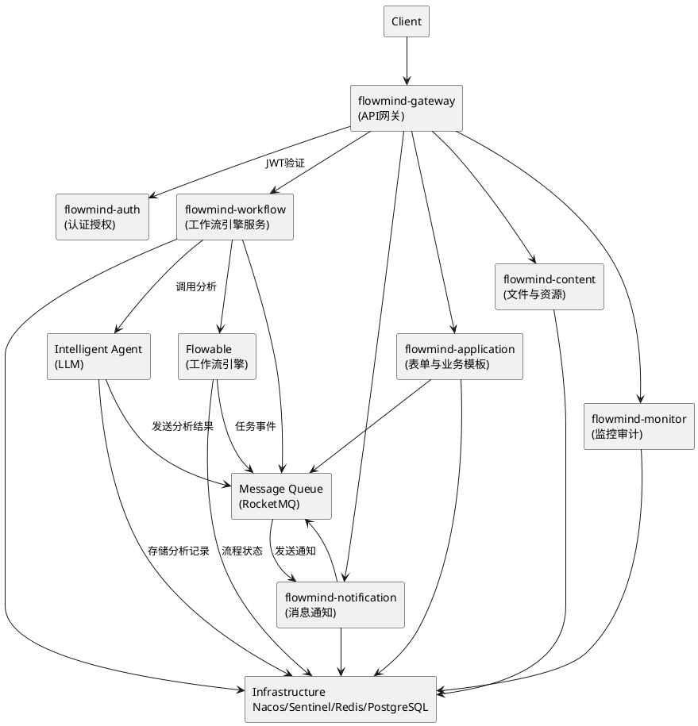

# FlowMind 模块设计文档

## 🧩 模块概览

FlowMind 系统采用微服务架构，将功能划分为多个独立的模块，每个模块负责特定的业务功能。整体架构基于 Spring Cloud Alibaba 微服务框架，结合 Flowable 工作流引擎和 LLM 智能 Agent，实现智能化审批流程。

### 系统模块结构

```
flowmind/
├── agent/                              # 智能 Agent 层 (LLM + FastAPI)
│   ├── main.py                         # FastAPI 启动入口
│   ├── core/                           # 业务核心逻辑 (任务规划、意图解析)
│   ├── llm/                            # LLM 调用封装 (OpenAI / Ollama / HuggingFace)
│   ├── tools/                          # 智能体可调用的工具 (SQL、文件、流程)
│   ├── memory/                         # 知识记忆管理 (向量数据库)
│   ├── configs/                        # 模型与服务配置文件
│   └── requirements.txt
├── frontend/                           # 前端层 (Vue3 + TypeScript + ElementPlus)
│   ├── flowmind-web/                   # Web 管理端 (审批、监控、建模)
│   ├── flowmind-modeler/               # BPMN 模型设计器前端 (bpmn.js + vue-bpmn)
│   └── flowmind-mobile/                # 移动端 (Vue3 + TDesign Mobile)
├── flowmind-cloud/                     # FlowMind后端微服务平台
│   ├── flowmind-api/                   # 公共API模块（DTO、Feign接口）
│   ├── flowmind-common/                # 通用模块
        ├── flowmind-common-core/       # 工具类、异常、结果封装
        ├── flowmind-common-dto/        # DTO / VO / 常量
        └── flowmind-common-feign/      # 各服务的 Feign Client 客户端定义
│   ├── flowmind-auth/                  # 认证授权服务
│   ├── flowmind-gateway/               # API网关
│   ├── flowmind-workflow/              # 工作流引擎（Flowable集成）
│   ├── flowmind-application/           # 表单与业务模板服务
│   ├── flowmind-content/               # 文件与资源管理
│   ├── flowmind-notification/          # 消息通知（邮件/WebSocket）
│   └── flowmind-monitor/               # 监控审计（操作日志/性能）
├── bpmn/                               # BPMN 流程定义文件（XML）
│   ├── templates/
│   ├── examples/
│   └── README.md
├── infra/                              # 基础设施层
│   ├── docker/                         # Dockerfile 与 Compose 文件
│   │   ├── docker-compose.yml
│   │   ├── Dockerfile.agent
│   │   ├── Dockerfile.gateway
│   │   └── Dockerfile.frontend
│   │
│   ├── k8s/                            # Kubernetes 部署清单 / Helm Chart
│   │   ├── charts/
│   │   ├── deployment/
│   │   └── service/
│   │
│   └── jenkins/                        # CI/CD Pipeline 脚本
│       ├── Jenkinsfile
│       ├── pipeline-template.groovy
│       └── env/
├── scripts/                            # 辅助脚本（初始化、迁移、测试）
│   ├── init-db.sql
│   ├── migrate.sh
│   ├── start-dev.sh
│   └── clean.sh
├── docs/                               # 项目文档
│   ├── architecture/                   # 架构与设计文档
│   ├── api/                            # 接口文档（OpenAPI / Swagger 导出）
│   ├── dev-guide/                      # 开发规范与流程
│   ├── deployment/                     # 部署与运维说明
│   └── FlowMind 项目开发模式与流程规范文档.md
│
├── .gitlab-ci.yml                      # CI/CD 配置
├── pom.xml                             # 项目聚合配置
└── README.md                           # 项目说明文件
```

---

## 🧠 智能 Agent 模块 (Python)

### 模块概述

智能 Agent 模块是 FlowMind 系统的核心智能组件，基于 Python 实现，负责处理自然语言的审批申请，提取关键信息，并进行初步的智能判断和路由。

### 技术栈

- **框架**: FastAPI
- **LLM 框架**: LangChain
- **大模型**: OpenAI GPT / Claude / 本地 LLaMA
- **向量存储**: FAISS / Chroma
- **通信协议**: gRPC + REST
- **监控**: Loguru + Prometheus Exporter

### 核心功能

1. **文本分析**: 对用户提交的审批申请文本进行语义分析
2. **信息提取**: 从文本中提取关键字段（如申请人、部门、申请类型、金额等）
3. **智能判断**: 根据预设规则和历史数据，对申请进行初步判断
4. **路由分发**: 将处理后的申请分发到相应的工作流

### 模块结构

```
agent/
├── main.py                 # 应用入口
├── core/                   # 核心模块
│   ├── llm_manager.py      # LLM 管理器
│   ├── prompt_manager.py   # Prompt 管理器
│   ├── text_processor.py    # 文本处理器
│   └── router.py           # 路由分发器
├── models/                 # 数据模型
│   ├── application.py      # 申请数据模型
│   └── analysis_result.py  # 分析结果模型
├── services/               # 服务层
│   ├── analysis_service.py # 分析服务
│   └── routing_service.py  # 路由服务
├── utils/                  # 工具类
│   ├── config.py           # 配置管理
│   └── logger.py           # 日志管理
└── tests/                  # 测试用例
```

### 接口设计

#### 文本分析接口

```http
POST /api/v1/analyze
Content-Type: application/json

{
  "text": "申请部门活动经费2000元，用于团建活动",
  "context": {
    "applicant": "张三",
    "department": "技术部"
  }
}
```

响应:

```json
{
  "application_id": "app_123456",
  "type": "department_activity",
  "amount": 2000,
  "department": "技术部",
  "applicant": "张三",
  "confidence": 0.95,
  "suggested_workflow": "standard_approval"
}
```

---

## 📦 工作流引擎服务模块 (flowmind-workflow)

### 模块概述

工作流引擎服务模块是 FlowMind 系统的核心业务模块，负责处理审批流程的创建、执行和管理。该模块与 Flowable 工作流引擎深度集成，实现审批流程的自动化执行。

### 技术栈

- **框架**: Spring Boot
- **ORM**: MyBatis-Plus
- **数据库**: PostgreSQL
- **缓存**: Redis
- **消息队列**: RocketMQ
- **工作流引擎**: Flowable

### 核心功能

1. **流程管理**: 创建、启动、暂停、终止审批流程
2. **任务处理**: 分配、处理、完成审批任务
3. **状态跟踪**: 实时跟踪审批状态和进度
4. **决策支持**: 为审批人提供决策支持信息

### 模块结构

```
flowmind-workflow/
├── src/main/java/com/flowmind/workflow/
│   ├── WorkflowApplication.java     # 应用入口
│   ├── config/                      # 配置类
│   │   └── FlowableConfig.java      # Flowable配置
│   ├── controller/                  # 控制器层
│   ├── service/                     # 服务层
│   ├── repository/                  # 数据访问层
│   ├── entity/                      # 实体类
│   ├── dto/                         # 数据传输对象
│   ├── exception/                   # 异常处理
│   └── client/                      # 外部服务客户端
└── src/main/resources/
    ├── application.yml              # 应用配置
    ├── mapper/                      # MyBatis 映射文件
    └── processes/                   # Flowable 流程定义
```

### 核心类设计

#### 工作流实例实体 (WorkflowInstance)

```java
@Entity
public class WorkflowInstance {
    @Id
    private String id;
    private String name;
    private String description;
    private String processDefinitionKey;
    private String businessKey;
    private ProcessStatus status;
    private String createdBy;
    private LocalDateTime createdAt;
    private LocalDateTime updatedAt;
    // getters and setters
}
```

#### 审批任务实体 (ApprovalTask)

```java
@Entity
public class ApprovalTask {
    @Id
    private String id;
    private String processInstanceId;
    private String taskDefinitionKey;
    private String assignee;
    private TaskStatus status;
    private String description;
    private LocalDateTime createdAt;
    private LocalDateTime dueDate;
    // getters and setters
}
```

### 接口设计

#### 创建工作流实例

```http
POST /api/workflow/instances
Content-Type: application/json

{
  "name": "部门经费申请",
  "description": "技术部申请团建经费",
  "processDefinitionKey": "department_funding",
  "businessKey": "APPLY-2024-001",
  "createdBy": "张三"
}
```

#### 查询审批任务

```http
GET /api/workflow/tasks?assignee=zhangsan&status=PENDING
```

---

## 📋 表单与业务模板服务模块 (flowmind-application)

### 模块概述

表单与业务模板服务模块负责管理系统中的各类业务表单、模板定义和申请数据。该模块与工作流服务模块紧密配合，为审批流程提供表单数据支撑。

### 技术栈

- **框架**: Spring Boot
- **ORM**: MyBatis-Plus
- **数据库**: PostgreSQL
- **缓存**: Redis

### 核心功能

1. **表单管理**: 创建、编辑和管理各类业务表单
2. **模板定义**: 维护审批流程模板和表单模板
3. **数据存储**: 存储和管理表单提交的数据
4. **数据校验**: 提供表单数据的校验和验证

### 模块结构

```
flowmind-application/
├── src/main/java/com/flowmind/application/
│   ├── ApplicationServiceApplication.java  # 应用入口
│   ├── config/                      # 配置类
│   ├── controller/                  # 控制器层
│   ├── service/                     # 服务层
│   ├── repository/                  # 数据访问层
│   ├── entity/                      # 实体类
│   ├── dto/                         # 数据传输对象
│   └── exception/                   # 异常处理
└── src/main/resources/
    └── application.yml              # 应用配置
```

### 核心类设计

#### 表单定义实体 (FormDefinition)

```java
@Entity
public class FormDefinition {
    @Id
    private String id;
    private String name;
    private String code;
    private String description;
    private String schema;
    private FormStatus status;
    private LocalDateTime createdAt;
    private LocalDateTime updatedAt;
    // getters and setters
}
```

#### 申请表单实体 (ApplicationForm)

```java
@Entity
public class ApplicationForm {
    @Id
    private String id;
    private String formDefinitionId;
    private String businessKey;
    private String applicantId;
    private String applicantName;
    private String departmentId;
    private String formData;
    private FormStatus status;
    private LocalDateTime submittedAt;
    private LocalDateTime updatedAt;
    // getters and setters
}
```

---

## 📢 消息通知服务模块 (flowmind-notification)

### 模块概述

消息通知服务模块负责向用户发送各类通知，包括审批状态变更、任务分配、系统提醒等。支持多种通知渠道，如邮件、WebSocket实时推送等。

### 技术栈

- **框架**: Spring Boot
- **邮件**: Spring Mail
- **WebSocket**: Spring WebSocket
- **消息队列**: RocketMQ

### 核心功能

1. **邮件通知**: 发送邮件通知
2. **实时通知**: 通过 WebSocket 发送实时通知
3. **短信通知**: 发送短信通知（集成第三方服务）
4. **通知模板**: 管理各类通知模板

### 模块结构

```
flowmind-notification/
├── src/main/java/com/flowmind/notification/
│   ├── NotificationApplication.java # 应用入口
│   ├── config/                      # 配置类
│   ├── controller/                  # 控制器层
│   ├── service/                     # 服务层
│   ├── repository/                  # 数据访问层
│   ├── entity/                      # 实体类
│   ├── dto/                         # 数据传输对象
│   ├── exception/                   # 异常处理
│   ├── websocket/                   # WebSocket 支持
│   └── template/                    # 通知模板管理
└── src/main/resources/
    ├── application.yml              # 应用配置
    └── templates/                   # 通知模板文件
```

### 核心类设计

#### 通知实体 (Notification)

```java
@Entity
public class Notification {
    @Id
    private String id;
    private String userId;
    private String title;
    private String content;
    private NotificationType type;
    private NotificationStatus status;
    private LocalDateTime createdAt;
    private LocalDateTime sentAt;
    // getters and setters
}
```

---

## 🔐 认证授权服务模块 (flowmind-auth)

### 模块概述

认证授权服务模块负责系统的用户认证和授权管理，基于 JWT 实现无状态认证，确保系统的安全性和可扩展性。

### 技术栈

- **框架**: Spring Boot
- **安全框架**: Spring Security
- **认证**: JWT
- **数据库**: PostgreSQL

### 核心功能

1. **用户认证**: 用户登录、登出
2. **令牌管理**: JWT 令牌的生成、验证和刷新
3. **权限控制**: 基于角色的访问控制（RBAC）
4. **用户管理**: 用户信息管理

### 模块结构

```
flowmind-auth/
├── src/main/java/com/flowmind/auth/
│   ├── AuthApplication.java         # 应用入口
│   ├── config/                      # 配置类
│   ├── controller/                  # 控制器层
│   ├── service/                     # 服务层
│   ├── repository/                  # 数据访问层
│   ├── entity/                      # 实体类
│   ├── dto/                         # 数据传输对象
│   ├── security/                    # 安全相关
│   └── exception/                   # 异常处理
└── src/main/resources/
    └── application.yml              # 应用配置
```

### 核心类设计

#### 用户实体 (User)

```java
@Entity
public class User {
    @Id
    private String id;
    private String username;
    private String password;
    private String email;
    private String fullName;
    private String department;
    private List<Role> roles;
    private boolean enabled;
    private LocalDateTime createdAt;
    private LocalDateTime updatedAt;
    // getters and setters
}
```

#### 角色实体 (Role)

```java
@Entity
public class Role {
    @Id
    private String id;
    private String name;
    private String description;
    private List<Permission> permissions;
    // getters and setters
}
```

---

## 🌐 API网关服务模块 (flowmind-gateway)

### 模块概述

API网关服务模块作为系统的统一入口，负责请求路由、认证验证、限流熔断等功能，是系统的流量控制中心。

### 技术栈

- **框架**: Spring Cloud Gateway
- **限流**: Sentinel
- **注册中心**: Nacos

### 核心功能

1. **请求路由**: 将请求路由到相应的微服务
2. **认证验证**: 验证 JWT 令牌
3. **限流熔断**: 防止系统过载
4. **日志记录**: 记录请求日志

### 模块结构

```
flowmind-gateway/
├── src/main/java/com/flowmind/gateway/
│   ├── GatewayApplication.java      # 应用入口
│   ├── config/                      # 配置类
│   ├── filter/                      # 网关过滤器
│   └── handler/                     # 异常处理
└── src/main/resources/
    └── application.yml              # 应用配置
```

---

## 🔄 公共模块

### 公共API模块 (flowmind-api)

公共API模块包含各个微服务共享的接口定义和数据传输对象，是服务间通信的基础。

```
flowmind-api/
├── src/main/java/com/flowmind/api/
│   ├── dto/                         # 数据传输对象
│   ├── vo/                          # 视图对象
│   ├── feign/                       # Feign 接口定义
│   └── constant/                    # 常量定义
└── pom.xml                          # Maven 配置
```

### 通用工具模块 (flowmind-common)

通用工具模块包含各个微服务共享的工具类、异常处理等基础组件，确保代码的一致性和复用性。

```
flowmind-common/
├── flowmind-common-core/
│   ├── src/main/java/com/flowmind/common/core/
│   │   ├── util/                    # 工具类
│   │   ├── exception/               # 通用异常类
│   │   └── result/                  # 统一结果封装
│   └── pom.xml
├── flowmind-common-dto/
│   ├── src/main/java/com/flowmind/common/dto/
│   │   ├── base/                    # 基础数据传输对象
│   │   └── constant/                # 常量定义
│   └── pom.xml
├── flowmind-common-feign/
│   ├── src/main/java/com/flowmind/common/feign/
│   │   └── client/                  # 各服务的Feign客户端
│   └── pom.xml
└── pom.xml                          # 聚合配置
```

### 文件与资源管理模块 (flowmind-content)

文件与资源管理模块负责处理系统中的文件上传、存储、下载和资源管理功能。

```
flowmind-content/
├── src/main/java/com/flowmind/content/
│   ├── ContentApplication.java      # 应用入口
│   ├── config/                      # 配置类
│   ├── controller/                  # 控制器层
│   ├── service/                     # 服务层
│   ├── repository/                  # 数据访问层
│   ├── entity/                      # 实体类
│   ├── dto/                         # 数据传输对象
│   └── exception/                   # 异常处理
└── src/main/resources/
    └── application.yml              # 应用配置
```

### 监控审计服务模块 (flowmind-monitor)

监控审计服务模块负责系统的运行监控、操作审计和性能分析，为系统运维提供支持。

```
flowmind-monitor/
├── src/main/java/com/flowmind/monitor/
│   ├── MonitorApplication.java      # 应用入口
│   ├── config/                      # 配置类
│   ├── controller/                  # 控制器层
│   ├── service/                     # 服务层
│   ├── repository/                  # 数据访问层
│   ├── entity/                      # 实体类
│   ├── dto/                         # 数据传输对象
│   └── exception/                   # 异常处理
└── src/main/resources/
    └── application.yml              # 应用配置
```

---

## 📊 模块间交互关系

### 模块依赖关系图



---

## 🧪 模块测试策略

### 单元测试

每个模块都需要编写单元测试，覆盖核心业务逻辑，确保代码质量。

### 集成测试

模块间集成测试，验证模块间接口的正确性和数据一致性。

### 端到端测试

完整的业务流程测试，模拟真实用户场景，验证系统整体功能。

---

## 📈 性能优化建议

1. **缓存策略**: 合理使用 Redis 缓存热点数据
2. **数据库优化**: 使用连接池、索引优化、读写分离
3. **异步处理**: 使用消息队列处理非实时任务
4. **负载均衡**: 通过 Kubernetes 实现服务负载均衡
5. **限流熔断**: 使用 Sentinel 实现服务保护

---

## 🔮 未来扩展方向

1. **模块拆分**: 随着业务发展，可将大模块进一步拆分为更小的微服务
2. **技术升级**: 持续关注新技术，适时升级技术栈
3. **功能扩展**: 根据业务需求，扩展新的功能模块
4. **性能优化**: 持续优化系统性能，提升用户体验