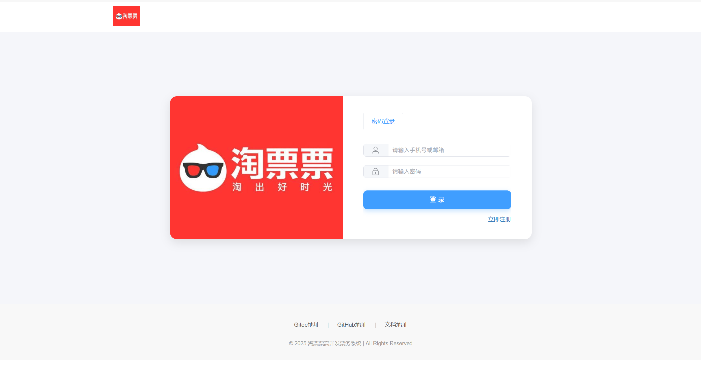
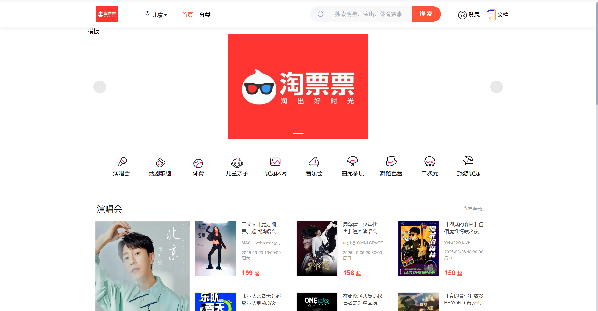
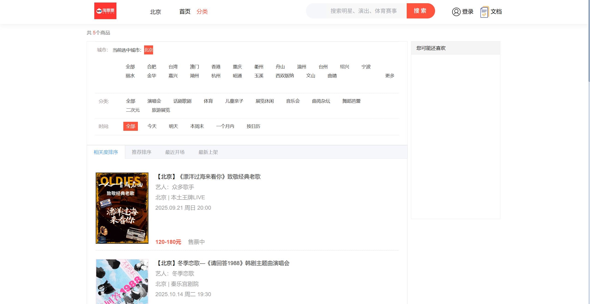
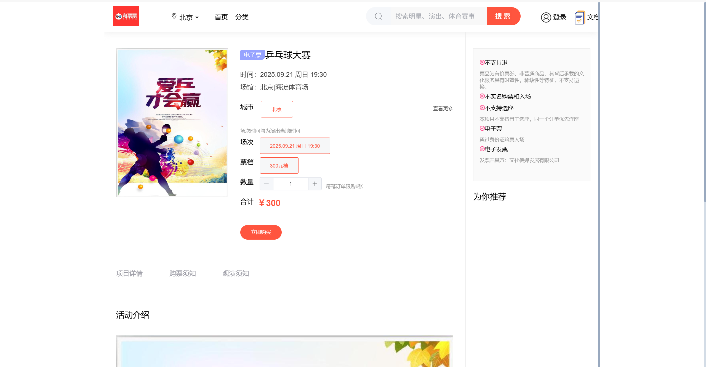
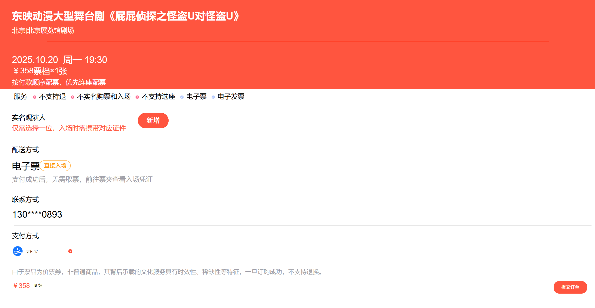
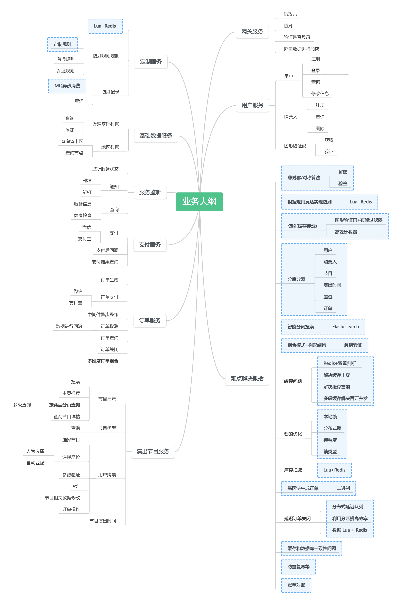
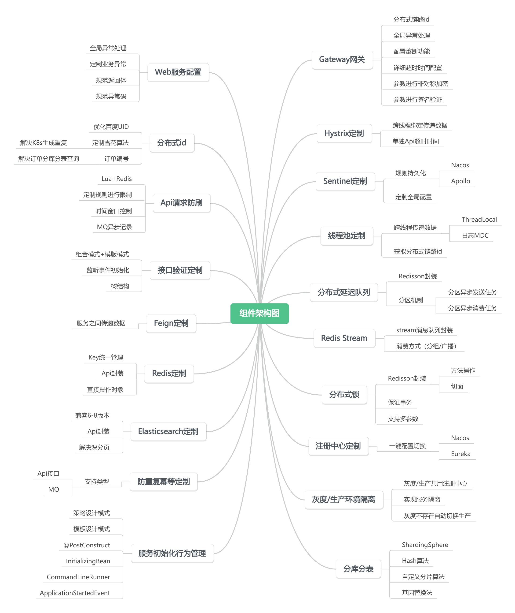
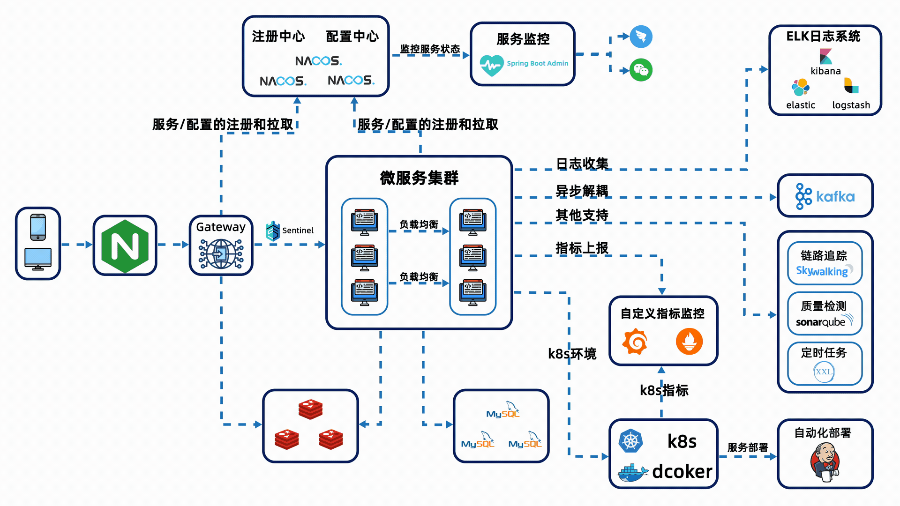

# 淘票票（Taopiaopiao）-高并发分布式票务系统

[](https://opensource.org/licenses/Apache-2.0)      

> 一个基于 Spring Cloud Alibaba 构建的高并发票务系统，专注于演唱会/大型活动的高并发抢票场景。

---

## 🎫 项目简介

**淘票票（Taopiaopiao）** 是一个高并发分布式票务系统，聚焦于 **演唱会/大型活动抢票** 等秒杀场景，重点解决 **高并发下的库存一致性、性能瓶颈与系统可用性** 问题。

本项目仿造淘票票网站构建，主要聚焦于高并发场景下的技术实践与性能优化。

### 系统设计目标

* **高性能**：通过缓存预热、异步削峰、读写分离等手段，支撑 **万级 QPS** 的并发抢票请求
* **高一致性**：使用 Redis Lua 脚本与分布式锁保证库存原子扣减，结合消息队列实现订单与库存最终一致
* **高可用**：利用 Sentinel 限流熔断与 Kafka 异步削峰，确保系统在流量洪峰下稳定运行
* **可扩展性**：模块化微服务架构 + 分库分表 + Docker 部署，支持灵活扩展与快速上线

该项目不仅是一个票务系统，更是一次 **高并发分布式架构的综合实战**，涵盖缓存、消息队列、数据库分片、分布式锁、限流熔断等核心技术栈。

---

## 🔍 项目界面预览

| 页面 | 示例截图                         |
| ----- | ---------------------------- |
| 登录界面  |  |
| 主页面   |  |
| 分类列表  |  |
| 票务详情页 |  |
| 支付页面  |  |

---

## 📊 核心业务功能

### 核心业务
- **电影票预订**：用户可以浏览电影信息、选择影院、场次和座位，完成在线购票
- **用户管理**：支持用户注册、登录、个人信息管理、观影历史等功能
- **订单管理**：提供完整的订单生命周期管理，包括下单、支付、退款、改签等
- **支付系统**：集成多种支付方式，确保交易安全可靠
- **数据分析**：对用户行为、票房数据进行分析，为运营决策提供支持
- **影院/演出管理**：影院排片与座位管理、场次安排等

### 辅助功能
- **验证码服务**：提供图形验证码、短信验证码等安全验证
- **缓存管理**：优化系统性能，提升用户体验
- **分布式锁**：保证分布式环境下的数据一致性
- **延迟队列**：处理异步任务，如订单超时取消等
- **用户评价与互动**：提供用户对影片的评价和互动功能
- **个性化推荐服务**：基于用户行为提供个性化的影片推荐

---

## 📁 数据库设计概述

### 数据库表关系

淘票票项目采用分库分表的设计，主要数据库包括：

#### 用户相关数据库 (taopiaopiao_user_0, taopiaopiao_user_1)
- `t_user_0`, `t_user_1`: 用户基本信息表
- `t_ticket_user_0`, `t_ticket_user_1`: 购票人信息表
- `t_user_email_0`, `t_user_email_1`: 用户邮箱信息表
- `t_user_mobile_0`, `t_user_mobile_1`: 用户手机号信息表

#### 节目相关数据库 (taopiaopiao_program_0, taopiaopiao_program_1)
- `t_program_0`, `t_program_1`: 节目信息表
- `t_program_category`: 节目分类表
- `t_program_group_0`: 节目分组表

#### 订单相关数据库 (taopiaopiao_order_0, taopiaopiao_order_1)
- `t_order_0` 至 `t_order_4`: 订单信息表
- `t_order_ticket_user_0` 至 `t_order_ticket_user_4`: 订单购票人关联表

#### 支付相关数据库 (taopiaopiao_pay_0, taopiaopiao_pay_1)
- `t_pay_bill_0`, `t_pay_bill_1`: 支付账单表
- `t_refund_bill_0`, `t_refund_bill_1`: 退款账单表

---

## 🧭 项目架构图

| 图示                                                                        |
|-------------------------------------------------------------------------- |
|                          |
|                       |                
|   |

### 系统架构层次

淘票票项目采用多层架构设计，主要包括：

- **前端层**：基于Vue 3的单页应用，提供用户交互界面
- **API网关层**：统一入口，处理路由、鉴权、限流等功能
- **业务服务层**：包含用户、订单、支付、影片等核心业务微服务
- **基础设施层**：提供缓存、消息队列、搜索引擎等技术支持
- **数据存储层**：包括MySQL、Redis等多种数据存储方案

---

## ✨ 淘票票项目技术亮点一览

### Ⅰ. 核心技术架构与治理

| 维度 | 技术/方案 | 亮点与优势 |
| :--- | :--- | :--- |
| **微服务架构** | **Spring Cloud Alibaba 全家桶** | 基于 SpringCloud 体系构建分布式系统，快速实现服务注册、配置管理与流量治理。|
| **服务治理** | **Nacos + Sentinel** | Nacos 实现服务注册与发现、统一配置管理；Sentinel 实现熔断降级、系统自适应限流。|
| **API 网关** | **Spring Cloud Gateway** | 统一 API 入口，实现鉴权、路由转发、全局限流、请求日志等功能，保障后端服务安全。|
| **数据层架构** | **ShardingSphere 分库分表** | 针对订单、用户等核心表进行分库分表（如按用户ID或订单ID），有效解决海量数据存储瓶长颈与查询性能问题。|
| **ID 生成** | **分布式 ID (雪花算法优化)** | 采用优化的雪花算法，保证全局唯一且趋势递增的 ID，满足分库分表键值与高性能要求。|

### Ⅱ. 高并发与性能优化（万级 QPS 核心保障）

| 维度 | 技术/方案 | 亮点与优势 |
| :--- | :--- | :--- |
| **极致性能优化** | **订单生成四版本演进** | 从 V1 直写 DB 到 **V4 Redis Lua 原子扣减 + 异步 Kafka 落库 + Redisson 锁**，性能提升约 **15 倍**，达到 **12000 QPS**。|
| **库存一致性** | **Redis Lua 脚本原子操作** | 使用 Lua 脚本将"检查库存"和"扣减库存"封装为单个原子命令执行，彻底杜绝超卖。|
| **多级缓存体系** | **Caffeine (L1) + Redis (L2)** | **本地缓存**（Caffeine）承担热点数据第一层压力，**分布式缓存**（Redis）提供共享数据，有效降低网络IO和数据库压力。|
| **缓存安全** | **防穿透、击穿、雪崩** | **布隆过滤器** 结合缓存空值防穿透；**数据预热** + **热点数据永不失效** 防击穿/雪崩。|
| **分布式锁** | **Redisson 高性能分布式锁** | 采用 Redisson 实现了基于 Redis 的分布式锁，具备自动续期（看门狗）、防止死锁等特性，保障购票过程并发安全。|

### Ⅲ. 核心中间件高级应用

| 维度 | 技术/方案 | 亮点与优势 |
| :--- | :--- | :--- |
| **异步处理与削峰** | **Kafka 消息队列** | 核心购票流程采用 Kafka 异步处理订单落库、库存补偿等，平滑流量洪峰，保障系统高可用。|
| **业务一致性** | **Redis 延迟队列 (ZSet)** | 精准控制订单支付超时关闭逻辑，超时未支付则释放库存，保证资源最大化利用。|
| **数据流处理** | **Redis Stream** | 用于实现消息队列特性，支持消费组、消息持久化和消费追踪，用于日志或关键操作的可靠记录。|
| **数据搜索** | **Elasticsearch (ES)** | 为票务/场次提供高性能全文检索服务，支持复杂条件筛选和快速响应。|
| **可观测性** | **ELK Stack (日志) + Prometheus/Grafana (监控)** | 统一日志采集、存储与查询；实时监控 JVM、业务指标、延迟、错误率，实现高效故障排查和预警。|

### Ⅳ. 核心业务与工程实践

| 维度 | 技术/方案 | 亮点与优势 |
| :--- | :--- | :--- |
| **数据一致性** | **延迟双删/消息队列补偿** | 结合使用**延迟双删**策略和**消息队列**保证最终一致性，解决高并发下缓存与数据库的瞬时不一致问题。|
| **线程池优化** | **定制化线程池** | 基于业务场景定制 IO 密集型和 CPU 密集型线程池，并集成 **TraceId**（MDC），便于跨线程的日志链路追踪。|
| **幂等性保障** | **防重复提交机制** | 采用 AOP 注解 + Token/分布式锁，实现订单创建、支付等核心接口的幂等性控制，防止用户重复操作。|
| **读写分离优化** | **订单查询分库设计** | 针对订单历史查询进行分库设计，避免用户高频查询引发的读扩散问题影响核心业务数据库。|
| **组件化设计** | **SpringBoot Starter** | 封装可复用的业务组件，基于 SpringBoot 自动装配机制，提高代码复用率和开发效率。|

---

## 🎯 系统特性

### 高性能
- 采用Redis缓存热点数据
- 使用线程池优化并发处理能力
- 数据库读写分离，分库分表策略
- Elasticsearch实现高效搜索

### 高可用
- 服务多实例部署
- 熔断、限流、降级机制
- 服务注册与发现
- 灰度发布策略

### 可扩展
- 微服务架构，服务独立部署
- 基于消息队列实现服务解耦
- 接口标准化，便于功能扩展

---

## 🎭 业务流程概述

### 用户业务流程

#### 用户注册与登录
- 支持手机号注册登录
- 支持邮箱注册登录
- 集成图形验证码防止恶意注册

#### 用户购票流程
1. 用户登录系统
2. 浏览并选择节目
3. 选择场次和座位
4. 填写购票人信息
5. 提交订单并支付
6. 查看订单详情和票务信息

#### 用户订单管理
- 查看订单列表
- 查看订单详情
- 取消未支付订单
- 申请退票
- 查看票夹信息

### 节目业务流程

#### 节目信息管理
- 节目按类型分类（演唱会、话剧歌剧、体育、儿童亲子等）
- 节目支持多城市演出，通过节目分组关联
- 节目信息包含演出时间、地点、票价等详细信息

#### 节目浏览流程
1. 用户访问首页，查看推荐节目列表
2. 可按分类浏览不同类型节目
3. 点击节目查看详细信息
4. 选择场次和票档

---

## 🔧 快速运行

### 本地环境依赖

* JDK 17
* Maven 3.8+
* MySQL 8+
* Redis 6+
* Kafka 3+
* Nacos 2.x

### 启动步骤

```bash
# clone 仓库
git clone https://github.com/java-up-up/taopiaopiao.git
cd taopiaopiao

# 构建
mvn clean package -DskipTests

# 启动依赖服务（推荐使用 Docker Compose）
docker-compose up -d

# 启动应用服务
cd taopiaopiao-server
mvn spring-boot:run
```

### Swagger 接口文档

访问：[http://localhost:8080/swagger-ui/index.html](http://localhost:8080/swagger-ui/index.html)

---

## 📈 性能优化实践

本地 JMeter 压测（1w 并发）结果：

| 版本                    | QPS    | 平均延迟   | 超卖情况 |
| --------------------- | ------ | ------ | ---- |
| V1（直写 DB）             | ~800   | 500ms+ | 严重   |
| V2（Redis 预扣）          | ~3500  | 120ms  | 少量   |
| V3（Redis Lua + Kafka） | ~12000 | 40ms   | 无    |
| V4（加锁优化）              | ~11000 | 50ms   | 无    |

> ⚡ 从直写 DB 到异步 Kafka，性能提升约 15 倍。

