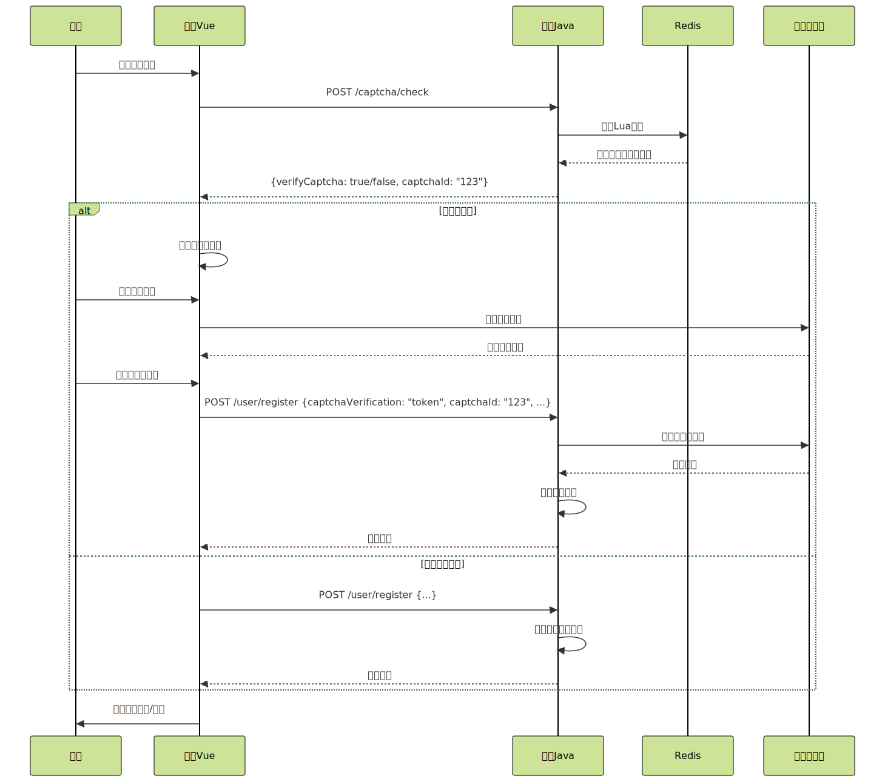

# 3.淘票票项目验证码功能完整说明

### 1. 功能概述

验证码功能用于防止恶意注册、刷单等自动化攻击，采用滑块拼图验证码形式，结合频率控制机制动态决定是否需要验证。

### 2. 前端实现

#### 2.1 组件结构
```vue
<!-- register.vue -->
<template>
  <Verify
    mode="pop"          
    :captchaType="captchaType"
    :imgSize="{width:'400px',height:'200px'}"
    ref="verify"
    @update:value="handleValueFromChild"
  />
</template>
```


#### 2.2 验证码调用流程



#### 2.3 前端关键代码

```javascript
// 1. 检查是否需要验证码
function handleAgreeLogin() {
  isCaptcha().then(response => {
    let {verifyCaptcha, captchaId} = response.data
    registerForm.value.captchaId = captchaId
    
    if (verifyCaptcha == false) {
      // 不需要验证码，直接注册
      registerInfo()
    } else {
      // 需要验证码，显示验证码组件
      proxy.$refs.registerRef.validate(valid => {
        if (valid) {
          onShow('blockPuzzle')  // 显示滑块验证码
        }
      })
    }
  })
}

// 2. 显示验证码
const onShow = (type) => {
  captchaType.value = type
  verify.value.show()  // 调用验证码组件的show方法
}

// 3. 接收验证码结果
$bus.on('res', (data) => {
  captchaVerify.value = data.repData.captchaVerification  // 记录验证结果
})

// 4. 处理验证码关闭事件
function handleValueFromChild(value) {
  if (value == '关闭') {
    // 将验证码结果加入注册表单
    registerForm.value.captchaVerification = captchaVerify.value
    
    // 重新获取captchaId并提交注册
    isCaptcha().then(res => {
      let {captchaId} = res.data
      registerForm.value.captchaId = captchaId
      register(registerForm.value)
    })
  }
}
```


### 3. 后端实现

#### 3.1 验证码检查接口

```java
// UserCaptchaController.java
@RestController
@RequestMapping("/captcha")
public class UserCaptchaController {
    
    @Autowired
    private UserCaptchaService userCaptchaService;
    
    @PostMapping("/check")
    public ApiResponse<CheckNeedCaptchaDataVo> checkNeedCaptcha() {
        return ApiResponse.ok(userCaptchaService.checkNeedCaptcha());
    }
}
```


#### 3.2 验证码服务层

```java
// UserCaptchaService.java
@Service
public class UserCaptchaService {
    
    @Autowired
    private CheckNeedCaptchaOperate checkNeedCaptchaOperate;
    
    public CheckNeedCaptchaDataVo checkNeedCaptcha() {
        long currentTimeMillis = System.currentTimeMillis();
        long id = uidGenerator.getUid();
        
        // 构建Redis键
        List<String> keys = new ArrayList<>();
        keys.add(RedisKeyBuild.createRedisKey(RedisKeyManage.COUNTER_COUNT).getRelKey());
        keys.add(RedisKeyBuild.createRedisKey(RedisKeyManage.COUNTER_TIMESTAMP).getRelKey());
        keys.add(RedisKeyBuild.createRedisKey(RedisKeyManage.VERIFY_CAPTCHA_ID,id).getRelKey());
        
        // 准备参数
        String[] data = new String[4];
        data[0] = String.valueOf(verifyCaptchaThreshold);    // 阈值
        data[1] = String.valueOf(currentTimeMillis);         // 当前时间
        data[2] = String.valueOf(verifyCaptchaIdExpireTime); // 过期时间
        data[3] = String.valueOf(alwaysVerifyCaptcha);       // 总是验证标志
        
        // 执行Lua脚本判断
        Boolean result = checkNeedCaptchaOperate.checkNeedCaptchaOperate(keys, data);
        
        // 返回结果
        CheckNeedCaptchaDataVo vo = new CheckNeedCaptchaDataVo();
        vo.setCaptchaId(id);
        vo.setVerifyCaptcha(result);
        return vo;
    }
}
```


#### 3.3 Lua脚本执行

```java
// CheckNeedCaptchaOperate.java
@Component
public class CheckNeedCaptchaOperate {
    
    public Boolean checkNeedCaptchaOperate(List<String> keys, String[] args){
        Object object = redisCache.getInstance().execute(redisScript, keys, args);
        return Boolean.parseBoolean((String)object);
    }
}
```


#### 3.4 Lua脚本逻辑

```lua
-- checkNeedCaptcha.lua
local counterKey = KEYS[1]    -- 计数器键
local timestampKey = KEYS[2]  -- 时间戳键
local verifyIdKey = KEYS[3]   -- 验证码ID键

local threshold = tonumber(ARGV[1])     -- 阈值
local currentTime = tonumber(ARGV[2])   -- 当前时间
local expireTime = tonumber(ARGV[3])    -- 过期时间
local alwaysVerify = tonumber(ARGV[4])  -- 总是验证标志

-- 总是需要验证
if alwaysVerify == 1 then
    redis.call('SET', verifyIdKey, "true")
    redis.call('EXPIRE', verifyIdKey, expireTime)
    return "true"
end

-- 检查访问频率
local currentCount = redis.call('GET', counterKey) or 0
if tonumber(currentCount) >= threshold then
    -- 超过阈值，需要验证码
    redis.call('SET', verifyIdKey, "true")
    redis.call('EXPIRE', verifyIdKey, expireTime)
    return "true"
else
    -- 未超过阈值，增加计数
    redis.call('INCR', counterKey)
    redis.call('SET', timestampKey, currentTime)
    redis.call('SET', verifyIdKey, "false")
    redis.call('EXPIRE', counterKey, expireTime)
    redis.call('EXPIRE', timestampKey, expireTime)
    redis.call('EXPIRE', verifyIdKey, expireTime)
    return "false"
end
```


#### 3.5 用户注册时的验证码验证

```java
// UserService.java
@Service
public class UserService {
    
    public Boolean register(UserRegisterDto userRegisterDto) {
        // 1. 复合校验（包含验证码校验）
        compositeContainer.execute(CompositeCheckType.USER_REGISTER_CHECK.getValue(), userRegisterDto);
        
        // 2. 用户注册逻辑
        // ...
        return true;
    }
}

// UserRegisterVerifyCaptcha.java (复合校验组件)
@Component
public class UserRegisterVerifyCaptcha extends AbstractUserRegisterCheckHandler {
    
    @Override
    protected void execute(UserRegisterDto param) {
        // 1. 密码一致性校验
        if (!param.getPassword().equals(param.getConfirmPassword())) {
            throw new TaoPiaoPiaoFrameException(BaseCode.TWO_PASSWORDS_DIFFERENT);
        }
        
        // 2. 验证码状态检查
        String verifyCaptcha = redisCache.get(
            RedisKeyBuild.createRedisKey(RedisKeyManage.VERIFY_CAPTCHA_ID, param.getCaptchaId()),
            String.class
        );
        
        // 3. 如果需要验证码，则验证有效性
        if (VerifyCaptcha.YES.getValue().equals(verifyCaptcha)) {
            if (StringUtil.isEmpty(param.getCaptchaVerification())) {
                throw new TaoPiaoPiaoFrameException(BaseCode.VERIFY_CAPTCHA_EMPTY);
            }
            
            CaptchaVO captchaVO = new CaptchaVO();
            captchaVO.setCaptchaVerification(param.getCaptchaVerification());
            ResponseModel responseModel = captchaHandle.verification(captchaVO);
            
            if (!responseModel.isSuccess()) {
                throw new TaoPiaoPiaoFrameException(responseModel.getRepCode(), responseModel.getRepMsg());
            }
        }
    }
}
```


### 4. 完整调用时序图




### 5. 配置参数

```yaml
# application.yml
verify_captcha_threshold: 10          # 频率阈值：60秒内最多10次免验证码
verify_captcha_id_expire_time: 60     # 验证码ID过期时间：60秒
always_verify_captcha: 0              # 是否总是验证：0-否，1-是
```


### 6. 关键数据结构

#### 6.1 前端数据
```javascript
// 注册表单
registerForm = {
  mobile: "13800138000",
  password: "password123",
  confirmPassword: "password123",
  captchaId: "123456789",           // 验证码ID
  captchaVerification: "token..."   // 验证码验证令牌
}
```


#### 6.2 后端数据
```java
// UserRegisterDto.java
public class UserRegisterDto {
    private String mobile;
    private String password;
    private String confirmPassword;
    private String captchaId;          // 验证码ID
    private String captchaVerification; // 验证码验证令牌
}
```


### 7. 安全机制

1. **频率控制**：通过Redis计数器限制访问频率
2. **时间窗口**：设置验证码有效期防止重放攻击
3. **令牌验证**：一次性验证码令牌防止重复使用
4. **分布式支持**：通过Redis实现多实例共享状态

这套验证码机制通过前后端协同工作，实现了灵活的频率控制和安全的验证码验证功能。


