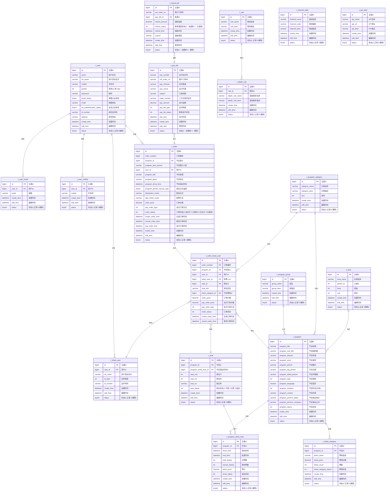

# 淘票票项目数据库设计

## 数据库架构概述
淘票票项目采用MySQL作为主数据库，并结合Redis缓存、Elasticsearch搜索引擎构建完整的数据存储体系。数据库设计遵循高可用、高性能、可扩展的原则，采用分库分表策略应对大数据量。

## 数据库ER图

以下是淘票票项目根据实际建表语句生成的实体关系图，包含中文注释以便阅读：

## 数据库分库分表策略

### 分库策略
- **按业务分库**：将不同业务模块的数据存储在不同的数据库实例中
  - 用户库：存储用户相关数据
  - 订单库：存储订单相关数据
  - 支付库：存储支付相关数据
  - 节目库：存储电影、场次等数据
  - 基础数据库：存储影院、城市等基础数据

### 分表策略
- **水平分表**：对单表数据量大的表进行水平拆分
  - 用户表：按用户ID取模分表
  - 订单表：按用户ID或订单ID取模分表
  - 支付表：按支付ID或用户ID取模分表
  - 节目表：按影院ID或城市ID分表

### 分表规则
- 分表字段：优先选择查询频率高、分布均匀的字段
- 分表数量：根据数据量预估和增长趋势确定
- 扩容策略：预留足够的分表数量，支持未来扩容

## 核心数据表设计

### 1. 用户库 (taopiaopiao_user)

#### 用户表 (user_info)
| 字段名 | 数据类型 | 约束 | 描述 |
| :--- | :--- | :--- | :--- |
| user_id | BIGINT | PRIMARY KEY | 用户ID |
| username | VARCHAR(50) | NOT NULL, UNIQUE | 用户名 |
| password | VARCHAR(100) | NOT NULL | 密码（加密存储） |
| phone | VARCHAR(20) | UNIQUE | 手机号 |
| email | VARCHAR(100) | UNIQUE | 邮箱 |
| nickname | VARCHAR(50) | | 昵称 |
| avatar | VARCHAR(255) | | 头像URL |
| gender | TINYINT | | 性别(0:未知,1:男,2:女) |
| birth_date | DATE | | 出生日期 |
| register_time | DATETIME | NOT NULL | 注册时间 |
| last_login_time | DATETIME | | 最后登录时间 |
| status | TINYINT | NOT NULL DEFAULT 1 | 状态(0:禁用,1:启用) |
| version | INT | NOT NULL DEFAULT 0 | 版本号（乐观锁） |

#### 用户地址表 (user_address)
| 字段名 | 数据类型 | 约束 | 描述 |
| :--- | :--- | :--- | :--- |
| address_id | BIGINT | PRIMARY KEY | 地址ID |
| user_id | BIGINT | NOT NULL | 用户ID |
| consignee | VARCHAR(50) | NOT NULL | 收货人姓名 |
| phone | VARCHAR(20) | NOT NULL | 收货人手机号 |
| province | VARCHAR(50) | NOT NULL | 省份 |
| city | VARCHAR(50) | NOT NULL | 城市 |
| district | VARCHAR(50) | NOT NULL | 区县 |
| detail_address | VARCHAR(255) | NOT NULL | 详细地址 |
| is_default | TINYINT | NOT NULL DEFAULT 0 | 是否默认地址(0:否,1:是) |
| create_time | DATETIME | NOT NULL | 创建时间 |
| update_time | DATETIME | NOT NULL | 更新时间 |

#### 用户观影记录表 (user_view_history)
| 字段名 | 数据类型 | 约束 | 描述 |
| :--- | :--- | :--- | :--- |
| history_id | BIGINT | PRIMARY KEY | 记录ID |
| user_id | BIGINT | NOT NULL | 用户ID |
| movie_id | BIGINT | NOT NULL | 电影ID |
| view_time | DATETIME | NOT NULL | 观影时间 |
| cinema_id | BIGINT | NOT NULL | 影院ID |
| order_id | BIGINT | | 订单ID |
| create_time | DATETIME | NOT NULL | 创建时间 |

### 2. 订单库 (taopiaopiao_order)

#### 订单表 (order_info)
| 字段名 | 数据类型 | 约束 | 描述 |
| :--- | :--- | :--- | :--- |
| order_id | BIGINT | PRIMARY KEY | 订单ID |
| user_id | BIGINT | NOT NULL | 用户ID |
| order_no | VARCHAR(50) | NOT NULL, UNIQUE | 订单号 |
| total_amount | DECIMAL(10,2) | NOT NULL | 订单总金额 |
| actual_amount | DECIMAL(10,2) | NOT NULL | 实际支付金额 |
| order_status | TINYINT | NOT NULL | 订单状态(1:待支付,2:已支付,3:已完成,4:已取消,5:退款中,6:已退款) |
| pay_type | TINYINT | | 支付方式(1:支付宝,2:微信支付,3:银行卡) |
| pay_time | DATETIME | | 支付时间 |
| cancel_time | DATETIME | | 取消时间 |
| finish_time | DATETIME | | 完成时间 |
| expire_time | DATETIME | NOT NULL | 订单过期时间 |
| create_time | DATETIME | NOT NULL | 创建时间 |
| update_time | DATETIME | NOT NULL | 更新时间 |
| version | INT | NOT NULL DEFAULT 0 | 版本号（乐观锁） |

#### 订单明细表 (order_item)
| 字段名 | 数据类型 | 约束 | 描述 |
| :--- | :--- | :--- | :--- |
| item_id | BIGINT | PRIMARY KEY | 明细ID |
| order_id | BIGINT | NOT NULL | 订单ID |
| program_id | BIGINT | NOT NULL | 场次ID |
| movie_id | BIGINT | NOT NULL | 电影ID |
| cinema_id | BIGINT | NOT NULL | 影院ID |
| ticket_count | INT | NOT NULL | 购票数量 |
| unit_price | DECIMAL(10,2) | NOT NULL | 单价 |
| total_price | DECIMAL(10,2) | NOT NULL | 总价 |
| show_time | DATETIME | NOT NULL | 放映时间 |
| hall_name | VARCHAR(50) | NOT NULL | 影厅名称 |
| seat_info | VARCHAR(255) | NOT NULL | 座位信息(如:8排10座,8排11座) |
| ticket_status | TINYINT | NOT NULL DEFAULT 1 | 票状态(1:有效,2:已退,3:已改签) |
| create_time | DATETIME | NOT NULL | 创建时间 |

### 3. 支付库 (taopiaopiao_pay)

#### 支付记录表 (payment_record)
| 字段名 | 数据类型 | 约束 | 描述 |
| :--- | :--- | :--- | :--- |
| pay_id | BIGINT | PRIMARY KEY | 支付记录ID |
| order_id | BIGINT | NOT NULL, UNIQUE | 订单ID |
| user_id | BIGINT | NOT NULL | 用户ID |
| pay_no | VARCHAR(50) | NOT NULL, UNIQUE | 支付流水号 |
| third_pay_no | VARCHAR(100) | UNIQUE | 第三方支付流水号 |
| pay_amount | DECIMAL(10,2) | NOT NULL | 支付金额 |
| pay_type | TINYINT | NOT NULL | 支付方式(1:支付宝,2:微信支付,3:银行卡) |
| pay_status | TINYINT | NOT NULL | 支付状态(1:待支付,2:支付成功,3:支付失败,4:支付关闭) |
| pay_time | DATETIME | | 支付完成时间 |
| refund_amount | DECIMAL(10,2) | NOT NULL DEFAULT 0 | 退款金额 |
| refund_status | TINYINT | NOT NULL DEFAULT 0 | 退款状态(0:未退款,1:退款中,2:退款成功) |
| refund_time | DATETIME | | 退款完成时间 |
| create_time | DATETIME | NOT NULL | 创建时间 |
| update_time | DATETIME | NOT NULL | 更新时间 |

#### 退款记录表 (refund_record)
| 字段名 | 数据类型 | 约束 | 描述 |
| :--- | :--- | :--- | :--- |
| refund_id | BIGINT | PRIMARY KEY | 退款记录ID |
| pay_id | BIGINT | NOT NULL | 支付记录ID |
| order_id | BIGINT | NOT NULL | 订单ID |
| refund_no | VARCHAR(50) | NOT NULL, UNIQUE | 退款流水号 |
| third_refund_no | VARCHAR(100) | UNIQUE | 第三方退款流水号 |
| refund_amount | DECIMAL(10,2) | NOT NULL | 退款金额 |
| refund_reason | VARCHAR(255) | NOT NULL | 退款原因 |
| refund_status | TINYINT | NOT NULL | 退款状态(1:退款中,2:退款成功,3:退款失败) |
| apply_time | DATETIME | NOT NULL | 申请时间 |
| complete_time | DATETIME | | 完成时间 |
| create_time | DATETIME | NOT NULL | 创建时间 |
| update_time | DATETIME | NOT NULL | 更新时间 |

### 4. 节目库 (taopiaopiao_program)

#### 电影表 (movie_info)
| 字段名 | 数据类型 | 约束 | 描述 |
| :--- | :--- | :--- | :--- |
| movie_id | BIGINT | PRIMARY KEY | 电影ID |
| movie_name | VARCHAR(100) | NOT NULL | 电影名称 |
| movie_en_name | VARCHAR(200) | | 英文名称 |
| director | VARCHAR(50) | NOT NULL | 导演 |
| actors | VARCHAR(500) | NOT NULL | 主演 |
| genre | VARCHAR(100) | NOT NULL | 类型 |
| country | VARCHAR(50) | NOT NULL | 国家/地区 |
| language | VARCHAR(50) | NOT NULL | 语言 |
| duration | INT | NOT NULL | 片长(分钟) |
| release_date | DATE | NOT NULL | 上映日期 |
| poster_url | VARCHAR(255) | NOT NULL | 海报URL |
| cover_url | VARCHAR(255) | NOT NULL | 封面URL |
| trailer_url | VARCHAR(255) | | 预告片URL |
| description | TEXT | | 剧情简介 |
| rating | DECIMAL(3,1) | DEFAULT 0 | 评分 |
| status | TINYINT | NOT NULL DEFAULT 1 | 状态(1:热映,2:预售,3:即将上映,4:已下线) |
| create_time | DATETIME | NOT NULL | 创建时间 |
| update_time | DATETIME | NOT NULL | 更新时间 |

#### 场次表 (program_info)
| 字段名 | 数据类型 | 约束 | 描述 |
| :--- | :--- | :--- | :--- |
| program_id | BIGINT | PRIMARY KEY | 场次ID |
| movie_id | BIGINT | NOT NULL | 电影ID |
| cinema_id | BIGINT | NOT NULL | 影院ID |
| hall_id | BIGINT | NOT NULL | 影厅ID |
| show_time | DATETIME | NOT NULL | 放映时间 |
| end_time | DATETIME | NOT NULL | 结束时间 |
| version_type | VARCHAR(20) | NOT NULL | 版本类型(2D,3D,IMAX等) |
| language_type | VARCHAR(20) | NOT NULL | 语言类型(国语,英语等) |
| ticket_price | DECIMAL(10,2) | NOT NULL | 票价 |
| total_seats | INT | NOT NULL | 总座位数 |
| available_seats | INT | NOT NULL | 可用座位数 |
| status | TINYINT | NOT NULL DEFAULT 1 | 状态(1:正常,2:已取消,3:已售罄) |
| create_time | DATETIME | NOT NULL | 创建时间 |
| update_time | DATETIME | NOT NULL | 更新时间 |

#### 影厅表 (hall_info)
| 字段名 | 数据类型 | 约束 | 描述 |
| :--- | :--- | :--- | :--- |
| hall_id | BIGINT | PRIMARY KEY | 影厅ID |
| cinema_id | BIGINT | NOT NULL | 影院ID |
| hall_name | VARCHAR(50) | NOT NULL | 影厅名称 |
| hall_type | VARCHAR(20) | NOT NULL | 影厅类型(普通厅,IMAX厅等) |
| total_seats | INT | NOT NULL | 总座位数 |
| seat_map | TEXT | NOT NULL | 座位图(JSON格式) |
| status | TINYINT | NOT NULL DEFAULT 1 | 状态(1:正常,0:停用) |
| create_time | DATETIME | NOT NULL | 创建时间 |
| update_time | DATETIME | NOT NULL | 更新时间 |

#### 座位表 (seat_info)
| 字段名 | 数据类型 | 约束 | 描述 |
| :--- | :--- | :--- | :--- |
| seat_id | BIGINT | PRIMARY KEY | 座位ID |
| hall_id | BIGINT | NOT NULL | 影厅ID |
| seat_row | INT | NOT NULL | 行号 |
| seat_col | INT | NOT NULL | 列号 |
| seat_no | VARCHAR(10) | NOT NULL | 座位号(如:8排10座) |
| seat_type | TINYINT | NOT NULL DEFAULT 1 | 座位类型(1:普通座,2:情侣座,3:VIP座) |
| status | TINYINT | NOT NULL DEFAULT 1 | 状态(1:正常,0:损坏) |
| create_time | DATETIME | NOT NULL | 创建时间 |

### 5. 基础数据库 (taopiaopiao_base_data)

#### 影院表 (cinema_info)
| 字段名 | 数据类型 | 约束 | 描述 |
| :--- | :--- | :--- | :--- |
| cinema_id | BIGINT | PRIMARY KEY | 影院ID |
| cinema_name | VARCHAR(100) | NOT NULL | 影院名称 |
| brand | VARCHAR(50) | | 品牌 |
| city_id | INT | NOT NULL | 城市ID |
| district_id | INT | NOT NULL | 区县ID |
| address | VARCHAR(255) | NOT NULL | 详细地址 |
| phone | VARCHAR(50) | | 联系电话 |
| business_hours | VARCHAR(100) | | 营业时间 |
| facilities | VARCHAR(500) | | 设施服务(JSON格式) |
| longitude | DECIMAL(10,6) | | 经度 |
| latitude | DECIMAL(10,6) | | 纬度 |
| rating | DECIMAL(3,1) | DEFAULT 0 | 评分 |
| status | TINYINT | NOT NULL DEFAULT 1 | 状态(1:正常,0:停用) |
| create_time | DATETIME | NOT NULL | 创建时间 |
| update_time | DATETIME | NOT NULL | 更新时间 |

#### 城市表 (city_info)
| 字段名 | 数据类型 | 约束 | 描述 |
| :--- | :--- | :--- | :--- |
| city_id | INT | PRIMARY KEY | 城市ID |
| city_name | VARCHAR(50) | NOT NULL | 城市名称 |
| province_id | INT | NOT NULL | 省份ID |
| province_name | VARCHAR(50) | NOT NULL | 省份名称 |
| pinyin | VARCHAR(100) | NOT NULL | 拼音 |
| is_hot | TINYINT | NOT NULL DEFAULT 0 | 是否热门城市(0:否,1:是) |
| create_time | DATETIME | NOT NULL | 创建时间 |

#### 数据字典表 (sys_dict)
| 字段名 | 数据类型 | 约束 | 描述 |
| :--- | :--- | :--- | :--- |
| dict_id | BIGINT | PRIMARY KEY | 字典ID |
| dict_type | VARCHAR(50) | NOT NULL | 字典类型 |
| dict_code | VARCHAR(50) | NOT NULL | 字典编码 |
| dict_value | VARCHAR(255) | NOT NULL | 字典值 |
| sort_order | INT | NOT NULL DEFAULT 0 | 排序 |
| status | TINYINT | NOT NULL DEFAULT 1 | 状态(1:正常,0:停用) |
| create_time | DATETIME | NOT NULL | 创建时间 |
| update_time | DATETIME | NOT NULL | 更新时间 |

## 数据库索引设计

### 关键索引

#### 用户库索引
- `user_info`: (username, password), (phone), (email), (user_id)
- `user_address`: (user_id), (address_id)
- `user_view_history`: (user_id, create_time), (movie_id)

#### 订单库索引
- `order_info`: (order_id), (user_id, create_time), (order_no), (order_status)
- `order_item`: (order_id), (program_id), (item_id)

#### 支付库索引
- `payment_record`: (pay_id), (order_id), (pay_no), (third_pay_no)
- `refund_record`: (refund_id), (pay_id), (order_id), (refund_no)

#### 节目库索引
- `movie_info`: (movie_id), (movie_name), (release_date), (status)
- `program_info`: (program_id), (movie_id, show_time), (cinema_id, show_time), (status)
- `hall_info`: (hall_id), (cinema_id, hall_name)
- `seat_info`: (seat_id), (hall_id, seat_row, seat_col)

#### 基础数据库索引
- `cinema_info`: (cinema_id), (city_id), (cinema_name)
- `city_info`: (city_id), (province_id), (is_hot)
- `sys_dict`: (dict_id), (dict_type, dict_code)

## 数据库优化策略

### 查询优化
1. 合理设计索引，避免全表扫描
2. 优化JOIN查询，控制JOIN表数量
3. 使用分页查询，避免返回大量数据
4. 合理使用覆盖索引，减少回表操作

### 写入优化
1. 使用批量插入，减少SQL执行次数
2. 控制事务范围，避免长事务
3. 使用异步写入，提高响应速度
4. 合理设置自增主键，优化写入性能

### 存储优化
1. 选择合适的数据类型，避免浪费存储空间
2. 定期归档历史数据，保持表的合理大小
3. 使用分区表，提高查询性能
4. 合理设置表的字符集，减少存储空间

## 数据库备份与恢复

### 备份策略
- **全量备份**：每天凌晨进行一次全量备份
- **增量备份**：每小时进行一次增量备份
- **日志备份**：实时备份二进制日志

### 恢复策略
- **全量恢复**：使用最新的全量备份恢复基础数据
- **增量恢复**：应用增量备份和二进制日志，恢复到故障时间点
- **恢复测试**：定期进行恢复测试，确保备份可用性

## 数据库监控与告警

### 监控指标
- 数据库连接数
- 查询响应时间
- 慢查询数量
- 磁盘空间使用情况
- 缓存命中率
- 锁等待情况

### 告警机制
- 设置阈值告警
- 多级别告警（邮件、短信、电话）
- 自动故障转移
- 性能趋势分析