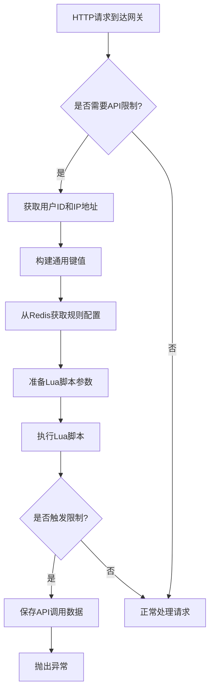

# 淘票票项目API限制功能深度解析与最佳实践

## 1. 概述

淘票票项目通过API限制功能来保护系统免受恶意请求和异常流量的影响，确保系统的稳定性和高可用性。该功能基于Redis和Lua脚本实现，具备高性能、低延迟的特点，能够实时监控和限制API访问频率。

## 2. 整体架构设计

### 2.1 核心组件

API限制功能主要由以下几个核心组件构成：

1. **ApiRestrictService**：Java服务层，负责业务逻辑处理和规则配置
2. **ApiRestrictCacheOperate**：Redis Lua脚本执行器
3. **apiLimit.lua**：核心Lua脚本，实现限流逻辑
4. **Redis**：存储限流相关数据和状态

### 2.2 工作流程



## 3. Lua脚本深度解析

### 3.1 脚本功能概述

[apiLimit.lua](file://F:\MyProjects\taopiaopiao\taopiaopiao-server\taopiaopiao-gateway-service\src\main\resources\lua\apiLimit.lua)脚本是API限制功能的核心，它实现了以下功能：

1. **计数统计**：对API访问进行计数
2. **阈值检查**：检查访问次数是否超过设定阈值
3. **时间窗口管理**：管理限流的时间窗口
4. **深度规则处理**：处理复杂的时间段规则

### 3.2 脚本执行逻辑

#### 3.2.1 初始化阶段

```lua
-- 初始化变量
local trigger_result = 0
local trigger_call_Stat = 0
local api_count = 0
local threshold = 0

-- 解析API规则配置
local apiRule = cjson.decode(KEYS[1])
local api_rule_type = apiRule.apiRuleType
local rule_key = apiRule.ruleKey
local rule_stat_time = apiRule.statTime
-- 从传入的KEYS[数中解析出的API规则对象获取阈值配置
local rule_threshold = apiRule.threshold1]
local rule_effective_time = apiRule.effectiveTime
local rule_limit_key = apiRule.ruleLimitKey
local z_set_key = apiRule.zSetRuleStatKey

local current_Time = apiRule.currentTime
local message_index = -1
```

脚本首先初始化各种变量，并从传入的参数中解析API规则配置。

#### 3.2.2 基础计数和阈值检查

```lua
-- 对规则key进行计数统计
local count = tonumber(redis.call('incrby', rule_key, 1))
if (count == 1) then
    -- 如果是第一次访问，则设置过期时间
    redis.call('expire', rule_key, rule_stat_time)
end

-- 检查是否超过阈值
if ((count - rule_threshold) >= 0) then
    if (redis.call('exists', rule_limit_key) == 0) then
        -- 首次触发限制，设置限制key和过期时间
        redis.call('set', rule_limit_key, rule_limit_key)
        redis.call('expire', rule_limit_key, rule_effective_time)
        trigger_call_Stat = 1
        -- 将当前时间和计数添加到有序集合中
        local z_set_member = current_Time .. "_" .. tostring(count)
        redis.call('zadd',z_set_key,current_Time,z_set_member)
    end
    trigger_result = 1
end

-- 检查限制key是否存在
if (redis.call('exists', rule_limit_key) == 1) then
    trigger_result = 1
end
```

这部分逻辑实现了基础的计数和阈值检查功能：
1. 使用`INCRBY`命令对访问次数进行递增
2. 如果是第一次访问，设置过期时间以实现时间窗口功能
3. 检查访问次数是否超过阈值
4. 如果超过阈值且是首次触发，设置限制key并记录到有序集合中
5. 检查限制key是否存在，确定是否触发限制

#### 3.2.3 深度规则处理

```lua
-- 处理深度规则（时间段规则）
if (api_rule_type == 2) then
    local depthRules = apiRule.depthRules
    for index,depth_rule in ipairs(depthRules)  do
        local start_time_window = depth_rule.startTimeWindowTimestamp
        local end_time_window = depth_rule.endTimeWindowTimestamp
        local depth_rule_stat_time = depth_rule.statTime
        local depth_rule_threshold = depth_rule.threshold
        local depth_rule_effective_time = depth_rule.effectiveTime
        local depth_rule_limit_key = depth_rule.depthRuleLimit

        threshold = depth_rule_threshold

        -- 清除过期的数据
        if (current_Time > start_time_window) then
            redis.call('zremrangebyscore',z_set_key,0,start_time_window - 1000)
        end

        -- 在有效时间窗口内进行检查
        if (current_Time >= start_time_window and current_Time <= end_time_window) then
            local z_set_min_score = start_time_window;
            local z_set_max_score = current_Time;

            -- 计算统计时间范围
            if ((current_Time - start_time_window) > depth_rule_stat_time * 1000) then
                z_set_min_score = current_Time - (depth_rule_stat_time * 1000)
            end

            -- 统计时间窗口内的请求数量
            local rule_trigger_count = tonumber(redis.call('zcount',z_set_key,z_set_min_score,z_set_max_score))
            api_count = rule_trigger_count

            -- 检查是否超过深度规则阈值
            if ((rule_trigger_count - depth_rule_threshold) >= 0) then
                if (redis.call('exists', depth_rule_limit_key) == 0) then
                    -- 首次触发深度规则限制
                    redis.call('set', depth_rule_limit_key, depth_rule_limit_key)
                    redis.call('expire', depth_rule_limit_key, depth_rule_effective_time)
                    trigger_result = 1
                    trigger_call_Stat = 2
                    message_index = index
                    return string.format('{"triggerResult": %d, "triggerCallStat": %d, "apiCount": %d, "threshold": %d, "messageIndex": %d}'
                    ,trigger_result,trigger_call_Stat,api_count,threshold,message_index)
                end
            end

            -- 检查深度规则限制key是否存在
            if (redis.call('exists', depth_rule_limit_key) == 1) then
                trigger_result = 1
                message_index = index
                return string.format('{"triggerResult": %d, "triggerCallStat": %d, "apiCount": %d, "threshold": %d, "messageIndex": %d}'
                ,trigger_result,trigger_call_Stat,api_count,threshold,message_index)
            end
        end
    end
end
```

深度规则处理逻辑更加复杂，支持基于时间段的精细化控制：
1. 遍历所有深度规则
2. 清除过期数据，保持有序集合的清洁
3. 在有效时间窗口内进行检查
4. 计算统计时间范围，确保只统计指定时间窗口内的请求
5. 使用`ZCOUNT`命令统计时间窗口内的请求数量
6. 检查是否超过深度规则阈值
7. 如果超过阈值且是首次触发，设置深度规则限制key
8. 检查深度规则限制key是否存在，确定是否触发限制

#### 3.2.4 结果返回

```lua
-- 返回结果
return string.format('{"triggerResult": %d, "triggerCallStat": %d, "apiCount": %d, "threshold": %d, "messageIndex": %d}'
,trigger_result,trigger_call_Stat,api_count,threshold,message_index)
```

脚本最后以JSON格式返回执行结果，包括：
- `triggerResult`：是否触发限制（0/1）
- `triggerCallStat`：触发类型（1=基础规则，2=深度规则）
- `apiCount`：当前API访问次数
- `threshold`：阈值
- `messageIndex`：触发的深度规则索引

## 4. Java服务层实现

### 4.1 ApiRestrictService

[ApiRestrictService](file://F:\MyProjects\taopiaopiao\taopiaopiao-server\taopiaopiao-gateway-service\src\main\java\com\taopiaopiao\service\ApiRestrictService.java#L41-L311)是API限制功能的Java服务层实现，主要负责：

1. **路径匹配**：检查请求URI是否需要进行API限制
2. **规则获取**：从Redis获取限流规则配置
3. **参数准备**：准备Lua脚本执行所需的参数
4. **结果处理**：处理Lua脚本返回的结果并采取相应措施

#### 4.1.1 路径匹配

```java
public boolean checkApiRestrict(String requestUri){
    if (gatewayProperty.getApiRestrictPaths() != null) {
        for (String apiRestrictPath : gatewayProperty.getApiRestrictPaths()) {
            PathMatcher matcher = new AntPathMatcher();
            if(matcher.match(apiRestrictPath, requestUri)){
                return true;
            }
        }
    }
    return false;
}
```

通过AntPathMatcher匹配需要进行API限制的路径。

#### 4.1.2 规则参数准备

```java
public JSONObject getRuleParameter(int apiRuleType, String commonKey, RuleVo ruleVo){
    JSONObject parameter = new JSONObject();
    
    parameter.put("apiRuleType",apiRuleType);
    
    String ruleKey = "rule_api_limit" + "_" + commonKey;
    parameter.put("ruleKey",ruleKey);
    
    parameter.put("statTime",String.valueOf(Objects.equals(ruleVo.getStatTimeType(), RuleTimeUnit.SECOND.getCode()) ? ruleVo.getStatTime() : ruleVo.getStatTime() * 60));
    
    parameter.put("threshold",ruleVo.getThreshold());
    
    parameter.put("effectiveTime",String.valueOf(Objects.equals(ruleVo.getEffectiveTimeType(), RuleTimeUnit.SECOND.getCode()) ? ruleVo.getEffectiveTime() : ruleVo.getEffectiveTime() * 60));
    
    parameter.put("ruleLimitKey", RedisKeyBuild.createRedisKey(RedisKeyManage.RULE_LIMIT,commonKey).getRelKey());
    
    parameter.put("zSetRuleStatKey", RedisKeyBuild.createRedisKey(RedisKeyManage.Z_SET_RULE_STAT,commonKey).getRelKey());
    
    return parameter;
}
```

准备基础规则参数，包括规则类型、统计时间、阈值、有效时间等。

```java
public JSONObject getDepthRuleParameter(JSONObject parameter,String commonKey,List<DepthRuleVo> depthRuleVoList){
    // 对深度规则按开始时间窗口排序
    depthRuleVoList = sortStartTimeWindow(depthRuleVoList);
    
    parameter.put("depthRuleSize",String.valueOf(depthRuleVoList.size()));
    
    parameter.put("currentTime",System.currentTimeMillis());
    
    List<JSONObject> depthRules = new ArrayList<>();
    for (int i = 0; i < depthRuleVoList.size(); i++) {
        JSONObject depthRule = new JSONObject();
        DepthRuleVo depthRuleVo = depthRuleVoList.get(i);
        
        depthRule.put("statTime",Objects.equals(depthRuleVo.getStatTimeType(), RuleTimeUnit.SECOND.getCode()) ? depthRuleVo.getStatTime() : depthRuleVo.getStatTime() * 60);
        
        depthRule.put("threshold",depthRuleVo.getThreshold());
        
        depthRule.put("effectiveTime",String.valueOf(Objects.equals(depthRuleVo.getEffectiveTimeType(), RuleTimeUnit.SECOND.getCode()) ? depthRuleVo.getEffectiveTime() : depthRuleVo.getEffectiveTime() * 60));
        
        depthRule.put("depthRuleLimit", RedisKeyBuild.createRedisKey(RedisKeyManage.DEPTH_RULE_LIMIT,i,commonKey).getRelKey());
        
        depthRule.put("startTimeWindowTimestamp",depthRuleVo.getStartTimeWindowTimestamp());
        depthRule.put("endTimeWindowTimestamp",depthRuleVo.getEndTimeWindowTimestamp());
        
        depthRules.add(depthRule);
    }
    
    parameter.put("depthRules",depthRules);
    
    return parameter;
}
```

准备深度规则参数，包括时间窗口、统计时间、阈值等。

### 4.2 ApiRestrictCacheOperate

[ApiRestrictCacheOperate](file://F:\MyProjects\taopiaopiao\taopiaopiao-server\taopiaopiao-gateway-service\src\main\java\com\taopiaopiao\service\lua\ApiRestrictCacheOperate.java#L23-L46)负责执行Lua脚本：

```java
@PostConstruct
public void init(){
    try {
        redisScript = new DefaultRedisScript<>();
        redisScript.setScriptSource(new ResourceScriptSource(new ClassPathResource("lua/apiLimit.lua")));
        redisScript.setResultType(String.class);
    } catch (Exception e) {
        log.error("redisScript init lua error",e);
    }
}

public ApiRestrictData apiRuleOperate(List<String> keys, Object[] args){
    Object object = redisCache.getInstance().execute(redisScript, keys, args);
    return JSON.parseObject((String)object, ApiRestrictData.class);
}
```

通过Spring的RedisTemplate执行Lua脚本，并将结果解析为[ApiRestrictData](file://F:\MyProjects\taopiaopiao\taopiaopiao-server\taopiaopiao-gateway-service\src\main\java\com\taopiaopiao\service\ApiRestrictData.java#L12-L32)对象。

## 5. 限流策略详解

### 5.1 基础限流规则

基础限流规则采用计数器算法，通过Redis的INCRBY命令实现简单的访问次数统计：

1. **计数统计**：每次访问对指定key的计数器进行递增
2. **时间窗口**：通过设置key的过期时间实现时间窗口控制
3. **阈值检查**：检查计数是否超过设定阈值
4. **限制生效**：超过阈值后设置限制key，一段时间内拒绝访问

### 5.2 深度限流规则

深度限流规则采用滑动窗口算法，通过Redis的有序集合（ZSet）实现更精细化的时间窗口控制：

1. **时间序列记录**：将每次访问的时间戳记录到有序集合中
2. **过期数据清理**：定期清理过期的时间记录
3. **窗口统计**：统计指定时间窗口内的访问次数
4. **时间段控制**：支持在特定时间段内应用不同的限流规则

## 6. 最佳实践

### 6.1 性能优化

1. **Lua脚本原子性**：将复杂的限流逻辑放在Lua脚本中执行，确保原子性并减少网络开销
2. **键值设计**：合理设计Redis键值，避免键冲突并便于管理
3. **数据清理**：定期清理过期数据，避免内存泄漏

### 6.2 可扩展性

1. **规则配置化**：将限流规则存储在Redis中，支持动态调整
2. **模块化设计**：将不同功能拆分为独立模块，便于维护和扩展
3. **策略模式**：通过不同的规则类型支持多种限流策略

### 6.3 可维护性

1. **详细日志**：记录关键操作日志，便于问题排查
2. **异常处理**：完善的异常处理机制，确保系统稳定性
3. **监控告警**：记录限流触发情况，支持监控和告警

## 7. 总结

淘票票项目的API限制功能通过Redis和Lua脚本实现了高性能、低延迟的限流控制。其核心优势包括：

1. **高性能**：基于Redis的内存操作和Lua脚本的原子性执行
2. **灵活性**：支持基础限流和深度限流两种策略
3. **可扩展性**：规则配置化，支持动态调整
4. **可维护性**：模块化设计，便于维护和扩展

该方案为高并发系统提供了有效的保护机制，确保系统在面对异常流量时仍能稳定运行。