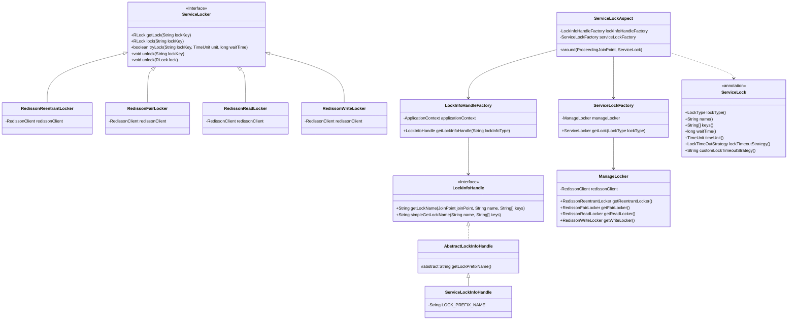

# 淘票票Redisson框架设计与实现详解

在淘票票高并发系统中，Redisson框架扮演着至关重要的角色。该框架基于Redisson客户端封装了分布式锁、防重复执行、布隆过滤器等多个核心组件，为系统提供了高可用、高性能的分布式协调能力。

## 一、模块结构概览

淘票票Redisson框架采用模块化设计，主要包括以下几个子模块：

```
taopiaopiao-redisson-framework
├── taopiaopiao-redisson-service-framework
│   ├── taopiaopiao-redisson-common-framework     # 公共配置模块
│   ├── taopiaopiao-service-lock-framework        # 分布式锁模块
│   ├── taopiaopiao-repeat-execute-limit-framework # 防重复执行模块
│   └── taopiaopiao-bloom-filter-framework        # 布隆过滤器模块
└── taopiaopiao-service-delay-queue-framework     # 延迟队列模块
```

### 1.1 模块依赖关系

各模块之间具有清晰的依赖关系：
- `taopiaopiao-redisson-common-framework`：作为基础模块，被其他所有模块依赖
- `taopiaopiao-service-lock-framework`：核心分布式锁实现，被防重复执行模块依赖
- `taopiaopiao-repeat-execute-limit-framework`：依赖分布式锁模块，实现防重复执行功能
- `taopiaopiao-bloom-filter-framework`：独立的布隆过滤器实现
- `taopiaopiao-service-delay-queue-framework`：延迟队列实现，依赖公共模块

## 二、核心模块详解

### 2.1 taopiaopiao-redisson-common-framework（公共配置模块）

该模块是整个Redisson框架的基础，提供了通用的配置和抽象类：

#### 2.1.1 核心组件

1. **RedissonCommonAutoConfiguration**
   - Redisson客户端配置和初始化
   - 提供RedissonDataHandle、LocalLockCache等基础Bean
   - 初始化LockInfoHandleFactory工厂类

2. **LockInfoHandle接口及实现**
   - 抽象锁信息处理器，定义锁名称生成规范
   - 提供基于SpEL表达式的动态锁名称生成能力

3. **常量定义**
   - LockInfoType：定义不同业务场景的锁类型标识

#### 2.1.2 设计理念

该模块采用工厂模式和策略模式相结合的设计：
- LockInfoHandleFactory通过ApplicationContext动态获取不同类型的锁信息处理器
- 通过LockInfoType常量标识不同类型处理器，实现解耦

### 2.2 taopiaopiao-service-lock-framework（分布式锁模块）

这是整个框架的核心模块，提供了完整的分布式锁解决方案。

#### 2.2.1 核心组件

1. **ServiceLock注解**
   - 声明式分布式锁的入口
   - 支持多种锁类型（可重入锁、公平锁、读锁、写锁）
   - 支持自定义锁超时策略

2. **ServiceLockAspect切面**
   - 通过AOP实现声明式分布式锁
   - 负责锁的获取、释放和超时处理
   - 与Spring框架无缝集成

3. **ServiceLocker接口及实现类**
   - 定义分布式锁操作规范
   - RedissonReentrantLocker：可重入锁实现
   - RedissonFairLocker：公平锁实现
   - RedissonReadLocker/RedissonWriteLocker：读写锁实现

4. **ServiceLockFactory工厂类**
   - 根据锁类型创建对应的锁实现
   - 通过ManageLocker管理器获取具体锁实例

5. **工具类**
   - ServiceLockTool：编程式使用分布式锁的工具类
   - 支持有返回值和无返回值的任务执行

#### 2.2.2 类关系图



#### 2.2.3 工作流程

1. 当方法被@ServiceLock注解标记时，ServiceLockAspect会拦截该方法调用
2. 通过LockInfoHandleFactory获取对应的锁信息处理器，生成唯一锁名称
3. 通过ServiceLockFactory获取指定类型的锁实例
4. 尝试获取锁，如果成功则执行方法，失败则执行超时策略
5. 方法执行完成后自动释放锁

### 2.3 taopiaopiao-repeat-execute-limit-framework（防重复执行模块）

该模块基于分布式锁实现防重复执行功能，主要用于保证接口幂等性。

#### 2.3.1 核心组件

1. **RepeatExecuteLimit注解**
   - 声明式防重复执行标记
   - 支持本地锁和分布式锁双重保障

2. **RepeatExecuteLimitAspect切面**
   - 实现防重复执行逻辑
   - 结合本地锁和分布式锁保证高并发下的幂等性

3. **LocalLockCache本地锁缓存**
   - 提供本地锁机制，减少Redis访问压力
   - 通过Guava Cache实现本地锁缓存

#### 2.3.2 设计理念

该模块采用双层锁机制：
- 本地锁：快速响应，减少Redis访问压力
- 分布式锁：保证分布式环境下的幂等性

### 2.4 taopiaopiao-bloom-filter-framework（布隆过滤器模块）

布隆过滤器模块用于快速判断元素是否存在，避免不必要的数据库查询。

#### 2.4.1 核心组件

1. **BloomFilterHandler**
   - 布隆过滤器操作封装
   - 提供添加元素、判断元素是否存在等方法

2. **BloomFilterProperties**
   - 布隆过滤器配置属性
   - 支持自定义误判率、预期元素个数等参数

### 2.5 taopiaopiao-service-delay-queue-framework（延迟队列模块）

延迟队列模块基于Redisson实现延迟任务处理。

#### 2.5.1 核心组件

1. **ConsumerTask接口**
   - 延迟任务消费者接口
   - 定义任务执行方法和主题标识

2. **DelayBaseQueue**
   - 延迟队列基础实现
   - 提供任务入队、出队等基础操作

## 三、设计优势与特点

### 3.1 高内聚低耦合

框架采用模块化设计，每个模块职责明确，模块间依赖关系清晰。通过接口和抽象类定义规范，实现组件间的解耦。

### 3.2 声明式与编程式并存

框架同时支持声明式（注解）和编程式两种使用方式：
- 声明式：通过@ServiceLock等注解，使用简单直观
- 编程式：通过ServiceLockTool工具类，灵活性更高

### 3.3 扩展性强

框架设计遵循开闭原则，易于扩展：
- 新增锁类型只需实现ServiceLocker接口
- 新增业务场景可扩展LockInfoHandle处理器
- 通过工厂模式实现动态获取实例

### 3.4 高性能设计

1. 本地锁缓存减少Redis访问压力
2. 连接池化管理提高资源利用率
3. 异步处理机制提升系统吞吐量

## 四、使用示例

### 4.1 分布式锁使用

```java
@Service
public class OrderService {
    
    @ServiceLock(
        name = "create_order", 
        keys = {"#userId", "#orderId"}, 
        waitTime = 5,
        lockTimeoutStrategy = LockTimeOutStrategy.FAIL
    )
    public void createOrder(String userId, String orderId) {
        // 创建订单的业务逻辑
    }
}
```

### 4.2 防重复执行使用

```java
@RestController
public class PaymentController {
    
    @RepeatExecuteLimit(
        name = "pay_order", 
        keys = {"#request.orderId"}
    )
    @PostMapping("/pay")
    public ApiResponse pay(@RequestBody PayRequest request) {
        // 支付逻辑
        return ApiResponse.success();
    }
}
```

## 五、总结

淘票票Redisson框架通过精心设计的模块结构和类关系，实现了高性能、高可用的分布式协调能力。其声明式与编程式并存的使用方式、良好的扩展性以及双层锁机制等特点，使其能够很好地适应高并发场景下的各种需求。该框架不仅满足了淘票票系统的核心需求，也为其他类似系统提供了可复用的解决方案。