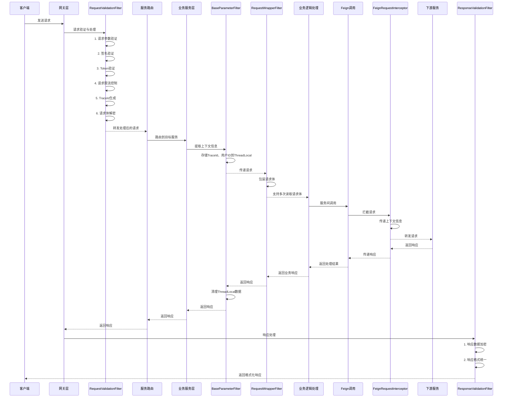

# 网关过滤技术解读

本文档详细解读淘票票项目中的微服务网关过滤技术实现，包括过滤器设计、请求处理流程、响应式编程应用及系统配置等核心内容。

## 1. 业务过滤器的讲解

淘票票项目中实现了多个过滤器来处理请求和响应，确保系统的安全性和一致性。

### 1.1 网关层过滤器

#### RequestValidationFilter（请求验证过滤器）

- 位置：taopiaopiao-server/taopiaopiao-gateway-service
- 功能：
  - 请求参数验证和签名验证
  - Token验证和用户身份识别
  - 请求限流控制
  - TraceId生成和传递
  - 请求体解密和验证
- 执行顺序：order = -2，优先级较高(Spring Cloud Gateway 中：设置order > 0（post 阶段） 拦截器，设置order < 0（pre 阶段）拦截器）

#### ResponseValidationFilter（响应验证过滤器）

- 位置：taopiaopiao-server/taopiaopiao-gateway-service
- 功能：
  - 响应数据加密
  - 响应格式统一处理
- 执行顺序：order = -2，优先级较高

### 1.2 服务层过滤器

#### BaseParameterFilter（基础参数过滤器）

- 位置：taopiaopiao-spring-cloud-framework/taopiaopiao-service-component
- 功能：
  - 从请求头中提取TraceId、用户ID等上下文信息
  - 将这些信息存储到ThreadLocal中供后续使用
  - 在请求处理完成后清理ThreadLocal数据

#### RequestWrapperFilter（请求包装过滤器）

- 位置：taopiaopiao-spring-cloud-framework/taopiaopiao-service-component
- 功能：
  - 包装原始HttpServletRequest
  - 允许对请求体进行多次读取

### 1.3 Feign拦截器

#### FeignRequestInterceptor（Feign请求拦截器）

- 位置：taopiaopiao-spring-cloud-framework/taopiaopiao-service-component
- 功能：
  - 在服务间调用时传递TraceId等上下文信息
  - 确保全链路追踪的一致性

### 1.4 项目整体过滤流程

淘票票项目采用多层级过滤器设计，构建了完整的请求处理链路。以下是从请求到响应的详细顺序图：



整个过滤流程具有以下特点：

1. **分层处理**：网关层负责统一的安全验证和限流控制，服务层负责上下文管理和业务处理
2. **上下文传递**：通过TraceId实现全链路追踪，在网关层生成，通过请求头和服务间调用传递
3. **线程安全**：使用ThreadLocal存储上下文信息，确保线程间数据隔离
4. **资源清理**：在请求处理完成后及时清理ThreadLocal数据，防止内存泄漏
5. **异常处理**：各层过滤器都有完善的异常处理机制，确保系统稳定性

### 1.5 请求体重写的意义

在RequestValidationFilter中，需要读取并重写请求体的主要原因如下：

#### 1.5.1 参数解密需求

淘票票项目为了保证数据传输的安全性，对业务参数进行了加密处理：

- 客户端将业务参数通过RSA算法加密后发送
- 网关层需要读取请求体，解密业务参数进行验证
- 解密后的明文参数需要传递给下游服务处理

#### 1.5.2 签名验证机制

为了防止请求被篡改，系统采用了签名验证机制：

- 客户端对请求参数生成RSA签名
- 网关层需要读取完整的请求体来验证签名
- 验证通过后，将处理后的参数传递给下游服务

#### 1.5.3 上下文信息增强

网关层在处理请求时会生成或提取一些上下文信息：

- TraceId：用于全链路追踪
- UserId：用户身份信息
- Code：渠道编码

这些信息需要添加到请求头中传递给下游服务。

#### 1.5.4 响应式编程的特殊性

由于Spring Cloud Gateway基于WebFlux构建，采用响应式编程模型：

- 请求体（RequestBody）是响应式流，只能被消费一次
- 为了在网关层读取并处理请求体，同时让下游服务也能获取处理后的数据，必须重新构建请求
- 通过CachedBodyOutputMessage缓存处理后的请求体，再通过ServerHttpRequestDecorator装饰原始请求

##### 1.5.4.1 Mono的作用和优势

Mono是Project Reactor中的核心组件，代表包含0或1个元素的异步序列：

要理解这个概念，我们可以用生活中的例子来类比：

- 就像一个快递盒子，里面可能有物品（1个元素），也可能没有物品（0个元素）
- 这个盒子的获取过程是异步的，你不需要一直在等待快递员，而是可以做其他事情
- 当快递到达时，你会收到通知，然后处理里面的物品

具体来说：

- **异步处理**：支持非阻塞的异步操作，提高系统吞吐量

  - 传统同步方式：线程需要一直等待I/O操作完成
  - 响应式方式：线程可以在等待期间处理其他任务，提高资源利用率
- **背压支持**：能够处理高速生产者和低速消费者之间的数据流控制

  - 当生产数据的速度超过消费数据的速度时，能够自动调节，防止内存溢出
- **链式操作**：提供丰富的操作符（如flatMap、switchIfEmpty等）支持函数式编程

  - 可以像流水线一样对数据进行一系列处理操作

##### 1.5.4.2 为什么Mono可以多次读取而原始请求不行

1. **原始HTTP请求体的限制**：

   - 基于InputStream实现，数据只能顺序读取一次
   - 读取完成后流关闭，无法重新打开
   - 这是HTTP协议和Java IO的标准行为
2. **Mono的缓存机制**：

   - 通过bodyToMono将一次性读取的请求体转换为Mono对象
   - Mono内部缓存了读取的数据，支持多次订阅
   - 后续的每个订阅者都能获取到完整的数据副本
3. **响应式流规范**：

   - 响应式流（Reactive Streams）规范允许对数据进行缓存和重放
   - Mono作为响应式流的实现，遵循这一规范
   - 通过响应式操作符可以实现复杂的数据转换和处理逻辑

##### 1.5.4.3 为什么需要CachedBodyOutputMessage和exchange.mutate()

在readBody方法的后半部分，有几处可能令人困惑的设计，让我们详细解释其前因后果：

**前因：**

1. 网关需要对请求体进行处理（解密、验证等）
2. 原始HTTP请求体是基于InputStream的，只能被读取一次
3. 处理后的数据需要传递给下游服务
4. 还需要添加额外的请求头信息（如TraceId等上下文）

**后果：**

1. 必须重新构建请求，包含处理后的数据和新的请求头
2. 保证下游服务能获取到正确的数据和上下文信息

**详细解释：**

1. **为什么需要CachedBodyOutputMessage**：

   - 原始请求体是只读的响应式流，一旦被消费就无法再次读取
   - CachedBodyOutputMessage作为一个可写的响应式消息容器，允许我们存储处理后的数据
   - 后续的处理可以通过getBody()方法获取处理后的数据流
   - 这解决了响应式流只能消费一次的限制问题
2. **为什么不能直接复用原始请求**：

   - 我们需要传递的是处理后的数据（如解密后的明文），而不是原始加密数据
   - 我们还需要添加额外的请求头信息（如TraceId、UserId等上下文信息）
   - ServerWebExchange是不可变对象，任何修改都需要通过mutate()创建新实例
3. **为什么使用Mono.defer()**：

   - defer()实现延迟执行：只有在订阅时才创建真正的Mono
   - 避免过早执行：确保在适当的时候才执行过滤器链
   - 保证正确顺序：确保写入操作完成后再执行后续过滤器
4. **为什么需要bodyInserter.insert()**：

   - bodyInserter.insert()只是定义了"如何写入"的操作，实际并未执行写入
   - 在响应式编程中，只有订阅时才会真正执行操作
   - 这一步将处理后的数据（modifiedBody）写入到CachedBodyOutputMessage中

#### 1.5.5 安全性和一致性保障

通过在网关层统一处理安全验证和参数处理：

- 避免下游服务重复进行相同的安全检查
- 确保所有请求都经过统一的安全验证
- 提高系统的整体安全性和一致性

### 1.6 响应式编程与请求体重写详解

在淘票票项目中，网关层采用了响应式编程模型来处理请求和响应。这种设计选择有其深刻的技术原因和业务需求背景。

#### 1.6.1 为什么采用响应式编程

##### 1.6.1.1 Spring Cloud Gateway架构特性

Spring Cloud Gateway基于Spring WebFlux构建，本身就是响应式框架：

- 非阻塞I/O模型，能够处理大量并发请求
- 资源利用率高，少量线程处理大量请求
- 与下游微服务的响应式集成更加顺畅

##### 1.6.1.2 高并发处理需求

淘票票作为票务平台，在高峰期需要处理大量并发请求：

- 响应式编程使用少量线程处理大量请求，避免了为每个请求创建线程的开销
- 特别适合I/O密集型的网关场景

##### 1.6.1.3 非阻塞操作支持

请求处理过程中可能涉及网络调用或计算密集型任务：

- 签名验证、解密等操作可能需要调用其他服务
- 响应式编程允许这些操作在不阻塞线程的情况下执行

#### 1.6.2 为什么需要重建请求而不是直接传输原始请求

##### 1.6.2.1 请求体只能被消费一次

在Spring WebFlux中，`ServerHttpRequest`的请求体是一个 `Flux<DataBuffer>`流，这个流只能被消费一次：

```
// 原始请求体只能读取一次
Mono<String> modifiedBody = serverRequest
        .bodyToMono(String.class)
        .flatMap(originalBody -> Mono.just(execute(requestTemporaryWrapper,originalBody,exchange)))
```

如果不重建请求，下游服务就无法再次读取已经被消费过的请求体。

##### 1.6.2.2 数据解密和转换需求

原始请求包含的是加密数据，而下游微服务需要的是解密后的明文数据：

```
// 解密业务数据
if (StringUtil.isNotEmpty(encrypt) && V2.equals(encrypt)) {
    // 使用渠道数据中的解密密钥对业务体进行解密
    String decrypt = RsaTool.decrypt(bodyContent.get(BUSINESS_BODY),channelDataVo.getDataSecretKey());
    bodyContent.put(BUSINESS_BODY,decrypt);
}
```

必须重建请求体以传递解密后的数据。

##### 1.6.2.3 请求头信息增强

需要向请求头中添加额外的上下文信息（如USER_ID、CODE等），供下游服务使用：

```
// 构建返回参数映射
Map<String,String> map = new HashMap<>(4);
map.put(REQUEST_BODY,requestBody);
if (StringUtil.isNotEmpty(code)) {
    map.put(CODE,code);
}
if (StringUtil.isNotEmpty(userId)) {
    map.put(USER_ID,userId);
}
```

##### 1.6.2.4 签名验证后的数据清理

原始请求中包含签名等验证用字段，这些字段需要被移除或处理后才能传递给下游服务：

```
/**
 * 获取签名检查的内容
 * @param params
 * @return
 */
private static String getSignCheckContent(Map<String, String> params) {
    if (params == null) {
        return null;
    }
    params.remove("sign");
    params.remove("files");
  
    return buildParam(params);
}
```

##### 1.6.2.5 ServerWebExchange的不可变性

`ServerWebExchange`是不可变对象，任何修改都需要通过 `mutate()`方法创建新的实例：

```
return bodyInserter
        .insert(outputMessage, new BodyInserterContext())
        .then(Mono.defer(() -> chain.filter(
                exchange.mutate().request(decorateHead(exchange, headers, outputMessage, requestTemporaryWrapper, headMap)).build()
        )))
```

#### 1.6.3 响应式编程在请求处理中的应用

##### 1.6.3.1 Mono的作用和优势

Mono是Project Reactor中的核心组件，代表包含0或1个元素的异步序列：

要理解这个概念，我们可以用生活中的例子来类比：

- 就像一个快递盒子，里面可能有物品（1个元素），也可能没有物品（0个元素）
- 这个盒子的获取过程是异步的，你不需要一直在等待快递员，而是可以做其他事情
- 当快递到达时，你会收到通知，然后处理里面的物品

具体来说：

- **异步处理**：支持非阻塞的异步操作，提高系统吞吐量

  - 传统同步方式：线程需要一直等待I/O操作完成
  - 响应式方式：线程可以在等待期间处理其他任务，提高资源利用率
- **背压支持**：能够处理高速生产者和低速消费者之间的数据流控制

  - 当生产数据的速度超过消费数据的速度时，能够自动调节，防止内存溢出
- **链式操作**：提供丰富的操作符（如flatMap、switchIfEmpty等）支持函数式编程

  - 可以像流水线一样对数据进行一系列处理操作

##### 1.6.3.2 为什么Mono可以多次读取而原始请求不行

1. **原始HTTP请求体的限制**：

   - 基于InputStream实现，数据只能顺序读取一次
   - 读取完成后流关闭，无法重新打开
   - 这是HTTP协议和Java IO的标准行为
2. **Mono的缓存机制**：

   - 通过bodyToMono将一次性读取的请求体转换为Mono对象
   - Mono内部缓存了读取的数据，支持多次订阅
   - 后续的每个订阅者都能获取到完整的数据副本
3. **响应式流规范**：

   - 响应式流（Reactive Streams）规范允许对数据进行缓存和重放
   - Mono作为响应式流的实现，遵循这一规范
   - 通过响应式操作符可以实现复杂的数据转换和处理逻辑

##### 1.6.3.3 为什么需要CachedBodyOutputMessage和exchange.mutate()

在readBody方法的后半部分，有几处可能令人困惑的设计，让我们详细解释其前因后果：

**前因：**

1. 网关需要对请求体进行处理（解密、验证等）
2. 原始HTTP请求体是基于InputStream的，只能被读取一次
3. 处理后的数据需要传递给下游服务
4. 还需要添加额外的请求头信息（如TraceId等上下文）

**后果：**

1. 必须重新构建请求，包含处理后的数据和新的请求头
2. 保证下游服务能获取到正确的数据和上下文信息

**详细解释：**

1. **为什么需要CachedBodyOutputMessage**：

   - 原始请求体是只读的响应式流，一旦被消费就无法再次读取
   - CachedBodyOutputMessage作为一个可写的响应式消息容器，允许我们存储处理后的数据
   - 后续的处理可以通过getBody()方法获取处理后的数据流
   - 这解决了响应式流只能消费一次的限制问题
2. **为什么不能直接复用原始请求**：

   - 我们需要传递的是处理后的数据（如解密后的明文），而不是原始加密数据
   - 我们还需要添加额外的请求头信息（如TraceId、UserId等上下文信息）
   - ServerWebExchange是不可变对象，任何修改都需要通过mutate()创建新实例
3. **为什么使用Mono.defer()**：

   - defer()实现延迟执行：只有在订阅时才创建真正的Mono
   - 避免过早执行：确保在适当的时候才执行过滤器链
   - 保证正确顺序：确保写入操作完成后再执行后续过滤器
4. **为什么需要bodyInserter.insert()**：

   - bodyInserter.insert()只是定义了"如何写入"的操作，实际并未执行写入
   - 在响应式编程中，只有订阅时才会真正执行操作
   - 这一步将处理后的数据（modifiedBody）写入到CachedBodyOutputMessage中

通过重建请求，可以确保下游微服务接收到的是经过处理的、干净的、包含必要上下文信息的请求数据。

## 2. 标准化数据返回结构

### 2.1 ApiResponse类设计

为确保API响应的一致性和可读性，项目实现了标准化的数据返回结构：

- **位置**：taopiaopiao-common/src/main/java/com/taopiaopiao/common/ApiResponse.java
- **设计特点**：
  - 统一的响应格式：code（状态码）、message（错误信息）、data（响应数据）
  - 提供多种静态方法创建成功和失败的响应
  - 支持泛型，可以包装任意类型的数据

### 2.2 ApiResponse类核心实现

```java
public class ApiResponse<T> {
    // 状态码：0表示成功，非0表示失败
    private int code;
    // 错误信息
    private String message;
    // 响应数据
    private T data;
  
    // 成功响应静态方法
    public static <T> ApiResponse<T> success(T data) {
        ApiResponse<T> response = new ApiResponse<>();
        response.code = 0;
        response.message = "success";
        response.data = data;
        return response;
    }
  
    // 失败响应静态方法
    public static <T> ApiResponse<T> fail(int code, String message) {
        ApiResponse<T> response = new ApiResponse<>();
        response.code = code;
        response.message = message;
        return response;
    }
  
    // getter和setter方法
    // ...
}

### 2.2 响应码规范

- 成功响应：code = 0
- 失败响应：code != 0，通常为负数或正数表示不同类型的错误
- 标准错误信息：通过BaseCode枚举定义

## 3. 全局服务配置优化

为提升系统运行效率和一致性，项目实现了全面的全局服务配置体系。

### 3.1 JSON序列化配置

- 位置：taopiaopiao-common/src/main/java/com/taopiaopiao/config/JacksonCustom.java
- 配置内容：
  - 时间格式统一处理（LocalDateTime、LocalDate、LocalTime、Date）
  - 空值处理策略
  - 特殊字符处理
  - 序列化和反序列化特性配置

### 3.2 自定义JSON序列化

- 位置：taopiaopiao-common/src/main/java/com/taopiaopiao/config/JsonCustomSerializer.java
- 功能：
  - 对不同类型的空值进行定制化处理
  - String类型空值序列化为空字符串
  - 数字类型空值序列化为空字符串
  - 布尔类型空值序列化为false
  - 集合类型空值序列化为空数组

### 3.3 日期反序列化配置

- 位置：taopiaopiao-common/src/main/java/com/taopiaopiao/config/DateJsonDeserializer.java
- 功能：
  - 支持多种日期格式的自动识别和解析
  - 支持时间戳格式的日期解析

### 3.4 自动配置类

- 位置：taopiaopiao-common/src/main/java/com/taopiaopiao/config/DaMaiCommonAutoConfig.java
- 功能：
  - 自动注册JacksonCustom配置
  - 确保JSON序列化配置在所有服务中生效

## 4. 微服务链路追踪与上下文传递

在微服务架构中，全链路追踪和上下文信息传递是确保系统可观测性和数据一致性的关键。

### 4.1 异常处理体系

- BaseException：基础异常类，继承RuntimeException
- TaoPiaoPiaoFrameException：业务异常类，包含错误码和错误信息
- ArgumentException：参数异常类，支持参数错误列表
- ArgumentError：参数错误详情类

### 4.2 统一异常处理

- 通过全局异常处理器统一处理各种异常
- 将异常转换为标准的ApiResponse格式返回
- 确保前后端交互的一致性

### 4.3 链路追踪配置

- 通过MDC和ThreadLocal实现TraceId传递
- 支持全链路追踪，便于问题定位和性能分析
- 在网关层生成TraceId，在各服务间传递

### 4.4 上下文信息传递

- 通过BaseParameterHolder管理上下文信息
- 支持TraceId、用户ID、灰度标识等信息的传递
- 确保在一次请求的整个生命周期中都能获取到上下文信息

### 4.5 日志管理配置

淘票票项目使用SLF4J作为日志门面，Logback作为日志实现，通过MDC（Mapped Diagnostic Context）实现链路追踪上下文注入。

#### 4.5.1 日志框架选型

- **SLF4J**：作为日志门面，提供统一的日志接口
- **Logback**：作为日志实现，提供高性能的日志记录能力
- **MDC**：用于存储诊断上下文信息，支持链路追踪

#### 4.5.2 TraceId生成与传递机制

1. **生成时机**：

   - 在网关层RequestValidationFilter中生成
   - 如果请求头中已包含TraceId，则直接使用；否则生成新的TraceId
2. **传递机制**：

   - 通过MDC.put(TRACE_ID, traceId)将TraceId放入MDC上下文
   - 通过HTTP请求头在各服务间传递TraceId
   - 在服务内部通过BaseParameterHolder存储和传递上下文信息
3. **代码实现**：

   ```java
   // 在网关中生成或获取TraceId
   String traceId = request.getHeaders().getFirst(TRACE_ID);
   if (StringUtil.isEmpty(traceId)) {
       traceId = String.valueOf(uidGenerator.getUid());
   }
   MDC.put(TRACE_ID, traceId);

   // 在服务间传递
   BaseParameterHolder.setParameter(TRACE_ID, traceId);
```

#### 4.5.3 上下文信息管理

1. **BaseParameterHolder**：

   - 基于ThreadLocal实现，用于在同一线程内传递上下文参数
   - 存储TraceId、用户ID、灰度标识等关键信息
   - 在请求处理完成后清理上下文，防止内存泄漏
2. **MDC**：

   - SLF4J提供的机制，用于在日志中添加诊断信息
   - 通过MDC.put()方法将关键信息添加到日志上下文中
   - 在日志输出时自动包含这些信息

#### 4.5.4 线程池中的上下文传递

考虑到在多线程环境下上下文信息的丢失问题，项目在BaseThreadPool中实现了上下文传递：

1. **MDC上下文传递**：

   - 通过MDC.getCopyOfContextMap()获取当前线程的MDC上下文
   - 在新线程中通过MDC.setContextMap()设置上下文
2. **ThreadLocal上下文传递**：获取当前线程的参数
   -----------------------------------------


   - 通过BaseParameterHolder.getParameterMap() 在新线程中通过BaseParameterHolder.setParameterMap()设置参数

#### 4.5.5 日志输出格式

通过在日志配置中使用%X{traceId}等占位符，可以在日志中输出链路追踪信息：

```
%d{yyyy-MM-dd HH:mm:ss.SSS} [%thread] %-5level [%X{traceId}] %logger{36} - %msg%n
```

#### 4.5.6 日志配置管理

- 支持不同环境（开发、测试、生产）的日志级别配置
- 支持日志文件滚动策略，防止日志文件过大
- 支持异步日志记录，提高系统性能
- 通过配置文件统一管理日志输出格式和路径

## 5. 统一异常处理机制

为保证系统稳定性和用户体验，项目实现了完善的异常处理机制。

### 5.1 异常分类处理

- 业务异常：通过TaoPiaoPiaoFrameException处理
- 参数异常：通过ArgumentException处理
- 系统异常：通过BaseException处理

### 5.2 异常信息标准化

- 使用BaseCode枚举定义标准错误码和错误信息
- 支持自定义错误信息
- 统一异常响应格式

### 5.3 异常日志记录

- 通过@Slf4j注解记录异常日志
- 包含详细的错误堆栈信息
- 支持链路追踪标识，便于问题排查

## 6. 高效JSON序列化与反序列化

为确保数据格式的一致性和高效处理，项目实现了定制化的JSON转换机制。

### 6.1 时间类型处理

- LocalDateTime、LocalDate、LocalTime的序列化和反序列化
- Date类型的自定义格式处理
- 支持多种日期格式的自动识别

### 6.2 空值处理策略

- 字符串类型空值处理为空字符串
- 数字类型空值处理为空字符串
- 布尔类型空值处理为false
- 集合类型空值处理为空数组

### 6.3 特殊字符处理

- 支持单引号
- 支持未加引号的字段名
- 支持未转义的控制字符

### 6.4 数据加密支持

- 在网关层支持响应数据加密
- 通过RSA算法进行数据加密
- 确保敏感数据在传输过程中的安全性

通过以上配置和设计，淘票票项目实现了统一、高效、安全的架构配置，为系统的稳定运行和高效开发提供了坚实的基础。
