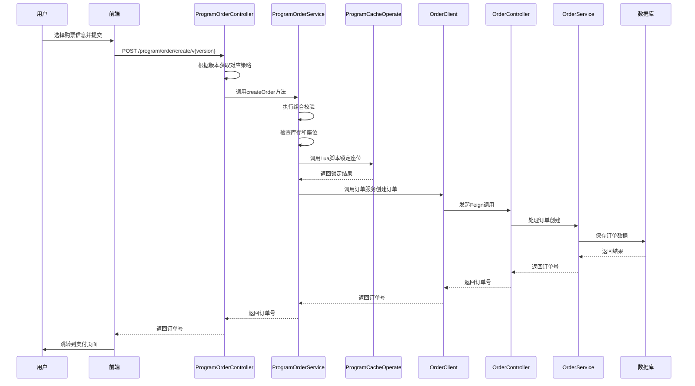
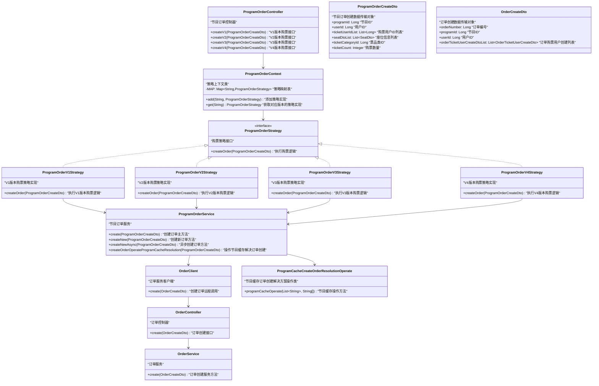

# 购票功能技术解读

## 一、项目概述

### 1. 核心技术栈

1. **Spring Boot + Spring Cloud Alibaba** - 微服务框架
2. **Nacos** - 服务注册与配置中心
3. **Sentinel** - 服务熔断与限流
4. **MySQL + ShardingSphere** - 分库分表数据库方案
5. **Redis** - 缓存、分布式锁、队列等
6. **Kafka** - 消息队列
7. **ElasticSearch** - 搜索引擎
8. **MyBatis-Plus** - ORM框架

## 二、购票流程详解

### 1. 完整购票逻辑流程

#### 1.1 用户选座/选票
- 用户在前端选择演出项目、场次和票档
- 系统展示可选座位或票数

#### 1.2 提交订单
用户确认购票信息后提交订单，系统执行以下步骤：
- **参数校验** - 验证用户选择的购票人信息和票数是否匹配
- **库存检查** - 检查所选票档的余票是否充足
- **创建订单** - 生成订单并锁定库存
- **订单超时处理** - 设置订单超时时间，超时未支付自动取消

#### 1.3 订单支付
- 用户跳转到支付页面
- 选择支付方式（如支付宝）完成支付

#### 1.4 支付回调处理
- 支付成功后
- 系统更新订单状态并扣减实际库存

#### 1.5 订单完成
- 系统发送出票通知
- 用户可在订单中心查看已购门票

### 2. 详细实现流程

#### 2.1 前端发起购票请求

```javascript
// Vue前端提交订单
function submitOrder(){
  if (ticketUserIdArr.value.length != num.value) {
    ElMessage({
      message:'选择的购票人和票张数量不一致',
      type: 'error',
    })
    return;
  }

  // 防止重复提交
  if (loading.value) {
    return;
  }

  const orderCreateParams = {
    'programId':detailList.value.id,
    'userId':useUser.userId,
    'ticketUserIdList':ticketUserIdArr.value,
    'ticketCategoryId':ticketCategoryId.value,
    'ticketCount':num.value
  }

  // 显示加载状态
  loadingShow();

  const createOrderVersion = import.meta.env.VITE_CREATE_ORDER_VERSION

  // 根据版本选择对应的API方法
  let apiMethod;
  switch (createOrderVersion) {
    case '1':
      apiMethod = orderCreateV1Api;
      break;
    case '2':
      apiMethod = orderCreateV2Api;
      break;
    case '3':
      apiMethod = orderCreateV3Api;
      break;
    case '4':
      apiMethod = orderCreateV4Api;
      break;
    default:
      apiMethod = orderCreateV1Api;
  }

  // 统一处理订单创建逻辑
  apiMethod(orderCreateParams)
    .then(response => {
      // 关闭加载状态
      loadingClose();

      if (response.code == '0') {
        if (createOrderVersion == '4') {
          if (response.data != null) {
            // 开始定时轮询查询
            startPolling(response.data, Date.now());
            // 设置一个5s后停止轮询的定时器
            timeoutTimer.value = setTimeout(() => {
              if (pollingTimer.value) {
                stopPolling();
              }
            }, fiveSecond);
          } else {
            dialogShow();
          }
        } else {
          const orderNumber = response.data;
          router.replace({path:'/order/payMethod',state:{'orderNumber':orderNumber}})
        }
      } else {
        ElMessage({
          message: response.message || '订单创建失败，请稍后重试',
          type: 'error',
        })
        // 排队弹框显示
        dialogShow();
      }
    })
    .catch(error => {
      // 关闭加载状态
      loadingClose();

      // 错误处理
      ElMessage({
        message: '网络异常，请检查网络后重试',
        type: 'error',
      })

      // 显示错误弹框
      dialogShow();

      // 在开发环境中打印错误信息
      if (import.meta.env.DEV) {
        console.error('订单创建失败:', error);
      }
    });
}
```


#### 2.2 购票时序图




## 三、核心技术实现

### 1. 分布式ID生成器
- 项目使用了定制化的分布式ID生成器
- 基于百度的UidGenerator
- 用于生成全局唯一的订单号、座位ID等
- 详细实现可参考[分布式ID生成器](分布式ID生成技术.html)
### 2. 缓存策略

#### 2.1 多级缓存设计
- **本地缓存** - 使用Caffeine缓存热点数据
- **分布式缓存** - 使用Redis缓存节目信息、座位信息等

#### 2.2 缓存更新策略
- **Cache-Aside模式** - 先读缓存，缓存未命中则读数据库，再写入缓存
- **失效策略** - 数据更新时先更新数据库，再删除缓存

### 3. 分布式锁
- 在关键操作（如扣减库存）中使用Redis分布式锁，防止并发问题

```java
@ServiceLock(lockType= LockType.Write, name = CREATE_ORDER_LOCK, keys = {"#createOrderDto.userId"})
public CreateOrderDataVo createOrder(CreateOrderDto createOrderDto) {
    // 订单创建逻辑
}
```


### 4. 高并发解决方案

#### 4.1 库存扣减优化
- **预扣库存** - 下单时预扣库存，支付成功后实际扣减
- **库存分桶** - 将库存分散到多个Redis key中，减少竞争

#### 4.2 限流策略
- **接口限流** - 使用Sentinel对关键接口进行限流
- **用户限流** - 防止恶意刷票行为

### 5. 消息队列
- 使用Kafka处理异步任务，如：
   - 发送出票通知
   - 更新统计数据
   - 日志收集

### 6. 分库分表
- 使用ShardingSphere实现分库分表，提高数据库性能：
   - **用户表** - 按用户ID分库分表
   - **订单表** - 按订单ID分库分表
   - **节目表** - 按节目ID分库分表

## 四、订单接口版本演进

### 1. 接口版本说明
淘票票项目提供了四个不同版本的订单创建接口，用于应对不同场景下的高并发处理需求：
1. **/order/create/v1** - 基础版本
2. **/order/create/v2** - 优化版本
3. **/order/create/v3** - 进一步优化版本
4. **/order/create/v4** - 异步处理版本

### 2. 各版本实现差异

#### 2.1 V1版本 - 基础同步处理
```javascript
// 直接同步处理订单创建逻辑
orderCreateV1Api(orderCreateParams).then(response => {
  // 直接返回订单号
  if (response.code == '0') {
    const orderNumber = response.data;
    router.replace({path:'/order/payMethod',state:{'orderNumber':orderNumber}})
  } else {
    dialogShow();
  }
})
```


#### 2.2 V2/V3版本 - 优化同步处理
- 这两个版本在V1基础上进行了优化，比如：
   - 改进了库存扣减策略
   - 优化了分布式锁的使用
   - 改进了数据库操作性能

#### 2.3 V4版本 - 异步处理
``` javascript
// V4版本的异步处理逻辑
orderCreateV4Api(orderCreateParams).then(response => {
  if (response.code == '0' && response.data != null) {
    console.log('异步订单创建成功 订单编号',response.data)
    // 开始定时轮训查询
    startPolling(response.data,Date.now());
    // 设置一个5s后停止轮询的定时器
    timeoutTimer.value = setTimeout(() => {
      if (pollingTimer.value) {
        stopPolling();
      }
    }, fiveSecond);
  } else {
    dialogShow();
  }
})
```


### 3. 版本选择机制
- 项目通过环境变量来选择使用哪个版本的接口：

```javascript
const createOrderVersion = import.meta.env.VITE_CREATE_ORDER_VERSION
```


- 在项目配置文件中设置：
```bash
VITE_CREATE_ORDER_VERSION=4
```


### 4. 各版本设计目的

#### 4.1 V1 - 基础版本
- **目的**：提供最基本的订单创建功能
- **特点**：同步处理，请求响应式
- **适用场景**：低并发场景或测试环境

#### 4.2 V2 - 性能优化版本
- **目的**：在V1基础上优化性能
- **特点**：改进了数据库操作、缓存策略等
- **适用场景**：中等并发场景

#### 4.3 V3 - 进一步优化版本
- **目的**：进一步提升系统性能和稳定性
- **特点**：更精细的锁控制、更好的库存管理等
- **适用场景**：高并发场景

#### 4.4 V4 - 异步处理版本
- **目的**：应对极高并发场景，提升用户体验
- **特点**：
   1. 异步处理订单创建
   2. 前端轮询查询订单状态
   3. 避免用户长时间等待
- **适用场景**：秒杀、高并发抢票场景

### 5. 异步处理的优势
V4版本采用异步处理方式有以下优势：

1. **提升用户体验**：
   - 用户提交订单后立即返回，不需要长时间等待
   - 通过轮询机制查询订单状态

2. **提高系统吞吐量**：
   - 订单创建请求快速返回，释放服务器资源
   - 实际的订单处理在后台进行

3. **更好的并发控制**：
   - 可以更好地控制订单处理队列
   - 避免大量请求同时占用服务器资源

### 6. 轮询机制实现

```javascript
// 订单查询轮训
const startPolling = (orderNumber,startTime) => {
  pollingTimer.value = setInterval(() => {
    const currentTime = Date.now();
    if (currentTime - startTime >= fiveSecond) {
      stopPolling();
      // 大于5秒，此订单被舍弃，显示排队弹框
      // loading弹出框关闭
      loadingClose();
      // 排队弹框显示
      dialogShow();
      return;
    }
    getOrderCache(orderNumber);
    if (orderNumberCache.value !== null && orderNumberCache.value !== '') {
      stopPolling();
      // 执行到这里说明订单创建成功
      // loading弹框关闭
      loadingClose();
      router.replace({path:'/order/payMethod',state:{'orderNumber':orderNumberCache.value}})
    }
  }, 200); // 每200毫秒调用一次
};

// 停止轮训
const stopPolling = () => {
  clearInterval(pollingTimer.value);
  pollingTimer.value = null;
  clearTimeout(timeoutTimer.value);
  timeoutTimer.value = null;
};
```


### 7. 为什么采用这种设计

1. **应对不同场景需求**：
   - 不同的业务场景对性能和用户体验的要求不同
   - 可以根据实际需求选择合适的版本

2. **渐进式优化**：
   - 从V1到V4，逐步优化系统性能
   - 每个版本都是在前一个版本基础上的改进

3. **风险控制**：
   - 保留多个版本，可以在某个版本出现问题时快速切换
   - 便于A/B测试，比较不同版本的效果

4. **技术演进**：
   - 展示了从同步到异步处理的技术演进过程
   - 体现了高并发系统设计的思路和方法

## 五、系统架构

### 1. 核心组件和类图



## 六、核心代码分析

### 1. 购票人信息处理

```java
@Data
@Schema(title="TicketUserVo", description ="购票人数据")
public class TicketUserVo implements Serializable {

    @Serial
    private static final long serialVersionUID = 1L;
    
    @Schema(name ="id", type ="Long", description ="购票人id")
    private Long id;
    
    @Schema(name ="userId", type ="Long", description ="用户id")
    private Long userId;
    
    @Schema(name ="relName", type ="String", description ="用户真实名字")
    private String relName;
    
    @Schema(name ="idType", type ="Integer", description ="证件类型 1:身份证 2:港澳台居民居住证 3:港澳居民来往内地通行证 4:台湾居民来往内地通行证 5:护照 6:外国人永久居住证")
    private Integer idType;
    
    @Schema(name ="idNumber", type ="String", description ="证件号码")
    private String idNumber;
    
    public String getRelName() {
        if (StringUtil.isNotEmpty(relName)) {
            return StrUtil.hide(relName, 0, 1);
        }
        return relName;
    }
    
    public String getIdNumber() {
        if (StringUtil.isNotEmpty(idNumber)) {
            return DesensitizedUtil.idCardNum(idNumber, 4, 4);
        }else {
            return idNumber;
        }
    }
}
```


### 2. ProgramOrderController接收请求

```java
@RestController
@RequestMapping("/program/order")
public class ProgramOrderController {
    
    @PostMapping(value = "/create/v1")
    public ApiResponse<String> createV1(@Valid @RequestBody ProgramOrderCreateDto programOrderCreateDto) {
        return ApiResponse.ok(ProgramOrderContext.get(ProgramOrderVersion.V1_VERSION.getVersion())
                .createOrder(programOrderCreateDto));
    }
    
    // 其他版本类似...
}
```


### 3. ProgramOrderContext获取策略

```java
public class ProgramOrderContext {
    private static final Map<String,ProgramOrderStrategy> MAP = new HashMap<>(8);
    
    public static void add(String version,ProgramOrderStrategy programOrderStrategy){
        MAP.put(version,programOrderStrategy);
    }
    
    public static ProgramOrderStrategy get(String version){
        return Optional.ofNullable(MAP.get(version)).orElseThrow(() -> 
                new TaoPiaoPiaoFrameException(BaseCode.PROGRAM_ORDER_STRATEGY_NOT_EXIST));
    }
}
```


### 4. ProgramOrderStrategy执行购票逻辑

以V1版本为例：

```java
public class ProgramOrderV1Strategy implements ProgramOrderStrategy {
    @Autowired
    private ProgramOrderService programOrderService;
    
    @Override
    public String createOrder(ProgramOrderCreateDto programOrderCreateDto) {
        // 执行组合校验
        compositeContainer.execute(CompositeCheckType.PROGRAM_ORDER_CREATE_CHECK.getValue(),programOrderCreateDto);
        
        // 创建订单
        return programOrderService.create(programOrderCreateDto);
    }
}
```


### 5. ProgramOrderService处理核心逻辑

```java
@Service
public class ProgramOrderService {
    
    public String create(ProgramOrderCreateDto programOrderCreateDto) {
        // 1. 获取节目演出时间
        ProgramShowTime programShowTime = 
            programShowTimeService.selectProgramShowTimeByProgramIdMultipleCache(
                programOrderCreateDto.getProgramId());
        
        // 2. 检查库存并锁定座位
        List\<SeatVo> purchaseSeatList = createOrderOperateProgramCacheResolution(programOrderCreateDto);
        
        // 3. 创建订单
        return doCreate(programOrderCreateDto, purchaseSeatList);
    }
    
    private String doCreate(ProgramOrderCreateDto programOrderCreateDto, List\<SeatVo> purchaseSeatList) {
        // 构建订单参数
        OrderCreateDto orderCreateDto = buildCreateOrderParam(programOrderCreateDto, purchaseSeatList);
        
        // 调用订单服务创建订单
        String orderNumber = createOrderByRpc(orderCreateDto, purchaseSeatList);
        
        // 发送延迟取消订单消息
        sendDelayCancelMessage(orderCreateDto.getOrderNumber());
        
        return orderNumber;
    }
    
    private String createOrderByRpc(OrderCreateDto orderCreateDto, List\<SeatVo> purchaseSeatList) {
        ApiResponse<String> createOrderResponse = orderClient.create(orderCreateDto);
        if (!Objects.equals(createOrderResponse.getCode(), BaseCode.SUCCESS.getCode())) {
            // 处理失败情况，解锁座位
            updateProgramCacheDataResolution(orderCreateDto.getProgramId(), purchaseSeatList, OrderStatus.CANCEL);
            throw new TaoPiaoPiaoFrameException(createOrderResponse);
        }
        return createOrderResponse.getData();
    }
}
```
```


### 6. 座位锁定和库存检查（Lua脚本）

```java
public class ProgramCacheCreateOrderResolutionOperate {
    public ProgramCacheCreateOrderData programCacheOperate(List<String> keys, String[] args) {
        // 执行Redis Lua脚本进行库存检查和座位锁定
        Object object = redisCache.getInstance().execute(redisScript, keys, args);
        // 处理结果
        return processResult(object);
    }
}
```


### 7. Order服务创建订单

```java
@RestController
@RequestMapping("/order")
public class OrderController {
    @PostMapping(value = "/create")
    public ApiResponse<String> create(@Valid @RequestBody OrderCreateDto orderCreateDto) {
        return ApiResponse.ok(orderService.create(orderCreateDto));
    }
}

@Service
public class OrderService extends ServiceImpl<OrderMapper, Order> {
    @Transactional(rollbackFor = Exception.class)
    public String create(OrderCreateDto orderCreateDto) {
        // 1. 检查订单是否已存在
        checkOrderExist(orderCreateDto.getOrderNumber());
        
        // 2. 创建订单对象
        Order order = new Order();
        BeanUtil.copyProperties(orderCreateDto, order);
        
        // 3. 创建购票人订单列表
        List<OrderTicketUser> orderTicketUserList = buildOrderTicketUserList(orderCreateDto);
        
        // 4. 保存订单数据
        orderMapper.insert(order);
        orderTicketUserService.saveBatch(orderTicketUserList);
        
        // 5. 更新用户订单统计
        updateAccountOrderCount(orderCreateDto);
        
        return String.valueOf(order.getOrderNumber());
    }
}
```


### 8. 四个版本的区别

#### 8.1 V1 - 基础版本
- 同步处理
- 基本的库存检查和订单创建

#### 8.2 V2/V3 - 优化版本
- 改进的分布式锁机制
- 优化的缓存策略
- 更好的异常处理

#### 8.3 V4 - 异步版本
- 使用消息队列异步处理订单创建
- 前端轮询查询订单状态
- 更好的用户体验和系统吞吐量

``` java
// V4版本的异步处理
public String createNewAsync(ProgramOrderCreateDto programOrderCreateDto) {
    List\<SeatVo> purchaseSeatList = createOrderOperateProgramCacheResolution(programOrderCreateDto);
    return doCreateV2(programOrderCreateDto, purchaseSeatList);
}

private String doCreateV2(ProgramOrderCreateDto programOrderCreateDto, List\<SeatVo> purchaseSeatList) {
    OrderCreateDto orderCreateDto = buildCreateOrderParam(programOrderCreateDto, purchaseSeatList);
    
    // 通过MQ异步创建订单
    String orderNumber = createOrderByMq(orderCreateDto, purchaseSeatList);
    
    // 发送延迟取消订单消息
    sendDelayCancelMessage(orderCreateDto.getOrderNumber());
    
    return orderNumber;
}
```


## 七、技术名词说明

### 1. 分布式锁
分布式锁是用于在分布式系统中控制多个节点对共享资源的访问，防止并发冲突。在购票场景中，用于保证库存扣减的原子性。

### 2. 缓存穿透
缓存穿透是指查询一个不存在的数据，由于缓存未命中，请求会穿透到数据库，如果数据库也未命中，则返回空结果。大量此类请求可能导致数据库压力过大。

### 3. 缓存雪崩
缓存雪崩是指大量缓存数据在同一时间失效，导致所有请求都直接访问数据库，造成数据库瞬时压力过大甚至宕机。

### 4. 分库分表
分库分表是数据库水平拆分的两种方式：
- **分库** - 将数据分散存储在多个数据库中
- **分表** - 将一张大表拆分成多个小表

### 5. 限流
限流是对系统的服务能力进行限制，防止因突发大流量导致系统崩溃。常见的限流算法有令牌桶、漏桶等。

### 6. 熔断
熔断机制类似于电路中的保险丝，当某个服务出现故障时，熔断器会直接返回错误，而不去访问故障服务，防止故障扩散。

### 7. 降级
降级是指在系统面临高负载时，为了保证核心功能的正常运行，暂时舍弃一些非核心功能。

### 8. 消息队列
消息队列是一种异步通信模型，用于在分布式系统中传递消息，实现系统解耦和削峰填谷。

### 9. 分布式ID生成器
分布式ID生成器用于在分布式系统中生成全局唯一的ID，常见的有UUID、雪花算法等。

### 10. 多级缓存
多级缓存是指在系统中部署多层缓存，通常包括本地缓存和分布式缓存，以提高缓存命中率和系统性能。

## 八、总结

淘票票项目的购票流程通过Program模块和Order模块的协作实现，具有以下特点：

1. **职责分离**：Program模块负责购票前的业务逻辑，Order模块负责订单管理
2. **多版本支持**：提供V1-V4四个版本适应不同场景需求
3. **高并发处理**：通过Redis Lua脚本、分布式锁等技术处理高并发场景
4. **异步处理**：V4版本采用消息队列异步处理提升系统吞吐量
5. **组合模式**：使用组合模式组织复杂的校验逻辑
6. **策略模式**：通过策略模式支持不同版本的处理逻辑

淘票票项目通过合理运用各种技术手段，有效地解决了高并发场景下的购票难题。其核心优势包括：

1. **高性能** - 通过缓存、分库分表等技术提高系统性能
2. **高可用** - 通过熔断、限流等机制保证系统稳定性
3. **可扩展** - 微服务架构便于系统扩展和维护
4. **安全性** - 通过分布式锁、参数校验等保障数据安全
