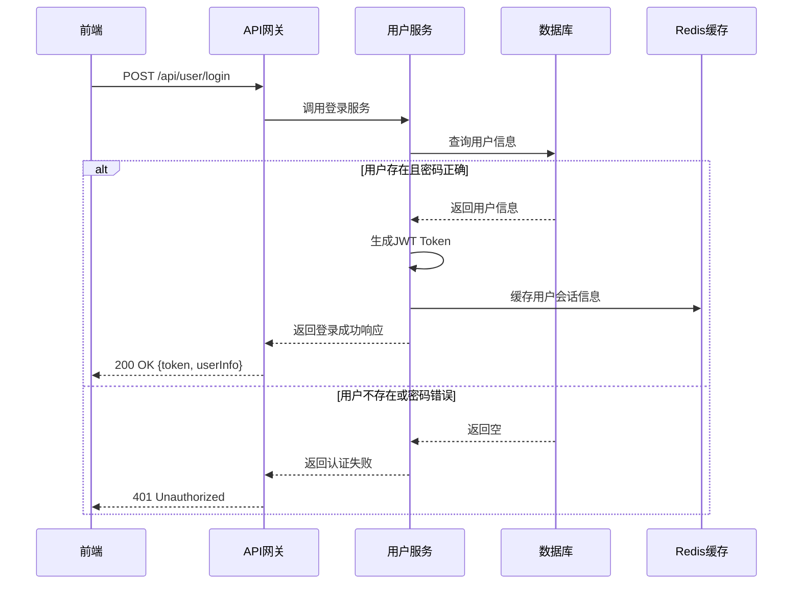
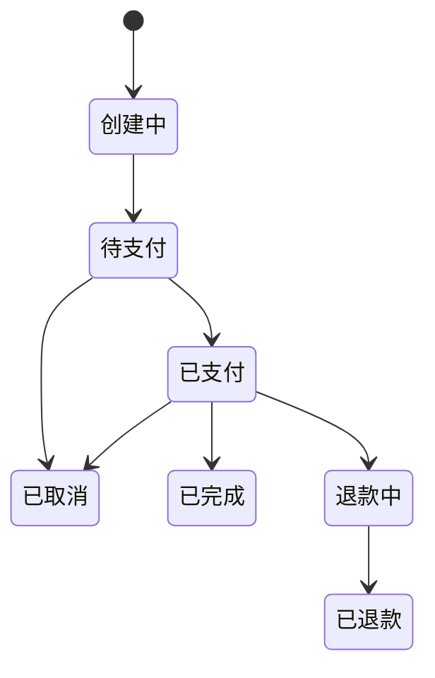
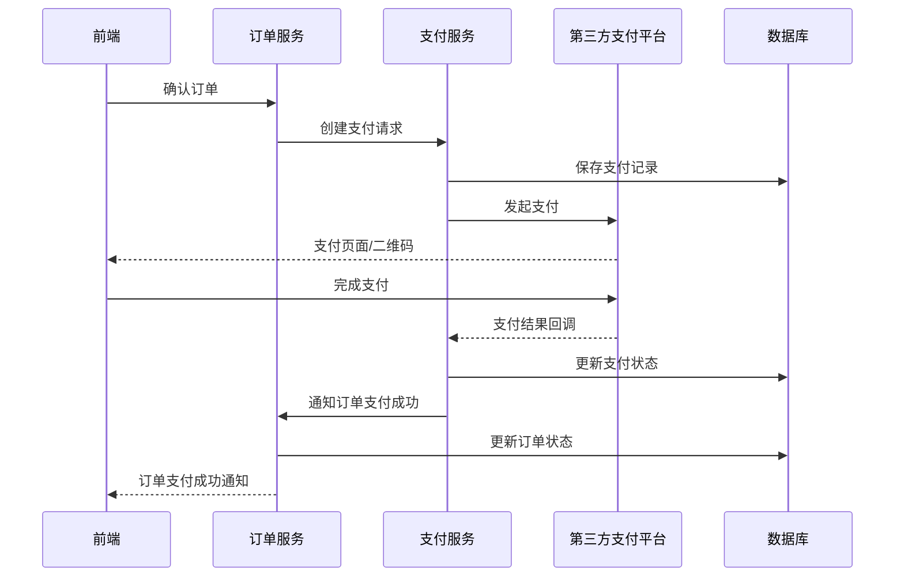
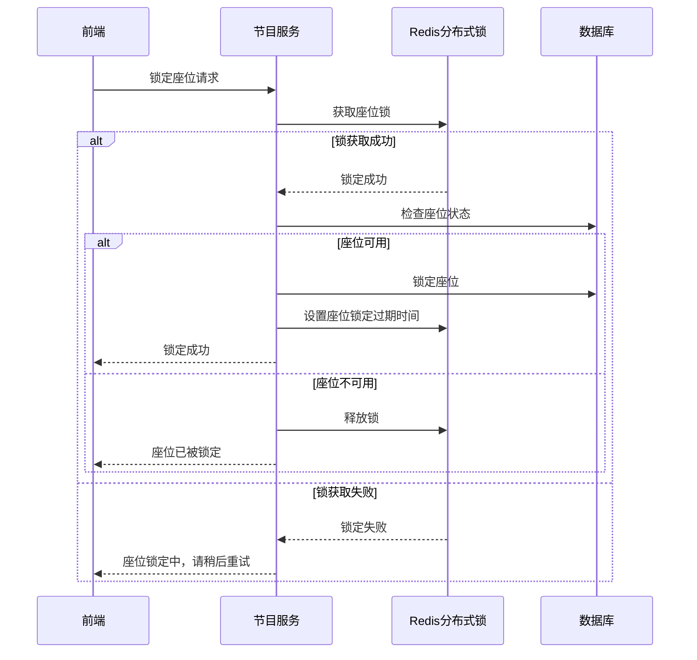
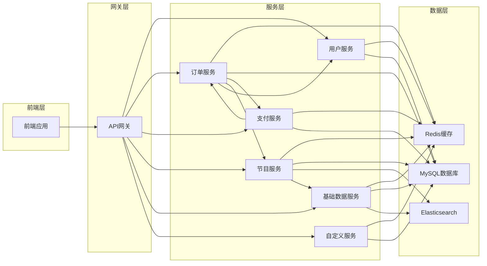

# 淘票票项目模块设计

## 模块概览
淘票票项目采用模块化设计，按照业务功能划分为多个核心模块，每个模块独立负责特定的业务领域。

## 核心模块详解

### 1. 用户模块 (User Module)

#### 功能职责
- 用户注册、登录、登出
- 个人信息管理
- 用户偏好设置
- 用户积分管理
- 用户观影历史

#### 主要组件
- **用户服务** (`taopiaopiao-user-service`)
  - 用户基本信息管理
  - 认证授权服务
  - 用户行为记录

- **用户客户端** (`taopiaopiao-user-client`)
  - 提供用户相关API接口
  - 与其他服务交互

#### 核心流程

### 2. 订单模块 (Order Module)

#### 功能职责
- 订单创建与管理
- 订单状态流转
- 订单查询
- 订单取消、改签
- 订单统计

#### 主要组件
- **订单服务** (`taopiaopiao-order-service`)
  - 订单核心业务逻辑
  - 订单状态管理
  - 订单数据访问

- **订单客户端** (`taopiaopiao-order-client`)
  - 订单相关API接口
  - 服务间调用

#### 订单状态流转

### 3. 支付模块 (Pay Module)

#### 功能职责
- 支付处理
- 退款管理
- 支付渠道集成
- 交易记录查询
- 对账功能

#### 主要组件
- **支付服务** (`taopiaopiao-pay-service`)
  - 支付处理逻辑
  - 退款流程管理
  - 支付状态回调处理

- **支付客户端** (`taopiaopiao-pay-client`)
  - 支付相关API接口
  - 服务间调用

#### 支付流程

### 4. 节目模块 (Program Module)

#### 功能职责
- 电影信息管理
- 场次管理
- 排片管理
- 座位管理
- 节目搜索

#### 主要组件
- **节目服务** (`taopiaopiao-program-service`)
  - 电影信息维护
  - 场次排片管理
  - 座位锁定与释放

- **节目客户端** (`taopiaopiao-program-client`)
  - 节目相关API接口
  - 服务间调用

#### 座位锁定流程

### 5. 基础数据模块 (Base Data Module)

#### 功能职责
- 影院信息管理
- 城市数据管理
- 区域信息管理
- 基础配置管理
- 数据字典维护

#### 主要组件
- **基础数据服务** (`taopiaopiao-base-data-service`)
  - 影院信息维护
  - 地区数据管理
  - 配置数据处理

- **基础数据客户端** (`taopiaopiao-base-data-client`)
  - 基础数据API接口
  - 服务间调用

### 6. 自定义模块 (Customize Module)

#### 功能职责
- 个性化推荐
- 用户标签管理
- 运营活动配置
- 广告管理

#### 主要组件
- **自定义服务** (`taopiaopiao-customize-service`)
  - 推荐算法实现
  - 标签系统管理
  - 活动配置管理

- **自定义客户端** (`taopiaopiao-customize-client`)
  - 推荐相关API接口
  - 服务间调用

### 7. 数据访问模块 (Data Access Module)

#### 功能职责
- 数据库访问封装
- ORM框架集成
- 代码生成工具

#### 主要组件
- **MyBatis-Plus服务** (`taopiaopiao-mybatis-plus-service`)
  - MyBatis-Plus配置与扩展
  - 代码生成器集成
  - 数据库连接管理

## 基础设施模块

### 1. 工具框架模块

#### 通用工具 (`taopiaopiao-common`)
- 通用工具类
- 数据结构
- 常量定义

#### 线程池框架 (`taopiaopiao-thread-pool-framework`)
- 线程池配置
- 任务调度
- 并发工具

#### ID生成器框架 (`taopiaopiao-id-generator-framework`)
- 分布式ID生成策略
- 雪花算法实现
- 业务ID生成

### 2. 缓存模块

#### Redis工具框架 (`taopiaopiao-redis-tool-framework`)
- **Redis通用框架** (`taopiaopiao-redis-common-framework`)
  - Redis客户端配置
  - 连接池管理

- **Redis框架** (`taopiaopiao-redis-framework`)
  - 缓存操作封装
  - 缓存策略实现

- **Redis Stream框架** (`taopiaopiao-redis-stream-framework`)
  - 消息队列功能
  - 流处理能力

#### Redisson框架 (`taopiaopiao-redisson-framework`)
- **Redisson服务框架** (`taopiaopiao-redisson-service-framework`)
  - 分布式锁实现
  - 分布式集合

- **布隆过滤器框架** (`taopiaopiao-bloom-filter-framework`)
  - 布隆过滤器实现
  - 数据去重

- **重复执行限制框架** (`taopiaopiao-repeat-execute-limit-framework`)
  - 请求去重
  - 幂等性保证

- **服务锁框架** (`taopiaopiao-service-lock-framework`)
  - 分布式锁服务
  - 锁超时处理

- **服务延迟队列框架** (`taopiaopiao-service-delay-queue-framework`)
  - 延迟任务处理
  - 订单超时取消

### 3. 验证码模块 (`taopiaopiao-captcha-manage-framework`)

#### 基础验证码 (`taopiaopiao-base-captcha`)
- 验证码生成器
- 验证码校验

#### 验证码框架 (`taopiaopiao-captcha-framework`)
- 验证码服务
- 验证码存储

### 4. 搜索引擎模块 (`taopiaopiao-elasticsearch-framework`)
- ES客户端配置
- 索引管理
- 搜索功能封装

### 5. 微服务框架 (`taopiaopiao-spring-cloud-framework`)

#### 服务通用 (`taopiaopiao-service-common`)
- 微服务通用配置
- 通用异常处理

#### 服务组件 (`taopiaopiao-service-component`)
- 微服务公共组件
- 服务间通信组件

#### 服务灰度发布框架 (`taopiaopiao-service-gray-transition-framework`)
- **灰度发布基础框架** (`taopiaopiao-service-gray-transition-base-framework`)
  - 灰度规则定义
  - 灰度策略接口

- **网关灰度框架** (`taopiaopiao-service-gray-transition-gateway-framework`)
  - 基于网关的灰度路由

- **WebMVC灰度框架** (`taopiaopiao-service-gray-transition-webmvc-framework`)
  - 基于WebMVC的灰度控制

#### 服务初始化 (`taopiaopiao-service-initialize`)
- 服务启动初始化
- 资源加载

## 模块依赖关系

## 模块架构说明

### 服务与客户端分离设计
本项目采用服务(service)和客户端(client)分离的架构设计：

- **服务层**：位于`taopiaopiao-server`目录下，如`taopiaopiao-order-service`、`taopiaopiao-pay-service`等，负责实现具体的业务逻辑。
- **客户端层**：位于`taopiaopiao-server-client`目录下，如`taopiaopiao-order-client`、`taopiaopiao-pay-client`等，封装了与服务通信的API接口。
- **设计优势**：
  1. 解耦合：服务实现和调用方式分离
  2. 便于维护：修改服务实现不影响调用方
  3. 接口标准化：提供统一的服务访问方式
  4. 服务治理：便于实现服务发现、负载均衡等功能

## 模块扩展策略

### 新业务模块扩展
1. **创建服务模块**：在`taopiaopiao-server`下创建新的服务子模块
2. **创建客户端模块**：在`taopiaopiao-server-client`下创建对应的客户端子模块
3. **定义接口**：在客户端模块中定义服务接口
4. **实现服务**：在服务模块中实现业务逻辑
5. **配置路由**：在API网关中配置路由规则
6. **注册服务**：将新服务注册到服务注册中心

### 现有模块功能扩展
1. **接口扩展**：遵循开闭原则，通过新增接口扩展功能，不修改现有接口
2. **策略模式**：使用策略模式处理不同场景的业务逻辑，便于扩展新策略
3. **插件化设计**：新功能优先考虑插件化实现，降低对现有代码的侵入性

## 模块边界

### 服务边界
- **只通过接口说话**：服务之间交流只能通过对方提供的API接口，不能直接访问其他服务的数据库
- **保持独立性**：每个服务有自己的数据库表，自己管自己的数据
- **解决数据不一致**：当多个服务需要保证数据一致时，通过事件通知或分布式事务来处理
- **避免循环依赖**：服务之间调用要避免形成环路，防止系统不稳定

### 数据边界
- **各管各的地**：每个模块主要操作自己负责的数据表
- **共享数据要规范**：多个模块需要使用的数据，通过专门的数据服务来提供，不能私自复制
- **敏感数据要保护**：涉及用户隐私、支付等敏感数据，严格控制谁能访问
- **数据一致性优先**：跨模块的数据操作要保证一致性，避免出现数据错乱