[](https://opensource.org/licenses/Apache-2.0)      
> 一个校园一站式服务平台 + AI 智能助手

### 🚀项目简介
打造校园全场景数字化服务生态，覆盖**校园活动、教务管理、社团运营、宿舍服务、邮件通知、智能助手**等核心场景，集成 **Ollama + Qwen 大模型**，为师生提供智能问答、业务办理、数据查询的一站式解决方案，重构校园服务体验。

### 🌟技术亮点

1. **AI 智能助手深度集成**

    * 基于 **Ollama + Qwen 大模型**，支持自然语言问答、多轮对话
    * 结合 **Redis 会话缓存 + ElasticSearch 语义检索**，实现校园信息“检索增强生成”，回答更准确

2. **分层架构设计**

    * 前端 Vue3 + TDesign，UI 风格统一、组件化开发
    * 后端 SpringBoot + MyBatis-Plus，分模块治理（教务、社团、宿舍、消费、邮件通知等），可扩展性强
    * 权限中心基于 SpringSecurity + JWT，实现角色权限控制

3. **高并发与异步处理**

    * 使用 **RabbitMQ** 处理邮件通知等异步消息
    * Redis 缓存热点数据，支持高并发请求下的快速响应

4. **搜索与日志分析能力**

    * **ElasticSearch + Kibana** 提供全文检索与可视化日志分析，支持校园通知、新闻、活动的快速搜索。
    * 结合 Logstash 实现数据实时采集与同步，保障系统可观测性。

5. **容器化与可持续交付**

    * 基于 **Docker + docker-compose** 部署，支持 MySQL、Redis、RabbitMQ、ElasticSearch 等组件快速启动。
    * 模块化配置，方便扩展与上线维护。

### 🔍项目预览
#### 登录页面
| 页面模块     | 截图 |
|--------------|------|
| 登录页面     |  |
| 新闻栏目     | 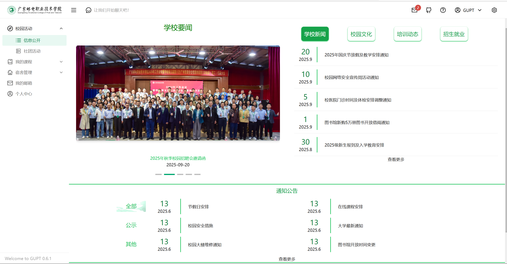 |
| 新闻列表     | 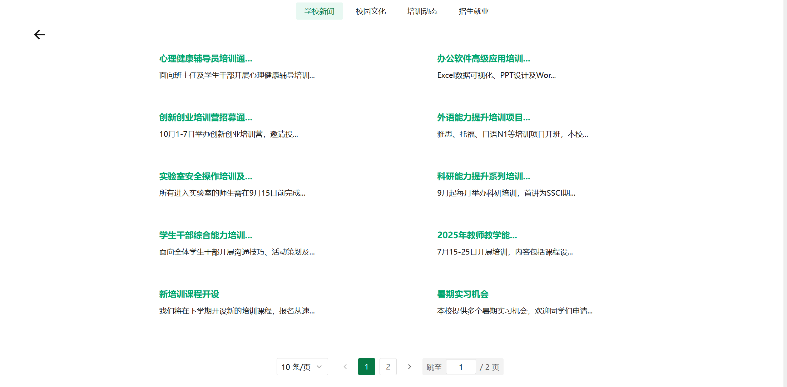 |
| 新闻详情     |  |
| 社团活动     | 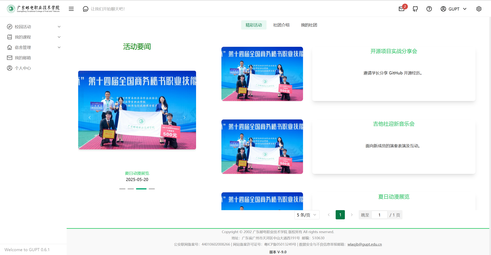 |
| 社团介绍     | 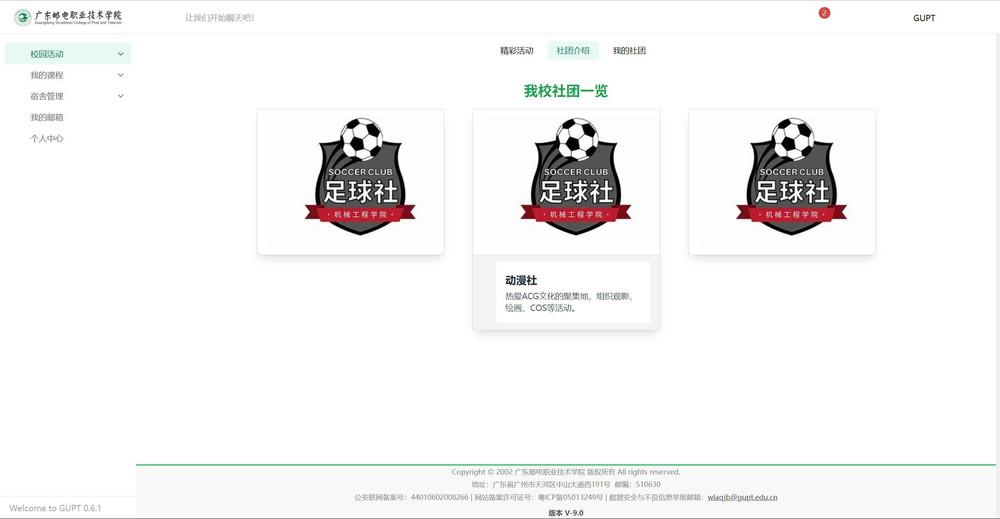 |
| 我的社团     | 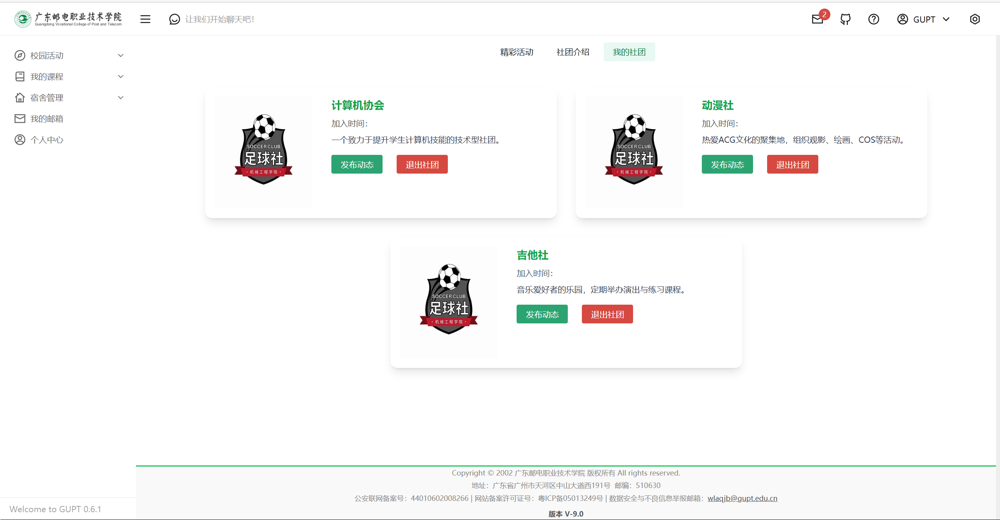 |
| 我的成绩     | 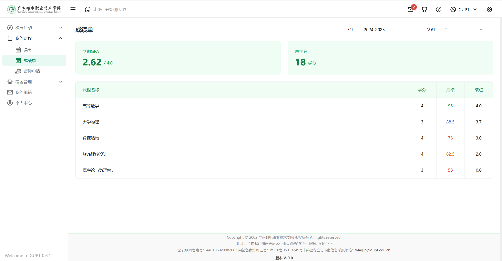 |
| 我的课表     | 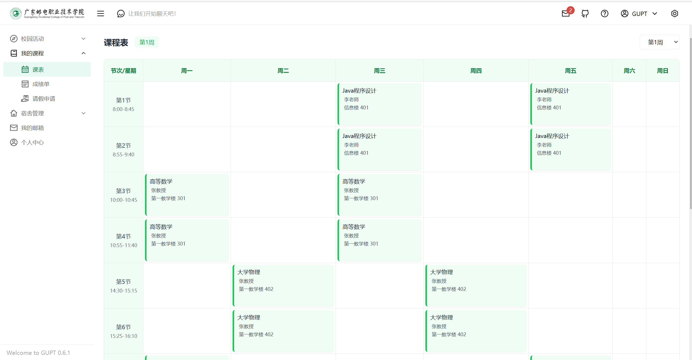 |
| 请假功能     | 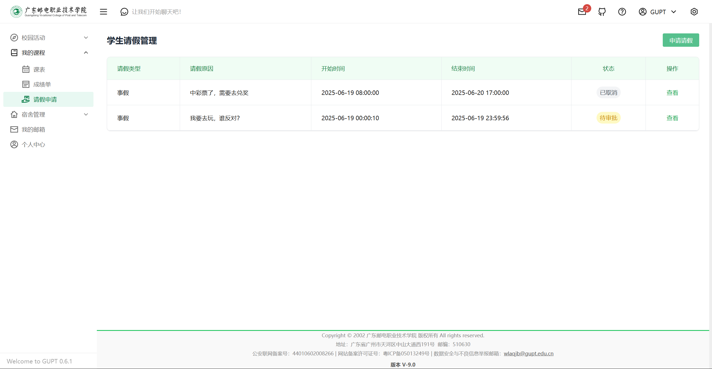 |
| 请假详情     | 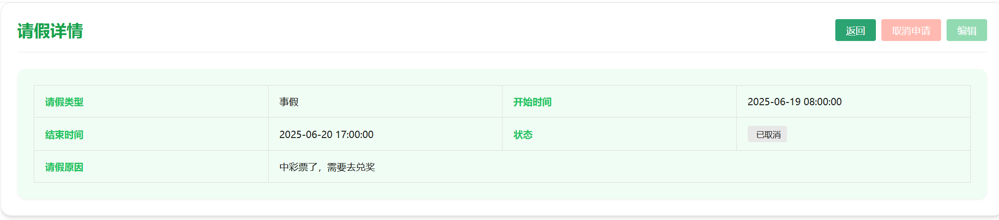 |
| 宿舍评分     | 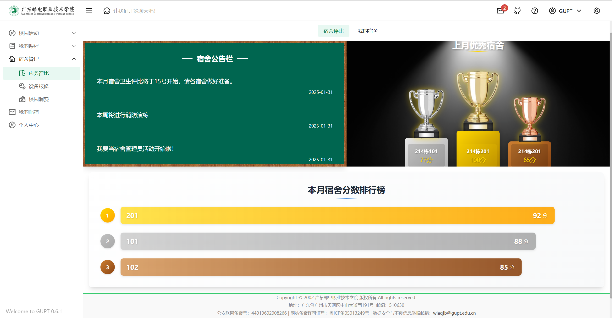 |
| 宿舍报修     | 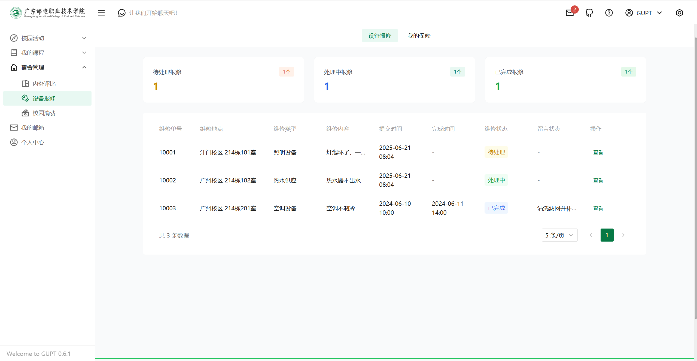 |
| 我的报修记录 | 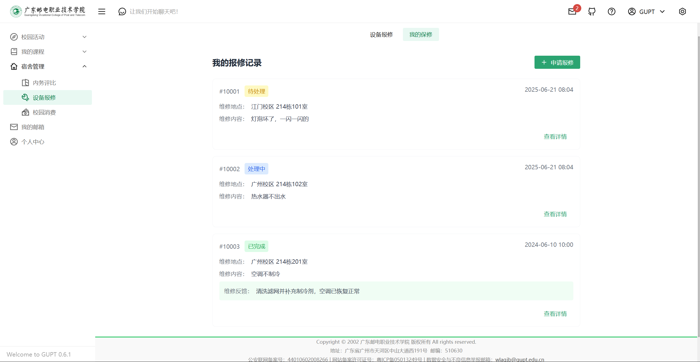 |
| 我的宿舍     | 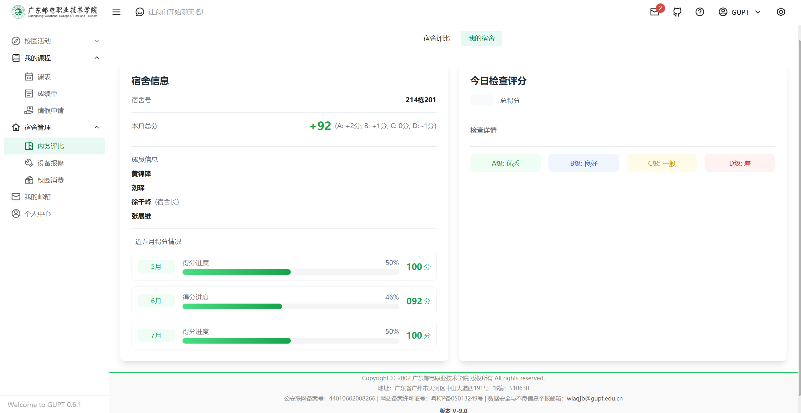 |
| 校园消费     | 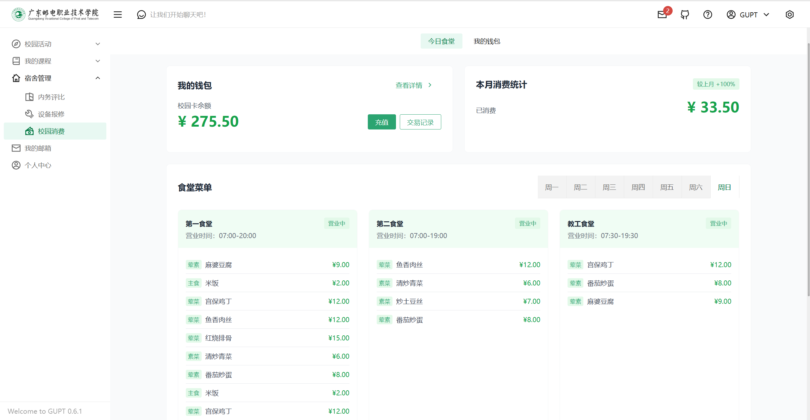 |
| 我的钱包     |  |
| 消费记录     | 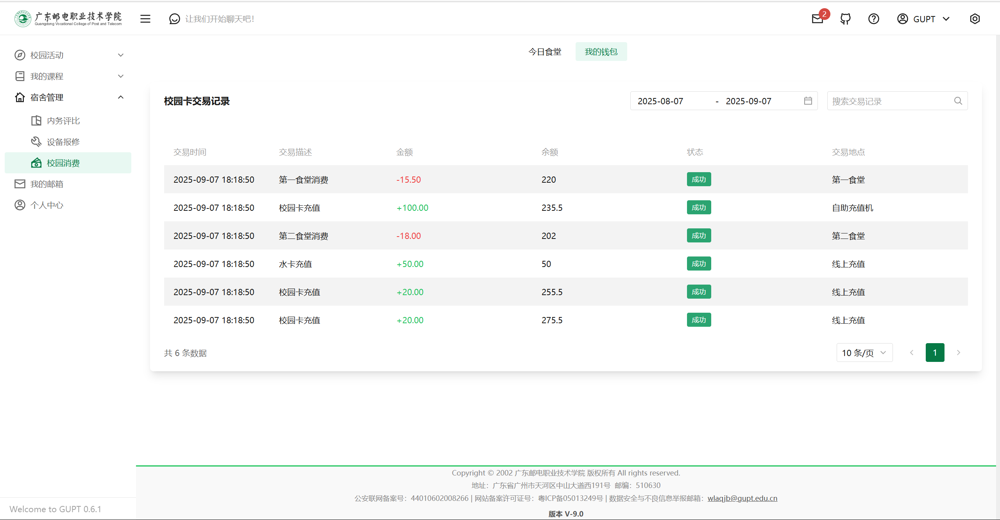 |
| 我的邮箱     | 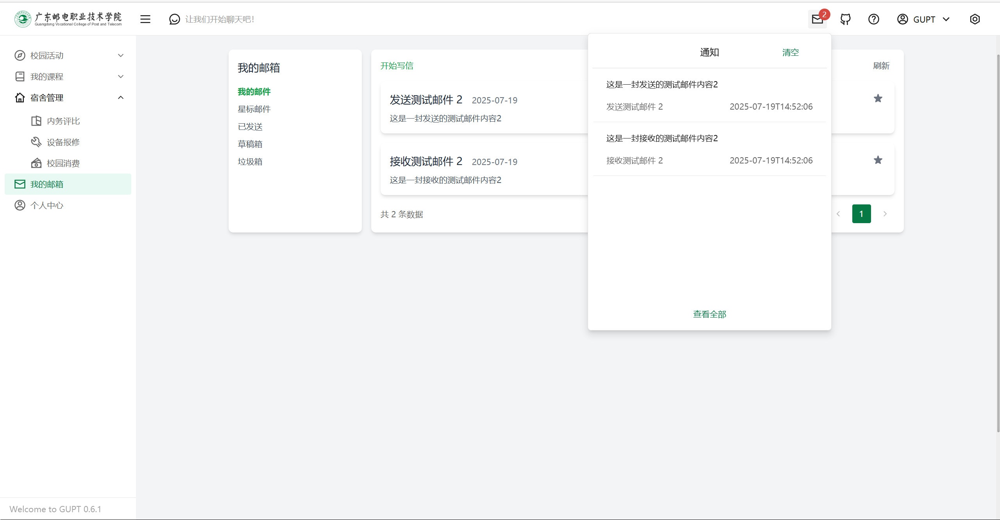 |
| 编辑信件     | 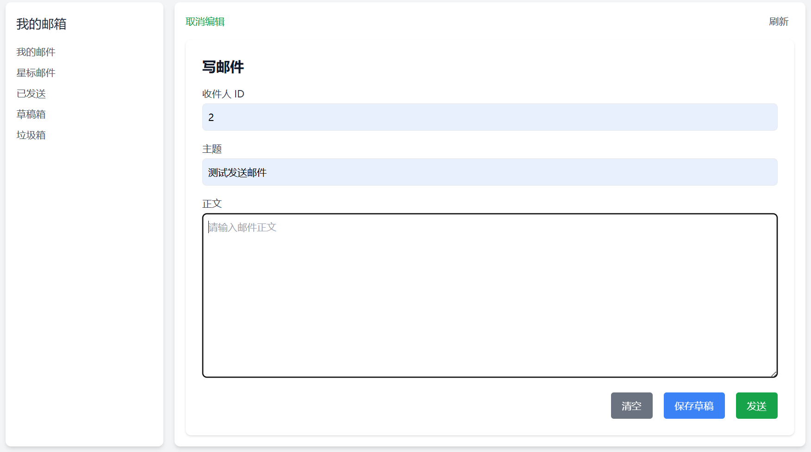 |
| 个人简介     | 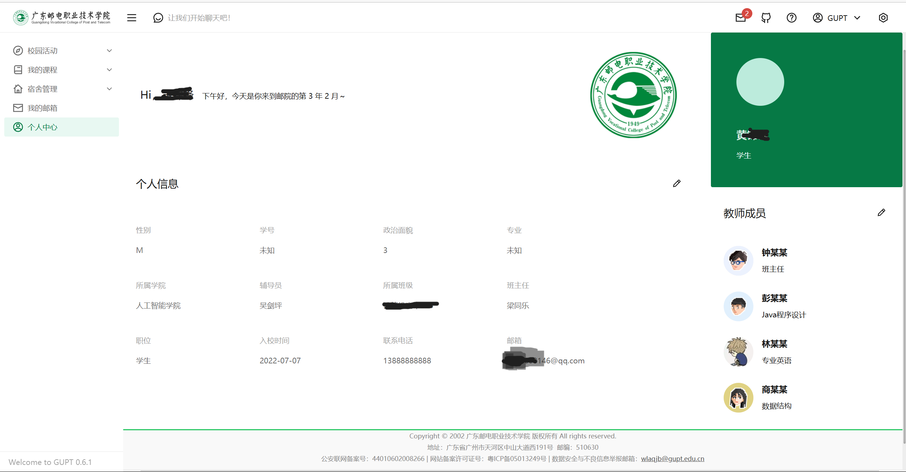 |


### 🏗️系统整体架构

#### 1. 前端层
- **技术栈**：Vue3 + TDesign + TailwindCSS
- **核心作用**：
    - 构建响应式校园服务界面（如首页、业务办理页、AI 助手对话界面）
    - 通过 HTTP 请求与后端交互，实现数据展示与用户操作反馈
    - 基于 TDesign 组件库与 TailwindCSS 实现校园风格 UI


#### 2. 应用服务层（后端）
- **核心框架**：SpringBoot
- **子模块与技术**：
    - MyBatis-Plus：简化 MySQL 数据库 CRUD 操作，处理课程、社团等业务数据
    - SpringSecurity：实现用户认证（学生/管理员账号登录）、权限控制（区分学生/管理员操作权限）
- **核心作用**：
    - 接收前端请求，处理业务逻辑（如课程查询、社团申请审核）
    - 调用数据层与中间件，完成数据存取与异步任务调度
    - 对接 AI 能力层，转发用户提问并返回智能回答


#### 3. 数据存储层
- **技术栈**：MySQL + Redis + ElasticSearch
- **各自作用**：
    - MySQL：存储结构化业务数据（用户信息、课程表、社团档案等）
    - Redis：缓存高频访问数据（如用户会话、热门新闻列表）、管理 AI 对话上下文
    - ElasticSearch：提供全文检索能力（如搜索校园通知、社团活动通知）


#### 4. 中间件层
- **技术栈**：RabbitMQ
- **核心作用**：
    - 处理异步任务（如发送通知邮件、AI 回答生成后的消息推送）

#### 5. AI 能力层
- **技术栈**：Ollama + Qwen 模型
- **核心作用**：
    - 接收后端转发的用户自然语言提问（如“如何申请宿舍调换？”“推荐一门计算机基础课”）
    - 通过 Qwen 模型进行语义理解与内容生成，返回结构化回答
    - 支持多轮对话（结合 Redis 缓存的上下文，实现连续提问逻辑）


#### 6. 各层交互关系
1. 前端 → 应用服务层：通过 HTTP 接口提交用户操作（如查询课程、发送 AI 提问）
2. 应用服务层 → 数据存储层：通过 MyBatis-Plus 操作 MySQL，通过 Redis 客户端读写缓存，通过 ES 客户端执行检索
3. 应用服务层 → 中间件层：通过 RabbitMQ 发送异步任务消息（如通知、日志记录）
4. 应用服务层 ↔ AI 能力层：后端调用 Ollama API 发送提问，接收 Qwen 模型返回的回答，再转发给前端


#### 2. 核心技术栈
| 模块         | 技术栈                          | 作用说明              |  
|--------------|---------------------------------|-------------------|  
| 前端         | Vue3 + TDesign + TailwindCSS    | 响应式 UI，快速构建校园业务页面 |  
| 后端         | SpringBoot + MyBatis-Plus       | 业务逻辑处理、数据持久化      |  
| 权限管理     | SpringSecurity                  | 接口鉴权、角色权限控制       |  
| 数据存储     | MySQL + Redis + ElasticSearch   | 结构化数据、缓存、全文检索     |  
| 消息队列     | RabbitMQ                        | 异步任务（如邮件通知） |  
| AI 能力      | Ollama + Qwen 模型              | 智能问答与搜索           |  


### 🛠️功能模块详解
#### 1. 业务服务模块

- **gupt-assistant-service**：AI 智能助手核心
    - 对接 **Ollama 部署的 Qwen 模型**，实现：
        - 自然语言问答（如“查一下本学期我的课程表”）
        - 语义检索（结合 ElasticSearch 实现校园信息智能查询）

- **gupt-auth**：权限管理中心
    - 基于 SpringSecurity 实现 **RBAC（角色权限控制）**
    - 支持账号密码、JWT Token 登录，区分学生、管理员等角色权限

- **gupt-club-service**：社团管理系统
    - 社团创建、招新、活动发布流程

- **gupt-course-service**：教务课程服务
    - 课程查询、成绩查询

- **gupt-dormitory-service**：宿舍服务
    - 宿舍分配、报修流程、水电费查询

- **gupt-email-service**：邮件通知服务
    - 结合 RabbitMQ 异步发送：
        - 社团活动提醒、系统公告等

- **gupt-user-service**：用户中心
    - 学生信息管理、个人资料维护

#### 2. AI 能力深度集成
- **核心流程**：


- **关键实现**：
    - **上下文管理**：用 Redis 存储用户会话，Key 为 `user:session:{userId}`，Value 为对话历史列表，保证多轮对话连贯。
    - **语义检索增强**：结合 ElasticSearch 构建校园知识库（课程、社团、通知等），AI 先检索再回答，提升准确性。


### 🔧部署与启动
#### 1. 环境依赖
- 基础环境：JDK 17 + MySQL 8.0 + Redis 7.0 + RabbitMQ 3.12 + Ollama（已部署 Qwen 模型）
- 前端依赖：Node.js 18 + npm/yarn

- docker-compose.yml文件配置如下：
```yaml
services:
  elasticsearch:
    image: docker.elastic.co/elasticsearch/elasticsearch:8.12.2
    container_name: elasticsearch
    restart: always
    environment:
      - discovery.type=single-node
      - ES_JAVA_OPTS=-Xms512m -Xmx512m
      - xpack.security.enabled=false  # 强制禁用安全
      #- ELASTIC_PASSWORD=4hDcyD=3xOqFWtwyVRcL
    ports:
      - "9200:9200"
    volumes:
      - /UniversityManagementSystem/elasticsearch/esdata:/usr/share/elasticsearch/data
      - /UniversityManagementSystem/elasticsearch/config/elasticsearch.yml:/usr/share/elasticsearch/config/elasticsearch.yml  # 挂载配置文件
      - /UniversityManagementSystem/elasticsearch/logs:/usr/share/elasticsearch/logs  # 日志目录（可选）
      - /UniversityManagementSystem/elasticsearch/certs:/usr/share/elasticsearch/config/certs
      
    networks:
      - gupt
    healthcheck:
      #test: ["CMD-SHELL", "curl -u elastic:'4hDcyD=3xOqFWtwyVRcL' --insecure --silent --fail https://localhost:9200/_cluster/health || exit 1"]
      test: ["CMD-SHELL", "curl --silent --fail localhost:9200/_cluster/health || exit 1"]
      interval: 30s
      timeout: 10s
      retries: 3

  kibana:
    restart: always
    image: docker.elastic.co/kibana/kibana:8.12.2
    container_name: kibana
    environment:
      - ELASTICSEARCH_HOSTS=http://elasticsearch:9200
      #- ELASTICSEARCH_USERNAME=elastic/kibana
      #- ELASTICSEARCH_password=123456
      - I18N_LOCALE=zh-CN  # 设置Kibana的默认语言为简体中文
    ports:
      - "5601:5601"
    volumes:
      - /UniversityManagementSystem/kibana/config/kibana.yml:/usr/share/kibana/config/kibana.yml#挂载Kibana配置文件
    networks:
      - gupt
    depends_on:
      elasticsearch:
        condition: service_healthy

  logstash:
    image: docker.elastic.co/logstash/logstash:8.12.2
    restart: always
    container_name: logstash
    volumes:
      # 挂载配置文件
      - /UniversityManagementSystem/logstash/logstash.conf:/usr/share/logstash/pipeline/logstash.conf
      # 挂载 JDBC 驱动库
      - /UniversityManagementSystem/logstash/mysql-connector-j-9.2.0/mysql-connector-j-9.2.0.jar:/usr/share/logstash/mysql-connector-java.jar
      # 挂载用于存储元数据的目录
      - /UniversityManagementSystem/logstash/logs/:/usr/share/logstash/logs/
    ports:
      - "5044:5044" # 如果需要监听 Beats 输入插件等，可以暴露端口
    depends_on:
      - elasticsearch
    environment:
      - LS_JAVA_OPTS=-Xmx512m -Xms512m # 根据实际情况调整内存设置
    networks:
      - gupt

  redis:
    image: redis:latest
    container_name: universitymanagementsystem-redis
    ports:
      - "6379:6379"
    volumes:
      - /UniversityManagementSystem/redis/data:/data  # 挂载Redis数据目录
      - /UniversityManagementSystem/redis/redis.conf:/usr/local/etc/redis/redis.conf  # 挂载Redis配置文件
    restart: always
    networks:
      - gupt

  torna:
    image: registry.cn-hangzhou.aliyuncs.com/tanghc/torna:1.26.0
    container_name: torna
    environment:
      JAVA_OPTS: "-Xms512m -Xmx512m"
    restart: always
    volumes:
      - /UniversityManagementSystem/torna-1.26.0/application.properties:/torna/config/application.properties
    ports:
      - "7700:7700" # 根据实际需求配置端口
    networks:
      - gupt

  mysql:
    image: mysql:latest
    container_name: universitymanagementsystem-mysql
    environment:
      MYSQL_ROOT_PASSWORD: 123
      MYSQL_DATABASE: university_db
      MYSQL_USER: root
      MYSQL_PASSWORD: 123
    ports:
      - "3306:3306"
    volumes:
      - /UniversityManagementSystem/mysql/conf:/etc/mysql/conf.d:rw
      - /UniversityManagementSystem/mysql/data:/var/lib/mysql:rw
    restart: always
    networks:
    - gupt
    
  rabbitmq:
    image: rabbitmq:3.12-management
    container_name: gupt-rabbitmq
    hostname: rabbitmq
    ports:
      - "5672:5672"   # AMQP 协议端口（应用连接）
      - "15672:15672" # 管理界面端口
    environment:
      RABBITMQ_DEFAULT_USER: gupt
      RABBITMQ_DEFAULT_PASS: gupt123
      RABBITMQ_DEFAULT_VHOST: gupt_vhost
    volumes:
      - /UniversityManagementSystem/rabbitmq_data:/var/lib/rabbitmq   # 数据持久化
      - /UniversityManagementSystem/rabbitmq_logs:/var/log/rabbitmq   # 日志持久化
    networks:
      - gupt_network
    restart: unless-stopped

networks:
  gupt:

```

#### 2. 部署步骤
##### （1）后端启动（以 IDEA 为例）
1. 克隆代码仓库：
   ```bash  
   git clone https://github.com/Moonlight168/campus-ai-assistant.git  
   ```  
2. 配置 `application.yml`：
    - 填写 MySQL、Redis、RabbitMQ 连接信息
    - 配置 Ollama 地址（如 `http://localhost:11434` ，需提前启动 Ollama 并拉取 Qwen 模型：`ollama pull qwen` ）
3. 启动 SpringBoot 应用：运行 `gupt-management-back-end` 根模块的 `Application` 类


##### （2）前端启动
1. 进入 `gupt-web` 前端目录：
   ```bash  
   cd gupt-web  
   ```  
2. 安装依赖：
   ```bash  
   npm install  
   ```  
3. 启动开发环境：
   ```bash  
   npm run dev  
   ```  
4. 访问前端：浏览器打开 `http://localhost:5173`

### 🔗源码链接
- 源码地址：[GitHub - 邮院通(后端)](https://github.com/Moonlight168/gupt-management-back-end)
- 源码地址：[GitHub - 邮院通(前端)](https://github.com/Moonlight168/gupt-font_end)
