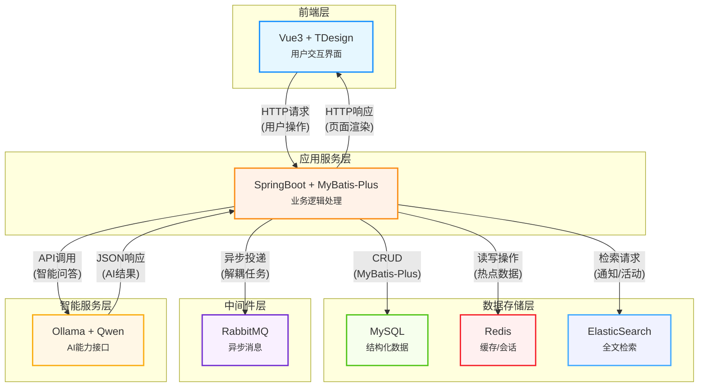
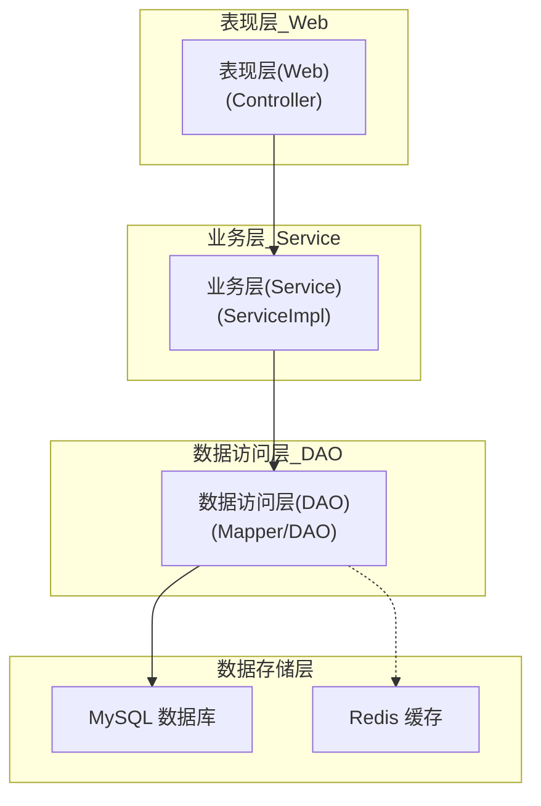

# 架构设计

## 1. 架构概述

Gupt Management System 采用基于Spring Boot的模块化单体架构设计，将系统功能划分为多个独立的Maven模块，通过明确的依赖关系和接口契约实现松耦合的架构。这种设计在保持单体应用部署简单性的同时，提高了代码的可维护性和可扩展性，适合中大型管理系统开发。

系统基于Java 19和Spring Boot 3.2.4构建，采用MVC分层架构模式，集成了MyBatis-Plus作为ORM框架，使用MySQL作为主数据库，并通过JWT实现无状态的身份认证。

### 1.1 核心架构图



### 1.2 技术栈概览

| 分类 | 技术/框架 | 版本 | 用途 |
|------|-----------|------|------|
| 基础框架 | Spring Boot | 3.2.4 | 应用基础框架 |
| 开发语言 | Java | 19 | 主要开发语言 |
| 数据访问 | MyBatis-Plus | 3.5.6 | ORM框架 |
| 数据库 | MySQL | 8.0.33 | 主数据库 |
| 缓存 | Redis | - | 数据缓存 |
| 安全认证 | JWT | 4.4.0 | 无状态认证 |
| 工具库 | Hutool | 5.8.25 | Java工具集 |
| 构建工具 | Maven | - | 项目构建与依赖管理 |
| 文档工具 | Smart-doc | 2.7.7 | API文档自动生成 |
| 文件存储 | Aliyun OSS | 3.17.4 | 云存储服务 |
| 搜索引擎 | Elasticsearch | 8.12.2 | 全文检索服务 |
| 开发工具 | Lombok | 1.18.22 | 代码简化工具 |

## 2. 模块架构设计

### 2.1 模块结构概览

Gupt Management System采用模块化设计，由15个核心模块组成，每个模块承担特定的功能职责。模块间通过明确的依赖关系进行交互，确保系统的高内聚低耦合。


### 2.2 模块职责说明

#### 2.2.1 基础设施层模块

| 模块名称 | 主要职责 | 核心功能 |
|---------|---------|--------|
| **gupt-common** | 提供系统通用组件和工具 | 工具类、异常处理、常量定义、数据校验、日志记录 |
| **gupt-config** | 管理系统配置信息 | 配置加载、环境配置切换、配置缓存 |
| **gupt-domain** | 定义核心业务实体和领域规则 | 业务实体类、领域服务、值对象、领域事件 |
| **gupt-message-queue** | 提供消息队列和异步处理能力 | 消息发送与接收、队列管理、异步任务处理 |

#### 2.2.2 核心层模块

| 模块名称 | 主要职责 | 核心功能 |
|---------|---------|--------|
| **gupt-api** | 定义系统数据传输对象和接口契约 | DTO定义、VO定义、数据验证工具 |
| **gupt-auth** | 提供安全认证和授权服务 | JWT令牌管理、权限验证、安全配置 |
| **gupt-user-service** | 管理用户信息和用户操作 | 学生信息管理、用户服务、数据查询与维护 |

#### 2.2.3 业务服务层模块

| 模块名称 | 主要职责 | 核心功能 |
|---------|---------|--------|
| **gupt-course-service** | 管理课程相关业务 | 课程信息管理、课程表管理、成绩管理、请假记录管理 |
| **gupt-dormitory-service** | 管理宿舍相关业务 | 宿舍信息管理、成员管理、报修管理、评分管理、公告管理 |
| **gupt-club-service** | 管理社团相关业务 | 社团信息管理、社团活动管理 |
| **gupt-info-service** | 管理信息通知相关业务 | 通知公告管理、新闻资讯管理 |
| **gupt-email-service** | 提供邮件发送服务 | 邮件发送、邮件内容管理 |
| **gupt-assistant-service** | 提供智能助手服务 | 智能问答、系统辅助功能 |
| **gupt-thirdpart-service** | 集成第三方服务 | 外部API调用、服务适配器 |

#### 2.2.4 接入层模块

| 模块名称 | 主要职责 | 核心功能 |
|---------|---------|--------|
| **gupt-web** | 提供Web层实现 | 请求路由与处理、控制器实现、静态资源管理 |

## 3. 系统分层设计

### 3.1 分层架构图



### 3.2 各层职责说明

| 层级 | 职责 | 组件/技术 |
|------|------|-----------|
| **表现层** | 处理HTTP请求，返回响应，参数验证 | Controller, DTO, Validator |
| **业务层** | 实现核心业务逻辑，事务管理 | ServiceImpl, 业务规则引擎 |
| **数据访问层** | 数据库操作，SQL映射 | Mapper接口, XML映射文件 |
| **数据存储层** | 数据持久化，缓存存储 | MySQL, Redis |
| **通用层** | 提供公共组件和工具 | 工具类, 通用配置, 拦截器 |

## 4. 核心技术实现

### 4.1 安全认证体系

系统采用Spring Security结合JWT实现无状态认证，主要包括以下核心组件：

1. **JwtAuthenticationTokenFilter**：负责拦截请求并验证JWT令牌
2. **JwtTokenUtil**：提供JWT令牌的创建、验证和解析功能
3. **SecurityContextUtil**：管理安全上下文信息
4. **StudentDetails**：封装学生认证信息

认证流程：
1. 用户登录时，系统验证凭证并生成JWT令牌
2. 后续请求携带JWT令牌进行身份验证
3. 令牌中包含用户信息和权限声明
4. 系统验证令牌有效性并提取用户信息

### 4.2 数据访问层设计

#### 4.2.1 MyBatis-Plus配置

```java
@Configuration
@MapperScan("edu.gupt.**.mapper")
public class MyBatisConfig {
    @Bean
    public SqlSessionFactory sqlSessionFactory(DataSource dataSource) throws Exception {
        SqlSessionFactoryBean factoryBean = new SqlSessionFactoryBean();
        factoryBean.setDataSource(dataSource);
        // 配置类型别名、XML扫描等
        return factoryBean.getObject();
    }
}
```

#### 4.2.2 数据传输对象设计

系统通过gupt-api模块统一管理数据传输对象，包括：

- **DTO (Data Transfer Object)**：用于接收请求数据
  - 按业务领域分类组织（course、dormitory、user等）
  - 包含数据验证注解
  - 示例：CourseDTO、StudentDTO

- **VO (View Object)**：用于封装响应数据
  - 按业务领域分类组织
  - 优化前端展示所需的数据结构
  - 示例：CourseVO、LoginVO

### 4.3 模块化设计实现

#### 4.3.1 模块间通信方式

1. **同步调用**：服务间通过接口直接调用，使用依赖注入方式
2. **异步通信**：通过gupt-message-queue模块实现消息驱动的异步通信
3. **数据共享**：使用gupt-api模块定义的DTO和VO作为数据传输契约

#### 4.3.2 模块化开发规范

1. 每个模块遵循MVC分层架构
2. 接口定义与实现分离
3. 依赖关系清晰，避免循环依赖
4. 模块间通过API模块进行数据交互

## 5. 关键业务流程设计

### 5.1 用户认证流程

@startuml
start
:用户登录请求;
:验证用户凭证<br>gupt-auth;
if (验证成功?) then (是)
:生成JWT令牌<br>JwtTokenUtil;
:返回令牌和用户信息;
:后续请求携带令牌;
:JWT过滤器验证<br>JwtAuthenticationTokenFilter;
if (令牌有效?) then (是)
:授权访问;
else (否)
:返回未授权;
endif
else (否)
:返回认证失败;
endif
stop
@enduml

### 5.2 课程管理流程

@startuml
start
:创建课程请求;
:参数验证<br>CourseDTO;
:权限校验<br>gupt-auth;
:业务逻辑处理<br>CourseService;
:保存课程信息<br>CourseMapper;
:返回课程信息<br>CourseVO;
stop
@enduml

### 5.3 宿舍报修流程

@startuml
start
:提交报修申请;
:验证申请信息<br>DormitoryRepairOrderDTO;
:创建报修订单<br>RepairService;
:保存订单信息<br>RepairOrderMapper;
:发送通知<br>gupt-message-queue;
:维修人员处理;
:更新订单状态;
:用户确认完成;
:结束报修流程;
stop
@enduml

## 6. 性能优化设计

### 6.1 缓存策略

系统使用Redis进行热点数据缓存，主要包括：

1. **用户会话缓存**：缓存用户认证信息
2. **热点数据缓存**：课程信息、公告等频繁访问的数据
3. **查询结果缓存**：复杂查询结果缓存

缓存更新策略：
- 数据更新时主动失效相关缓存
- 设置合理的缓存过期时间
- 使用缓存预热提升访问性能

### 6.2 数据库优化

1. **索引优化**：为常用查询字段创建索引
2. **分页查询**：使用MyBatis-Plus分页插件优化大数据量查询
3. **连接池配置**：合理配置数据库连接池参数
4. **SQL优化**：避免全表扫描，优化复杂查询


## 7. 扩展性设计

### 7.1 模块扩展机制

1. **接口定义优先**：所有服务先定义接口，再实现
2. **依赖注入**：通过Spring的依赖注入机制，方便替换实现
3. **插件化设计**：支持功能模块的动态加载和卸载

### 7.2 技术栈升级路径

1. **微服务转型**：当前模块化设计为未来微服务拆分提供基础
2. **容器化部署**：支持Docker容器化部署，提高环境一致性
3. **服务网格**：预留服务网格集成能力，为后续服务治理提供支持

## 8. 总结

Gupt Management System采用模块化单体架构，通过清晰的模块划分和职责定义，实现了高内聚低耦合的系统设计。系统基于Spring Boot框架构建，集成了多种现代化技术，为高校管理提供了全面的信息化解决方案。

模块化设计使系统具有良好的可维护性和可扩展性，既保持了单体应用的简单部署特性，又为未来可能的微服务转型打下基础。统一的安全认证、数据访问和公共组件设计，确保了系统的一致性和稳定性。
