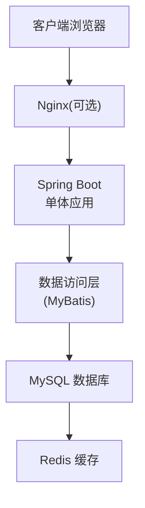
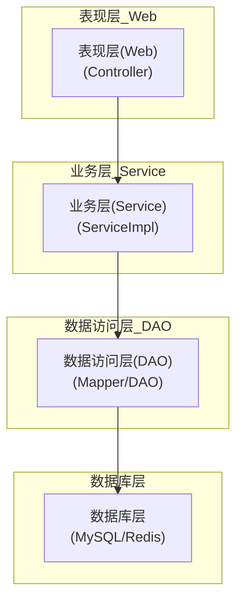

# 架构设计

## 1. 架构概述

Gupt Management System 采用单体架构设计，将所有功能模块集中在一个应用中。这种架构适合中小型项目，具有部署简单、开发效率高、数据一致性强等优势。

### 1.1 核心架构图



## 2. 系统分层设计

### 2.1 分层架构图



### 2.2 各层职责说明

| 层级 | 职责 | 组件/技术 |
|------|------|-----------|
| 表现层 | 处理HTTP请求，返回响应，参数验证 | Controller, DTO, Validator |
| 业务层 | 实现核心业务逻辑，事务管理 | ServiceImpl, 业务规则引擎 |
| 数据访问层 | 数据库操作，SQL映射 | Mapper接口, XML映射文件 |
| 数据库层 | 数据存储，缓存 | MySQL, Redis |
| 通用层 | 提供公共组件和工具 | 工具类, 通用配置, 拦截器 |

## 3. 核心模块设计

### 3.1 用户模块

**功能范围**：用户注册、登录、信息管理、权限控制

**核心实体**：
- User (用户信息)
- Role (角色信息)
- Permission (权限信息)

**模块结构**：
```
com.gupt.user
  ├── controller/
  │   └── UserController.java
  ├── service/
  │   ├── UserService.java
  │   └── impl/
  │       └── UserServiceImpl.java
  ├── mapper/
  │   └── UserMapper.java
  ├── entity/
  │   ├── User.java
  │   ├── Role.java
  │   └── Permission.java
  ├── dto/
  │   ├── UserDTO.java
  │   └── UserLoginDTO.java
  └── config/
      └── SecurityConfig.java
```

### 3.2 认证模块

**功能范围**：用户认证、会话管理、权限校验

**核心实体**：
- LoginUser (登录用户信息)

**模块结构**：
```
com.gupt.auth
  ├── controller/
  │   └── AuthController.java
  ├── service/
  │   ├── AuthService.java
  │   └── impl/
  │       └── AuthServiceImpl.java
  ├── filter/
  │   └── JwtAuthenticationFilter.java
  ├── util/
  │   └── JwtUtils.java
  └── config/
      └── AuthConfig.java
```

### 3.3 课程模块

**功能范围**：课程管理、选课、成绩管理

**核心实体**：
- Course (课程信息)
- CourseSection (课程章节)
- CourseSelection (选课信息)
- Score (成绩信息)

**模块结构**：
```
com.gupt.course
  ├── controller/
  │   ├── CourseController.java
  │   ├── SelectionController.java
  │   └── ScoreController.java
  ├── service/
  │   ├── CourseService.java
  │   ├── SelectionService.java
  │   ├── ScoreService.java
  │   └── impl/
  ├── mapper/
  │   ├── CourseMapper.java
  │   ├── SelectionMapper.java
  │   └── ScoreMapper.java
  ├── entity/
  │   ├── Course.java
  │   ├── CourseSection.java
  │   ├── CourseSelection.java
  │   └── Score.java
  └── dto/
```

### 3.4 宿舍模块

**功能范围**：宿舍管理、住宿分配

**核心实体**：
- DormitoryBuilding (宿舍楼信息)
- DormitoryRoom (宿舍房间信息)

**模块结构**：
```
com.gupt.dormitory
  ├── controller/
  │   ├── BuildingController.java
  │   └── RoomController.java
  ├── service/
  │   ├── BuildingService.java
  │   ├── RoomService.java
  │   └── impl/
  ├── mapper/
  │   ├── BuildingMapper.java
  │   └── RoomMapper.java
  ├── entity/
  │   ├── DormitoryBuilding.java
  │   └── DormitoryRoom.java
  └── dto/
```

### 3.5 社团模块

**功能范围**：社团管理、成员管理

**核心实体**：
- Club (社团信息)
- ClubMember (社团成员信息)

**模块结构**：
```
com.gupt.club
  ├── controller/
  │   ├── ClubController.java
  │   └── MemberController.java
  ├── service/
  │   ├── ClubService.java
  │   ├── MemberService.java
  │   └── impl/
  ├── mapper/
  │   ├── ClubMapper.java
  │   └── MemberMapper.java
  ├── entity/
  │   ├── Club.java
  │   └── ClubMember.java
  └── dto/
```

### 3.6 信息模块

**功能范围**：通知管理、个人消息管理

**核心实体**：
- Notice (通知信息)
- PersonalMessage (个人消息)

**模块结构**：
```
com.gupt.info
  ├── controller/
  │   ├── NoticeController.java
  │   └── MessageController.java
  ├── service/
  │   ├── NoticeService.java
  │   ├── MessageService.java
  │   └── impl/
  ├── mapper/
  │   ├── NoticeMapper.java
  │   └── MessageMapper.java
  ├── entity/
  │   ├── Notice.java
  │   └── PersonalMessage.java
  └── dto/
```

### 3.7 助手模块

**功能范围**：智能助手功能、常见问题解答

**模块结构**：
```
com.gupt.assistant
  ├── controller/
  │   └── AssistantController.java
  ├── service/
  │   ├── AssistantService.java
  │   └── impl/
  ├── mapper/
  │   └── FAQMapper.java
  ├── entity/
  │   └── FAQ.java
  └── dto/
```

## 4. 数据访问层设计

### 4.1 数据源配置

采用Spring Boot内置的数据源配置，支持连接池管理：

```java
@Configuration
public class DataSourceConfig {
    @Bean
    @ConfigurationProperties(prefix = "spring.datasource")
    public DataSource dataSource() {
        return DataSourceBuilder.create().build();
    }
}
```

### 4.2 MyBatis配置

```java
@Configuration
@MapperScan("com.gupt.**.mapper")
public class MyBatisConfig {
    @Bean
    public SqlSessionFactory sqlSessionFactory(DataSource dataSource) throws Exception {
        SqlSessionFactoryBean factoryBean = new SqlSessionFactoryBean();
        factoryBean.setDataSource(dataSource);
        // 配置类型别名、XML扫描等
        return factoryBean.getObject();
    }
}
```

## 5. 安全框架设计

### 5.1 Spring Security配置

实现基于角色的访问控制：

```java
@Configuration
@EnableWebSecurity
public class SecurityConfig extends WebSecurityConfigurerAdapter {
    @Override
    protected void configure(HttpSecurity http) throws Exception {
        http
            .csrf().disable()
            .authorizeRequests()
            .antMatchers("/api/auth/**").permitAll()
            .antMatchers("/api/admin/**").hasRole("ADMIN")
            .anyRequest().authenticated()
            .and()
            .sessionManagement().sessionCreationPolicy(SessionCreationPolicy.STATELESS)
            .and()
            .addFilterBefore(jwtAuthenticationFilter(), UsernamePasswordAuthenticationFilter.class);
    }
}
```

## 6. 通用组件设计

### 6.1 全局异常处理

```java
@ControllerAdvice
public class GlobalExceptionHandler {
    @ExceptionHandler(Exception.class)
    @ResponseBody
    public Result<?> handleException(Exception e) {
        // 异常处理逻辑
        return Result.error("系统错误");
    }
}
```

### 6.2 统一响应格式

```java
public class Result<T> {
    private int code;
    private String message;
    private T data;
    
    // 构造方法、getter/setter等
    
    public static <T> Result<T> success(T data) {
        Result<T> result = new Result<>();
        result.setCode(200);
        result.setMessage("success");
        result.setData(data);
        return result;
    }
}
```

### 6.3 日志管理

使用SLF4J+Logback进行日志记录，配置不同级别的日志输出：

```xml
<!-- logback-spring.xml -->
<configuration>
    <appender name="FILE" class="ch.qos.logback.core.rolling.RollingFileAppender">
        <file>${LOG_PATH}/app.log</file>
        <!-- 配置滚动策略 -->
    </appender>
    
    <root level="INFO">
        <appender-ref ref="FILE" />
    </root>
</configuration>
```

## 7. 性能优化设计

### 7.1 缓存策略

使用Redis进行热点数据缓存：

```java
@Service
public class CacheServiceImpl implements CacheService {
    @Autowired
    private RedisTemplate<String, Object> redisTemplate;
    
    @Override
    public void putCache(String key, Object value, long expireTime) {
        redisTemplate.opsForValue().set(key, value, expireTime, TimeUnit.SECONDS);
    }
    
    @Override
    public <T> T getCache(String key, Class<T> type) {
        return (T) redisTemplate.opsForValue().get(key);
    }
}
```

### 7.2 数据库优化

- 使用索引优化查询性能
- 合理设计表结构，避免大表查询
- 使用分页查询减少数据传输量

## 8. 部署架构设计

### 8.1 单服务器部署

```mermaid
flowchart TD
    A[Java应用服务器<br>(Spring Boot)] --> B[MySQL]
    B --> C[Redis]
```

### 8.2 负载均衡部署（可选）

```mermaid
flowchart TD
    A[Nginx负载均衡] --> B[Java应用服务器集群<br>(多实例Spring Boot)]
    B --> C[MySQL主从复制]
    C --> D[Redis缓存集群]
```
